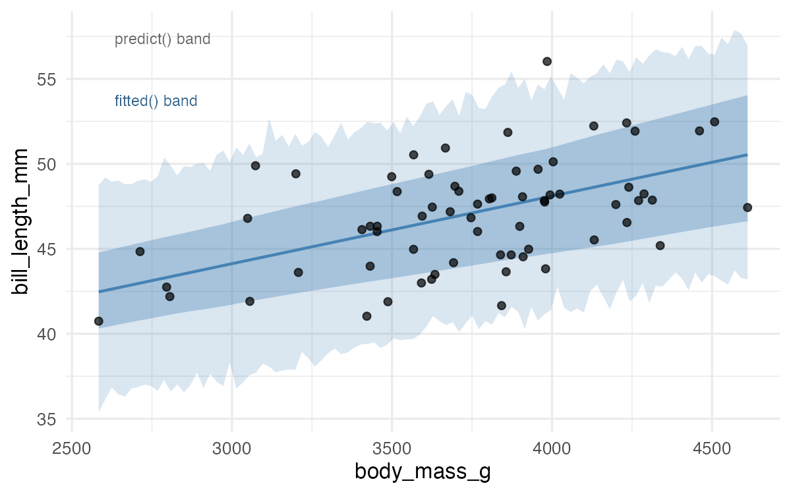
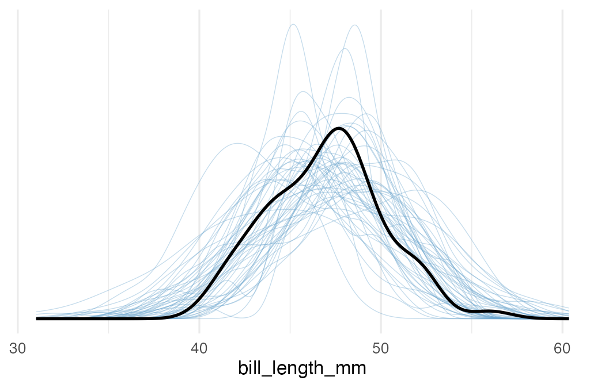

## The six distributions

| Distribution | Notation |
|---|---|
| Likelihood | $P(D \mid \theta)$ |
| Prior | $P(\theta)$ |
| Prior predictive | $P(D)$ |
| Posterior | $P(\theta \mid D)$ |
| Posterior of expectations | $P(\mu_i \mid D)$ |
| Posterior predictive | $P(D_{\text{new}} \mid D)$ |

::: {.notes}
- Okay, so Bayesian models come with a lot of distributions. Six, at minimum. Keeping them straight is genuinely the hardest part of this unit, so let's take it slow.
- This first column uses generic notation. D is your data, theta is all your parameters bundled together. The conditioning bar means "given" -- so the likelihood is the probability of data given parameters, and the posterior flips that around.
- Don't worry about memorising this table right now. We're going to build it up column by column, and you'll see each of these again in the lab.
:::


## The six distributions

| Distribution | Notation | Alt. notation |
|---|---|---|
| Likelihood | $P(D \mid \theta)$ | $P(y \mid \beta, \sigma)$ |
| Prior | $P(\theta)$ | $P(\beta_0), P(\beta_1), P(\sigma)$ |
| Prior predictive | $P(D)$ | $P(\tilde{y})$ |
| Posterior | $P(\theta \mid D)$ | $P(\beta, \sigma \mid y)$ |
| Posterior of expectations | $P(\mu_i \mid D)$ | $P(\hat{y}_i \mid D)$ |
| Posterior predictive | $P(D_{\text{new}} \mid D)$ | $P(\tilde{y} \mid y)$ |

::: {.notes}
- Now the second column makes it concrete. Instead of generic theta, you can see the actual regression parameters: beta_0, beta_1, sigma. Instead of D, it's y -- your bill_length_mm measurements.
- The tilde on y-tilde means "simulated" or "predicted." So P(y-tilde) is "what data would my model predict before it's seen anything?" and P(y-tilde given y) is "what new data would it predict after learning from the data I have?"
- If you're wondering why we need both columns: the generic version generalises to any model. The specific version is what you'll actually compute today.
:::


## The six distributions

| Distribution | Notation | Alt. notation | In brms |
|---|---|---|---|
| Likelihood | $P(D \mid \theta)$ | $P(y \mid \beta, \sigma)$ | `family = gaussian()` |
| Prior | $P(\theta)$ | $P(\beta_0), P(\beta_1), P(\sigma)$ | `get_prior()` / `prior` arg |
| Prior predictive | $P(D)$ | $P(\tilde{y})$ | `sample_prior = "only"` |
| Posterior | $P(\theta \mid D)$ | $P(\beta, \sigma \mid y)$ | `as_draws_df()` |
| Posterior of expectations | $P(\mu_i \mid D)$ | $P(\hat{y}_i \mid D)$ | `fitted()` |
| Posterior predictive | $P(D_{\text{new}} \mid D)$ | $P(\tilde{y} \mid y)$ | `predict()` / `pp_check()` |

::: {.notes}
- And now the payoff: the brms column tells you which R function gives you each distribution. This is the practical bit.
- fitted() gives you the posterior of the expectations -- uncertainty in the average. predict() gives you the posterior predictive -- uncertainty in where a new data point might land. pp_check() takes that posterior predictive and asks "does it look like my actual data?"
- You'll use every single one of these functions in the lab today. So this table is basically a cheat sheet for what's coming.
:::


## Bayesian workflow

{fig-align="center"}

::: {style="font-size: 0.5em; text-align: center;"}
Figure from Martin, Kumar & Lao, *Bayesian Modeling and Computation in Python* (2022)
:::

::: {.notes}
- This diagram looks busy, but the logic is simple. You build a model, you check it, you fit it, you check it again. If something looks off, you go back and fix it.
- The two key checkpoints are the prior predictive check ("before I see data, does this model predict anything reasonable?") and the posterior predictive check ("after fitting, can this model generate data that looks like mine?").
- Most of the rest of today's lecture zooms into these individual steps. The diagram is here so you can see where each piece fits in the bigger picture.
:::


## Why model checking?

> "Comparing the data to the posterior predictions of the model is a posterior predictive check. When systematic discrepancies appear that are substantively meaningful, the model should be expanded or replaced."

*Kruschke, Doing Bayesian Data Analysis, Ch. 17*

. . .

> "Practical Bayesian data analysis is an iterative process of model building, inference, model checking and evaluation, and model expansion."

*Gabry, Simpson, Vehtari, Betancourt & Gelman (2019)*

. . .

A model doesn't need to be *true*, only good enough for the question you're asking.

::: {.notes}
- Two quotes from people who think about this a lot. Kruschke's point is that you're not looking for any discrepancy -- you're looking for discrepancies that actually matter for your question. A model that's slightly off in the tails but nails the center might be perfectly fine.
- Gelman and colleagues are saying: this is iterative. You don't get it right the first time, and that's normal. Build, check, revise, repeat.
- The last line is the key takeaway. Your model is a simplification. It's supposed to be. The question is whether it's a useful simplification for what you're trying to learn.
:::


## `fitted()` vs `predict()`

::::: columns
::: {.column width="50%"}

**`fitted()`** = uncertainty in the mean

"What's the average bill length at this body mass?"

Uses only $\beta_0 + \beta_1 x$

**`predict()`** = uncertainty in new observations

"Where might the next penguin's bill length fall?"

Adds a draw from $\text{Normal}(0, \sigma)$ on top

:::

::: {.column width="50%"}

| | `fitted()` | `predict()` |
|---|---|---|
| Includes $\beta$ uncertainty | Yes | Yes |
| Includes $\sigma$ | No | Yes |
| Band width | Narrow | Wide |
| Use for | "Average at $x$" | "Next observation" |

:::
:::::

::: {.notes}
- This is the single most important distinction in today's lab, so let's make sure it lands.
- fitted() takes your 4,000 posterior draws and computes 4,000 regression lines. The spread of those lines is the narrow band. It's answering: "on average, what bill length do we expect at this body mass?"
- predict() does the same thing, but then for each draw it also adds random noise from Normal(0, sigma). So each line becomes a scatter of possible data points. It's answering: "if I went out and caught a new penguin at this body mass, where might its actual bill length land?"
- The predict() band is always wider. Always. Because it includes two sources of uncertainty: where the line is, and how far individual penguins scatter around it.
- About 95% of your observed data should fall inside the predict() band. If they don't, your model is too confident about something.
- If this sounds familiar, it should. In frequentist regression you have the confidence interval for the mean (narrow) and the prediction interval for a new observation (wide). Same logic, different framework. fitted() is the Bayesian confidence interval. predict() is the Bayesian prediction interval.
:::


## The two ribbons

{fig-align="center"}

::: {.notes}
- Two bands on the plot, and they answer different questions. The inner dark ribbon comes from fitted(), the posterior uncertainty in the conditional mean. It's saying: "here's where the regression line plausibly runs." The outer lighter ribbon comes from predict(), adding residual scatter on top, so it's saying: "here's where individual penguins could actually land."
- Most of your data points should fall inside the outer band but outside the inner one. If you see that pattern, your model is doing its job.
- If this looks familiar from frequentist regression, it should. The inner band is the Bayesian version of a confidence interval for the mean. The outer band is the Bayesian version of a prediction interval. The logic is identical: one captures uncertainty about the average, the other captures uncertainty about individual observations.
- The jagged edges on the outer band come from posterior uncertainty in sigma, not just the betas. Each posterior draw uses a slightly different residual SD, so the width of the prediction band itself is uncertain.
:::


## Posterior predictive checks

"After fitting, does simulated data from the model look like real data?"

. . .

`pp_check(fit1.b, ndraws = 100)`

{fig-align="center" width="60%"}

::: {.notes}
- Remember the last lab, where you pulled draws from the posterior with as_draws_df(), plugged them into rnorm(), and overlaid the simulated densities? pp_check() does all of that in one line.
- The dark line is your actual data. Each light line is a full simulated dataset from one posterior draw of beta_0, beta_1, and sigma. If those light lines cluster around the dark one, the model is capturing the structure of the data.
- You can also run targeted checks. stat = "mean" asks whether the model gets the center right. stat = "sd" asks about the spread. type = "scatter" compares predicted values against observed values directly.
- Think of posterior predictive checking as the Bayesian version of residual diagnostics, except instead of one set of residuals you have 4,000 simulated datasets to compare against.
:::


## Prior predictive checks

"Before seeing data, does the model make sensible predictions?"

. . .

`sample_prior = "only"` tells brms to ignore data entirely and just simulate from priors + likelihood.

. . .

If predictions are absurd (e.g., 500mm bills), your priors are too permissive.

. . .

Takeaway: prior predictive checks catch bad priors before you waste time fitting.

::: {.notes}
- You saw sample_prior = "only" mentioned in the Bayes Intro lecture. In today's lab you'll actually run it and look at what comes out.
- With default priors, the predictions are vague but not crazy. With intentionally bad priors, like normal(0, 1000) on the slope, the model predicts bill lengths spanning thousands of millimeters. Obviously wrong, and you can see it immediately.
- Here's why this matters for next week: hierarchical models add priors on group-level standard deviations. A careless prior on tau, the between-group SD, can imply that group means vary by thousands of units. Prior predictive checks catch that kind of problem before you waste time fitting.
:::


## Default priors

brms always has priors, whether you set them or not.

. . .

`get_prior(data = chinstrap, bill_length_mm ~ 1 + body_mass_g)` reveals them:

| Parameter | Default prior |
|---|---|
| $\beta_0$ (Intercept) | Student-t(3, 49.5, 3.6) |
| $\beta_1$ (slope) | Flat (uniform $-\infty$ to $\infty$) |
| $\sigma$ | Half-Student-t(3, 0, 3.6) |

. . .

Student-t with $\nu = 3$ has thick tails = more permissive. As $\nu$ grows, it approaches Normal.

::: {.notes}
- Even if you don't set priors explicitly, brms picks data-adaptive defaults. For simple regression, they're usually fine.
- The Student-t family shows up here with nu = 3, which gives thick tails, making the prior more permissive. As nu increases, Student-t approaches the Normal. The intercept gets a Student-t centered on the data median. The slope gets a flat prior, meaning the data do all the work for that parameter. With 68 Chinstrap observations, that's fine.
- Sigma gets a half-Student-t, which enforces positivity while keeping heavy tails on the upper side.
- In the lab, you'll fit a model with hand-set priors that match these defaults and confirm the posteriors are nearly identical. The point of that exercise: once you know what brms chose by default, you're in a better position to make informed choices when defaults aren't enough.
:::


## Model comparison with LOO-CV

The Bayesian AIC/BIC: Leave-One-Out Cross-Validation.

. . .

The idea: hide one data point, predict it from the rest, repeat for every point.

Higher ELPD (expected log predictive density) = better out-of-sample prediction.

. . .

```r
loo_compare(loo(fit0.b), loo(fit1.b))
```

`loo_compare()` puts the better model on top. The `elpd_diff` column tells you how much better, `se_diff` tells you how certain.

::: {.notes}
- In the MLM unit, you compared models with AIC, BIC, and likelihood ratio tests. LOO-CV is the Bayesian version of that idea.
- The logic: hide one data point, predict it from the rest, then repeat for every data point. Models that consistently predict held-out observations well are capturing real structure. Models that are frequently surprised are either too simple or overfitting.
- In practice, the loo package doesn't actually refit the model 68 times. It uses an efficient approximation based on the posterior draws you already have.
- In the lab, you'll compare the intercept-only model to the regression model. The regression model should win, confirming that body_mass_g carries useful information about bill_length_mm.
:::


## The lab

Today you'll work through **all six distributions** using the Chinstrap penguins.

- Build `fitted()` and `predict()` ribbons
- Run `pp_check()` and connect it to the manual simulation from last time
- Inspect default priors and set your own
- Compare models with `loo_compare()`

. . .

Some questions have **hidden answers you can reveal** after writing your response.

Other questions are **open**: no provided answer.

::: {.notes}
- The lab is a walkthrough. Read and run each chunk before moving on.
- Some questions have collapsible answers you can reveal after writing your own response. These cover concepts that later questions build on, so check your understanding before continuing.
- The open questions, the ones without provided answers, are where you synthesize what you've learned. By that point the walkthrough has given you enough context to reason through them independently.
- The exercise at the end asks you to redo everything with Gentoo penguins. Try it before looking back at the Chinstrap code.
:::
