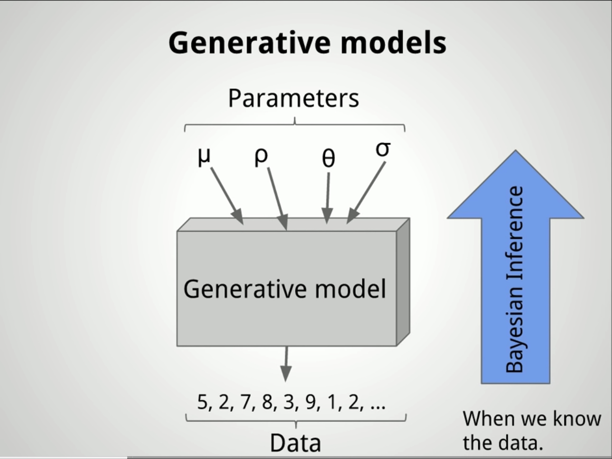
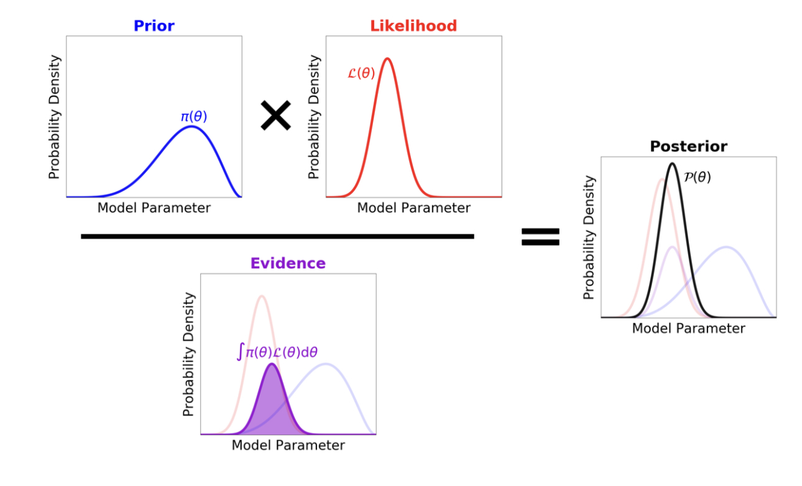
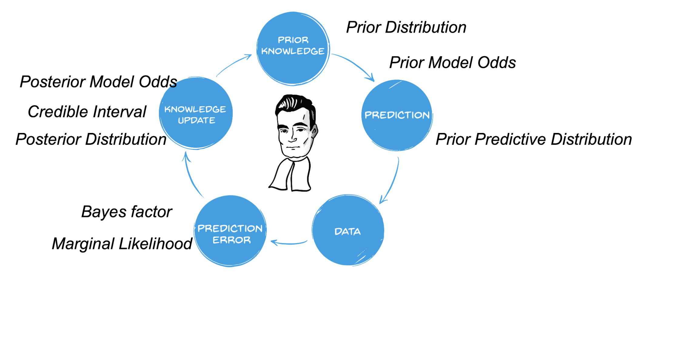
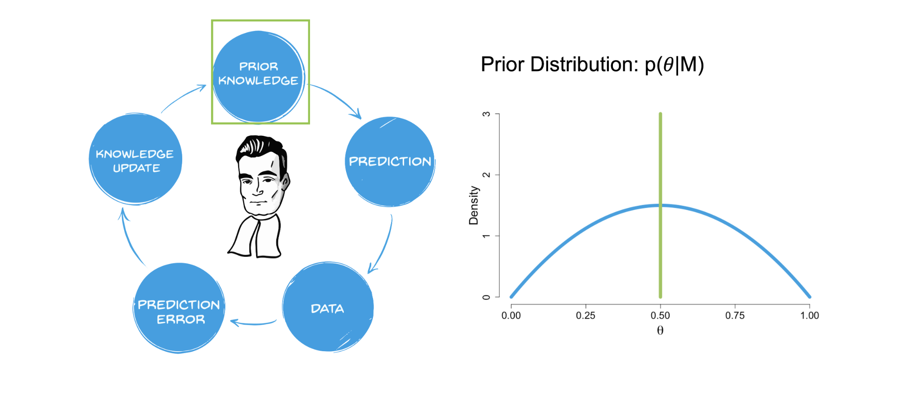

## Packages

```{r}
library(tidyverse)
library(tidybayes)
library(brms) # run bayesian models
library(emoji)
library(emmeans)
library(easystats)
library(ggdist)
library(marginaleffects)
library(ggeffects)
library(knitr)
library(gghalves)
library(ggokabeito)
library(ggbeeswarm)

options(scipen=999)
```

-   QMD available in: <https://github.com/suyoghc/PSY504_Spring_2026/tree/main/posts>

<br> <br>

-   A gentle introduction to Bayesian inference

-   Fit, interpret, and report a Bayesian regression with `brms`

# Models and Data Generating Processes {.center}

## What is a data generating process?

The process that produced your data.

. . .

Last semester — every simulation you wrote was one.

Pick a distribution.
Pick parameters.
Generate data.

. . .

Last week — logistic regression was one.

Lead weight → probability → coin flips.

## A model (class) is a *family* of DGPs

A **model** = a structure with free parameters.

. . .

Each choice of parameters → a different member.

. . .

$$Y_i \sim \text{Normal}(\mu_i, \sigma), \quad \mu_i = \beta_0 + \beta_1 X_i$$

. . .

-   $\beta_0 = 50, \beta_1 = 0.3, \sigma = 10$ → one member
-   $\beta_0 = 40, \beta_1 = 0.8, \sigma = 5$ → another member

. . .

Same family.
Different members.

## Two families you already know

::::: columns
::: {.column width="50%"}
**Linear model**

$$
\begin{align}
Y_i &\sim \text{Normal}(\mu_i, \sigma) \\
\mu_i &= \beta_0 + \beta_1 X_i
\end{align}
$$
:::

::: {.column width="50%"}
**Logistic model**

$$
\begin{align}
Y_i &\sim \text{Bernoulli}(p_i) \\
\text{logit}(p_i) &= \beta_0 + \beta_1 X_i
\end{align}
$$
:::
:::::

. . .

Same structure:

-   you specify parameters

-   at each X, the parameters produce a different distribution

-   data gets drawn from it (the \~ ; captures randomness)

## The DGP runs forward (parameters → data)

We fix the parameters.
And **generate** data.

. . .

"If $\beta_0 = 50$, $\beta_1 = 0.3$, $\sigma = 10$ — what grades would I see?"

``` r
rnorm(n = 33, mean = 50 + 0.3 * avgView, sd = 10)
```

. . .

-   Parameters are **known** (you chose them)
-   Data **varies** (different every time you simulate)
-   This is simulation — `r` functions: `rnorm()`, `rbinom()`

## What \~ means

$Y_i \sim \text{Binomial}(n, \theta)$ means:

$$p(Y = k \mid \theta) = \binom{n}{k}\theta^k(1-\theta)^{n-k}$$

. . .

"If $\theta = 0.6$ — what data can come out, and how often?"

. . .

In R,

``` r
dbinom(0:5, size = 5, prob = 0.6)
```

. . .

These sum to 1.
Every outcome covered.
A proper distribution.

. . .

This is $p(\text{data} \mid \theta)$**.**

## $p(\text{data} \mid \theta)$ for the coin family

5 tosses.
Each row = one family member.

|                | 0 heads | 1 head | 2 heads | 3 heads | 4 heads | 5 heads | **Row sum** |
|----------------|---------|--------|---------|---------|---------|---------|-------------|
| $\theta = 0.2$ | .328    | .410   | .205    | .051    | .006    | .000    | **1.0**     |
| $\theta = 0.4$ | .078    | .259   | .346    | .230    | .077    | .010    | **1.0**     |
| $\theta = 0.5$ | .031    | .156   | .312    | .312    | .156    | .031    | **1.0**     |
| $\theta = 0.6$ | .010    | .077   | .230    | .346    | .259    | .078    | **1.0**     |
| $\theta = 0.8$ | .000    | .006   | .051    | .205    | .410    | .328    | **1.0**     |

. . .

Every row sums to 1.

Pick a family member → all outcomes covered → proper distribution.

## The true DGP is unknown

You observed 3 heads out of 5.

. . .

Which $\theta$ produced the data?

. . .

|                | 0 heads | 1 head | 2 heads | 3 heads | 4 heads | 5 heads | **Row sum** |
|----------------|---------|--------|---------|---------|---------|---------|-------------|
| $\theta = 0.2$ | .328    | .410   | .205    | .051    | .006    | .000    | **1.0**     |
| $\theta = 0.4$ | .078    | .259   | .346    | .230    | .077    | .010    | **1.0**     |
| $\theta = 0.5$ | .031    | .156   | .312    | .312    | .156    | .031    | **1.0**     |
| $\theta = 0.6$ | .010    | .077   | .230    | .346    | .259    | .078    | **1.0**     |
| $\theta = 0.8$ | .000    | .006   | .051    | .205    | .410    | .328    | **1.0**     |

. . .

You don't know.
You never get to see the true $\theta$.

. . .

**Inference** = using the data to figure out which row produced it.

## Inference runs backward (data → parameters)

You observed 3 heads out of 5.

Which member of the family produced them?

. . .

Data are fixed.
Parameters are unknown.

. . .

Two strategies:

. . .

-   MLE — find the best-scoring member

. . .

-   Bayes — get a distribution over all plausible members

## How do we score the members?

Fix the data.
Ask each member: how well do you explain this?

. . .

You got 3 heads out of 5.

. . .

$\theta = 0.6$ → score: 0.346

$\theta = 0.5$ → score: 0.312

$\theta = 0.2$ → score: 0.051

. . .

Higher score = that member explains the data better.

## How do we score the members?

Fix the data.
Ask each member: how well do you explain this?

. . .

You got 3 heads out of 5.

. . .

$\theta = 0.6$ → score: 0.346

$\theta = 0.5$ → score: 0.312

$\theta = 0.2$ → score: 0.051

. . .

Higher score = that member explains the data better.

## Same table — read it the other way

|                | 0 heads | 1 head | 2 heads | **3 heads**     | 4 heads | 5 heads |
|----------------|---------|--------|---------|-----------------|---------|---------|
| $\theta = 0.2$ |         |        |         | **.051**        |         |         |
| $\theta = 0.4$ |         |        |         | **.230**        |         |         |
| $\theta = 0.5$ |         |        |         | **.312**        |         |         |
| $\theta = 0.6$ |         |        |         | **.346**        |         |         |
| $\theta = 0.8$ |         |        |         | **.205**        |         |         |
|                |         |        |         | **Sum = 1.144** |         |         |

. . .

Data fixed at 3 heads.
Read **down** the column.

. . .

Peak at $\theta = 0.6$.
That's what MLE does — pick the peak.

. . .

Sum = 1.144.
**Not 1.** This column is not a distribution.

True bias: $\theta = 0.5$.
You flip 5 times.
You get 4 heads.

. . .

Read down the "4 heads" column:

|                | **4 heads** |
|----------------|-------------|
| $\theta = 0.2$ | .006        |
| $\theta = 0.4$ | .077        |
| $\theta = 0.5$ | .156        |
| $\theta = 0.6$ | .259        |
| $\theta = 0.7$ | .360        |
| $\theta = 0.8$ | **.410**    |

. . .

MLE picks $\theta = 0.8$.
The true value is 0.5.

. . .

With 5 flips — the peak is noisy.
The best-scoring member isn't necessarily the true one.

## "But it's the same table/number!"

`dbinom(3, 5, 0.6)` = 0.346 in both tables.
So why does it matter?

. . .

Try to make a statement:

. . .

Forward: "There's a **35% chance** of getting 3 heads." ✓

. . .

Backward: "There's a \*\*\_\_\_% chance\*\* that $\theta$ is 0.6."

. . .

You can't fill in the blank.

The scores don't add to 1.
0.346 is not a percentage here.

. . .

That blank is $p(\theta \mid \text{data})$.
We don't have it yet.

## Probability vs. likelihood

Same formula: $p(\text{data} \mid \theta)$.
Different direction.

. . .

::::: columns
::: {.column width="50%"}
**Read across a row**

-   $\theta$ fixed, data varies
-   Sums to 1 ✓
-   Probability
:::

::: {.column width="50%"}
**Read down a column**

-   Data fixed, $\theta$ varies
-   Does **not** sum to 1 ✗
-   Likelihood $L(\theta)$
:::
:::::

. . .

Rows = distribution.
Columns = scoring function.

## The likelihood is not enough

We want $p(\theta \mid \text{data})$ — a distribution.

. . .

The likelihood finds the peak.
That's MLE.

. . .

But it can't fill in the blank: "\_\_\_% chance $\theta$ is between 0.4 and 0.8."

. . .

We need one more ingredient.

## You know things before seeing data

. . .

You're flipping a coin — not rolling a die, not drawing cards.

. . .

Most coins are roughly fair.
$\theta$ is probably near 0.5.

. . .

$\theta = 0.0$ or $\theta = 1.0$?
A two-headed or two-tailed coin?
Possible — but unlikely.

. . .

The likelihood doesn't have this knowledge.
It just scores.

## A prior distribution

Which $\theta$ values are plausible — **before** you flip?

$$p(\theta)$$

. . .

"Most coins are fair-ish" → prior peaked near 0.5

. . .

"I have no idea" → flat prior, all $\theta$ equally plausible

. . .

"This coin came from a magic shop" → prior allows extreme values

. . .

Unlike the likelihood — the prior **is** a distribution.
Sums to 1.

## Bayes' rule

$$p(\theta \mid \text{data}) \;\propto\; \underbrace{p(\theta)}_{\text{Prior}} \;\times\; \underbrace{L(\theta)}_{\text{Likelihood}}$$

. . .

Prior (distribution) × Likelihood (scoring function) = **Posterior** (distribution)

. . .

-   Prior — what you believed before
-   Likelihood — what the data say
-   Posterior — your updated belief

. . .

The posterior **is** $p(\theta \mid \text{data})$.

Now you can fill in the blank.

## The coin posterior

3 heads out of 5.
Flat prior.
Multiply prior × likelihood at each $\theta$:

. . .

| $\theta$ | Prior | Likelihood | Prior × Likelihood | **Posterior** |
|----------|-------|------------|--------------------|---------------|
| 0.2      | .200  | .051       | .010               | **.045**      |
| 0.4      | .200  | .230       | .046               | **.201**      |
| 0.5      | .200  | .312       | .062               | **.273**      |
| 0.6      | .200  | .346       | .069               | **.303**      |
| 0.8      | .200  | .205       | .041               | **.179**      |
|          |       |            | Sum = .229         | **1.0**       |

. . .

Prior × Likelihood doesn't sum to 1.
Divide each by the sum (.229) to normalize.

. . .

Posterior sums to 1.
Now it's a distribution.

. . .

"There's a **30% chance** $\theta$ is 0.6." The blank is filled.

## Bayes' rule

$$p(\theta \mid \text{data}) \;\propto\; \underbrace{p(\theta)}_{\text{Prior}} \;\times\; \underbrace{L(\theta)}_{\text{Likelihood}}$$

. . .

Prior (distribution) × Likelihood (scoring function) = **Posterior** (distribution)

. . .

-   Prior — what you believed before
-   Likelihood — what the data say
-   Posterior — your updated belief

. . .

The full version:

$$p(\theta \mid \text{data}) = \frac{p(\theta) \times L(\theta)}{\sum_{\theta} p(\theta) \times L(\theta)}$$

The denominator just makes it sum to 1.

## The coin posterior — with an informative prior

3 heads out of 5.
But now: "most coins are roughly fair."

. . .

| $\theta$ | Prior | Likelihood | Prior × Likelihood | **Posterior** |
|----------|-------|------------|--------------------|---------------|
| 0.0      | .010  | .000       | .000               | **.000**      |
| 0.1      | .040  | .008       | .000               | **.001**      |
| 0.3      | .200  | .132       | .026               | **.102**      |
| 0.5      | .400  | .312       | .125               | **.483**      |
| 0.6      | .250  | .346       | .086               | **.334**      |
| 0.8      | .100  | .205       | .020               | **.079**      |
|          |       |            | Sum = .258         | **1.0**       |

. . .

MLE picked $\theta = 0.6$.
The posterior peaks at $\theta = 0.5$.

. . .

The prior pulled the estimate toward "fair." Data alone said 0.6.
Prior knowledge said "probably near 0.5." The posterior is a compromise.

## Three ingredients

:::::: columns
::: {.column width="33%"}
**Prior** $p(\theta)$

Belief before data

Distribution ✓
:::

::: {.column width="33%"}
**Likelihood** $L(\theta)$

What data say

Not a distribution ✗
:::

::: {.column width="33%"}
**Posterior** $p(\theta \mid \text{data})$

Updated belief

Distribution ✓
:::
::::::

. . .

-   Both high → posterior high
-   Either low → posterior pulled down
-   With lots of data — likelihood dominates
-   With little data — prior matters more

## Why can't we just compute it?

In principle — just multiply prior × likelihood at every $\theta$.

. . .

For the coin with 5 values of $\theta$?
Easy.
Do it by hand.

. . .

But real models have continuous parameters — every $\theta$ between 0 and 1.

$$p(\theta \mid \text{data}) = \frac{p(\theta) \times L(\theta)}{\int p(\theta) \times L(\theta) \, d\theta}$$

. . .

That denominator — integrate over **every possible** $\theta$.

. . .

1 parameter → fine.
3 → hard.
20 → forget it.

. . .

Solution: don't compute it.
**Sample from it.**

That's MCMC. That's `brms`.

## What does "sample from it" mean?

We can't write down $p(\theta \mid \text{data})$ as a formula.

. . .

But we can generate thousands of $\theta$ values that **behave as if** they came from it.

. . .

Imagine drawing 10,000 values of $\theta$ from the posterior:

-   \~300 of them would be near 0.6
-   \~270 near 0.5
-   \~45 near 0.2
-   Almost none near 0.0

. . .

The histogram of those draws **is** the posterior.

No formula needed.
Just draws.

. . .

That's what MCMC does.
That's what `brms` gives you.

## What Bayes gives you that MLE doesn't

|   | MLE | Bayes |
|----|----|----|
| Point estimate | ✓ (peak) | ✓ (posterior mean/median) |
| Uncertainty | SE from curvature | Full distribution |
| Probability statements | ✗ | "95% chance β₁ ∈ \[0.1, 0.5\]" |
| Prior knowledge | ✗ | ✓ |
| Small samples | Unstable (due to sampling error) | Priors stabilize estimates |
| Evidence FOR null | ✗ | ✓ (Bayes Factors) |

# The rise of Bayesian statistics {.center}

## The rise of Bayesian statistics


## Why now?

::::: columns
::: {.column width="50%"}
**Technology**

-   Faster computers
-   Better algorithms (MCMC -\> HMC)
-   Accessible software (`brms`, Stan)
:::

::: {.column width="50%"}
**Frustration**

-   Can't incorporate prior knowledge
-   p-values don't answer what we want
-   Can't find evidence FOR the null
-   Replication crisis
:::
:::::

## Bayesian statistics as a tool

::::: columns
::: {.column width="50%"}
-   Google "Bayesian" → philosophical wars

-   Subjective vs. objective.
    Frequentist vs. Bayesian.

-   Interesting.
    Not our focus.
:::

::: {.column width="50%"}
```{r}
#| echo: false
include_graphics("images/bayespower.jpg")
```
:::
:::::

## Two views of probability

::::: columns
::: {.column width="50%"}
**Frequentist**

Probability = long-run frequency.

"If I repeated this experiment forever, 60% of the time I'd get heads."

. . .

Parameters are **fixed** but unknown.

Data are **random**.

Only data get probability statements.
:::

::: {.column width="50%"}
**Bayesian**

Probability = degree of belief.

"I'm 60% sure this coin is biased toward heads."

. . .

Parameters are **uncertain** — they get distributions.

Data are **fixed** (you observed them).

Parameters get probability statements.
:::
:::::

# Bayesian belief updating {.center}

## Belief updating: an example

Let's watch Bayes' rule work — step by step.

. . .

What proportion of people are dog people?

. . .

-   Data: 0 = cat person, 1 = dog person
-   Parameter: $\theta$ = proportion of dog people
-   Sample: 5 people

. . .

Same structure as the coin — just a different question.

## Step 1: State your prior

```{r, fig.align='center', echo=FALSE}
knitr::include_graphics("images/diffpriors.png")
```

. . .

People vary in how strongly they state prior beliefs.

. . .

-   **Informative** → "I'm pretty sure it's near 0.5"
-   **Weakly informative** → "Probably between 0.2 and 0.8"
-   **Non-informative** → "I have no idea"

. . .

Most researchers use **weakly informative** priors.

## Step 2: Your prior makes predictions

Before seeing data — what does each model predict?

{fig-align="center"}

. . .

Narrow prior → specific predictions.

Wide prior → anything is plausible.

## Step 3: Collect data

{fig-align="center"}

. . .

3 out of 5 are dog people.

Everything before this happened **without data**.

Now we update.

## Step 4: Which model predicted better?

The **marginal likelihood** — how plausible is the observed data under each model?

```{r, fig.align='center', echo=FALSE}
include_graphics("images/marg_like.png")
```

. . .

Go back to each model's predictions.
Evaluate at the observed data.

The ratio of these = the **Bayes Factor**.

## Bayes Factors

How much did the data change your mind?

$$BF_{12} = \frac{P(\text{data} \mid M_1)}{P(\text{data} \mid M_2)}$$

. . .

-   $BF > 1$ → data favor $M_1$
-   $BF < 1$ → data favor $M_2$
-   $BF = 1$ → data equally consistent with both

. . .

Unlike p-values — BFs can provide evidence **for** the null.

. . .

```{r, fig.align='center', echo=FALSE, out.width="60%"}
include_graphics("images/bf.png")
```

## Step 5: Update → Posterior

```{r, fig.align='center', echo=FALSE}
include_graphics("images/step6.png")
```

. . .

The wide prior (blue) gets reshaped — narrower, pulled toward the data.

. . .

The spike prior (green) doesn't budge.

If you rule something out completely, no data can bring it back.

## Prior → Posterior

{fig-align="center"}

. . .

The posterior sits between prior and likelihood.

With more data — pulled toward the likelihood.

With less data — stays closer to the prior.

## Credible intervals

The posterior gives you what you always wanted from confidence intervals:

. . .

"With 95% probability, $\theta$ lies within this interval."

. . .

```{r, fig.align='center', echo=FALSE, out.width="70%"}
knitr::include_graphics("images/step7.png")
```

. . .

This is a **direct probability statement** about the parameter.

Not "if we repeated the experiment..."

# From coins to regression {.center}

## Same recipe, more parameters

|   | Coin | Regression |
|----|----|----|
| Model | $Y \sim \text{Binomial}(n, \theta)$ | $Y \sim \text{Normal}(\mu_i, \sigma)$ |
| Parameters | $\theta$ | $\beta_0, \beta_1, \sigma$ |
| Prior | $p(\theta)$ | $p(\beta_0), p(\beta_1), p(\sigma)$ |
| Likelihood | Score each $\theta$ | Score each $(\beta_0, \beta_1, \sigma)$ |
| Posterior | $p(\theta \mid \text{data})$ | $p(\beta_0, \beta_1, \sigma \mid \text{data})$ |

. . .

More parameters.
Same recipe.

. . .

`brms` handles all of it.

## Computing a likelihood

``` r
compute_ll <- function(b0, b1, data) {
  p_hat <- plogis(b0 + b1 * data$lead_weight)
  sum(data$outcomes * log(p_hat) + 
      (1 - data$outcomes) * log(1 - p_hat))
}
```

. . .

Same idea — many parameters, score each combination.

. . .

The linear model has one too — swap in `dnorm()`.

## The likelihood for a linear model

$$Y_i \sim \text{Normal}(\mu_i, \sigma), \quad \mu_i = \beta_0 + \beta_1 X_i$$

Say $\beta_0 = 50$, $\beta_1 = 0.3$, $\sigma = 10$:

. . .

-   Student watches 30 min → predicted mean = $50 + 0.3(30) = 59$
-   Actual grade = 65
-   Score: `dnorm(65, mean = 59, sd = 10)` ≈ 0.03

. . .

Do this for every student.
Multiply.
That's the likelihood.

Different parameters → different score.

## Priors for regression

Same logic as the coin — just different parameters.

. . .

-   Grades are 0–100. $\beta_0$ can't be 500. → $\beta_0 \sim \text{Normal}(50, 20)$

. . .

-   Watching lectures shouldn't hurt. $\beta_1$ probably isn't −20. → $\beta_1 \sim \text{Normal}(0, 5)$

. . .

-   $\sigma$ must be positive, probably not 1000. → $\sigma \sim \text{Half-Cauchy}(0, 10)$

. . .

MLE ignores all of this.
Bayes encodes it.

<!-- ##_________________________ -->

<!-- ## This is the likelihood function -->

<!-- $$L(\theta) = p(\text{data} \mid \theta)$$ -->

<!-- It's not a distributions.  -->

<!-- Rather, it's a **scoring function**. -->

<!-- . . . -->

<!-- ::::: columns -->

<!-- ::: {.column width="50%"} -->

<!-- **Forward (probability)** -->

<!-- -   $\theta$ fixed, data varies -->

<!-- -   Sums to 1 ✓ -->

<!-- -   A distribution -->

<!-- ::: -->

<!-- ::: {.column width="50%"} -->

<!-- **Backward (likelihood)** -->

<!-- -   Data fixed, $\theta$ varies -->

<!-- -   Does **not** sum to 1 ✗ -->

<!-- -   A scoring function -->

<!-- ::: -->

<!-- ::::: -->

<!-- . . . -->

<!-- It can **rank** members. -->

<!-- It cannot say which are **probable**. -->

<!-- ::: notes -->

<!-- Same formula. -->

<!-- Two uses. -->

<!-- Forward — probability, sums to 1. -->

<!-- Backward — likelihood, doesn't. -->

<!-- Ranks candidates. -->

<!-- Finds peaks. -->

<!-- But can't assign probabilities to parameters. -->

<!-- ::: -->

<!-- ## You know `dbinom()` -->

<!-- Last week — coins with lead weights. -->

<!-- . . . -->

<!-- Pick a coin with bias $\theta = 0.6$. -->

<!-- Flip it 5 times. -->

<!-- What's the chance of exactly 3 heads? -->

<!-- ``` r -->

<!-- dbinom(3, size = 5, prob = 0.6)   # = 0.346 -->

<!-- ``` -->

<!-- . . . -->

<!-- What about 0 heads? -->

<!-- 1 head? -->

<!-- All 5? -->

<!-- ``` r -->

<!-- dbinom(0:5, size = 5, prob = 0.6) -->

<!-- ``` -->

<!-- . . . -->

<!-- These sum to 1. -->

<!-- Every possible outcome accounted for. -->

<!-- A proper distribution. -->

<!-- ::: notes -->

<!-- You know dbinom. -->

<!-- Pick a coin — θ is 0.6. -->

<!-- Flip 5 times. -->

<!-- Chance of exactly 3 heads — 0.346. -->

<!-- Compute it for every possible outcome — 0 through 5. -->

<!-- They sum to 1. -->

<!-- Every possibility covered. -->

<!-- That's a probability distribution over data. -->

<!-- ::: -->

<!-- ## This is $p(\text{data} \mid \theta)$ -->

<!-- The probability of a particular outcome, **given** a particular parameter value. -->

<!-- . . . -->

<!-- $$p(\text{3 heads} \mid \theta = 0.6) = 0.346$$ -->

<!-- . . . -->

<!-- -   $\theta$ is **fixed** — you picked a family member -->

<!-- -   Data **varies** — you're asking about all possible outcomes -->

<!-- -   Sums to 1 across outcomes -->

<!-- . . . -->

<!-- This is the **forward** direction. -->

<!-- Familiar territory. -->

<!-- ::: notes -->

<!-- This is p of data given θ. -->

<!-- The probability of a particular outcome given a specific parameter value. -->

<!-- θ is fixed — you chose it. -->

<!-- Data varies — you're asking what could happen. -->

<!-- Sums to 1. -->

<!-- This is the forward direction — formalized. -->

<!-- ::: -->

<!-- ## Now flip it -->

<!-- The data already happened. -->

<!-- 3 heads out of 5. -->

<!-- That's fixed. -->

<!-- . . . -->

<!-- How well does $\theta = 0.6$ explain that? -->

<!-- ``` r -->

<!-- dbinom(3, size = 5, prob = 0.6)   # = 0.346 -->

<!-- ``` -->

<!-- . . . -->

<!-- Same formula. -->

<!-- Same number. -->

<!-- **Completely different question.** -->

<!-- . . . -->

<!-- -   Data is **fixed** -->

<!-- -   $\theta$ **varies** — we're scanning across the family -->

<!-- This is the **likelihood**: $L(\theta) = p(\text{data} \mid \theta)$ -->

<!-- ::: notes -->

<!-- Flip it. -->

<!-- 3 out of 5 already happened. -->

<!-- Locked in. -->

<!-- Now vary θ. -->

<!-- How well does 0.6 explain what I saw? -->

<!-- Same formula, same number — but the question reversed. -->

<!-- Data fixed, θ varies. -->

<!-- That's the likelihood. -->

<!-- We write L(θ) to signal we're treating it as a function of θ, not of data. -->

<!-- ::: -->

<!-- <!-- Now the formula appears because they derived it — not because I announced it. -->

--\> <!-- <!-- Then continue with "Score every family member" (the table), the "sums to 1?" reveal, and the comparison slide. --> --\>

<!-- ## Are we clear on? -->

<!-- -   Models -->

<!-- -   Model parameters -->

<!-- -   DGPs -->

<!-- -   True DGP -->

<!-- -   Inference -->

<!-- # Probability and Likelihood {.center} -->

<!-- ## Probability -->

<!-- Same DGP, but now ask: what data **could** come out? -->

<!-- . . . -->

<!-- "If $\theta = 0.6$, what's the chance of getting exactly 3 heads out of 5?" -->

<!-- ``` r -->

<!-- dbinom(3, size = 5, prob = 0.6)   # = 0.346 -->

<!-- ``` -->

<!-- . . . -->

<!-- -   $\theta$ is **fixed** — you're conditioning on it -->

<!-- -   Data **varies** — you're asking about all possible outcomes -->

<!-- -   Sums to 1 across all possible data outcomes — it's a **proper distribution** -->

<!-- ``` r -->

<!-- # All possible outcomes for 5 flips, given θ = 0.6 -->

<!-- sum(dbinom(0:5, size = 5, prob = 0.6))   # = 1 -->

<!-- ``` -->

<!-- ::: notes -->

<!-- Probability asks: given THESE parameters, what data could come out? -->

<!-- If θ is 0.6, chance of exactly 3 heads out of 5 is dbinom — 0.346. -->

<!-- Key property — sum across all possible outcomes and you get 1. -->

<!-- Zero heads plus one head plus two heads... -->

<!-- all the way to five heads. -->

<!-- Adds to 1. -->

<!-- It's a proper distribution over data. -->

<!-- ::: -->

<!-- ## Likelihood -->

<!-- Now flip it. -->

<!-- Data happened. -->

<!-- Score the parameters. -->

<!-- . . . -->

<!-- "I saw 3 heads out of 5. How well does $\theta = 0.6$ explain that?" -->

<!-- ``` r -->

<!-- dbinom(3, size = 5, prob = 0.6)   # = 0.346 -->

<!-- ``` -->

<!-- . . . -->

<!-- Same formula. -->

<!-- Same number. -->

<!-- **Completely different question.** -->

<!-- ::: notes -->

<!-- Now flip the question. -->

<!-- The data already happened — 3 heads out of 5. -->

<!-- That's fixed. -->

<!-- Instead, we vary θ. -->

<!-- How well does θ = 0.6 explain what I saw? -->

<!-- Same formula — dbinom. -->

<!-- Same number — 0.346. -->

<!-- But the question is reversed. -->

<!-- Data is fixed, parameters vary. -->

<!-- ::: -->

<!-- ## Same formula — different function of what -->

<!-- ::::: columns -->

<!-- ::: {.column width="50%"} -->

<!-- **Probability** $p(\text{data} \mid \theta)$ -->

<!-- -   $\theta$ fixed, data varies -->

<!-- -   Sums to 1 over data ✓ -->

<!-- -   A proper distribution -->

<!-- -   "What data might I see?" -->

<!-- ::: -->

<!-- ::: {.column width="50%"} -->

<!-- **Likelihood** $L(\theta) = p(\text{data} \mid \theta)$ -->

<!-- -   Data fixed, $\theta$ varies -->

<!-- -   Does **not** sum to 1 over $\theta$ ✗ -->

<!-- -   Just a curve — not a distribution -->

<!-- -   "Which parameters explain my data?" -->

<!-- ::: -->

<!-- ::::: -->

<!-- . . . -->

<!-- This distinction matters. -->

<!-- The likelihood can rank parameters — but it can't tell you which are **probable**. -->

<!-- ::: notes -->

<!-- Here's the key. -->

<!-- Same formula — p of data given θ. -->

<!-- But probability holds θ fixed and varies data. -->

<!-- Sums to 1 over data. -->

<!-- A real distribution. -->

<!-- The likelihood holds data fixed and varies θ. -->

<!-- Does NOT sum to 1 over θ. -->

<!-- It's a curve, not a distribution. -->

<!-- It can rank parameters — this θ scores better than that θ. -->

<!-- But it can't tell you which parameters are probable. -->

<!-- That's not what it is. -->

<!-- We write L(θ) to remind ourselves. -->

<!-- This distinction drives everything that follows. -->

<!-- ::: -->

<!-- ## The likelihood across many parameter values -->

<!-- "3 heads out of 5. Score every possible $\theta$." -->

<!-- ``` r -->

<!-- theta <- seq(0, 1, by = 0.1) -->

<!-- dbinom(3, size = 5, prob = theta) -->

<!-- ``` -->

<!-- . . . -->

<!-- | $\theta$    | 0.0  | 0.1  | 0.2  | 0.3  | 0.4  | 0.5  | 0.6  | 0.7  | 0.8  | 0.9  | 1.0  | -->

<!-- |-------------|------|------|------|------|------|------|------|------|------|------|------| -->

<!-- | $L(\theta)$ | .000 | .008 | .051 | .132 | .230 | .312 | .346 | .309 | .205 | .073 | .000 | -->

<!-- . . . -->

<!-- -   Peak at $\theta = 0.6$ — the MLE -->

<!-- -   But $\theta = 0.5$ and $\theta = 0.7$ score almost as well -->

<!-- -   These numbers **do not sum to 1** — not a probability distribution over $\theta$ -->

<!-- ::: notes -->

<!-- Let's see it. -->

<!-- 3 heads out of 5 — score every θ from 0 to 1. -->

<!-- Peak at 0.6. -->

<!-- But 0.5 scores 0.312, 0.7 scores 0.309 — almost as good. -->

<!-- Add all these up — you don't get 1. -->

<!-- This is NOT a probability distribution over θ. -->

<!-- It's a scoring function. -->

<!-- It ranks candidates. -->

<!-- It finds peaks. -->

<!-- But it can't tell you "there's a 70% chance θ is between 0.4 and 0.8." For that, you need something more. -->

<!-- ::: -->

<!-- ## You computed a likelihood surface last week -->

<!-- ``` r -->

<!-- compute_ll <- function(b0, b1, data) { -->

<!--   p_hat <- plogis(b0 + b1 * data$lead_weight) -->

<!--   sum(data$outcomes * log(p_hat) +  -->

<!--       (1 - data$outcomes) * log(1 - p_hat)) -->

<!-- } -->

<!-- ``` -->

<!-- . . . -->

<!-- Same idea — many parameters, score each combination. -->

<!-- The linear model has one too. -->

<!-- Swap in `dnorm()`. -->

<!-- ::: notes -->

<!-- Last week you wrote this. -->

<!-- Pick candidate β₀, β₁. -->

<!-- Compute predictions. -->

<!-- Score against actual outcomes. -->

<!-- Sum log-scores. -->

<!-- That's the log-likelihood. -->

<!-- Linear model — same logic, swap in dnorm. -->

<!-- For each observation: given predicted mean and σ, how does the observed Y score? -->

<!-- Sum across observations. -->

<!-- ::: -->

<!-- ## The likelihood for a linear model -->

<!-- $$Y_i \sim \text{Normal}(\mu_i, \sigma), \quad \mu_i = \beta_0 + \beta_1 X_i$$ -->

<!-- Say $\beta_0 = 50$, $\beta_1 = 0.3$, $\sigma = 10$: -->

<!-- . . . -->

<!-- -   Student watches 30 min → predicted mean = $50 + 0.3(30) = 59$ -->

<!-- -   Actual grade = 65 -->

<!-- -   Score: `dnorm(65, mean = 59, sd = 10)` ≈ 0.03 -->

<!-- . . . -->

<!-- Do this for every student. -->

<!-- Multiply. -->

<!-- That's the likelihood. -->

<!-- Different parameters → different score. -->

<!-- ::: notes -->

<!-- Concrete. -->

<!-- Guess β₀ = 50, β₁ = 0.3, σ = 10. -->

<!-- Student watched 30 minutes — predicted mean 59. -->

<!-- Actual grade 65. -->

<!-- dnorm gives about 0.03. -->

<!-- Do it for all 33 students. -->

<!-- Multiply. -->

<!-- That's the likelihood for this guess. -->

<!-- Try different parameters — different score. -->

<!-- ::: -->

<!-- # Maximum Likelihood {.center} -->

<!-- ## The likelihood surface -->

<!-- ```{r, echo=FALSE, fig.align='center', out.width="65%"} -->

<!-- # knitr::include_graphics("images/likelihood_surface.png") -->

<!-- #[[erevisit]] -->

<!-- ``` -->

<!-- -   Every point = a different model (different parameter values) -->

<!-- -   Brighter = better score -->

<!-- -   You saw this last week -->

<!-- ::: notes -->

<!-- Every point on this surface is a different model — different parameter values. -->

<!-- Brightness is how well those parameters score against the data. -->

<!-- You saw this last week with logistic regression. -->

<!-- Same idea applies to any model. -->

<!-- ::: -->

<!-- ## Maximum Likelihood Estimation -->

<!-- MLE says: **find the peak.** -->

<!-- . . . -->

<!-- -   `lm()` does this. `glm()` does this. -->

<!-- -   You get **one point** — the single best-scoring parameter values -->

<!-- . . . -->

<!-- That point is **not** a probability. -->

<!-- It's just the highest-scoring guess. -->

<!-- ::: notes -->

<!-- MLE says — find the peak. -->

<!-- The single best-scoring combination. -->

<!-- That's what lm() does. -->

<!-- That's what glm() does. -->

<!-- One point. -->

<!-- One β₀, one β₁, one σ. -->

<!-- But remember — the likelihood is not a probability distribution. -->

<!-- The peak is the best guess, not the most probable value. -->

<!-- That's a subtle but important distinction. -->

<!-- ::: -->

<!-- # One point vs. the whole surface {.center} -->

<!-- ## What MLE throws away -->

<!-- ```{r, echo=FALSE, fig.align='center', out.width="65%"} -->

<!-- # knitr::include_graphics("images/likelihood_surface.png") -->

<!-- ``` -->

<!-- . . . -->

<!-- -   The peak = best parameters -->

<!-- -   But what about parameters that score **almost as well**? -->

<!-- -   Sharp peak → confident. Broad peak → uncertain. -->

<!-- -   MLE keeps only the peak. The shape is discarded. -->

<!-- ::: notes -->

<!-- Look again. -->

<!-- The peak is the best guess. -->

<!-- But what about the region around it? -->

<!-- Those parameters score almost as well. -->

<!-- Sharp narrow peak — high confidence. -->

<!-- Broad flat peak — lots of plausible values. -->

<!-- MLE collapses all that into one point plus a standard error. -->

<!-- The shape — which tells you about uncertainty — is mostly discarded. -->

<!-- ::: -->

<!-- ## Two guesses, nearly identical scores -->

<!-- ::::: columns -->

<!-- ::: {.column width="50%"} -->

<!-- **Model A**: $\beta_1 = 0.30$ -->

<!-- Log-likelihood: −142.3 -->

<!-- ::: -->

<!-- ::: {.column width="50%"} -->

<!-- **Model B**: $\beta_1 = 0.35$ -->

<!-- Log-likelihood: −142.5 -->

<!-- ::: -->

<!-- ::::: -->

<!-- . . . -->

<!-- MLE picks A. -->

<!-- But B is almost as good. -->

<!-- . . . -->

<!-- Wouldn't you rather say: -->

<!-- > "The slope is **probably between 0.25 and 0.40**, most likely around 0.30"? -->

<!-- That requires a **distribution** over parameters — not just a peak. -->

<!-- ::: notes -->

<!-- Model A — slope 0.30, slightly higher score. -->

<!-- Model B — slope 0.35, almost the same. -->

<!-- MLE picks A. -->

<!-- But B is barely worse. -->

<!-- Wouldn't it be more honest to report a distribution? -->

<!-- Probably between 0.25 and 0.40, most likely around 0.30. -->

<!-- But the likelihood isn't a distribution — it doesn't sum to 1. -->

<!-- We can't get probabilities from it alone. -->

<!-- We need something more. -->

<!-- ::: -->

<!-- # Prior knowledge {.center} -->

<!-- ## You know things before seeing data -->

<!-- . . . -->

<!-- -   Grades are 0–100 — $\beta_0$ can't be 500 -->

<!-- . . . -->

<!-- -   Watching lectures shouldn't *hurt* grades — $\beta_1$ probably isn't −20 -->

<!-- . . . -->

<!-- -   $\sigma$ isn't 0.001 or 1000 -->

<!-- . . . -->

<!-- MLE ignores all of this. -->

<!-- Every $\theta$ starts with equal standing. -->

<!-- ::: notes -->

<!-- You know things before looking at data. -->

<!-- Grades are bounded. -->

<!-- Huge negative slopes are implausible. -->

<!-- σ isn't tiny or enormous. -->

<!-- MLE ignores all of this. -->

<!-- Every parameter value starts with equal standing. -->

<!-- What if you could encode that knowledge? -->

<!-- ::: -->

<!-- ## Priors = beliefs before data -->

<!-- A **prior distribution** says which parameter values you find plausible before seeing any data. -->

<!-- . . . -->

<!-- -   Skeptical → centered near zero, narrow -->

<!-- -   Vague → wide, permissive -->

<!-- -   Constrained → σ must be positive -->

<!-- . . . -->

<!-- Unlike the likelihood, the prior IS a proper distribution — it sums to 1. -->

<!-- ::: notes -->

<!-- A prior formalizes what you know. -->

<!-- Skeptical? -->

<!-- Narrow around zero. -->

<!-- Uncertain? -->

<!-- Go wide. -->

<!-- σ can't be negative? -->

<!-- Encode that. -->

<!-- And unlike the likelihood — the prior IS a proper probability distribution. -->

<!-- It sums to 1 over θ. -->

<!-- That's going to be important in a moment. -->

<!-- ::: -->

<!-- # Prior × Likelihood = Posterior {.center} -->

<!-- ## The problem -->

<!-- -   The **likelihood** scores parameters but isn't a distribution (doesn't sum to 1) -->

<!-- -   The **prior** is a distribution but ignores data -->

<!-- -   We want: a **distribution over parameters that accounts for data** -->

<!-- . . . -->

<!-- Bayes' rule gives us exactly that. -->

<!-- ::: notes -->

<!-- Here's the problem. -->

<!-- The likelihood can rank parameters but isn't a distribution — can't give probabilities. -->

<!-- The prior is a distribution but ignores data. -->

<!-- We want both — a distribution over parameters that also reflects data. -->

<!-- That's the posterior. -->

<!-- Bayes' rule is how you get it. -->

<!-- ::: -->

<!-- ## Bayes' rule -->

<!-- $$p(\theta \mid \text{data}) \;\propto\; \underbrace{p(\theta)}_{\text{Prior}} \;\times\; \underbrace{p(\text{data} \mid \theta)}_{\text{Likelihood}}$$ -->

<!-- . . . -->

<!-- **Posterior ∝ Prior × Likelihood** -->

<!-- . . . -->

<!-- -   Prior (a distribution) × Likelihood (a scoring function) = Posterior (a distribution) -->

<!-- -   The posterior **IS** a proper probability distribution over $\theta$ -->

<!-- -   Now we can say: "95% probability that $\theta$ is between 0.3 and 0.7" -->

<!-- ::: notes -->

<!-- Bayes' rule. -->

<!-- Prior times likelihood — proportional to the posterior. -->

<!-- The prior is a distribution. -->

<!-- The likelihood is a scoring function. -->

<!-- Multiply them — the result is a distribution. -->

<!-- A proper one. -->

<!-- Sums to 1. -->

<!-- NOW we can make probability statements about parameters. -->

<!-- "95% probability θ is between 0.3 and 0.7." We couldn't do that with the likelihood alone. -->

<!-- The prior is what turns a scoring function into a probability distribution. -->

<!-- ::: -->

<!-- ## The rise of Bayesian statistics -->

<!--  -->

<!-- ::: notes -->

<!-- This figure shows the explosion of papers using Bayesian methods over the last couple of decades. -->

<!-- Bayesian statistics went from a niche approach to something mainstream across psychology, neuroscience, ecology, political science, and many other fields. -->

<!-- Why? -->

<!-- Partly technology, partly philosophy, and partly frustration with traditional methods. -->

<!-- Let's unpack that. -->

<!-- ::: -->

<!-- ## Why now? -->

<!-- ::::: columns -->

<!-- ::: {.column width="50%"} -->

<!-- **Technology** -->

<!-- -   Faster computers -->

<!-- -   Better algorithms (HMC) -->

<!-- -   Accessible software (`brms`, Stan) -->

<!-- ::: -->

<!-- ::: {.column width="50%"} -->

<!-- **Frustration** -->

<!-- -   Can't incorporate prior knowledge -->

<!-- -   p-values don't answer what we want -->

<!-- -   Can't find evidence FOR the null -->

<!-- -   Replication crisis -->

<!-- ::: -->

<!-- ::::: -->

<!-- ::: notes -->

<!-- Two forces. Technology made it possible — faster computers, HMC, brms. Frustration made it desirable — p-values, no priors, no null evidence, replication crisis. -->

<!-- ::: -->

<!-- <!-- ## The rise: technological factors -->

--\>

<!-- <!-- -   More powerful computers -->

--\> <!-- <!-- -   Better sampling algorithms (MCMC, HMC, etc.) --> --\> <!-- <!-- -   Accessible software packages (Stan, PyMC, brms, etc.) --> --\>

<!-- ::: notes -->

<!-- Three developments made the Bayesian revolution possible. -->

<!-- First, computers got fast enough — Bayesian analysis requires enormous computation, sampling millions of times from probability distributions. -->

<!-- Second, the algorithms got better — Hamiltonian Monte Carlo, which Stan uses under the hood, is dramatically more efficient than older MCMC. -->

<!-- Third, the software became accessible. -->

<!-- `brms` uses the same formula syntax as `lm()` and `glm()`, so the transition from frequentist modeling is smooth. -->

<!-- ::: -->

<!-- <!-- ## The rise: issues with frequentist methods -->

--\>

<!-- <!-- -   Inability to incorporate prior knowledge -->

--\> <!-- <!-- -   Alternate hypotheses are not directly assessed (p-values are based on the Null) --> --\> <!-- <!-- -   Questionable research practices --> --\> <!-- <!--     -   optional stopping --> --\> <!-- <!--     -   p-hacking --> --\>

<!-- ::: notes -->

<!-- The other half of the story is dissatisfaction with frequentist methods. -->

<!-- Frequentist inference has no natural way to incorporate prior knowledge. -->

<!-- P-values tell you how surprising data would be if the null were true, but not how likely your alternative is. -->

<!-- And the replication crisis exposed how easily frequentist tools can be abused — optional stopping, p-hacking, forking paths. -->

<!-- Bayesian methods aren't immune to bad practices, but they change the incentive structure in helpful ways. -->

<!-- ::: -->

<!-- ## What is Bayesian data analysis? -->

<!-- -   It is when you use probability to represent uncertainty in all parts of a statistical model (update beliefs accordingly) . . . -->

<!-- Discuss: What is it that you are uncertain about while modeling? -->

<!-- . . . -->

<!-- -   A flexible extension of maximum likelihood -->

<!-- . . . -->

<!-- -   Can be computationally intensive hard! -->

<!-- ::: notes -->

<!-- At its core, Bayesian data analysis uses probability to represent uncertainty. -->

<!-- Every part of your model — parameters, predictions, even the model itself — gets a probability distribution. -->

<!-- As you collect data, you update those distributions. -->

<!-- Discussion question: when building a statistical model, what are you uncertain about? -->

<!-- Parameter values, model structure, which variables matter — Bayesian analysis handles all of that coherently. -->

<!-- It's also a flexible extension of maximum likelihood: with flat priors, you get essentially the same answers as MLE. -->

<!-- The trade-off is computational cost. -->

<!-- ::: -->

<!-- ## What is Bayesian data analysis? -->

<!-- -   A method for figuring out unknowns that requires three things: -->

<!-- 1.  Prior (what we know before data is collected) -->

<!-- 2.  Data -->

<!-- 3.  Generative models -->

<!-- ::: notes -->

<!-- Concretely, a Bayesian analysis requires three ingredients. -->

<!-- A prior — what you believe about parameters before seeing data. -->

<!-- Data — your actual observations. -->

<!-- And a generative model — a story about how your data could have been produced, which is your likelihood function. -->

<!-- Combine these three using Bayes' rule and you get a posterior distribution — your updated belief after seeing the data. -->

<!-- ::: -->

<!-- ## Generative model -->

<!-- ```{r, fig.align='center', echo=FALSE, out.width="65%"} -->

<!--  -->

<!-- ``` -->

<!-- ::: notes -->

<!-- This figure illustrates a generative model. -->

<!-- You imagine a process that could have generated your data — for example, "grades are normally distributed, with a mean that depends on viewing time." Then you ask: given specific parameter values, how likely is the data I observed? -->

<!-- The generative model forces you to be explicit about assumptions. -->

<!-- In frequentist statistics you make the same assumptions — normality, independence, linearity — but the Bayesian framework makes them more visible. -->

<!-- ::: -->

<!-- ## Bayes' rule & terminology -->

<!-- <!-- $$\begin{align} -->

--\> <!-- <!-- \underbrace{ p(\theta \mid \text{data})}_{\substack{\text{Posterior beliefs}}} \,\,\, = \,\,\, --> --\> <!-- <!-- \underbrace{ p(\theta)}_{\substack{\text{Prior beliefs} }} --> --\> <!-- <!-- \,\,\,\, \times --> --\> <!-- <!-- \overbrace{\underbrace{\frac{p( \text{data} \mid \theta)}{p( \text{data})}}}^{\substack{\text{Prediction for specific }\theta }}_{\substack{\text{sum} \\\text{across all }  \theta's}}. --> --\> <!-- <!-- \end{align}$$ --> --\>

<!-- <!-- . . . -->

--\>

<!-- <!-- -   $p(\theta \mid \text{data})$ - what we believe about parameters after seeing the data (posterior probability) -->

--\>

<!-- <!-- -   $p(\theta)$ - initial beliefs about parameters (prior probability) -->

--\>

<!-- <!-- -   $p(data \mid \theta)$ - how probable the observed data is, given specific parameter values (likelihood) -->

--\>

<!-- <!-- -   $p(data \mid M_k)$ - probability of observing our data under model M_k (evidence / marginal likelihood) -->

--\>

<!-- <!-- ::: notes -->

--\> <!-- <!-- Here's the mathematical heart. --> --\> <!-- <!-- Posterior equals prior times likelihood, divided by the evidence. --> --\> <!-- <!-- p(theta\|data) is your updated belief. --> --\> <!-- <!-- p(theta) is your prior. --> --\> <!-- <!-- p(data\|theta) is the likelihood. --> --\> <!-- <!-- And p(data) in the denominator is the marginal likelihood — the total probability of the data across all possible parameter values. --> --\> <!-- <!-- In practice, the denominator is a normalizing constant, which is why we often use the proportional version instead. --> --\> <!-- <!-- ::: --> --\>

<!-- ## Bayes' rule -->

<!-- ```{r, fig.align='center', echo=FALSE, out.width="100%"} -->

<!--  -->

<!-- ``` -->

<!-- ::: notes -->

<!-- This figure gives visual intuition. -->

<!-- Prior on the left, likelihood in the middle, posterior on the right — the product of the two after normalization. -->

<!-- If your prior is flat, the posterior is basically the likelihood. -->

<!-- If your prior is peaked, data have to work harder to shift it. -->

<!-- With enough data, the likelihood overwhelms almost any prior. -->

<!-- Bayesian inference is self-correcting: bad priors get washed out by enough evidence. -->

<!-- ::: -->

<!-- ## Bayes' rule -->

<!-- <br> -->

<!-- <br> -->

<!-- -   Proportional formula -->

<!-- $$p(\theta \mid \text{data}) \propto p(\theta) \times p(\text{data} \mid \theta)$$ -->

<!-- ::: notes -->

<!-- This is the version you'll use most: posterior is proportional to prior times likelihood. -->

<!-- We drop the denominator because MCMC samplers can draw samples from the posterior without computing the normalizing constant. -->

<!-- This form makes the intuition clear: your posterior is your prior updated by the evidence. -->

<!-- ::: -->

<!-- ## Bayesian belief updating -->

<!-- {fig-align="center"} -->

<!-- ::: notes -->

<!-- This lays out the full Bayesian workflow as a series of steps: start with prior beliefs, derive predictions, collect data, evaluate how well each model predicted the data (marginal likelihood), compute Bayes Factors, and arrive at the posterior. -->

<!-- Think of it as a narrative: you start with what you believe, make predictions, see what happened, and update. -->

<!-- ::: -->

<!-- ## Working example -->

<!-- -   We are interested in the percentage of dog people in the US -->

<!-- -   People can be classified at dog people or cat people -->

<!-- -   Data: -->

<!--     -   0 = Cat person -->

<!--     -   1 = Dog person -->

<!-- Parameters: -->

<!-- -   $\theta$ = Proportion of dog people -->

<!-- ::: notes -->

<!-- Our running example: what proportion of people are "dog people" vs. "cat people"? -->

<!-- Each person is coded 0 or 1. -->

<!-- Our parameter theta is the true proportion of dog people. -->

<!-- This is nice because theta is bounded between 0 and 1, data are binary, so the math is simple and the intuitions are clear. -->

<!-- ::: -->

<!-- ## Bayesian belief updating -->

<!-- -   Prior Probability -->

<!--     -   An unconditional probability distribution representing belief about a parameter BEFORE DATA COLLECTION -->

<!-- {fig-align="center"} -->

<!-- ::: notes -->

<!-- 2025: We start off with a prior distribution that captures the state of knowledge about parameters before the data collection. -->

<!-- The wider the distribution the less knowledge we have. -->

<!-- The most extreme prior someone can have is a point prior (here green) on one value. -->

<!-- This means that prior to seeing the data, the person thinks that only this and no other value is technically possible. -->

<!-- Different people can have different prior distributions, for example, the blue person has considerable more uncertainty about the prior parameter than the blue person. -->

<!-- Step 1: before data, we articulate prior beliefs. -->

<!-- The green person has a spike prior at exactly 0.5 — 100% certain that exactly half are dog people. -->

<!-- The blue person has a wide, spread-out prior — many values are plausible. -->

<!-- The width of the prior reflects uncertainty. -->

<!-- A wide prior says "I don't know much." A narrow prior says "I'm confident." -->

<!-- ::: -->

<!-- ## Bayesian belief updating -->

<!-- ```{r, fig.align='center', echo=FALSE} -->

<!-- knitr::include_graphics("images/diffpriors.png") -->

<!-- ``` -->

<!-- ::: notes -->

<!-- This shows more concretely how different priors look. -->

<!-- None is "right" or "wrong" in isolation — they're different statements of belief. -->

<!-- The critical question is: how do they interact with data? -->

<!-- A strong prior requires lots of evidence to shift. -->

<!-- A weak prior moves easily. -->

<!-- Most researchers use weakly informative priors that rule out impossible values without making strong claims. -->

<!-- ::: -->

## Declaring Priors

You have to identify:

-   Distribution of every statistic you want to estimate, including the dependent variable and each parameter of its distribution
    -   (e.g., DV \~ N( $\mu$ , $\sigma$))
-   Expected values for the location and spread of the distributions

## How to choose

-   People argue about priors

    -   Where do they come from?

    -   Priors differ in how informative they are

    -   Priors differ in how 'proper' they are

-   Creates camps:

    -   "Subjective Bayesians" vs. "Objective Bayesians" vs. "Empirical Bayesians" vs. "Pragmatic Bayesians"

## Informativeness of priors

-   Informative Priors ("Subjective Bayesians")

    -   Prior distributions that are specific about the values of model parameters (e.g., true correlation ≈ N(μ = -0.5)

-   Non-informative Priors ("Objective Bayesians")

    -   Priors that let data speak for themselves; invariant to transformation

-   Weakly-informative priors ("WIP"; Most Bayesians)

    -   Specifying the distribution (e.g., Normal), with starting values known to bias estimates the least

## Informativeness of priors

-   People vary in how strongly they state their prior beliefs

-   If you state your belief strongly

    -   E.g., the true correlation is \~N(0.3, 0.06)
        -   Pitfall: Your beliefs have greater influence over the shape of the posterior distribution

-   If you state your belief weakly

    -   E.g., true correlation is equally likely at any real value between -1 and 1
        -   Pitfall: You run the risk of overestimating the relative densities of the posterior distribution to the prior distribution

## Bayesian belief updating

-   Prior odds

    -   Compares the relative plausibility of two models before data collection

$$\frac{p(M1)}{p(M2)}$$

{fig-align="center"}

## Bayesian belief updating

-   Prior prediction distribution

    -   Makes a prediction about plausibility of the data

        -   What is the probability to observe 0, 1, 2, … dog people in a random sample of 5 people given our model?

{fig-align="center"}

## Bayesian belief updating

{fig-align="center"}

## Bayesian belief updating

-   Marginal Likelihood

    -   How plausible are the observed data under the model?

        -   Evaluation of the prior predictive distribution at the observed data

```{r, fig.align='center', echo=FALSE}

include_graphics("images/marg_like.png")

```

## Bayesian belief updating

{fig-align="center" width="1001"}

## Bayes factors

::::: columns
::: {.column width="50%"}
-   Frequentists have *p* values

-   Bayesians have Bayes factors (BF)

    -   Tells you how much more likely the observed data are under one model than under another model

    -   Can be interpreted as degree of relative evidence for a model

        $$\text{Bayes factor} (BF) = \frac{P(\mathcal{D}|M_1)}{P(\mathcal{D}|M_2)}$$
:::

::: {.column width="50%"}
{fig-align="center"}

-   $BF_{12}$ \> 1: More evidence for M1

-   $BF_{12}$ \< 1: More evidence for M2
:::
:::::

## Bayesian belief updating

{fig-align="center"}

## Bayes factors

-   How convincing is the evidence that M1 is better than M2?

    -   Moderate to strong evidence (BF \> 3) to publish in psych

```{r, fig.align='center', echo=FALSE}

include_graphics("images/bf.png")

```

## Bayesian belief updating

-   A posterior distribution is a conditional probability distribution that represents belief about a parameter, taking the evidence into account

```{r, fig.align='center', echo=FALSE}

include_graphics("images/step6.png")

```

## Bayesian belief updating

{fig-align="center"}

## Bayesian belief updating

-   Posterior

    -   Credible intervals (Highest Density Intervals)

        -   Give us a way to express the uncertainty in estimating parameter values

        -   Provide a range within which we believe the true value of a parameter lies, with a certain probability

            -   With a probability of x%, the parameter lies within this interval

```{r, fig.align='center', echo=FALSE, out.width="70%"}

knitr::include_graphics("images/step7.png")

```

## Bayesian belief updating

{fig-align="center"}

# Note: Two uses of "Bayesian" in psychology

::::: columns
::: {.column width="50%"}
**Bayesian data analysis**

(what we're doing)

A tool for **analyzing data**.

You, the researcher, use Bayes' rule to estimate parameters from your experiment.

The model describes your **data**.
:::

::: {.column width="50%"}
**Bayesian models of cognition**

(Griffiths, Tenenbaum, etc.)

A theory of **how people think**.

The claim: human minds use something like Bayes' rule to learn and make decisions.

The model describes the **mind**.
:::
:::::

. . .

Similar math.
Completely different claim.

. . .

You can use Bayesian data analysis without believing the brain is Bayesian.

## Bayesian models as psychological theory

The claim: people behave **as if** they do Bayesian inference.

. . .

-   **Language:** Children infer word meanings from few examples (Xu & Tenenbaum, 2007)

. . .

-   **Perception:** The brain combines noisy sensory input with prior expectations (Knill & Pouget, 2004)

. . .

-   **Causal reasoning:** People learn causal structure from sparse evidence (Griffiths & Tenenbaum, 2005)

. . .

-   **Motor control:** You catch a ball by combining visual uncertainty with learned priors (Körding & Wolpert, 2004)

. . .

These are **theories about cognition** — testable, debatable, sometimes wrong.

Our course: Bayes as a **screwdriver**, not a theory of the hand.

##\~\~

# Implementation in R {.center}

## Bayesian regression example

-   Does synchronous attendance and average viewing matter in hybrid courses?

    -   33 students in Fall 2020 statistics course

        -   Looked at:

            -   Grade `Final course grade`: Min: 30 Max: 97

            -   sync `Mode of attendance`: (0=asynchronous; 1=synchronous)

            -   avgView `Average standardized viewing time for recorded lectures`: in minutes

## Data

```{r}

data<-read.csv("https://osf.io/sxk2a/download")

```

```{r, eval=FALSE}

library(brms) # run bayes lm

library(marginaleffects) # get posteriors

library(ggeffects) # graph

library(easystats) # easystats packages # bayesttestR

library(bayesplot) # graph trace plots

library(ggdist) # graph distributions and geoms

```

## `avgView` plot

```{r, echo=FALSE, out.width="70%"}

#| fig-align: "center"

# The ggplot function takes the data as argument, and then the variables

# related to aesthetic features such as the x and y axes.

ggplot(data, aes(x = avgView, y = grade)) +

  geom_point(size=3) + # This adds the points

  geom_smooth(method = "lm")  +

  theme_lucid(base_size=25)# This adds a regression line

```

## `sync` plot

```{r, echo=FALSE, fig.align='center', out.width="70%"}

library(gghalves)

library(ggokabeito)

library(ggbeeswarm)

data$sync_cat<-ifelse(data$sync==0, "Async", "Sync")

data$sync_cont<-ifelse(data$sync_cat=="Async", -.5, .5)

# Visualise distributions and observations

ggplot(data, aes(x = sync_cat, y = grade)) +

  geom_half_point(aes(color = sync_cat),

                  transformation = position_quasirandom(width = 0.1),

                  side = "l", size = 2, alpha = 0.5) +

  geom_half_boxplot(aes(fill = sync_cat), side = "r") +

  scale_fill_okabe_ito() +

  scale_color_okabe_ito() +

  guides(color = "none", fill = "none") +

  labs(x = "Sync", y = "Grade") +

  theme_lucid(base_size=24)

```

## Simple regression

```{r}

lm_class <- lm(grade~avgView+sync_cont, data=data)

model_parameters(lm_class) %>%

  print_md()

```

## `brms`

-   Bayesian regression models in Stan (`brms`)

```{r}

#| results: hide

#|

brm_class1 <- brm(grade~avgView+sync_cont, data=data,

family= gaussian(),#distribution

prior=NULL,

chains=4, # how many chains are run

core=4, #computer cores to use

warmup = 2000, # warm-up for MCMC

iter = 5000) # number of MCMC samples

```

## Computing the posterior

-   Markov chain Monte Carlo (MCMC) sampler!

-   Given possible priors and your data, a computer uses a Monte Carlo sampling technique to build stochastic Markov Chains, a process referred to as MCMC

-   We run multiple chains (e.g., 4 chains in `brms`) with equal numbers of iterations (e.g., 5000 iterations) in each chain to estimate convergence/stability

-   MCMC chains contain samples from the posterior distribution of the theory given the data

## Markov Chain (MC)

::::: columns
::: {.column width="50%"}
{fig-align="center" width="212"}


:::

::: {.column width="50%"}
-   Chain of discrete events, moving forward in time

    -   Probability of each event is a conditional probability, given the last event

-   Memoryless

    -   Future events can be predicted by knowing only the current event

-   Issue: they can stay the same/loop
:::
:::::

## Monte Carlo (MC)

-   Monte Carlo simulations involve simulating a random process and then directly averaging the values of interest

```{webr-r}

# Define the number of simulations

n_simulations <- 100

# Define the sample size for each simulation

sample_size <- 100

# Define the mean and standard deviation for the normal distribution

mean <- 0

sd <- 1

# Initialize a vector to store the mean of each simulation

simulation_means <- numeric(n_simulations)

# Perform the simulations

for(i in 1:n_simulations) {

  sample_data <- rnorm(n = sample_size, mean = mean, sd = sd)

  simulation_means[i] <- mean(sample_data)

}

# Print the results

print(simulation_means)

```

# MCMC in action

-   https://chi-feng.github.io/mcmc-demo/app.html

## MCMC diagnostics

-   Trace plots

    -   Look for the fuzzy ***caterpillars***

```{r, fig.align='center', out.width="40%"}

bayesplot::color_scheme_set("mix-blue-red")

bayesplot::mcmc_trace(brm_class1, pars = c("b_avgView"),

           facet_args = list(ncol = 1, strip.position = "left"))

```

## MCMC Diagnostics

-   Bad plots

```{r, echo=F}

knitr::include_graphics("images/bad.jpeg")

```

## MCMC Diagnostics

-   Can use numeric methods

```{r}

kable(diagnostic_posterior(brm_class1), digits=3)

```

-   $\hat{R}$

    -   Measure of consistency of Markov chains

        -   Should be close to 1 (not larger than 1.01)

    -   Ratio of variance (like *F* test)

## MCMC Diagnostics

```{r}

kable(diagnostic_posterior(brm_class1), digits=3)

```

-   Effective sample size (ESS)

    -   Number of independent pieces there is in autocorrelated chains (Krushke, 2015, p182-3)

        -   MCMC chains are autocorrelated

    -   ESS should be \> 1000

## Priors

```{r}

prior_summary(brm_class1)

```

::: callout-note
Non-informative priors will give you essentially same results as a frequentist analysis
:::

## Weakly informative priors

-   Normal(0, 10)

```{r}

#| echo: false

#|

x=distribution_normal(100, 0, 10)

plot(density(x))

```

## Weakly informative priors

-   Cauchy(mean=0, width=.707)

    -   50% of probability lies between .707 and -.707

```{r}

#| echo: false

#|

x=distribution_cauchy(100, 0, 10)

plot(density(x))

```

## Visualize prior predictive distribution

-   Make sure prior distribution makes sensible predictions (if using informative priors)

::::: columns
::: {.column width="50%"}
```{r,warning=F, message=F, results='hide'}

# set prior using prior function

# these priors are not good and only for demo

prior1 <- prior(cauchy(0, .707), class=b)

prior2 <- prior(normal(0, 10), class = b)

prior3 <- prior(normal(0, .51), class = b)

#include prior

# only sample from prior so we can plot it and look

brm_class_prior <- brm(grade~avgView, data=data,

sample_prior="only", #use this to check prior pulls

prior=prior2, # add in prior information

family= gaussian(),

warmup = 2000,

iter = 5000)

# check prior

```
:::

::: {.column width="50%"}
```{r}

#| eval: false

pp_check(brm_class_prior)

```
:::
:::::

## Describing the posterior

-   A point-estimate which is a one-value summary (similar to the $\beta$ in frequentist regressions)

    -   Mean/median

-   A credible interval representing the associated uncertainty

-   Some indices of significance, giving information about the relative importance of this effect (e.g., Bayes Factors)

## Posterior distribution plot

```{r, fig.align='center', out.width="60%"}

#| eval: false

pp_check(brm_class1, type="stat_grouped", group="sync_cont")

```

## Posterior distribution plot

```{r}

#| eval: false

pp_check(brm_class1,group="avgView")

```

## Point-estimate

```{r}

model_parameters(brm_class1) %>%

  kable()

```

## Uncertainty: Credible intervals

-   Credible intervals (high density intervals)

```{r}

posteriors <- get_parameters(brm_class1)

resuls=hdi(posteriors$b_avgView, ci=0.95)

```

```{r, echo=F, fig.align='center', out.width="100%"}

include_graphics("hdi_avg.jpg")

```

## Uncertainty: Credible intervals

```{r}

library(see)

posteriors <- get_parameters(brm_class1)

results=hdi(posteriors$b_sync_cont, ci=0.95)

```

```{r, echo=F, fig.align='center', out.width="100%"}

include_graphics("hdi_sync.jpg")

```

## Visualizing uncertainty: `avgView`

::::: columns
::: {.column width="50%"}
```{r}

#get predictions from margainaleffects

pred <- predictions(brm_class1,

                    newdata = datagrid(

        avgView = seq(6, 75, by = 5))) %>%

        posterior_draws()

pred_fig <- ggplot(pred, aes(x = avgView, y = draw)) +

    stat_lineribbon() +

    scale_fill_brewer(palette = "Reds") +

    labs(x = "Average Watch Time (min)",

         y = "Grades (predicted)",

         fill = "")

```
:::

::: {.column width="50%"}
```{r}

#| echo: false

#|

pred_fig

```
:::
:::::

## Visualizing uncertainty: `sync`

::::: columns
::: {.column width="50%"}
```{r}

#| eval: false

#|

pred <- avg_predictions(brm_class1, variables = "sync_cont") %>%  posterior_draws()

pred$sync_cont<-as.factor(pred$sync_cont)

ggplot(pred, aes(x = draw, y = sync_cont, fill = sync_cont)) +

  stat_halfeye(.width=c(.8, .95))  +

  scale_fill_viridis_d(option = "plasma", end = 0.8) +

  guides(fill = "none") +

  labs(x ="Class", y = "Grades",

       caption = "80% and 95% credible intervals shown in black") +

  theme_lucid(base_size=25)

```
:::

::: {.column width="50%"}
```{r}

#| echo: false

pred <- avg_predictions(brm_class1, variables = "sync_cont") %>%  posterior_draws()

pred$sync_cont<-as.factor(pred$sync_cont)

ggplot(pred, aes(x = draw, y = sync_cont, fill = sync_cont)) +

  stat_halfeye()  +

  scale_fill_viridis_d(option = "plasma", end = 0.8) +

  guides(fill = "none") +

  labs(x ="Class", y = "Grades",

       caption = "80% and 95% credible intervals shown in black") +

  theme_lucid(base_size=25)

```
:::
:::::

## Descriptives

-   `bayestestR` from `easystats`

```{r}

describe_posterior(

  brm_class1,

  effects = "fixed",

  component = "all",

  test=c("p_direction"),

  centrality = "all"

) %>%

  kable()

```

::: callout-note
probability of direction (pd) is pretty cool!

It tells us how much of the distribution is completely positive or negative.

It is correlated with p values!
:::

## Significance

-   Does the credible interval for `avgView` contain 0?

    -   If yes, "not significant"

    -   If no, "significant"

```{r}

hdi(posteriors$b_avgView, ci=0.95)

```

. . .

-   It does not in our case so significant!

## Significance

-   Does the credible interval for `sync_cont` contain 0?

    -   If yes, "not significant"

    -   If no, "significant"

```{r}

hdi(posteriors$b_sync_cont, ci=0.95)

```

. . .

-   It does not in our case - not significant!

## Significant differences

-   Use `marginaleffects` or emmeans to get mean differences between variables

```{r}

marginaleffects::avg_comparisons(brm_class1, variables="sync_cont")  %>%

  kable()

```

## Significant differences: BFs

-   Adding prior to our model

    -   Cannot compute BFs without specifying a weak or informative prior!

```{r, message=FALSE, warning=FALSE, echo=TRUE, results='hide'}

brm_class_cat <- brm(grade~avgView + sync_cont, prior=prior2,

data=data,

family=gaussian(),

sample_prior="yes") # make sure to sample prior

```

## Significant differences: BFs

-   Can compare model parameters to determine if effect is 0 (or some other value)

-   Use `bayesfactor_parameter` function to test a model with the observed effect to a model with the effect at 0

```{r, warning=F, message=F}

library(bayestestR) # bayes functions easystats

# contrast

#BF only if you use weakly-strong priors

BF <- bayestestR::bayesfactor_parameters(brm_class_cat, null = 0)

BF

```

## Model comparisons: BF

-   Use `bayestestR::bayesfactor_models` to get a BF for full models selection

```{r, echo=TRUE, message=F, warning=F, results='hide'}

# Model 1: grade ~ sync + avgView

#save_pars for bayes factors

brm_class1 <- brm(grade~avgView + sync, data=data , family = gaussian(), prior=prior2, sample_prior="yes", save_pars = save_pars(all=TRUE), warmup = 2000, iter = 5000)

#grade ~ avgView

brm_class2 <- brm(grade~avgView, data=data, prior=prior2, family = gaussian(), sample_prior="yes", save_pars = save_pars(all=TRUE),

    warmup = 2000, iter = 5000)

```

```{r}

#| eval: false

#|

# testing models

# compared to intercept-only or null model

bayesfactor_models(brm_class1, brm_class2)

```

-   `avgview` only model is 15 times more likely than a model with

## Significant differences: BFs

-   Is the effect 0?

```{r}

BF <- bayestestR::bayesfactor_parameters(brm_class2, null = 0)

BF

```

. . .

-   Not 0!

## Original question

-   Do my students' course grades depend on mode of attendance and average viewing time?

-   Only `avgView`

    -   BF favored a model with only `avgView`

        -   Strong evidence that effect not zero (BF = 15)

    -   Weak evidence for an effect of mode of attendance

. . .

-   What do we get from Bayesian analysis that we don't get from regular linear regression?

## Reporting Bayesian analysis

```{r, echo=T, message=F, warning=F, results='hide', eval=F}

report_bayes=report::report(brm_class1)

```

1.  Include which prior settings were used

2.  Justify the prior settings (particularly for informed priors in a testing scenario)

3.  Include a plot of the prior and posterior distribution

4.  Report the posterior mean/median and x% credible intervals

5.  If relevant, report the results from both estimation and hypothesis testing

6.  Include BFs for model comparisons or parameters (sensitivity analysis)

7.  Include model convergence diagnostics (trace plot, $\hat R$, ESS)

#\~\~

## Bayesian pros

-   Bayesian inference allows you to make direct probability statements for things that you are interested in

-   Quantify the amount of support for one hypothesis relative to another

-   It allows you to incorporate prior information you have in a formal way (via the prior distribution)

-   Sample size does not affect estimates as much as it does the likelihood

## Bayesian cons:

-   Priors (can be good and bad)

-   Computationally intensive

## Caveat: What can Bayes not do?

-   Ban questionable research practices (e.g., HARKing)

-   Provide a remedy for:

    -   Small sample sizes

    -   Unrepresentative samples

    -   Poor experimental design

## Resources

{fig-align="center"}

## Resources

{fig-align="center"}

-   Check out the awesome YouTube videos that go through each chapter.

## Resources

{fig-align="center"}

Free online textbook

# Tomorrow


. . .

<https://betanalpha.github.io/assets/chapters_html/reading_times.html>
