## Packages

```{r}
library(tidyverse)
library(tidybayes)
library(brms) # run bayesian models
library(emoji)
library(emmeans)
library(easystats)
library(ggdist)
library(marginaleffects)
library(ggeffects)
library(knitr)
library(gghalves)
library(ggokabeito)
library(ggbeeswarm)

options(scipen=999)
```

-   QMD available in: <https://github.com/suyoghc/PSY504_Spring_2026/tree/main/posts>

# Today
-   A gentle introduction to Bayesian inference

-   Fit, interpret, and report a Bayesian regression with `brms`

# Models and Data Generating Processes {.center}

## What is a data generating process (DGP)?

The process that produced your data.

. . .

Last semester: every simulation you wrote was a DGP.

Steps:

- Pick a distribution.

- Pick parameters.

- Generate data.

. . .

Last week: logistic regression was a DGP

## A model (class) is a *family* of DGPs

A **model** = a structure with free parameters.

. . .

Each choice of parameters → a different member of the family.

. . .

$$Y_i \sim \text{Normal}(\mu_i, \sigma), \quad \mu_i = \beta_0 + \beta_1 X_i$$

. . .

-   $\beta_0 = 50, \beta_1 = 0.3, \sigma = 10$ → one member
-   $\beta_0 = 40, \beta_1 = 0.8, \sigma = 5$ → another member


## Two families you already know

::::: columns
::: {.column width="50%"}
**Linear model**

$$
\begin{align}
Y_i &\sim \text{Normal}(\mu_i, \sigma) \\
\mu_i &= \beta_0 + \beta_1 X_i
\end{align}
$$
:::

::: {.column width="50%"}
**Logistic model**

$$
\begin{align}
Y_i &\sim \text{Bernoulli}(p_i) \\
\text{logit}(p_i) &= \beta_0 + \beta_1 X_i
\end{align}
$$
:::
:::::

. . .

Model structure:

-   you specify parameters

-   at each X, the parameters produce a different distribution

-   data gets drawn from it (the \~ ; captures randomness)

## The DGP runs forward (parameters → data)

We fix the parameters.
And **generate** data.

. . .

"If $\beta_0 = 50$, $\beta_1 = 0.3$, $\sigma = 10$ — what grades would I see?"

``` r
rnorm(n = 33, mean = 50 + 0.3 * avgView, sd = 10)
```

. . .

-   Parameters are **known**/ fixed by you
-   Data **varies** (different in each simulation)
-   `r` functions: `rnorm()`, `rbinom()`

## What \~ means

$Y_i \sim \text{Binomial}(n, \theta)$ means you are sampling n points from:

$$p(Y = k \mid \theta) = \binom{n}{k}\theta^k(1-\theta)^{n-k}$$

. . .

Now you can ask questions like "If $\theta = 0.6$ — what data/outcomes are possible, and how likely are they?"

. . .


``` r
dbinom(0:5, size = 5, prob = 0.6)
```
These sum to 1.
. . .

The probability of each outcome is covered.

You get a proper probability distribution.

. . .

This is $p(\text{data} \mid \theta)$**.**

## $p(\text{data} \mid \theta)$ for the coin family

Consider 5 tosses.

Each row is DGP/ a member of the model family.

|                | 0 heads | 1 head | 2 heads | 3 heads | 4 heads | 5 heads | **Row sum** |
|---------|---------|---------|---------|---------|---------|---------|---------|
| $\theta = 0.2$ | .328    | .410   | .205    | .051    | .006    | .000    | **1.0**     |
| $\theta = 0.4$ | .078    | .259   | .346    | .230    | .077    | .010    | **1.0**     |
| $\theta = 0.5$ | .031    | .156   | .312    | .312    | .156    | .031    | **1.0**     |
| $\theta = 0.6$ | .010    | .077   | .230    | .346    | .259    | .078    | **1.0**     |
| $\theta = 0.8$ | .000    | .006   | .051    | .205    | .410    | .328    | **1.0**     |

. . .

Every row sums to 1.

Each row is a probability distribution.

## The true DGP is unknown

Say, you observed 3 heads out of 5 tosses.

. . .

Can you answer, "Which $\theta$ produced the data?"

. . .

|                | 0 heads | 1 head | 2 heads | 3 heads | 4 heads | 5 heads | **Row sum** |
|---------|---------|---------|---------|---------|---------|---------|---------|
| $\theta = 0.2$ | .328    | .410   | .205    | .051    | .006    | .000    | **1.0**     |
| $\theta = 0.4$ | .078    | .259   | .346    | .230    | .077    | .010    | **1.0**     |
| $\theta = 0.5$ | .031    | .156   | .312    | .312    | .156    | .031    | **1.0**     |
| $\theta = 0.6$ | .010    | .077   | .230    | .346    | .259    | .078    | **1.0**     |
| $\theta = 0.8$ | .000    | .006   | .051    | .205    | .410    | .328    | **1.0**     |

. . .

In reality, you don't know. But you're making an educated guess. 

. . .

**Inference** = using the data to figure out which model parameters (row) likely produced it.

## Inference runs backward (data → parameters)

You observed 3 heads out of 5 tosses.

Which model parameterization produced these observations?

. . .

Here, data are fixed.

But, parameters are unknown.

. . .

Two strategies for guessing:

. . .

-   MLE — find the best-scoring row in the table

. . .

-   Bayes — get a distribution over all plausible members

## How do we score the members?

Fix the data.

In each row, ask: how often does one expect the outcome?

. . .

We observe 3 heads out of 5.

. . .

$\theta = 0.6$ → score: 0.346

$\theta = 0.5$ → score: 0.312

$\theta = 0.2$ → score: 0.051

. . .

Higher score => that row explains the data better.

## Inference : Data (column) is fixed

|                | 0 heads | 1 head | 2 heads | **3 heads**     | 4 heads | 5 heads |
|----------------|---------|--------|---------|-----------------|---------|---------|
| $\theta = 0.2$ |         |        |         | **.051**        |         |         |
| $\theta = 0.4$ |         |        |         | **.230**        |         |         |
| $\theta = 0.5$ |         |        |         | **.312**        |         |         |
| $\theta = 0.6$ |         |        |         | **.346**        |         |         |
| $\theta = 0.8$ |         |        |         | **.205**        |         |         |
|                |         |        |         | **Sum = 1.144** |         |         |

. . .

Data fixed at 3 heads.

Read **down** the column.

. . .

Peak at $\theta = 0.6$.
Maximum Likelihood Estimation (MLE) picks the max.

. . .

Sum = 1.144.
The column is not a distribution!

## Inference : Data (column) is fixed

You might also have observed 4 heads in 5 tosses


|                | **4 heads** |
|----------------|-------------|
| $\theta = 0.2$ | .006        |
| $\theta = 0.4$ | .077        |
| $\theta = 0.5$ | .156        |
| $\theta = 0.6$ | .259        |
| $\theta = 0.7$ | .360        |
| $\theta = 0.8$ | **.410**    |

. . .

MLE picks $\theta = 0.8$.
The true value is 0.5.

. . .

With just 5 flips MLE is noisy.

The best-scoring $\theta$ isn't necessarily the true $\theta$.

## Inference : Data (column) is fixed


Try to make a statement:

. . .

Forward: "There's a **35% chance** of getting 3 heads." ✓

. . .

Backward: "There's a \*\*\_\_\_% chance\*\* that $\theta$ is 0.6." ?

. . .

We can't fill in the blank yet.

The scores don't add to 1.

. . .

We are looking for  $p(\theta \mid \text{data})$.

## The likelihood is not enough

We want $p(\theta \mid \text{data})$ — a distribution.

. . .

The likelihood finds the peak.
That's MLE.

. . .

But it can't fill in the blank: "\_\_\_% chance $\theta$ is between 0.4 and 0.8."


## You know things before seeing data

. . .

You're flipping a coin — not rolling a die, not drawing cards.

. . .

Most coins are roughly fair.
$\theta$ is probably near 0.5.

. . .

$\theta = 0.0$ or $\theta = 1.0$?
Possible — but highly unlikely.

. . .

The likelihood doesn't have this knowledge.

It just scores based on $P(D|\theta_i)$

## A prior distribution

Which $\theta$ values are plausible — **before** you flip?

$$p(\theta)$$

. . .

"Most coins are fair-ish" → prior peaked near 0.5

. . .

"I have no idea" → flat prior, all $\theta$ equally plausible

. . .

"This coin came from a magic shop" → prior allows extreme values

. . .

Unlike the likelihood — the prior **is** a distribution.
Sums to 1.

## Bayes' rule

$$p(\theta \mid \text{data}) \;\propto\; \underbrace{p(\theta)}_{\text{Prior}} \;\times\; \underbrace{L(\theta)}_{\text{Likelihood}}$$

. . .

Prior (distribution) × Likelihood (scoring function) = **Posterior** (distribution)

. . .

-   Prior — what you believed before
-   Likelihood — what the data say
-   Posterior — your updated belief

. . .

The posterior **is** $p(\theta \mid \text{data})$.

Now you can fill in the blank.

## The coin posterior

3 heads out of 5.
Flat prior.
Multiply prior × likelihood at each $\theta$:

. . .

| $\theta$ | Prior | Likelihood | Prior × Likelihood | **Posterior** |
|----------|-------|------------|--------------------|---------------|
| 0.2      | .200  | .051       | .010               | **.045**      |
| 0.4      | .200  | .230       | .046               | **.201**      |
| 0.5      | .200  | .312       | .062               | **.273**      |
| 0.6      | .200  | .346       | .069               | **.303**      |
| 0.8      | .200  | .205       | .041               | **.179**      |
|          |       |            | Sum = .229         | **1.0**       |

. . .

Prior × Likelihood doesn't sum to 1.
Divide each by the sum (.229) to normalize.

. . .

Posterior sums to 1.
Now it's a distribution.

. . .

"There's a **30% chance** $\theta$ is 0.6." The blank is filled.

## Bayes' rule

$$p(\theta \mid \text{data}) \;\propto\; \underbrace{p(\theta)}_{\text{Prior}} \;\times\; \underbrace{L(\theta)}_{\text{Likelihood}}$$

. . .

Prior (distribution) × Likelihood (scoring function) = **Posterior** (distribution)

. . .

-   Prior — what you believed before
-   Likelihood — what the data say
-   Posterior — your updated belief

. . .

The full version:

$$p(\theta \mid \text{data}) = \frac{p(\theta) \times L(\theta)}{\sum_{\theta} p(\theta) \times L(\theta)}$$

The denominator just makes it sum to 1.

## The coin posterior — with an informative prior

3 heads out of 5.
But now: "most coins are roughly fair."

. . .

| $\theta$ | Prior | Likelihood | Prior × Likelihood | **Posterior** |
|----------|-------|------------|--------------------|---------------|
| 0.0      | .010  | .000       | .000               | **.000**      |
| 0.1      | .040  | .008       | .000               | **.001**      |
| 0.3      | .200  | .132       | .026               | **.102**      |
| 0.5      | .400  | .312       | .125               | **.483**      |
| 0.6      | .250  | .346       | .086               | **.334**      |
| 0.8      | .100  | .205       | .020               | **.079**      |
|          |       |            | Sum = .258         | **1.0**       |

. . .

MLE picked $\theta = 0.6$.
The posterior peaks at $\theta = 0.5$.

. . .

The prior pulled the estimate toward "fair." Data alone said 0.6.
Prior knowledge said "probably near 0.5." The posterior is a compromise.

## Three ingredients

:::::: columns
::: {.column width="33%"}
**Prior** $p(\theta)$

Belief before data

Distribution ✓
:::

::: {.column width="33%"}
**Likelihood** $L(\theta)$

What data say

Not a distribution ✗
:::

::: {.column width="33%"}
**Posterior** $p(\theta \mid \text{data})$

Updated belief

Distribution ✓
:::
::::::

. . .

-   Both high → posterior high
-   Either low → posterior pulled down
-   With lots of data — likelihood dominates
-   With little data — prior matters more

## Why can't we just compute it?

In principle — just multiply prior × likelihood at every $\theta$.

. . .

But most models in practice have continuous parameters — every $\theta$ between 0 and 1.

$$p(\theta \mid \text{data}) = \frac{p(\theta) \times L(\theta)}{\int p(\theta) \times L(\theta) \, d\theta}$$

. . .

The denominator integrates over **every possible** $\theta$.

. . .

1 parameter → easy.

3 → hard.

20 → forget it.

. . .

Solution: don't compute it.
**Sample from it.**
. . .
Probabilistic programming languages let you do this more easily.

## What does "sample from it" mean?

We can't write down $p(\theta \mid \text{data})$ as a formula.

. . .

But we can generate thousands of $\theta$ values that **behave as if** they came from it.

. . .

Imagine drawing 10,000 values of $\theta$ from the posterior:

-   \~300 of them would be near 0.6
-   \~270 near 0.5
-   \~45 near 0.2
-   Almost none near 0.0

. . .

The histogram of those draws **is** the posterior.

We can compute probabilities now without the formula/ without knowing the likelihood function!


## What Bayes gives you that MLE doesn't

|   | MLE | Bayes |
|------------------------|------------------------|------------------------|
| Point estimate | ✓ (peak) | ✓ (posterior mean/median) |
| Uncertainty | SE from curvature | Full distribution |
| Probability statements | ✗ | "95% chance β₁ ∈ \[0.1, 0.5\]" |
| Prior knowledge | ✗ | ✓ |
| Small samples | Unstable (due to sampling error) | Priors stabilize estimates |
| Evidence FOR null | ✗ | ✓ (Bayes Factors) |

# The rise of Bayesian statistics {.center}

## The rise of Bayesian statistics

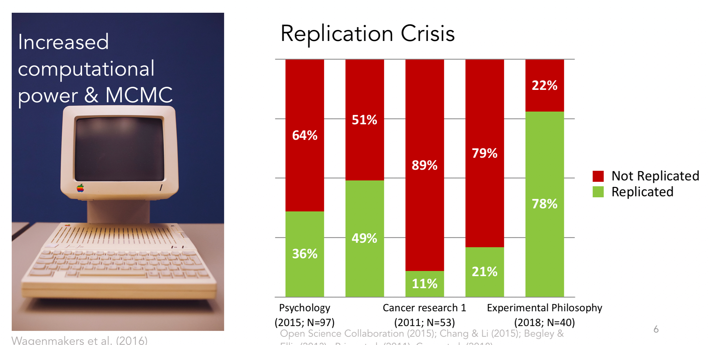

## Why now?

::::: columns
::: {.column width="50%"}
**Technology**

-   Faster computers
-   Better algorithms (MCMC -\> HMC)
-   Accessible software (`brms`, Stan)
:::

::: {.column width="50%"}
**Frustration**

-   Can't incorporate prior knowledge
-   p-values don't answer what we want
-   Can't find evidence FOR the null
-   Replication crisis
:::
:::::

## Bayesian statistics as a tool

::::: columns
::: {.column width="50%"}
-   Google "Bayesian" → philosophical wars

-   Subjective vs. objective.
    Frequentist vs. Bayesian.

-   Interesting.
    Not our focus.
:::

::: {.column width="50%"}
```{r}
#| echo: false
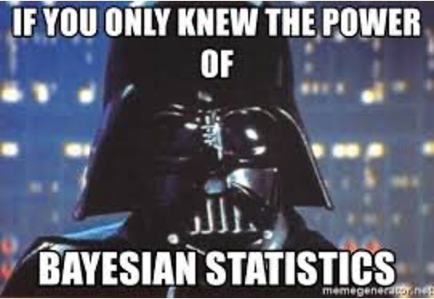
```
:::
:::::

## Two views of probability

::::: columns
::: {.column width="50%"}
**Frequentist**

Probability = long-run frequency.

"If I repeated this experiment forever, 60% of the time I'd get heads."

. . .

Parameters are **fixed** but unknown.

Data are **random**.

Only data get probability statements.
:::

::: {.column width="50%"}
**Bayesian**

Probability = degree of belief.

"I'm 60% sure this coin is biased toward heads."

. . .

Parameters are **uncertain** — they get distributions.

Data are **fixed** (you observed them).

Parameters get probability statements.
:::
:::::

# Bayesian belief updating {.center}

## Belief updating: an example

Let's watch Bayes' rule work — step by step.

. . .

What proportion of people are dog people?

. . .

-   Data: 0 = cat person, 1 = dog person
-   Parameter: $\theta$ = proportion of dog people
-   Sample: 5 people

. . .

Same structure as the coin — just a different question.

## Step 1: State your prior

```{r, fig.align='center', echo=FALSE}
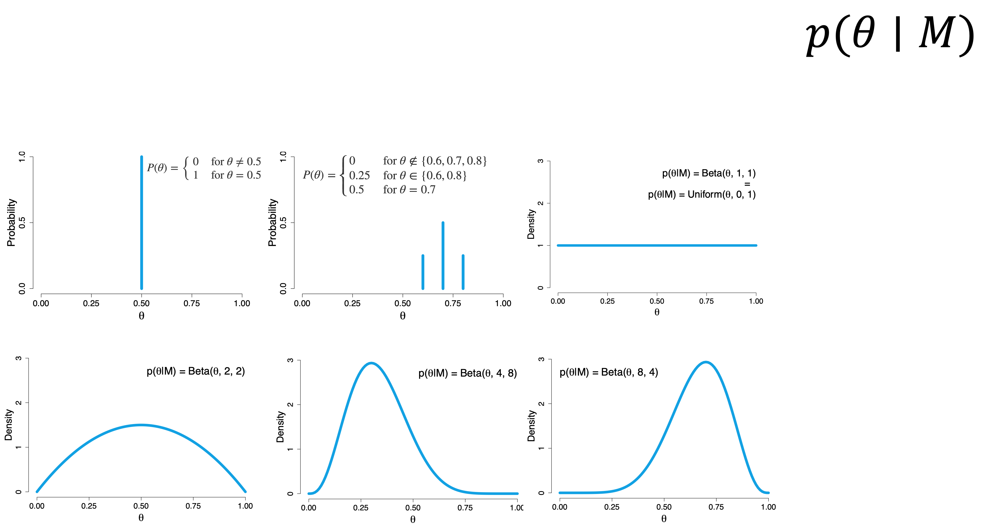
```

. . .

People vary in how strongly they state prior beliefs.

. . .

-   **Informative** → "I'm pretty sure it's near 0.5"
-   **Weakly informative** → "Probably between 0.2 and 0.8"
-   **Non-informative** → "I have no idea"

. . .

Most researchers use **weakly informative** priors.

## Step 2: Your prior makes predictions

Before seeing data — what does each model predict?

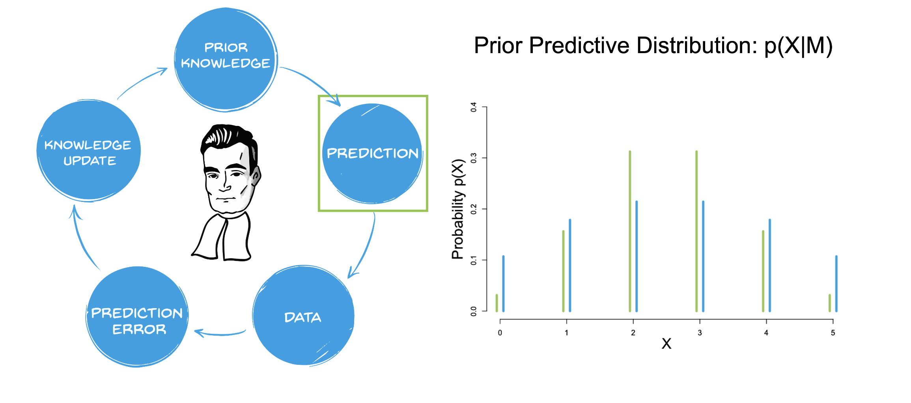{fig-align="center"}

. . .

Narrow prior → specific predictions.

Wide prior → anything is plausible.

## Step 3: Collect data

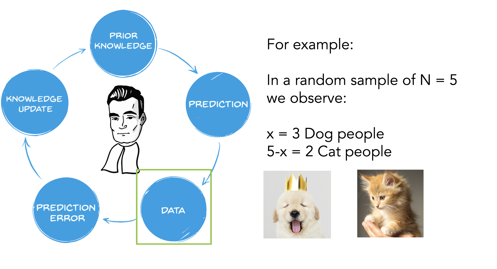{fig-align="center"}

. . .

3 out of 5 are dog people.

Everything before this happened **without data**.

Now we update.

## Step 4: Which model predicted better?

The **marginal likelihood** — how plausible is the observed data under each model?

```{r, fig.align='center', echo=FALSE}
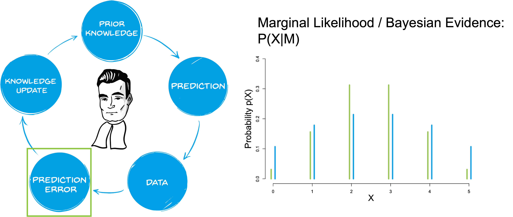
```

. . .

Go back to each model's predictions.
Evaluate at the observed data.

The ratio of these = the **Bayes Factor**.

## Bayes Factors

How much did the data change your mind?

$$BF_{12} = \frac{P(\text{data} \mid M_1)}{P(\text{data} \mid M_2)}$$

. . .

-   $BF > 1$ → data favor $M_1$
-   $BF < 1$ → data favor $M_2$
-   $BF = 1$ → data equally consistent with both

. . .

Unlike p-values — BFs can provide evidence **for** the null.

. . .

```{r, fig.align='center', echo=FALSE, out.width="60%"}
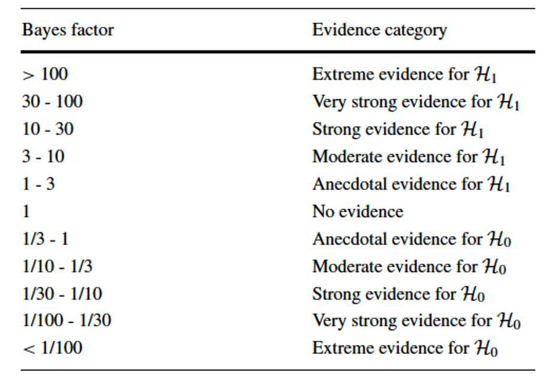
```

## Step 5: Update → Posterior

```{r, fig.align='center', echo=FALSE}
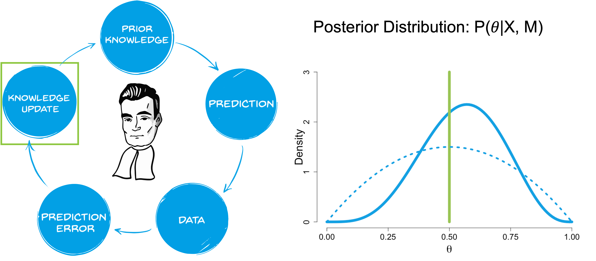
```

. . .

The wide prior (blue) gets reshaped — narrower, pulled toward the data.

. . .

The spike prior (green) doesn't budge.

If you rule something out completely, no data can bring it back.

## Prior → Posterior

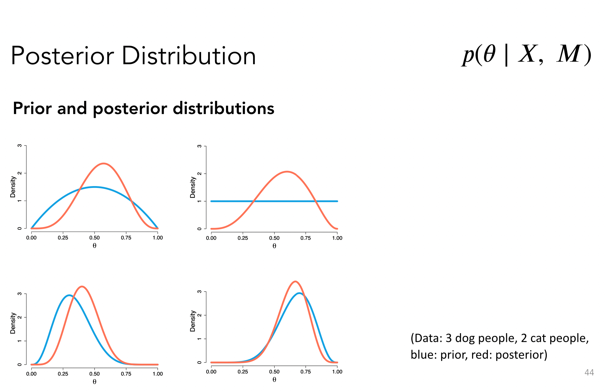{fig-align="center"}

. . .

The posterior sits between prior and likelihood.

With more data — pulled toward the likelihood.

With less data — stays closer to the prior.

## Credible intervals

The posterior gives you what you always wanted from confidence intervals:

. . .

"With 95% probability, $\theta$ lies within this interval."

. . .

```{r, fig.align='center', echo=FALSE, out.width="70%"}
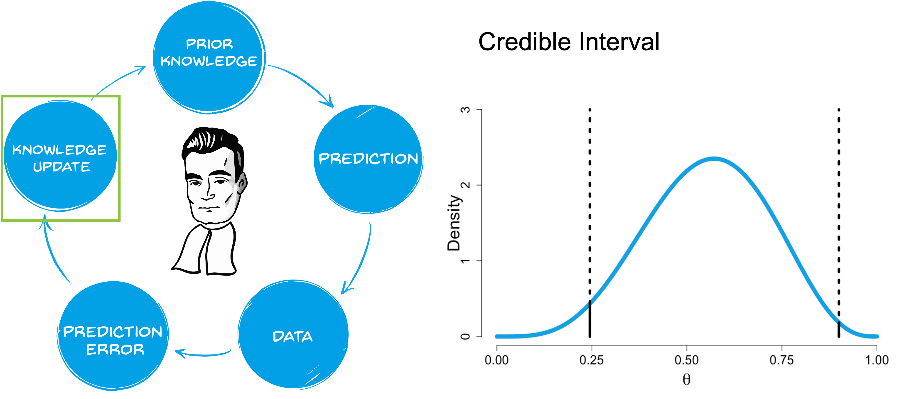
```

. . .

This is a **direct probability statement** about the parameter.

Not "if we repeated the experiment..."

# From coins to regression {.center}

## Same recipe, more parameters

|   | Coin | Regression |
|------------------------|------------------------|------------------------|
| Model | $Y \sim \text{Binomial}(n, \theta)$ | $Y \sim \text{Normal}(\mu_i, \sigma)$ |
| Parameters | $\theta$ | $\beta_0, \beta_1, \sigma$ |
| Prior | $p(\theta)$ | $p(\beta_0), p(\beta_1), p(\sigma)$ |
| Likelihood | Score each $\theta$ | Score each $(\beta_0, \beta_1, \sigma)$ |
| Posterior | $p(\theta \mid \text{data})$ | $p(\beta_0, \beta_1, \sigma \mid \text{data})$ |

. . .

More parameters.
Same recipe.

. . .

`brms` handles all of it.

## Computing a likelihood

``` r
compute_ll <- function(b0, b1, data) {
  p_hat <- plogis(b0 + b1 * data$lead_weight)
  sum(data$outcomes * log(p_hat) + 
      (1 - data$outcomes) * log(1 - p_hat))
}
```

. . .

Same idea — many parameters, score each combination.

. . .

The linear model has one too — swap in `dnorm()`.

## The likelihood for a linear model

$$Y_i \sim \text{Normal}(\mu_i, \sigma), \quad \mu_i = \beta_0 + \beta_1 X_i$$

Say $\beta_0 = 50$, $\beta_1 = 0.3$, $\sigma = 10$:

. . .

-   Student watches 30 min → predicted mean = $50 + 0.3(30) = 59$
-   Actual grade = 65
-   Score: `dnorm(65, mean = 59, sd = 10)` ≈ 0.03

. . .

Do this for every student.
Multiply.
That's the likelihood.

Different parameters → different score.

## Priors for regression

Same logic as the coin — just different parameters.

. . .

-   Grades are 0–100. $\beta_0$ can't be 500. → $\beta_0 \sim \text{Normal}(50, 20)$

. . .

-   Watching lectures shouldn't hurt. $\beta_1$ probably isn't −20. → $\beta_1 \sim \text{Normal}(0, 5)$

. . .

-   $\sigma$ must be positive, probably not 1000. → $\sigma \sim \text{Half-Cauchy}(0, 10)$

. . .

MLE ignores all of this.
Bayes encodes it.

## Declaring Priors

You have to identify:

-   Distribution of every statistic you want to estimate, including the dependent variable and each parameter of its distribution
    -   (e.g., DV \~ N( $\mu$ , $\sigma$))
-   Expected values for the location and spread of the distributions

## How to choose

-   People argue about priors

    -   Where do they come from?

    -   Priors differ in how informative they are

    -   Priors differ in how 'proper' they are

-   Creates camps:

    -   "Subjective Bayesians" vs. "Objective Bayesians" vs. "Empirical Bayesians" vs. "Pragmatic Bayesians"

## Informativeness of priors

-   Informative Priors ("Subjective Bayesians")

    -   Prior distributions that are specific about the values of model parameters (e.g., true correlation ≈ N(μ = -0.5)

-   Non-informative Priors ("Objective Bayesians")

    -   Priors that let data speak for themselves; invariant to transformation

-   Weakly-informative priors ("WIP"; Most Bayesians)

    -   Specifying the distribution (e.g., Normal), with starting values known to bias estimates the least

## Informativeness of priors

-   People vary in how strongly they state their prior beliefs

-   If you state your belief strongly

    -   E.g., the true correlation is \~N(0.3, 0.06)
        -   Pitfall: Your beliefs have greater influence over the shape of the posterior distribution

-   If you state your belief weakly

    -   E.g., true correlation is equally likely at any real value between -1 and 1
        -   Pitfall: You run the risk of overestimating the relative densities of the posterior distribution to the prior distribution

## Bayesian belief updating

-   Prior odds

    -   Compares the relative plausibility of two models before data collection

$$\frac{p(M1)}{p(M2)}$$

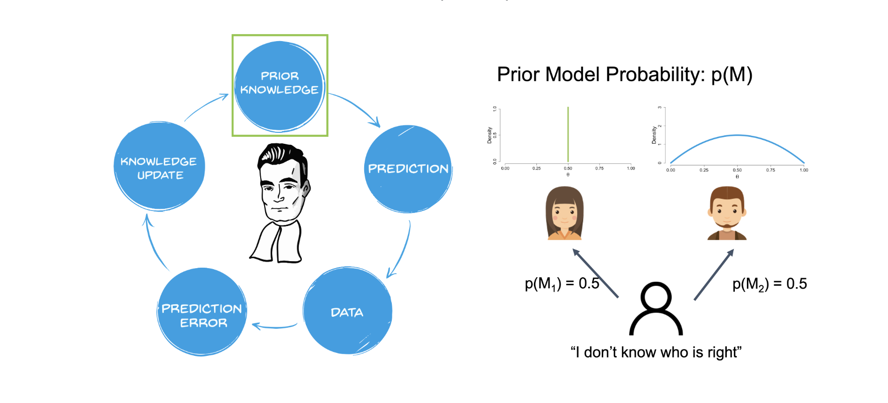{fig-align="center"}

## Bayesian belief updating

-   Prior prediction distribution

    -   Makes a prediction about plausibility of the data

        -   What is the probability to observe 0, 1, 2, … dog people in a random sample of 5 people given our model?

{fig-align="center"}

## Bayesian belief updating

{fig-align="center"}

## Bayesian belief updating

-   Marginal Likelihood

    -   How plausible are the observed data under the model?

        -   Evaluation of the prior predictive distribution at the observed data

```{r, fig.align='center', echo=FALSE}


```

## Bayesian belief updating

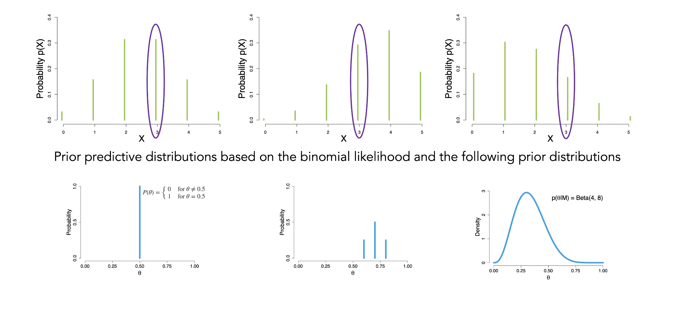{fig-align="center" width="1001"}

## Bayes factors

::::: columns
::: {.column width="50%"}
-   Frequentists have *p* values

-   Bayesians have Bayes factors (BF)

    -   Tells you how much more likely the observed data are under one model than under another model

    -   Can be interpreted as degree of relative evidence for a model

        $$\text{Bayes factor} (BF) = \frac{P(\mathcal{D}|M_1)}{P(\mathcal{D}|M_2)}$$
:::

::: {.column width="50%"}
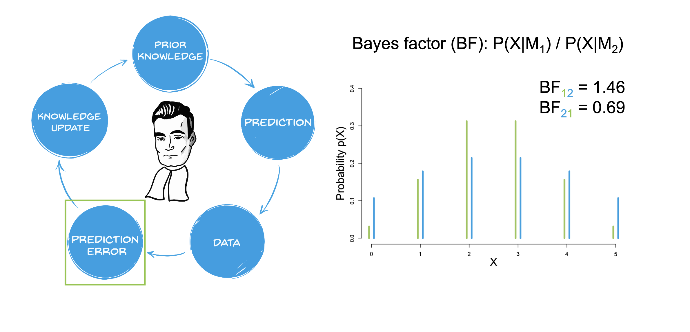{fig-align="center"}

-   $BF_{12}$ \> 1: More evidence for M1

-   $BF_{12}$ \< 1: More evidence for M2
:::
:::::

## Bayesian belief updating

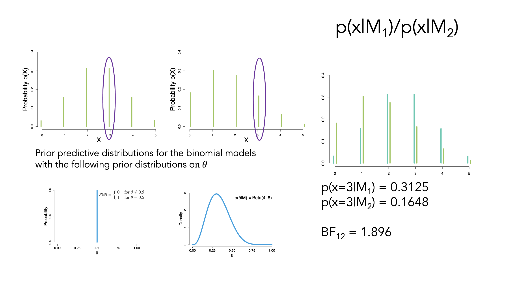{fig-align="center"}

## Bayes factors

-   How convincing is the evidence that M1 is better than M2?

    -   Moderate to strong evidence (BF \> 3) to publish in psych

```{r, fig.align='center', echo=FALSE}


```

## Bayesian belief updating

-   A posterior distribution is a conditional probability distribution that represents belief about a parameter, taking the evidence into account

```{r, fig.align='center', echo=FALSE}


```

## Bayesian belief updating

{fig-align="center"}

## Bayesian belief updating

-   Posterior

    -   Credible intervals (Highest Density Intervals)

        -   Give us a way to express the uncertainty in estimating parameter values

        -   Provide a range within which we believe the true value of a parameter lies, with a certain probability

            -   With a probability of x%, the parameter lies within this interval

```{r, fig.align='center', echo=FALSE, out.width="70%"}


```

## Bayesian belief updating

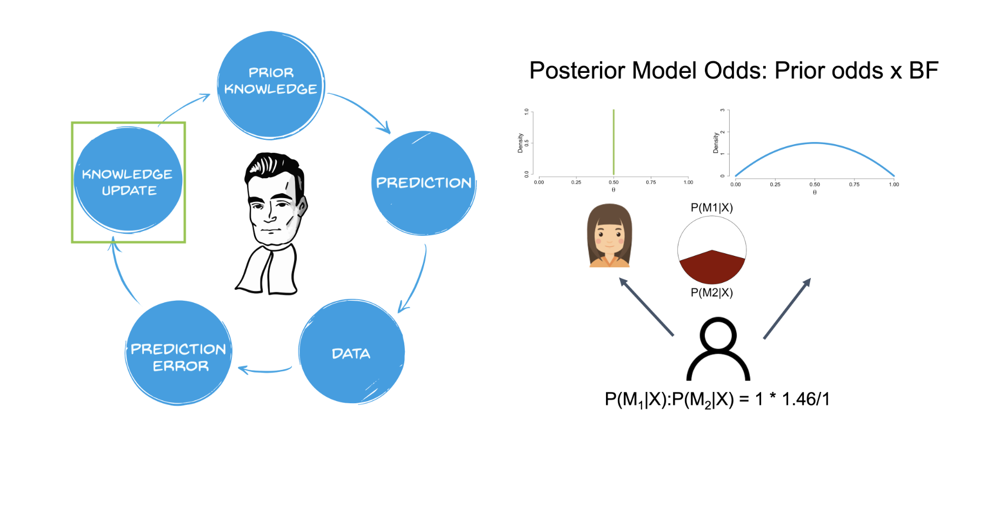{fig-align="center"}

# Note: Two uses of "Bayesian" in psychology

::::: columns
::: {.column width="50%"}
**Bayesian data analysis**

(what we're doing)

A tool for **analyzing data**.

Bayes' rule used estimate parameters from your experiment.

The model describes your **data**.
:::

::: {.column width="50%"}
**Bayesian models of cognition**

(Griffiths, Tenenbaum, etc.)

A theory of **how people think**.

The claim: human minds use something like Bayes' rule to learn and make decisions.

The model describes cognition.
:::
:::::


You can use Bayesian data analysis without committing to the Bayesian Brian hypothesis!

## Bayesian models as psychological theory

The claim: people behave **as if** they do Bayesian inference.

. . .

-   **Language:** Children infer word meanings from few examples (Xu & Tenenbaum, 2007)

. . .

-   **Perception:** The brain combines noisy sensory input with prior expectations (Knill & Pouget, 2004)

. . .

-   **Causal reasoning:** People learn causal structure from sparse evidence (Griffiths & Tenenbaum, 2005)

. . .

-   **Motor control:** You catch a ball by combining visual uncertainty with learned priors (Körding & Wolpert, 2004)


# Implementation in R {.center}

## Bayesian regression example

-   Does synchronous attendance and average viewing matter in hybrid courses?

    -   33 students in Fall 2020 statistics course

        -   Looked at:

            -   Grade `Final course grade`: Min: 30 Max: 97

            -   sync `Mode of attendance`: (0=asynchronous; 1=synchronous)

            -   avgView `Average standardized viewing time for recorded lectures`: in minutes

## Data

```{r}

#data<-read.csv("https://osf.io/sxk2a/download")
data<-read.csv("statGrades.csv")
```

```{r, eval=FALSE}

library(brms) # run bayes lm

library(marginaleffects) # get posteriors

library(ggeffects) # graph

library(easystats) # easystats packages # bayesttestR

library(bayesplot) # graph trace plots

library(ggdist) # graph distributions and geoms

```

## `avgView` plot

```{r, echo=FALSE, out.width="70%"}

#| fig-align: "center"

# The ggplot function takes the data as argument, and then the variables

# related to aesthetic features such as the x and y axes.

ggplot(data, aes(x = avgView, y = grade)) +

  geom_point(size=3) + # This adds the points

  geom_smooth(method = "lm")  +

  theme_lucid(base_size=25)# This adds a regression line

```

## `sync` plot

```{r, echo=FALSE, fig.align='center', out.width="70%"}

library(gghalves)

library(ggokabeito)

library(ggbeeswarm)

data$sync_cat<-ifelse(data$sync==0, "Async", "Sync")

data$sync_cont<-ifelse(data$sync_cat=="Async", -.5, .5)

# Visualise distributions and observations

ggplot(data, aes(x = sync_cat, y = grade)) +

  geom_half_point(aes(color = sync_cat),

                  transformation = position_quasirandom(width = 0.1),

                  side = "l", size = 2, alpha = 0.5) +

  geom_half_boxplot(aes(fill = sync_cat), side = "r") +

  scale_fill_okabe_ito() +

  scale_color_okabe_ito() +

  guides(color = "none", fill = "none") +

  labs(x = "Sync", y = "Grade") +

  theme_lucid(base_size=24)

```

## Simple regression

```{r}

lm_class <- lm(grade~avgView+sync_cont, data=data)

model_parameters(lm_class) %>%

  print_md()

```

## `brms`

-   Bayesian regression models in Stan (`brms`)

```{r}

#| results: hide

#|

brm_class1 <- brm(grade~avgView+sync_cont, data=data,

family= gaussian(),#distribution

prior=NULL,

chains=4, # how many chains are run

core=4, #computer cores to use

warmup = 2000, # warm-up for MCMC

iter = 5000) # number of MCMC samples

```

## Computing the posterior

-   Markov chain Monte Carlo (MCMC) sampler!

-   Given possible priors and your data, a computer uses a Monte Carlo sampling technique to build stochastic Markov Chains, a process referred to as MCMC

-   We run multiple chains (e.g., 4 chains in `brms`) with equal numbers of iterations (e.g., 5000 iterations) in each chain to estimate convergence/stability

-   MCMC chains contain samples from the posterior distribution of the theory given the data

## Markov Chain (MC)

::::: columns
::: {.column width="50%"}
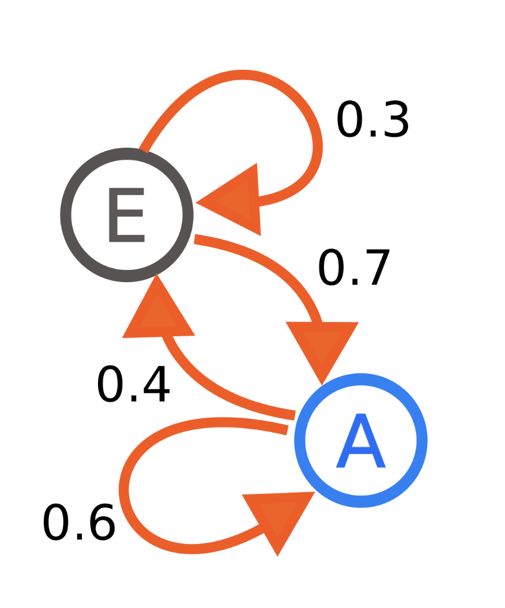{fig-align="center" width="212"}

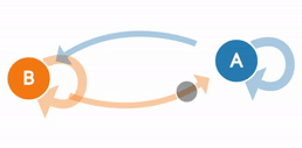
:::

::: {.column width="50%"}
-   Chain of discrete events, moving forward in time

    -   Probability of each event is a conditional probability, given the last event

-   Memoryless

    -   Future events can be predicted by knowing only the current event

-   Issue: they can stay the same/loop
:::
:::::

## Monte Carlo (MC)

-   Monte Carlo simulations involve simulating a random process and then directly averaging the values of interest

```{webr-r}

# Define the number of simulations

n_simulations <- 100

# Define the sample size for each simulation

sample_size <- 100

# Define the mean and standard deviation for the normal distribution

mean <- 0

sd <- 1

# Initialize a vector to store the mean of each simulation

simulation_means <- numeric(n_simulations)

# Perform the simulations

for(i in 1:n_simulations) {

  sample_data <- rnorm(n = sample_size, mean = mean, sd = sd)

  simulation_means[i] <- mean(sample_data)

}

# Print the results

print(simulation_means)

```

# MCMC in action

-   https://chi-feng.github.io/mcmc-demo/app.html

## MCMC diagnostics

-   Trace plots

    -   Look for the fuzzy ***caterpillars***

```{r, fig.align='center', out.width="40%"}

bayesplot::color_scheme_set("mix-blue-red")

bayesplot::mcmc_trace(brm_class1, pars = c("b_avgView"),

           facet_args = list(ncol = 1, strip.position = "left"))

```

## MCMC Diagnostics

-   Bad plots

```{r, echo=F}

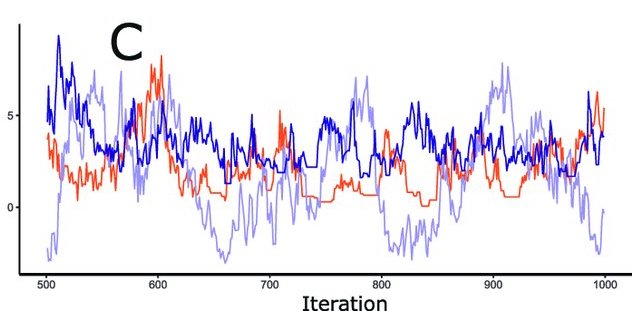

```

## MCMC Diagnostics

-   Can use numeric methods

```{r}

kable(diagnostic_posterior(brm_class1), digits=3)

```

-   $\hat{R}$

    -   Measure of consistency of Markov chains

        -   Should be close to 1 (not larger than 1.01)

    -   Ratio of variance (like *F* test)

## MCMC Diagnostics

```{r}

kable(diagnostic_posterior(brm_class1), digits=3)

```

-   Effective sample size (ESS)

    -   Number of independent pieces there is in autocorrelated chains (Krushke, 2015, p182-3)

        -   MCMC chains are autocorrelated

    -   ESS should be \> 1000

## Priors

```{r}

prior_summary(brm_class1)

```

::: callout-note
Non-informative priors will give you essentially same results as a frequentist analysis
:::

## Weakly informative priors

-   Normal(0, 10)

```{r}

#| echo: false

#|

x=distribution_normal(100, 0, 10)

plot(density(x))

```

## Weakly informative priors

-   Cauchy(mean=0, width=.707)

    -   50% of probability lies between .707 and -.707

```{r}

#| echo: false

#|

x=distribution_cauchy(100, 0, 10)

plot(density(x))

```

## Visualize prior predictive distribution

-   Make sure prior distribution makes sensible predictions (if using informative priors)

::::: columns
::: {.column width="50%"}
```{r,warning=F, message=F, results='hide'}

# set prior using prior function

# these priors are not good and only for demo

prior1 <- prior(cauchy(0, .707), class=b)

prior2 <- prior(normal(0, 10), class = b)

prior3 <- prior(normal(0, .51), class = b)

#include prior

# only sample from prior so we can plot it and look

brm_class_prior <- brm(grade~avgView, data=data,

sample_prior="only", #use this to check prior pulls

prior=prior2, # add in prior information

family= gaussian(),

warmup = 2000,

iter = 5000)

# check prior

```
:::

::: {.column width="50%"}
```{r}

#| eval: false

pp_check(brm_class_prior)

```
:::
:::::

## Describing the posterior

-   A point-estimate which is a one-value summary (similar to the $\beta$ in frequentist regressions)

    -   Mean/median

-   A credible interval representing the associated uncertainty

-   Some indices of significance, giving information about the relative importance of this effect (e.g., Bayes Factors)

## Posterior distribution plot

```{r, fig.align='center', out.width="60%"}

#| eval: false

pp_check(brm_class1, type="stat_grouped", group="sync_cont")

```

## Posterior distribution plot

```{r}

#| eval: false

pp_check(brm_class1,group="avgView")

```

## Point-estimate

```{r}

model_parameters(brm_class1) %>%

  kable()

```

## Uncertainty: Credible intervals

-   Credible intervals (high density intervals)

```{r}

posteriors <- get_parameters(brm_class1)

resuls=hdi(posteriors$b_avgView, ci=0.95)

```

```{r, echo=F, fig.align='center', out.width="100%"}

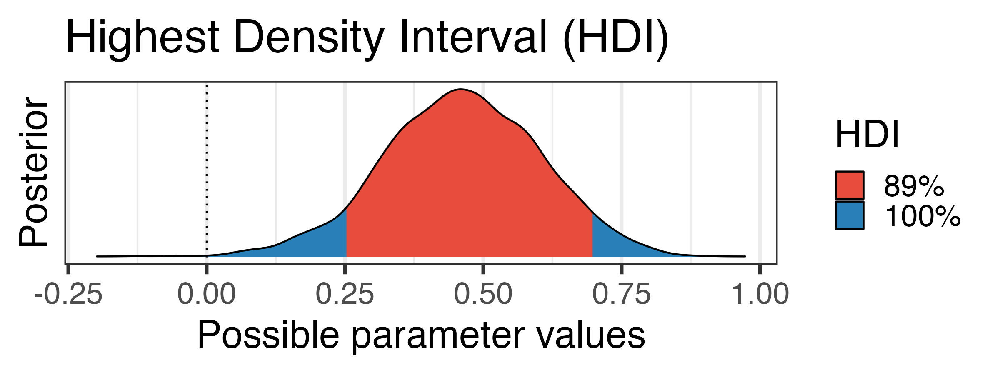

```

## Uncertainty: Credible intervals

```{r}

library(see)

posteriors <- get_parameters(brm_class1)

results=hdi(posteriors$b_sync_cont, ci=0.95)

```

```{r, echo=F, fig.align='center', out.width="100%"}

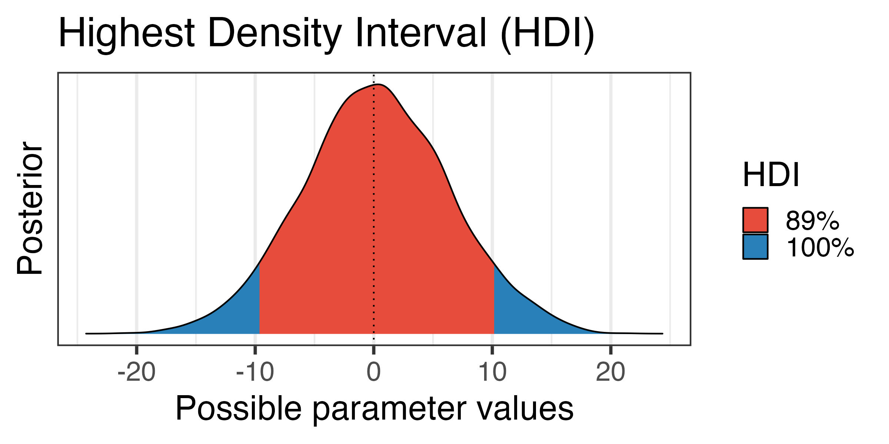

```

## Visualizing uncertainty: `avgView`

::::: columns
::: {.column width="50%"}
```{r}

#get predictions from margainaleffects

pred <- predictions(brm_class1,

                    newdata = datagrid(

        avgView = seq(6, 75, by = 5))) %>%

        posterior_draws()

pred_fig <- ggplot(pred, aes(x = avgView, y = draw)) +

    stat_lineribbon() +

    scale_fill_brewer(palette = "Reds") +

    labs(x = "Average Watch Time (min)",

         y = "Grades (predicted)",

         fill = "")

```
:::

::: {.column width="50%"}
```{r}

#| echo: false

#|

pred_fig

```
:::
:::::

## Visualizing uncertainty: `sync`

::::: columns
::: {.column width="50%"}
```{r}

#| eval: false

#|

pred <- avg_predictions(brm_class1, variables = "sync_cont") %>%  posterior_draws()

pred$sync_cont<-as.factor(pred$sync_cont)

ggplot(pred, aes(x = draw, y = sync_cont, fill = sync_cont)) +

  stat_halfeye(.width=c(.8, .95))  +

  scale_fill_viridis_d(option = "plasma", end = 0.8) +

  guides(fill = "none") +

  labs(x ="Class", y = "Grades",

       caption = "80% and 95% credible intervals shown in black") +

  theme_lucid(base_size=25)

```
:::

::: {.column width="50%"}
```{r}

#| echo: false

pred <- avg_predictions(brm_class1, variables = "sync_cont") %>%  posterior_draws()

pred$sync_cont<-as.factor(pred$sync_cont)

ggplot(pred, aes(x = draw, y = sync_cont, fill = sync_cont)) +

  stat_halfeye()  +

  scale_fill_viridis_d(option = "plasma", end = 0.8) +

  guides(fill = "none") +

  labs(x ="Class", y = "Grades",

       caption = "80% and 95% credible intervals shown in black") +

  theme_lucid(base_size=25)

```
:::
:::::

## Descriptives

-   `bayestestR` from `easystats`

```{r}

describe_posterior(

  brm_class1,

  effects = "fixed",

  component = "all",

  test=c("p_direction"),

  centrality = "all"

) %>%

  kable()

```

::: callout-note
probability of direction (pd) is pretty cool!

It tells us how much of the distribution is completely positive or negative.

It is correlated with p values!
:::

## Significance

-   Does the credible interval for `avgView` contain 0?

    -   If yes, "not significant"

    -   If no, "significant"

```{r}

hdi(posteriors$b_avgView, ci=0.95)

```

. . .

-   It does not in our case so significant!

## Significance

-   Does the credible interval for `sync_cont` contain 0?

    -   If yes, "not significant"

    -   If no, "significant"

```{r}

hdi(posteriors$b_sync_cont, ci=0.95)

```

. . .

-   It does not in our case - not significant!

## Significant differences

-   Use `marginaleffects` or emmeans to get mean differences between variables

```{r}

marginaleffects::avg_comparisons(brm_class1, variables="sync_cont")  %>%

  kable()

```

## Significant differences: BFs

-   Adding prior to our model

    -   Cannot compute BFs without specifying a weak or informative prior!

```{r, message=FALSE, warning=FALSE, echo=TRUE, results='hide'}

brm_class_cat <- brm(grade~avgView + sync_cont, prior=prior2,

data=data,

family=gaussian(),

sample_prior="yes") # make sure to sample prior

```

## Significant differences: BFs

-   Can compare model parameters to determine if effect is 0 (or some other value)

-   Use `bayesfactor_parameter` function to test a model with the observed effect to a model with the effect at 0

```{r, warning=F, message=F}

library(bayestestR) # bayes functions easystats

# contrast

#BF only if you use weakly-strong priors

BF <- bayestestR::bayesfactor_parameters(brm_class_cat, null = 0)

BF

```

## Model comparisons: BF

-   Use `bayestestR::bayesfactor_models` to get a BF for full models selection

```{r, echo=TRUE, message=F, warning=F, results='hide'}

# Model 1: grade ~ sync + avgView

#save_pars for bayes factors

brm_class1 <- brm(grade~avgView + sync, data=data , family = gaussian(), prior=prior2, sample_prior="yes", save_pars = save_pars(all=TRUE), warmup = 2000, iter = 5000)

#grade ~ avgView

brm_class2 <- brm(grade~avgView, data=data, prior=prior2, family = gaussian(), sample_prior="yes", save_pars = save_pars(all=TRUE),

    warmup = 2000, iter = 5000)

```

```{r}

#| eval: false

#|

# testing models

# compared to intercept-only or null model

bayesfactor_models(brm_class1, brm_class2)

```

-   `avgview` only model is 15 times more likely than a model with

## Significant differences: BFs

-   Is the effect 0?

```{r}

BF <- bayestestR::bayesfactor_parameters(brm_class2, null = 0)

BF

```

. . .

-   Not 0!

## Original question

-   Do my students' course grades depend on mode of attendance and average viewing time?

-   Only `avgView`

    -   BF favored a model with only `avgView`

        -   Strong evidence that effect not zero (BF = 15)

    -   Weak evidence for an effect of mode of attendance

. . .

-   What do we get from Bayesian analysis that we don't get from regular linear regression?

## Reporting Bayesian analysis

```{r, echo=T, message=F, warning=F, results='hide', eval=F}

report_bayes=report::report(brm_class1)

```

1.  Include which prior settings were used

2.  Justify the prior settings (particularly for informed priors in a testing scenario)

3.  Include a plot of the prior and posterior distribution

4.  Report the posterior mean/median and x% credible intervals

5.  If relevant, report the results from both estimation and hypothesis testing

6.  Include BFs for model comparisons or parameters (sensitivity analysis)

7.  Include model convergence diagnostics (trace plot, $\hat R$, ESS)

#\~\~

## Bayesian pros

-   Bayesian inference allows you to make direct probability statements for things that you are interested in

-   Quantify the amount of support for one hypothesis relative to another

-   It allows you to incorporate prior information you have in a formal way (via the prior distribution)

-   Sample size does not affect estimates as much as it does the likelihood

## Bayesian cons:

-   Priors (can be good and bad)

-   Computationally intensive

## Caveat: What can Bayes not do?

-   Ban questionable research practices (e.g., HARKing)

-   Provide a remedy for:

    -   Small sample sizes

    -   Unrepresentative samples

    -   Poor experimental design

## Resources

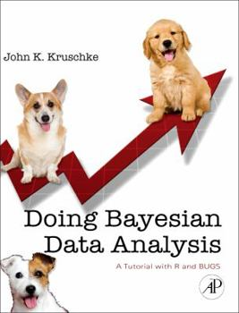{fig-align="center"}

## Resources

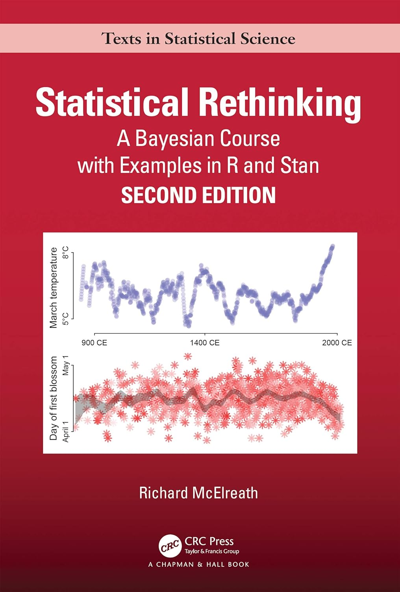{fig-align="center"}

-   Check out the awesome YouTube videos that go through each chapter.

## Resources

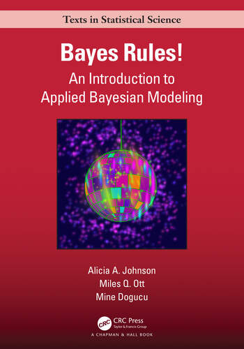{fig-align="center"}

Free online textbook

# Tomorrow


. . .

<https://betanalpha.github.io/assets/chapters_html/reading_times.html>
