## Packages

```{r}
library(easystats)
library(MASS)
library(arm) # residual plot
library(effectsize) 
library(tidyverse)
library(equatiomatic)
library(kableExtra)
library(broom)
library(emmeans)
library(marginaleffects)
library(modelsummary)
library(logistf) # Firth's penalized likelihood for separation

options(scipen = 999)
```

-   Access the .qmd document here: <https://github.com/suyoghc/PSY504_Spring_2026/tree/main/posts>

## Announcements

## Today

::::: columns
::: {.column width="50%"}
-   GLM framework

-   Nuts and bolts of logistic regression

    -   The model
        -   Binomial distribution
        -   Logit link
    -   Working with it
        -   Log-odds, odds, probabilities
        -   Likelihood
:::

::: {.column width="50%"}
-   Motivating example: Weight loss, gender, BMI

    -   Modeling fitting
    -   Parameter interpretation
    -   Model fit and model diagnostics
    -   Comparing models
    -   Visualizing
    -   Reporting
:::
:::::

## Linear model

-   Model $y$ as a linear function of predictors

$$ Y_i = b_0 + b_1*x + e_i$$

$$Y \sim~Normal(\mu, \sigma)$$

-   Everything so far has included a continuous outcome

-   We looked at different possibilities for the the RHS of this definition:

    -   types of X (Categorical, Continuous, Ordinal,.. )
    -   number of Xs
    -   interactions

## Dichotomous outcomes

The simplest kind of categorical data is each case is binary

. . .

-   Correct/incorrect
-   Pass/fail
-   Choose/Don't choose
-   Support/Not support
-   Relapse/Not relapse

::: callout-note
-   We usually code these as 0s and 1s and

-   And we model the probability of getting one or the other outcome.
:::

:::: notes
::: callout-note
:::

-   Binary outcomes are everywhere in psych

    -   recall (memory) or search, choice (decision-making), relapse

-   Code as 0/1, model probability of 1
::::

## Dichotomous outcomes

-   What happens if we try to model binary data (0/1) with a standard linear regression?

. . .

```{r}
#| echo: false
#| fig-align: "center"
#| fig-width: 8
#| fig-height: 5

# Create example data for illustration
set.seed(42)
n <- 200
x <- rnorm(n, 50, 15)
p <- plogis(-2 + 0.04 * x)
y <- rbinom(n, 1, p)

df_demo <- data.frame(x = x, y = y)

ggplot(df_demo, aes(x = x, y = y)) +
  geom_point(alpha = 0.4, size = 2) +
  geom_smooth(method = "lm", se = TRUE, color = "red", linewidth = 1.2) +
  scale_y_continuous(breaks = c(0, 0.5, 1), limits = c(-0.3, 1.3)) +
  geom_hline(yintercept = c(0, 1), linetype = "dashed", color = "grey50") +
  labs(x = "Predictor", y = "P(Y = 1)") +
  theme_lucid(base_size = 20) +
  annotate("text", x = max(x) - 5, y = 1.2, label = "Impossible predictions!", color = "red", size = 6)
```

## Problems with the Linear Probability Model

-   Makes impossible predictions (values not between 0, 1)

-   Non-normality of residuals

    -   $\hat{p}$ or (1-$\hat{p}$)

-   Heteroskedasticity

    -   Variance is influenced by $\hat{p}$

# Generalized linear model

## Generalized linear model

> Regression models with non-normal response likelihoods

$$\begin{align*}
  Y_i & \sim \mathrm{Dist}(\mu_i, \tau)  \\
  g(\mu_i) & = \eta_i \\
  \eta_i & = \beta_0 + \beta_1 X_{1i} + \beta_2 X_{2i} + \ldots
\end{align*}$$Where:

-   $y$ is referenced with $\mu$

-   $g$ is link function (in logistic regression we use *logit link*)

## What distribution do we use to model this process?

-   We assume that there is **some probability** p of responding correctly (or selecting what is coded as 1)

-   We don't know this probability, so we want to **use the data to estimate it**

## Bernoulli distribution

::::: columns
::: {.column width="50%"}
> Distribution of a single, discrete binary outcome $$y\sim Bernoulli(p)$$

-   A Bernoulli distribution generates a 1 ("success") with probability p

-   And a 0 ("failure") with probability 1−p=q

    -   $\mu$ = E(X)=p
    -   $\sigma^2(X)=p(1-p)$
:::

::: {.column width="50%"}
<br>

<br>

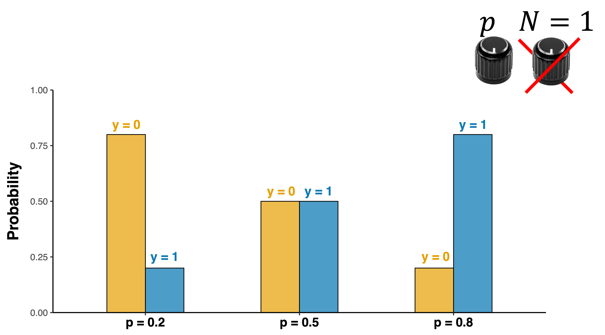{fig-align="center" width="520" height="270"}
:::
:::::

## Binomial distribution

::::: columns
::: {.column width="50%"}
> Distribution of discrete counts of independent outcomes over a certain set of trials

$$y\sim binomial(N,p)$$

-   N = number of trials

-   p = probability of "y = 1"

    -   $\mu$ = E(X)=np\$
    -   $\sigma^2(X)=np(1-p)$
    -   $\sigma(X)$=$\sqrt{np(1-p)}$
:::

::: {.column width="50%"}
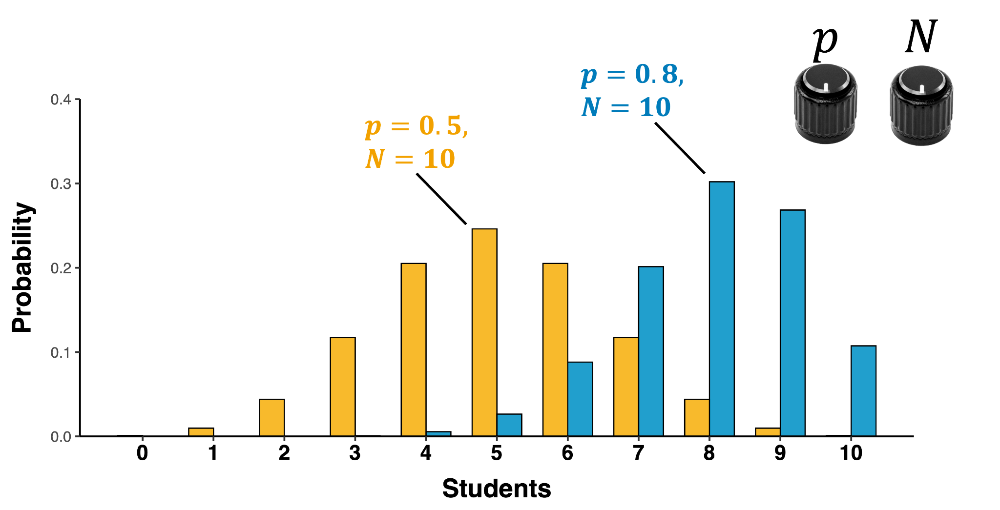{fig-align="center"}
:::
:::::

## Fitting a logistic regression in R

-   In R we use the `glm` function as opposed to `lm`

::: panel-tabset
## Bernoulli

```{r}
library(fivethirtyeight)
bechdel=fivethirtyeight::bechdel

#fit <- glm(
 # data = bechdel,
 # family = binomial(link="logit"),
 # binary  ~ 1 + budget_2013)

bechdel %>% dplyr::select(title, binary) %>% head() %>% kable()

```

## Binomial

```{r}

# one row with total # 1s and 0s instead of multiple rows 

df=glm(cbind(Deaths, N-Deaths)~Species, family=binomial, data=MASS::snails)

MASS::snails %>% dplyr::select(Deaths, N) %>% head() %>% kable()


```
:::

## Logit link

-   The logit link transforms a linear model in the log-odds metric:

$$\begin{equation*}
\log\left(\frac{p}{1 - p}\right)=b_0+b_1X 
 \end{equation*}$$

-   To a non-linear model in the probability metric:

$$\begin{equation*} 
p(logit)=\frac{e^{logit}}{1+e^{logit}}
\end{equation*}=\frac{exp(logit)}{1+exp(logit)}$$

## Logit link

-   Step 1

    -   Transform probability into odds

        -   The "odds" of an event are just the probability it happens divided by the probability it does not happen

$$\textrm{Odds} = \frac{\# \textrm{successes}}{\# \textrm{failures}}=
\frac{\# \textrm{successes}/n}{\# \textrm{failures}/n}=
\frac{p}{1-p}$$

## **L**ogit Link

::::: columns
::: {.column width="50%"}
-   Step 2

    -   When we convert a probability to odds, odds always \> 0

        -   Asymmetric

        -   Curvy

            -   Problematic for linear model

    -   Solution: take log of the odds

    $$logit = log(\frac{p}{1-p})$$
:::

::: {.column width="50%"}
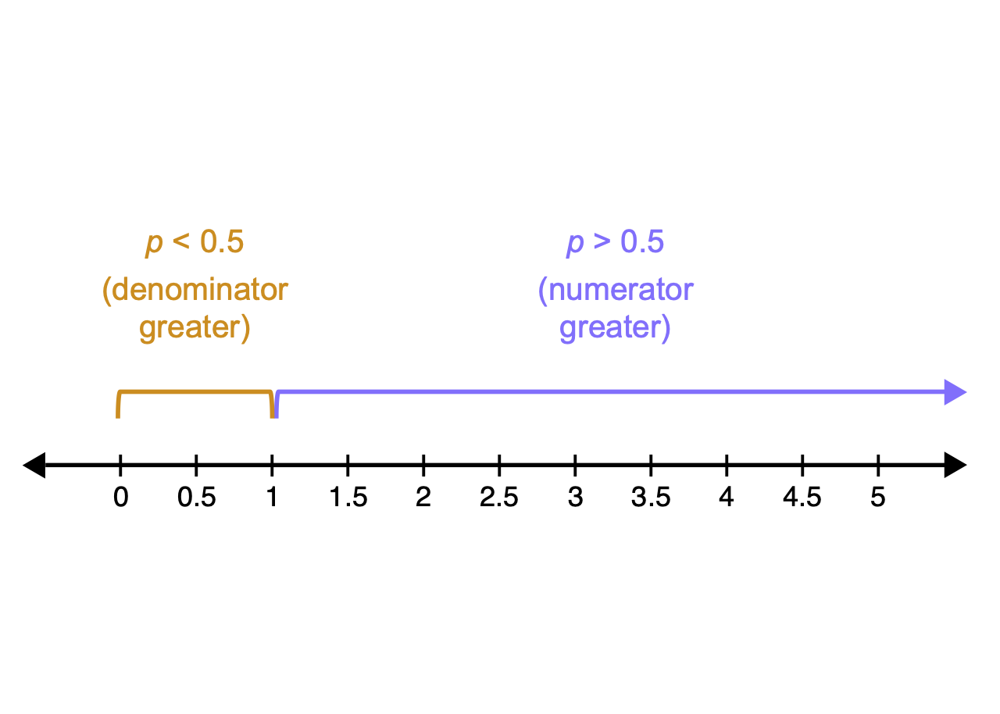{fig-align="center" width="466"}

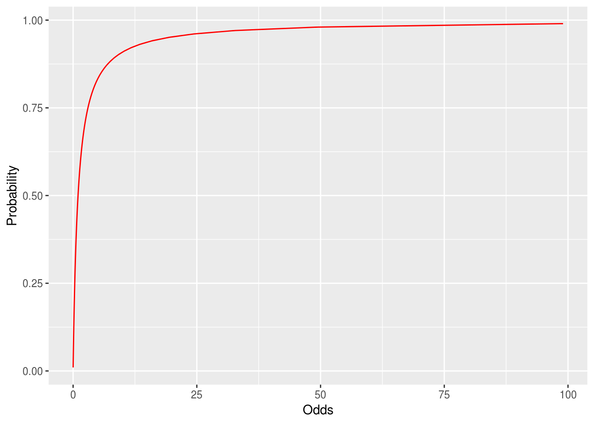{fig-align="center" width="382"}
:::
:::::

::::: notes
If you look at the figure here, we have the odds scale..\
P as a function of odds –\> bounded to 0. P\<0.5 is crammed to this region, and the rest extends to infinity\
\
Odds are always positive and asymmetric — an odds of 2 means twice as likely but an odds of 0.5 means half as likely.

Now we can take the log

::: {.column width="50%"}
-   Suddenly — symmetric. Zero sits in the middle. p \< 0.5 goes negative. p \> 0.5 goes positive. Equal room on both sides.

-   This is a scale where regression works!
:::

::: {.column width="50%"}
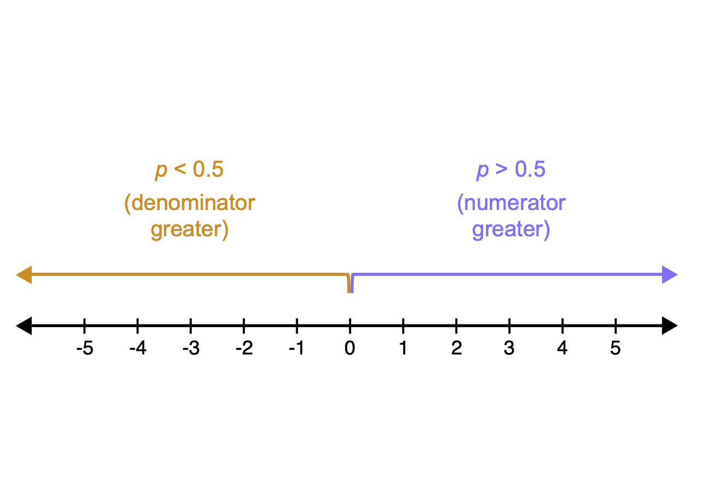{fig-align="center" width="345"}

```{r}
#| echo: false
#| 
# Manually calculate the logit values and tidy data for the plot

bechdel=fivethirtyeight::bechdel

bechdel <- bechdel  %>% 
  mutate(pass = ifelse(binary == "FAIL", 0, 1)) 

bechdel_lin<- bechdel %>%
  dplyr::select(pass, budget_2013)

fit <- glm(
  data = bechdel,
  family = binomial,
  pass ~ 1 + budget_2013)

bechdel_lin$prob <- fit$fitted.values

df_model <- bechdel_lin %>%
  mutate(logit = log(prob/(1-prob)))
        
  ggplot(df_model, aes(y = logit, x = budget_2013))+
  geom_point(size = 0.5, alpha = 0.5) +
  geom_smooth(method = "loess") + 
  theme_lucid(base_size=18)
```
:::
:::::

## However...

-   We need a function that scrunches the output of the linear predictor into a range appropriate for this parameter

```{r, echo=FALSE, fig.align='center', out.width="50%"}
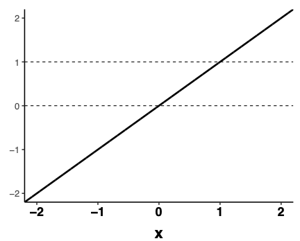
```

## Squiggles

-   We need a function that scrunches the output of the linear predictor into a range appropriate for this parameter

-   A squiggle to the rescue!

```{r, echo=FALSE, fig.align='center', out.width="100%"}

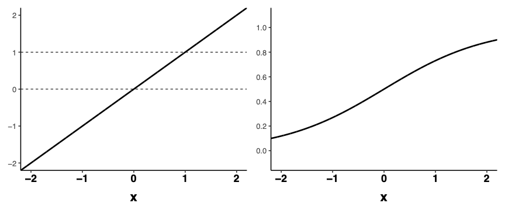

```

. . .

::: callout-note
## 🏷️ Jargon Alert

Squiggle = Sigmoid curve = S-curvew = inverse logit = logistic function = `plogis()` in R

\
*Same thing, many names.*
:::

## Logistic transform

```{r}
#| echo: false
#| 
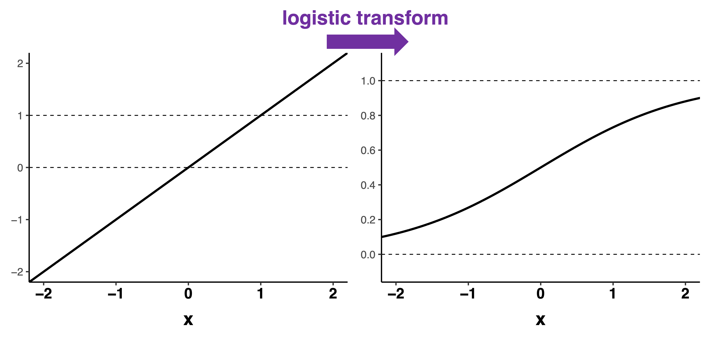
```

$$p(logit)=\frac{e^{logit}}{1+e^{{logit}}}$$

## How do the parameters affect the curve?

-   Understanding what $\beta_0$ and $\beta_1$ do visually is key to building intuition

## Slope and intercept parameters

::::: columns
::: {.column width="50%"}
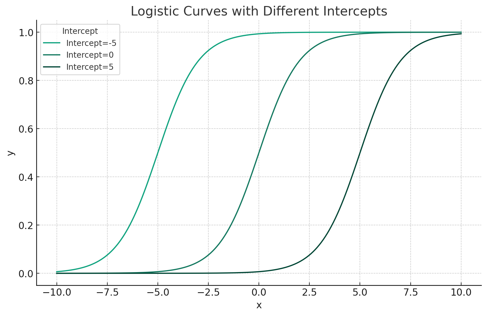{fig-align="center"} - **Intercept** ($\beta_0$) moves curve left or right - Determines where the 50% probability point falls
:::

::: {.column width="50%"}
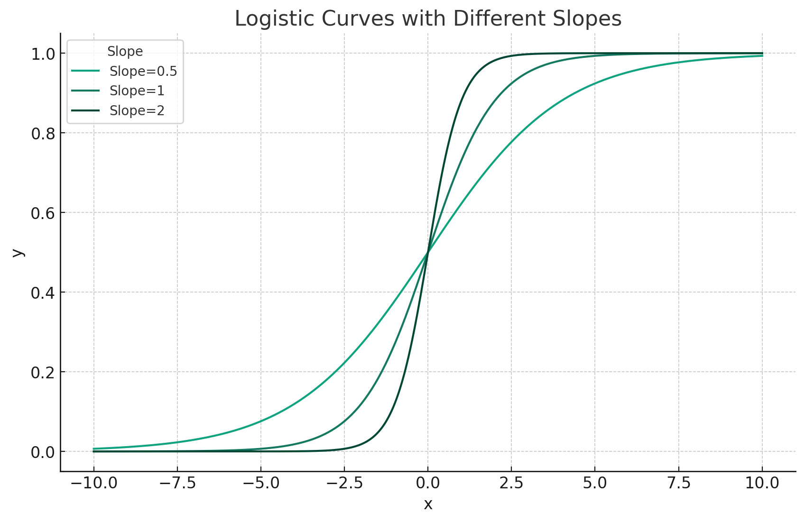{fig-align="center"} - **Slope** ($\beta_1$) determines the steepness of the curve - Larger values = steeper transition
:::
:::::

## All together

::: callout-note
Figures adapted from [Andrew Heiss](https://www.andrewheiss.com/)
:::

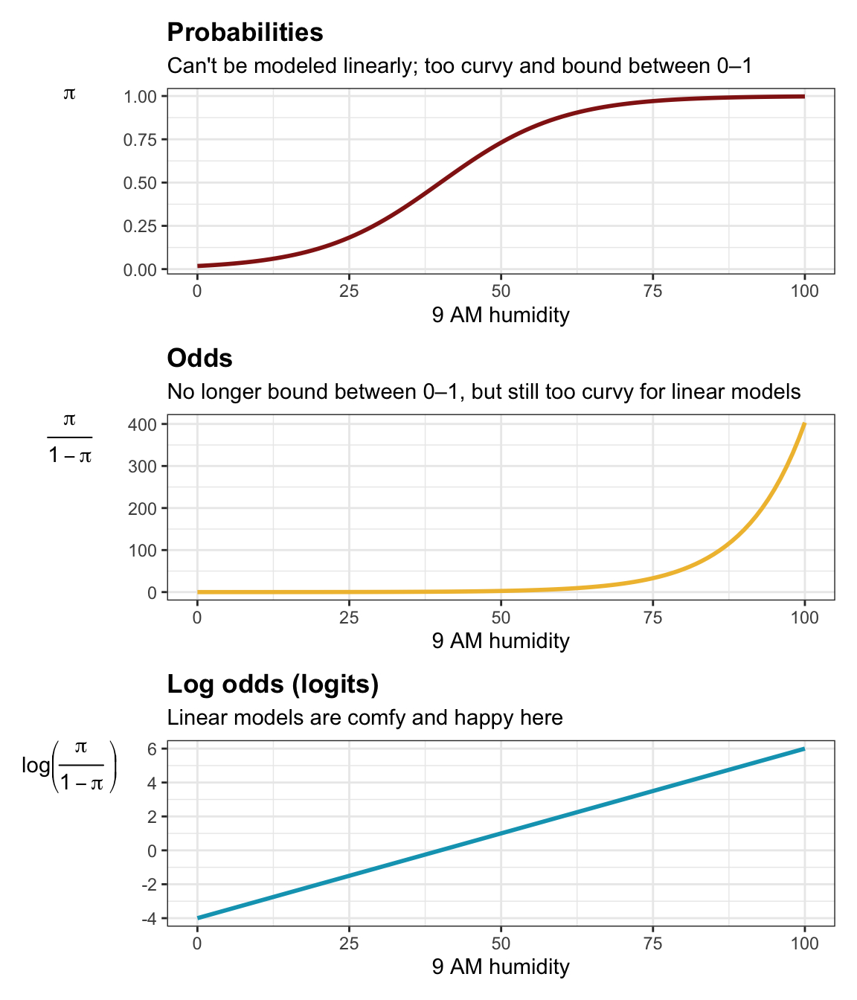{fig-align="center"}

## Probabilities, Odds, and Log Odds

```{r, echo=FALSE, fig.align='center', out.width="100%"}
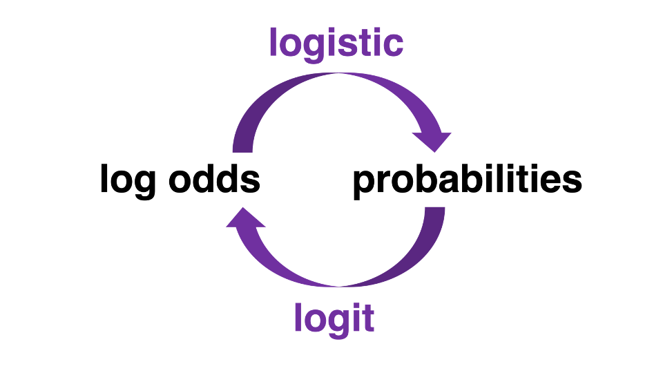
```

## Probabilities, Odds, and Log Odds

-   **From probabilities to log-odds**

```{r}
qlogis(.3)
```

-   **From log-odds to probabilities**

```{r}

plogis(-1)
```

## Probabilities, Odds, and Log Odds

::::: columns
::: {.column width="50%"}
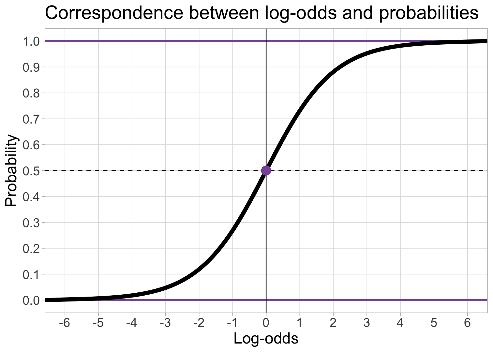{fig-align="center"}
:::

::: {.column width="50%"}
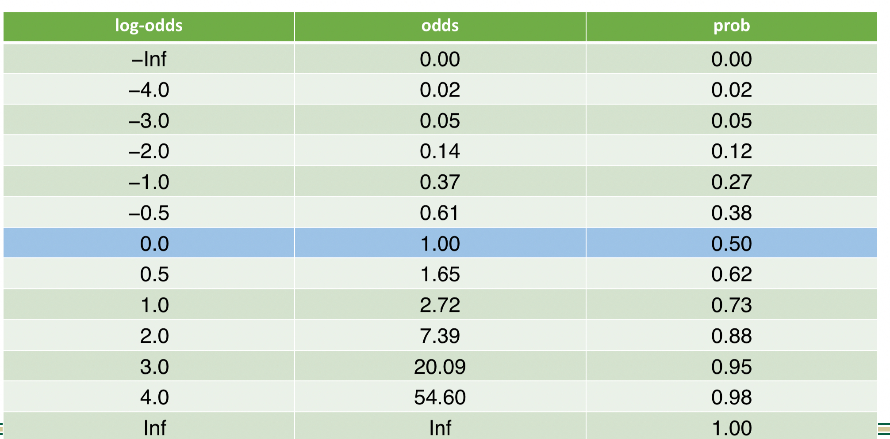{fig-align="center"}
:::
:::::

## Two Link Functions You Need to Know \[B1\] {.smaller}

::::: columns
::: {.column width="50%"}
### Logit link (today)

-   Maps probability $(0, 1)$ → log-odds $(-\infty, +\infty)$

$$\text{logit}(p) = \log\frac{p}{1-p}$$

-   Used for: **Binomial / Logistic** models

-   Inverse (logistic function) produces the S-curve

-   Effect on outcome: **compressed** near 0 and 1
:::

::: {.column width="50%"}
### Log link (coming soon)

-   Maps positive values $(0, +\infty)$ → real line $(-\infty, +\infty)$

$$\log(\mu) = \beta_0 + \beta_1 X$$

-   Used for: **Poisson / Count** models

-   Inverse is exponentiation: $\mu = e^{\beta_0 + \beta_1 X}$

-   Effect on outcome: **exponential** scaling
:::
:::::

. . .

::: callout-note
Both links solve the same problem — mapping a constrained parameter onto an unconstrained linear model. The logit handles probabilities; the log handles positive counts.
:::

## Best fitting squiggle

-   In standard linear regression we use **least squares** to find the best fitting line

```{r, echo=FALSE, fig.align='center', out.width="60%"}

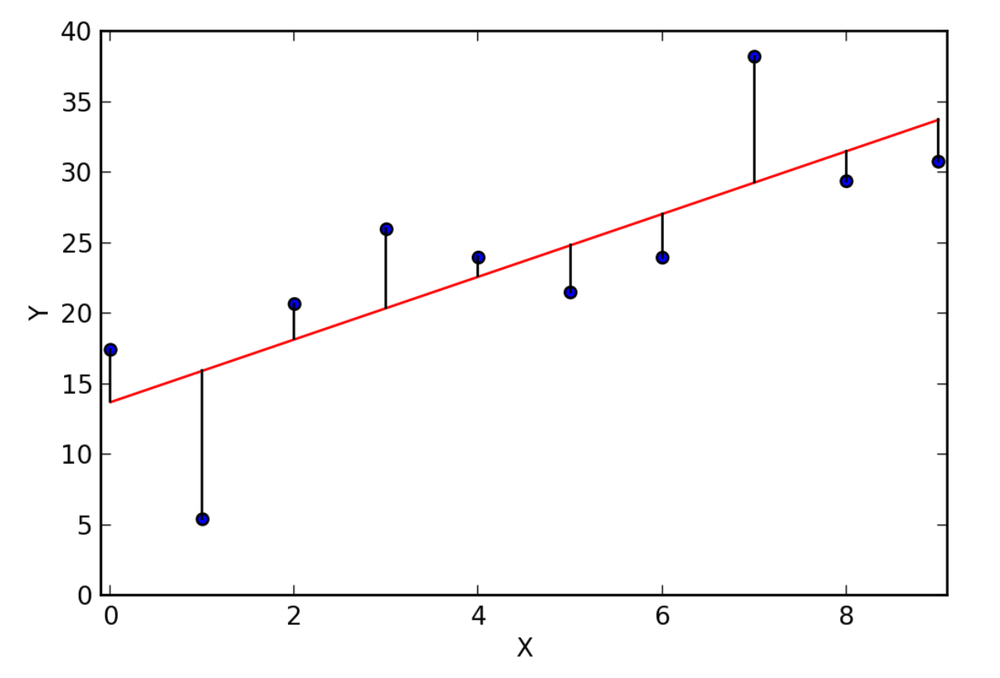
```

-   But with binary data, we need a different approach...

-   Step 1: We need find where points lie on line and get corresponding logits

::::: columns
::: {.column width="50%"}
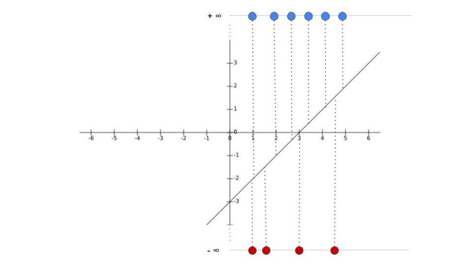{fig-align="center"}
:::

::: {.column width="50%"}
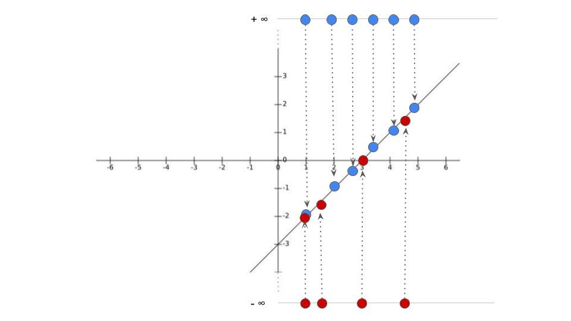
:::
:::::

## ML: Logistic Regression

-   Step 2: Project them onto the probability scale (rotate the log-odds line)

```{r,echo=FALSE, fig.align='center', out.width="50%"}

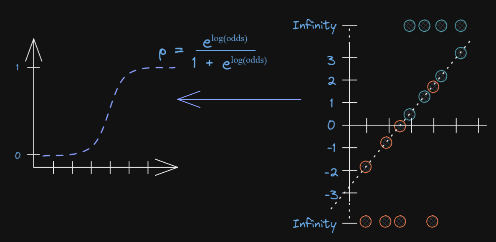

```

## Now what?

-   Step 3: We keep **rotating the log odds (line)** and projecting data on to it and transforming into probabilities

    -   Until we find the set of parameters that **maximizes the likelihood** of observing our data!

```{r, echo=FALSE, fig.align='center', out.width="70%"}

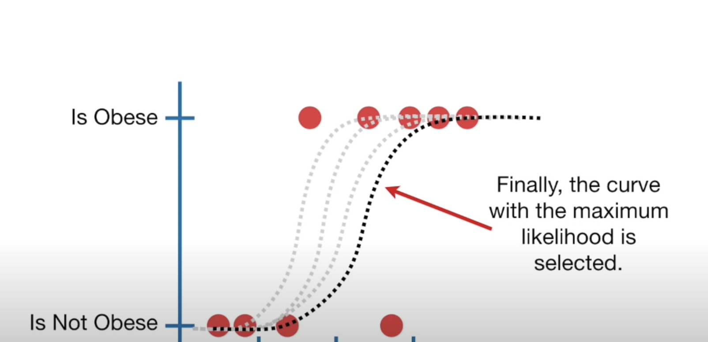

```

## MLE vs. OLS

-   OLS minimizes sum of squared residuals
-   MLE finds parameter values that make observed data most probable
-   No closed-form solution — uses iterative algorithms (Newton-Raphson / IRLS)

## \_\_

#Under the Hood New slides to address confusions from Monday \## Under the Hood {.center}

Addressing confusions from Monday

Let's revisit:

— what's being transformed

-   what the curves mean,

-   what x and y in the plots are

-   maximum likelihood

Easier to just **simulate the binary outcomes from scratch** and watch steps unfold.

## Simulation with a Data Generating Process {.smaller}

8 coins. 20 tosses each.

Each coin has a small lead weight on the heads side. More lead =\> higher probability of heads.

```{r}
#| echo: true

set.seed(504)

# --- DATA GENERATING FUNCTION ---
# Lead weight (grams) determines each coin's bias
coins <- tibble(
  coin        = 1:8,
  lead_weight = 1:8,
  true_p      = c(0.05, 0.15, 0.30, 0.45, 0.55, 0.70, 0.85, 0.95)
)

# Flip each coin 20 times (individual tosses)
individual <- coins %>%
  rowwise() %>%
  mutate(outcomes = list(rbinom(20, 1, true_p))) %>%
  unnest(outcomes) %>%
  ungroup() %>%
  group_by(coin) %>%
  mutate(toss = row_number()) %>%
  ungroup()

# Aggregate to counts (same data, summarized)
tosses <- individual %>%
  group_by(coin, lead_weight, true_p) %>%
  summarize(
    heads      = sum(outcomes),
    tails      = 20 - heads,
    observed_p = heads / 20,
    .groups    = "drop"
  )

```

## The raw data

```{r}
tosses %>% knitr::kable(digits = 2)
```

This table **is** the data generating function. In real life — you never get to see it.

## The raw data

A panel for each coin.

Each toss is a 0 or a 1.

```{r}
#| echo: false
#| fig-width: 11
#| fig-height: 5

# Consistent colors throughout ALL slides
color_heads <- "#00b894"
color_tails <- "#d63031"

ggplot(individual, aes(x = toss, y = outcomes)) +
  geom_point(aes(color = factor(outcomes)), size = 2.5, alpha = 0.8) +
  facet_wrap(~paste0(lead_weight, "g lead (true p = ", true_p, ")"), nrow = 1) +
  scale_color_manual(values = c("0" = color_tails, "1" = color_heads), 
                     labels = c("Tails", "Heads")) +
  scale_y_continuous(breaks = c(0, 1)) +
  labs(x = "Toss number", y = "Outcome", color = "") +
  theme_lucid(base_size = 14) +
  theme(strip.text = element_text(size = 10))
```

. . .

The data are just 0s and 1s.

At this point, there are no curves or squiggles.

## The two data representation formats {.smaller}

::::: columns
::: {.column width="50%"}
### Bernoulli — each toss is a row

| Lead (g) | Toss | Outcome |
|----------|------|---------|
| 1        | 1    | 0       |
| 1        | 2    | 0       |
| 1        | 3    | 1       |
| ...      | ...  | ...     |
| 8        | 20   | 1       |

160 rows. Each: $Y_i \sim \text{Bernoulli}(p)$
:::

::: {.column width="50%"}
### Binomial — each coin is a row

| Lead (g) | Heads               | Tails               |
|----------|---------------------|---------------------|
| 1        | `r tosses$heads[1]` | `r tosses$tails[1]` |
| 2        | `r tosses$heads[2]` | `r tosses$tails[2]` |
| 3        | `r tosses$heads[3]` | `r tosses$tails[3]` |
| 4        | `r tosses$heads[4]` | `r tosses$tails[4]` |
| 5        | `r tosses$heads[5]` | `r tosses$tails[5]` |
| 6        | `r tosses$heads[6]` | `r tosses$tails[6]` |
| 7        | `r tosses$heads[7]` | `r tosses$tails[7]` |
| 8        | `r tosses$heads[8]` | `r tosses$tails[8]` |

8 rows. Each: $Y_i \sim \text{Binomial}(20, p)$
:::
:::::

. . .

Same data — different representations. glm() works with both.

## What if we fit OLS? — Bernoulli {.smaller}

```{r}
#| echo: true
#| fig-width: 10
#| fig-height: 4.5

ols_bern <- lm(outcomes ~ lead_weight, data = individual)

ggplot(individual, aes(x = lead_weight, y = outcomes)) +
  geom_jitter(aes(color = factor(outcomes)), width = 0.12, height = 0.03, 
              size = 2, alpha = 0.6) +
  geom_smooth(method = "lm", se = TRUE, color = "red", linewidth = 1.2, 
              fullrange = TRUE) +
  scale_color_manual(values = c("0" = color_tails, "1" = color_heads),
                     labels = c("Tails", "Heads"), guide = "none") +
  scale_x_continuous(limits = c(-1, 11), breaks = 1:8) +
  scale_y_continuous(limits = c(-0.5, 1.5), breaks = seq(0, 1, 0.25)) +
  geom_hline(yintercept = c(0, 1), linetype = "dashed", color = "grey50") +
  annotate("text", x = 10, y = 1.35, label = "Impossible!", color = "red", size = 5) +
  annotate("text", x = -0.3, y = -0.35, label = "Impossible!", color = "red", size = 5) +
  labs(x = "Lead weight (grams)", y = "P(Heads)") +
  theme_lucid(base_size = 16)
```

. . .

**Red line** = OLS. Predicts impossible values (probabilities below 0 and above 1)

## What if we fit OLS? — Binomial {.smaller}

Same data. Same fitted line. But y-axis is proportion (not outcome)

```{r}
#| echo: true
#| fig-width: 10
#| fig-height: 4.5

ggplot(tosses, aes(x = lead_weight, y = observed_p)) +
  geom_point(size = 4, color = "#0984e3") +
  geom_smooth(method = "lm", se = TRUE, color = "red", linewidth = 1.2,
              fullrange = TRUE) +
  geom_point(aes(y = true_p), shape = 1, size = 4, color = "grey50") +
  scale_x_continuous(limits = c(-1, 11), breaks = 1:8) +
  scale_y_continuous(limits = c(-0.4, 1.4), breaks = seq(0, 1, 0.25)) +
  geom_hline(yintercept = c(0, 1), linetype = "dashed", color = "grey50") +
  annotate("text", x = 10, y = 1.25, label = "Impossible!", color = "red", size = 5) +
  annotate("text", x = -0.3, y = -0.25, label = "Impossible!", color = "red", size = 5) +
  labs(x = "Lead weight (grams)", y = "P(Heads)",
       caption = "Solid = observed. Open = true probability.") +
  theme_lucid(base_size = 16)
```

. . .

Each gram of lead increases the predicted probability of heads by β₁ (harder to see this in Bernoulli) .

## Can we transform the data? {.smaller}

We need a scale where the relationship is linear. Can we just... transform?

. . .

**Individual 0/1?**

-   `logit(0)` = $-\infty$
-   `logit(1)` = $+\infty$
-   Dead end.

. . .

**Aggregated proportions?**

-   `logit(0.15)` = −1.73
-   `logit(0.85)` = +1.73
-   Works fine.

. . .

So we have two options.

## Option 1: Transform the proportions, run OLS {.smaller}

We have proportions — so we **can** convert them:

```{r}
#| echo: true

tosses_scales <- tosses %>%
  mutate(
    odds     = observed_p / (1 - observed_p),
    log_odds = log(odds)
    # Shortcut: log_odds = qlogis(observed_p)
  )

tosses_scales %>%
  dplyr::select(lead_weight, observed_p, odds, log_odds) %>%
  knitr::kable(digits = 3, 
    col.names = c("Lead (g)", "Probability", "Odds = p/(1-p)", "Log-odds = log(odds)"))
```

## Option 1 works — but has limits {.smaller}

```{r}
#| echo: false
#| fig-width: 14
#| fig-height: 5

library(patchwork)

p1 <- ggplot(tosses_scales, aes(x = lead_weight, y = observed_p)) +
  geom_point(size = 3.5, color = "#0984e3") +
  geom_hline(yintercept = c(0, 1), linetype = "dotted", color = "grey70") +
  scale_y_continuous(limits = c(-0.05, 1.05)) +
  labs(x = "Lead weight (g)", y = "P(Heads)", title = "Probability") +
  theme_lucid(base_size = 14)

p2 <- ggplot(tosses_scales, aes(x = lead_weight, y = odds)) +
  geom_point(size = 3.5, color = "#e17055") +
  geom_hline(yintercept = 1, linetype = "dotted", color = "grey70") +
  labs(x = "Lead weight (g)", y = "Odds", title = "Odds") +
  theme_lucid(base_size = 14)

p3 <- ggplot(tosses_scales, aes(x = lead_weight, y = log_odds)) +
  geom_point(size = 3.5, color = "#00b894") +
  geom_smooth(method = "lm", se = FALSE, color = "#00b894", linewidth = 1) +
  geom_hline(yintercept = 0, linetype = "dotted", color = "grey70") +
  labs(x = "Lead weight (g)", y = "Log-odds", title = "Log-odds") +
  theme_lucid(base_size = 14)

p1 + p2 + p3
```

. . .

Log-odds scale is linear ✓ — OLS would work here.

. . .

But this needs **groups** to compute proportions from. Our coins had that — 20 tosses at each weight. What if we wanted predictors like spin rate, etc. that can vary across tosses ?

. . .

Option 1 requires aggregation which requires clear grouping / binning (which can be lossy).

## Option 2: Let the model handle it {.smaller}

`glm()` doesn't transform your data. It works **from the other direction**.

. . .

1.  **Propose** a line in log-odds: $\;\text{logit}(\hat{p}) = \beta_0 + \beta_1 x$

. . .

2.  **Convert** to predicted probabilities: $\;\hat{p} = \text{plogis}(\beta_0 + \beta_1 x)$

. . .

3.  **Score** against your raw data (0/1s or counts) — "how likely is what I observed?"

. . .

The model builds its line in log-odds space. Then it **comes to your data** to check its work.

## Option 2: The model's predictions gets a new scale {.smaller}

The model's **predicted probability** $\hat{p}$ can be expressed $\hat{p}$ on three scales:

:::::::::::::::::::: columns
::: {.column width="33%"}
### Probability

-   Bounded: $[0, 1]$
-   S-shaped
-   What you want to estimate and **interpret**
-   Can't use OLS
:::

::: {.column width="33%"}
### Odds

-   Bounded: $[0, +\infty)$
-   $\frac{\hat{p}}{1-\hat{p}}$
-   Still undesirable for OLS
:::

::: {.column width="33%"}
### Log-odds

-   Unbounded: $(-\infty, +\infty)$
-   $\log\frac{\hat{p}}{1-\hat{p}}$
-   Model is happy because now there's a **Linear** relationship
-   And you're happy because you can map it to an interpetable parameter
:::

## What do x and y mean in the S-curve? {.smaller}

```{r}
#| echo: false
#| fig-width: 12
#| fig-height: 5

coin_model <- glm(cbind(heads, tails) ~ lead_weight, data = tosses, family = binomial)

pred_grid <- tibble(lead_weight = seq(0.5, 8.5, length.out = 200))
pred_grid$log_odds <- predict(coin_model, newdata = pred_grid)
pred_grid$probability <- plogis(pred_grid$log_odds)

p_logodds <- ggplot() +
  geom_line(data = pred_grid, aes(x = lead_weight, y = log_odds), 
            color = "#0984e3", linewidth = 1.5) +
  geom_point(data = tosses_scales, aes(x = lead_weight, y = log_odds), size = 3.5, alpha=0.05) +
  geom_hline(yintercept = 0, linetype = "dashed", color = "grey50") +
  labs(x = "Lead weight (g)", y = "Log-odds of heads",
       title = "What the MODEL sees") +
  theme_lucid(base_size = 16)

p_prob <- ggplot() +
  geom_line(data = pred_grid, aes(x = lead_weight, y = probability), 
            color = "#6c5ce7", linewidth = 1.5) +
  geom_point(data = tosses_scales, aes(x = lead_weight, y = observed_p), size = 3.5) +
  geom_hline(yintercept = c(0, 0.5, 1), linetype = "dashed", color = "grey50") +
  scale_y_continuous(limits = c(0, 1)) +
  labs(x = "Lead weight (g)", y = "P(Heads)",
       title = "What YOU interpret") +
  theme_lucid(base_size = 16)

p_logodds + p_prob
```

. . .

|   | **Blue line** (left) | **Purple curve** (right) |
|------------------------|------------------------|------------------------|
| **x-axis** | Your predictor (lead weight) | Same predictor |
| **y-axis** | Predicted log-odds | Predicted probability |
| **Shape** | Straight line | S-curve |
| **Equation** | $\text{logit}(p) = \beta_0 + \beta_1 x$ | $p = \text{plogis}(\beta_0 + \beta_1 x)$ |

## What the intercept does {.smaller}

$\beta_0$ shifts the curve left or right — controls where (on x) it crosses $p = 0.5$

```{r}
#| echo: true
#| fig-width: 10
#| fig-height: 5

x <- seq(-10, 10, length.out = 300)

intercept_curves <- tibble(
  x = rep(x, 3),
  intercept = rep(c(-5, 0, 5), each = 300),
  log_odds = intercept + 1 * x,
  probability = plogis(log_odds)
)

ggplot(intercept_curves, aes(x = x, y = probability, color = factor(intercept))) +
  geom_line(linewidth = 1.2) +
  scale_color_manual(values = c("-5" = "#55efc4", "0" = "#00b894", "5" = "#006266"),
                     labels = c("β₀ = −5  (crosses 0.5 at x = 5)", 
                                "β₀ = 0   (crosses 0.5 at x = 0)", 
                                "β₀ = 5   (crosses 0.5 at x = −5)")) +
  geom_hline(yintercept = 0.5, linetype = "dashed", color = "grey50") +
  labs(x = "x (predictor)", y = "Predicted probability", color = "Intercept") +
  theme_lucid(base_size = 16)
```

## What the slope does {.smaller}

$\beta_1$ controls how **steep** the S-curve is — how fast probability transitions from 0 to 1

{fig-align="center" width="75%"}

. . .

| Slope | Curve | Meaning |
|----------------------|----------------------|----------------------------|
| $\beta_1 = 0.5$ | Gradual | Weak predictor — big change in x needed |
| $\beta_1 = 1$ | Moderate | Moderate predictor |
| $\beta_1 = 2$ | Sharp | Strong predictor — small change in x flips probability |

## What is Maximum Likelihood? {.smaller}

In OLS — we minimize the squared residuals. Closed-form solution.

With binary data — squared residuals don't make sense. Instead:

. . .

**Maximum Likelihood Estimation (MLE)**

Find the parameter values that make the observed data **least surprising**/ **most likely**.

. . .

The logic:

1.  **Propose** some parameter values ($\beta_0$, $\beta_1$)

2.  **Ask**: if these were the true values, how probable is the data I actually got?

3.  **Score** that probability — the **likelihood**

4.  **Repeat** with different values until the likelihood is as high as possible

. . .

The parameters at the peak = the **maximum likelihood estimates**.

## MLE for logistic regression {.smaller}

How does MLE apply to **our** problem?

. . .

**The model proposes** a straight line in log-odds: $\;\text{logit}(p) = \beta_0 + \beta_1 \cdot \text{lead_weight}$

. . .

**Converts to probabilities**: $\;\hat{p}_i = \text{plogis}(\beta_0 + \beta_1 x_i)$ for each observation

. . .

**Scores against the data**:

-   Observation got a 1 [●]{style="color:#00b894"}? Score = $\hat{p}_i$ — higher is better

-   Observation got a 0 [●]{style="color:#d63031"}? Score = $1 - \hat{p}_i$ — higher is better

. . .

**Total likelihood** = multiply all the scores: $\;\;L = \prod_{i=1}^{n} \hat{p}_i^{y_i}(1-\hat{p}_i)^{1-y_i}$

. . .

Try thousands of lines → find the one with the highest $L$.

That line's $\beta_0$ and $\beta_1$ are your **estimates**.

## MLE: Example with candidates {.smaller}

Three candidate lines — which one fits our coin data best?

```{r}
#| echo: false
#| fig-width: 14
#| fig-height: 5

guess_a <- tibble(
  lead_weight = seq(0, 9, 0.05), log_odds = -0.5 + 0.1 * lead_weight,
  prob = plogis(log_odds), guess = "Guess A: β₀=−0.5, β₁=0.1 (shallow)")
guess_b <- tibble(
  lead_weight = seq(0, 9, 0.05), log_odds = -2 + 0.5 * lead_weight,
  prob = plogis(log_odds), guess = "Guess B: β₀=−2, β₁=0.5 (moderate)")
guess_c <- tibble(
  lead_weight = seq(0, 9, 0.05), log_odds = -4 + 1.2 * lead_weight,
  prob = plogis(log_odds), guess = "Guess C: β₀=−4, β₁=1.2 (steep)")

guesses <- bind_rows(guess_a, guess_b, guess_c)

p_lo <- ggplot(guesses, aes(x = lead_weight, y = log_odds, color = guess)) +
  geom_line(linewidth = 1.2) +
  scale_color_manual(values = c("#e17055", "#0984e3", "#6c5ce7")) +
  labs(x = "Lead weight (g)", y = "Log-odds", 
       title = "Step 1: Guess a line", color = "") +
  theme_lucid(base_size = 13) +
  theme(legend.position = "bottom", legend.text = element_text(size = 9))

p_pr <- ggplot() +
  geom_jitter(data = individual, aes(x = lead_weight, y = outcomes), 
              width = 0.08, height = 0.02, alpha = 0.25, size = 1.5, color = "grey40") +
  geom_line(data = guesses, aes(x = lead_weight, y = prob, color = guess), linewidth = 1.2) +
  scale_color_manual(values = c("#e17055", "#0984e3", "#6c5ce7")) +
  scale_y_continuous(limits = c(0, 1)) +
  labs(x = "Lead weight (g)", y = "Predicted probability", 
       title = "Step 2: Convert via plogis()", color = "") +
  theme_lucid(base_size = 13) +
  theme(legend.position = "bottom", legend.text = element_text(size = 9))

p_lo + p_pr
```

## Where does the score come from? {.smaller}

Model predicts $\hat{p} = 0.88$ for the 6g coin. It lands **heads**. How likely was that?

. . .

\*Bernoulli Likelihood formula:\*\*

$$L(\hat{p}_i) = \hat{p}_i^{\,y_i} \cdot (1 - \hat{p}_i)^{1-y_i}$$

$y = 1$: just $\hat{p}$. $\;\;$ $y = 0$: just $1 - \hat{p}$.

. . .

**Two observations?** Multiply. **160 observations?** Multiply all scores → **likelihood**.

But 160 tiny numbers multiplied → computer underflow. So we take the log:

$$\log {L} = \sum_{i=1}^{n} \left[ y_i \log(\hat{p}_i) + (1 - y_i) \log(1 - \hat{p}_i) \right]$$

Same ranking and same peak (what we need for max). And numerically stable.

::: notes
Build the likelihood from a single observation. Left panel: if the coin lands heads (Y=1), the likelihood IS the predicted probability. The grey line is L(p̂) = p̂ — a straight line. At p̂ = 0.88, the green dot reads off 0.88. High prediction for an event that happened → high score. Right panel: same prediction, but tails (Y=0). Now L(p̂) = 1 − p̂. At p̂ = 0.88, the red dot reads off 0.12. The model predicted 88% heads but got tails — low score, the model was surprised.

The formula combines both. When y=1, the exponents collapse to p̂. When y=0, they collapse to 1−p̂.

For multiple observations, multiply. But 160 numbers between 0 and 1 multiplied together → astronomically small. Like 10⁻⁴⁷. Computers can't handle that — underflow. So we take the log. Log turns products into sums. Same ranking — if likelihood A beats likelihood B, log-likelihood A also beats log-likelihood B. Same peak. Just stable arithmetic. (J: Let me show you exactly where the score comes from. Left panel — the coin lands heads. The likelihood function for a single heads is just a straight line: the higher your predicted probability, the higher your score. Our model predicted 0.88, so the score is 0.88. Green dot, right there. Right panel — same prediction, but tails happened. Now the likelihood goes the other way — high prediction for something that didn't happen means a LOW score. 0.12. The model was wrong and the score shows it. The formula at the bottom just wraps both cases into one expression. Now — multiply 160 of these scores together and you get the likelihood. Problem is, 160 numbers less than 1 multiplied together gives you something tiny — like 10 to the negative 47. Computers can't handle that. So we take the log. Addition instead of multiplication. Same answer, same winner, just numbers your computer can actually store.)
:::

## Scoring each guess {.smaller}

For each observation:

-   If $Y_i = 1$ (heads [●]{style="color:#00b894"}): score = $\hat{p}_i$ — higher is better

-   If $Y_i = 0$ (tails [●]{style="color:#d63031"}): score = $1 - \hat{p}_i$ — higher is better

**Log-likelihood** = sum of log(scores) across all observations

```{r}
#| echo: true

compute_ll <- function(b0, b1, data) {
  p_hat <- plogis(b0 + b1 * data$lead_weight)
  sum(data$outcomes * log(p_hat) + (1 - data$outcomes) * log(1 - p_hat))
}

tibble(
  Guess = c("A: shallow (red)", "B: moderate (blue)", "C: steep (purple)"),
  `β₀` = c(-0.5, -2.0, -4.0),
  `β₁` = c(0.1, 0.5, 1.2),
  `Log-likelihood` = round(c(
    compute_ll(-0.5, 0.1, individual),
    compute_ll(-2.0, 0.5, individual),
    compute_ll(-4.0, 1.2, individual)
  ), 2)
) %>% knitr::kable()
```

. . .

Higher = better fit. The model searches for the **maximum**.

## The likelihood surface {.smaller}

```{r}
#| echo: false
#| fig-width: 11
#| fig-height: 5.5

b0_grid <- seq(-5, 0, length.out = 80)
b1_grid <- seq(0, 1.5, length.out = 80)
ll_grid <- expand.grid(b0 = b0_grid, b1 = b1_grid)
ll_grid$ll <- mapply(compute_ll, ll_grid$b0, ll_grid$b1, MoreArgs = list(data = individual))

actual_fit <- glm(outcomes ~ lead_weight, data = individual, family = binomial)

ggplot(ll_grid, aes(x = b0, y = b1, fill = ll)) +
  geom_tile() +
  scale_fill_viridis_c(option = "magma") +
  geom_point(aes(x = -0.5, y = 0.1), color = "#e17055", size = 4, shape = 17) +
  geom_point(aes(x = -2.0, y = 0.5), color = "#0984e3", size = 4, shape = 17) +
  geom_point(aes(x = -4.0, y = 1.2), color = "#6c5ce7", size = 4, shape = 17) +
  geom_point(aes(x = coef(actual_fit)[1], y = coef(actual_fit)[2]), 
             color = "white", size = 5, shape = 8) +
  annotate("text", x = coef(actual_fit)[1] + 0.5, y = coef(actual_fit)[2] + 0.08, 
           label = "MLE ★", color = "white", size = 5, fontface = "bold") +
  annotate("text", x = -0.5, y = 0.18, label = "A", color = "#e17055", size = 4, fontface = "bold") +
  annotate("text", x = -2.0, y = 0.58, label = "B", color = "#0984e3", size = 4, fontface = "bold") +
  annotate("text", x = -4.0, y = 1.28, label = "C", color = "#6c5ce7", size = 4, fontface = "bold") +
  labs(x = "β₀ (intercept)", y = "β₁ (slope)", fill = "Log-\nlikelihood",
       title = "Brighter = better fit") +
  theme_lucid(base_size = 16)
```

. . .

White star ★ = where `glm()` converges — the **maximum likelihood estimate**. Colored triangles = our three guesses.

## Fitting both ways in R {.smaller}

```{r}
#| echo: true

# Bernoulli: 160 rows of 0/1
fit_bernoulli <- glm(outcomes ~ lead_weight, data = individual, family = binomial)

# Binomial: 8 rows of counts
fit_binomial <- glm(cbind(heads, tails) ~ lead_weight, data = tosses, family = binomial)
```

```{r}
#| echo: true

bind_rows(
  tidy(fit_bernoulli) %>% mutate(format = "Bernoulli (160 rows)"),
  tidy(fit_binomial)  %>% mutate(format = "Binomial (8 rows)")
) %>%
  dplyr::select(format, term, estimate, std.error) %>%
  knitr::kable(digits = 3)
```

. . .

**Identical coefficients.** Representation format doesn't matter.

## The best-fitting squiggle {.smaller}

```{r}
#| echo: true
tidy(fit_bernoulli) %>% knitr::kable(digits = 3)
```

. . .

```{r}
#| echo: false
#| fig-width: 10
#| fig-height: 4.5

pred <- tibble(lead_weight = seq(0.5, 8.5, 0.05))
pred$prob <- predict(fit_bernoulli, newdata = pred, type = "response")

ggplot() +
  geom_jitter(data = individual, aes(x = lead_weight, y = outcomes, color = factor(outcomes)), 
              width = 0.08, height = 0.02, alpha = 0.4, size = 2) +
  scale_color_manual(values = c("0" = color_tails, "1" = color_heads), guide = "none") +
  geom_line(data = pred, aes(x = lead_weight, y = prob), color = "#6c5ce7", linewidth = 1.5) +
  geom_hline(yintercept = 0.5, linetype = "dashed", color = "grey50") +
  labs(x = "Lead weight (grams)", y = "P(Heads)",
       title = "Purple curve = best-fitting line in log-odds, viewed as probability") +
  theme_lucid(base_size = 18)
```

## Red vs purple — the two models {.smaller}

```{r}
#| echo: false
#| fig-width: 12
#| fig-height: 5.5

pred_logistic <- tibble(lead_weight = seq(-0.5, 10.5, 0.05))
pred_logistic$prob <- predict(fit_bernoulli, newdata = pred_logistic, type = "response")
pred_ols <- tibble(lead_weight = seq(-0.5, 10.5, 0.05))
pred_ols$prob <- predict(ols_bern, newdata = pred_ols)

ggplot() +
  geom_jitter(data = individual, aes(x = lead_weight, y = outcomes, color = factor(outcomes)), 
              width = 0.08, height = 0.02, alpha = 0.3, size = 1.5) +
  scale_color_manual(values = c("0" = color_tails, "1" = color_heads), guide = "none") +
  geom_line(data = pred_ols, aes(x = lead_weight, y = prob), 
            color = "red", linewidth = 1.2, linetype = "dashed") +
  geom_line(data = pred_logistic, aes(x = lead_weight, y = prob), 
            color = "#6c5ce7", linewidth = 1.2) +
  geom_hline(yintercept = c(0, 1), linetype = "dashed", color = "grey50") +
  scale_x_continuous(limits = c(-0.5, 10.5)) +
  scale_y_continuous(limits = c(-0.4, 1.4)) +
  labs(x = "Lead weight (grams)", y = "Predicted probability") +
  theme_lucid(base_size = 16)
```

. . .

| Line | Model | Equation | Bounded? |
|-----------------|-----------------|-------------------|-------------------|
| **Red dashed** | OLS | $\hat{p} = b_0 + b_1 x$ | ✗ Escapes \[0, 1\] |
| **Purple solid** | Logistic | $\hat{p} = \text{plogis}(\beta_0 + \beta_1 x)$ | ✓ Always in \[0, 1\] |

## Interpreting the squiggle — per-coin predictions {.smaller}

```{r}
#| echo: true

coin_preds <- tosses %>%
  mutate(
    pred_logodds = predict(fit_bernoulli, newdata = tibble(lead_weight = lead_weight)),
    pred_prob    = plogis(pred_logodds)
  )

coin_preds %>%
  dplyr::select(lead_weight, true_p, observed_p, pred_prob, pred_logodds) %>%
  knitr::kable(digits = 3, col.names = c("Lead (g)", "True p", "Observed p", 
                                          "Model's p̂", "Model's log-odds"))
```

## Interpreting the squiggle — per-coin predictions {.smaller}

```{r}
#| echo: false
#| fig-width: 10
#| fig-height: 3.5

pred_full <- tibble(lead_weight = seq(0.5, 8.5, 0.05))
pred_full$prob <- predict(fit_bernoulli, newdata = pred_full, type = "response")

ggplot() +
  geom_line(data = pred_full, aes(x = lead_weight, y = prob), color = "#6c5ce7", linewidth = 1.2) +
  geom_point(data = coin_preds, aes(x = lead_weight, y = pred_prob), 
             size = 5, color = "#6c5ce7") +
  geom_point(data = coin_preds, aes(x = lead_weight, y = true_p), 
             size = 5, shape = 1, color = "grey40") +
  geom_segment(data = coin_preds, 
               aes(x = lead_weight, xend = lead_weight, y = true_p, yend = pred_prob),
               linetype = "dotted", color = "grey50") +
  scale_y_continuous(limits = c(0, 1), breaks = seq(0, 1, 0.2)) +
  labs(x = "Lead weight (grams)", y = "Probability",
       caption = "Filled purple = model prediction. Open grey = true probability.") +
  theme_lucid(base_size = 16)
```

## Unrolling the coefficients {.smaller}

The model gives you log-odds. Three steps back to meaning:

```{r}
#| echo: true
b0 <- coef(fit_bernoulli)[1]
b1 <- coef(fit_bernoulli)[2]
```

. . .

**1. Log-odds** — what the model estimates

"Each gram of lead increases the log-odds of heads by `r round(b1, 3)`"

. . .

**2. Odds ratio** — exponentiate

```{r}
#| echo: true
exp(b1)
```

"Each gram multiplies the odds of heads by `r round(exp(b1), 2)`"

. . .

**3. Probability** — what you actually care about

```{r}
#| echo: true
plogis(b0 + b1 * 5)  # prediction at 5g
```

"A coin with 5g of lead has about a `r round(plogis(b0 + b1 * 5) * 100)`% chance of heads"

##\_\_

# Case Study: Losing Weight

## Case Study: Losing Weight

-   These data are a sample of 500 teens from data collected in 2009 through the U.S. Youth Risk Behavior Surveillance System (YRBSS)

-   Are the odds that young females report trying to lose weight greater than the odds that males do? Is increasing BMI associated with an interest in losing weight, regardless of sex?

```{webr-r}

risk2009.data <- read.csv("https://raw.githubusercontent.com/suyoghc/PSY504_Spring_2026/main/posts/Logistic%20Regression/data/risk2009.csv")

```

```{r}
#| echo: false
#| 
risk2009 <- read.csv("https://raw.githubusercontent.com/suyoghc/PSY504_Spring_2026/main/posts/Logistic%20Regression/data/risk2009.csv")

```

## Trying to lose weight

-   Selected variables:

DV: \*`lose.wt.01`, which is coded 1 when someone indicated they were trying to lost weight and 0 when they were not trying to. This is a dichotomized version of the `lose.wt` factor variable.

-   Our two predictor variables will be:

    -   `sex` and its related dummy variable `female`
    -   `bmipct`, which is the percentile for a given BMI for members of the same sex

## Exploratory data analysis

-   Here are two versions of comparing `lose.wt.01` by `sex`

::::: columns
::: {.column width="50%"}
```{r}
#| echo: false
#| fig-align: "center"
#| 
risk2009 %>% 
  mutate(lose.wt.01 = factor(lose.wt.01)) %>% 
  ggplot(aes(x = lose.wt.01)) +
  geom_bar() +
  facet_wrap(~ sex) + 
  theme_lucid(base_size=24)

```
:::

::: {.column width="50%"}
```{r}
#| echo: false
#| fig-align: "center"

risk2009 %>%
  ggplot(aes(x = sex, fill = lose.wt)) +
  geom_bar(position = "fill") +
  geom_text(stat = 'count',size=14,  aes(label = scales::percent(..count.. / sum(..count..), accuracy = 1)), 
            position = position_fill(vjust = 0.5), size = 3) + # Adjust size as needed
  scale_fill_viridis_d(option = "C", begin = .2) +
  labs(x = NULL, y = "Percent") + 
  scale_y_continuous(labels = scales::percent_format(accuracy = 1)) + # Ensure y-axis labels are in percent format + 
theme_lucid(base_size=24)

```
:::
:::::

## Exploratory data analysis

-   Here are the histograms for `bmipct`, faceted by `lose.wt`.

```{r, echo=FALSE, out.width="80%", fig.align='center'}

risk2009 %>% 
  ggplot(aes(x = bmipct)) +
  geom_histogram(binwidth = 5) +
  facet_wrap(~ lose.wt, ncol = 1) + 
  theme_lucid(base_size=24)
```

## Exploratory Data Analysis

-   Here are the histograms for `bmipct`, faceted by both `lose.wt` and `sex`

```{r, echo=FALSE, out.width="70%", fig.align='center'}

risk2009 %>% 
  ggplot(aes(x = bmipct)) +
  geom_histogram(binwidth = 5) +
  facet_grid(lose.wt ~ sex) + 
  theme_lucid(base_size=24)
```

## Logistic regression: Fitting model

-   Let's fit an intercept-only model

$$
\begin{align*}
\text{lose.wt.01}_i & \sim \operatorname{Binomial}(n = 1, p_i)\\
\text{logit}(p_i) & = \beta_0
\end{align*}
$$

## Logistic Regression: Fitting Model

```{webr-r}
# fit model
fit1 <- glm(
  data = risk2009,
  family = binomial(link="logit"),
  lose.wt.01 ~ 1
  ) 
fit1 %>% 
  tidy() %>%
  kable()

```

```{r}
#| echo: false
#| 
# fit model
fit1 <- glm(
  data = risk2009,
  family = binomial(link="logit"),
  lose.wt.01 ~ 1
  ) 
fit1 %>% 
  tidy() %>%
  kable()
```

## Hypothesis test for $\beta_j$

-   Hypotheses:

    -   $H_0$: $\beta_j$ = 0

    -   $H_a$: $\beta_j \neq 0$

-   Test Statistic: $$\text{Wald z} = \frac{\hat{\beta}_j - 0}{SE_{\hat{\beta}_j}}$$

-   CIs: $$\Large{\hat{\beta}_j \pm z^* SE_{\hat{\beta}_j}}$$

## Interpreting $b_0$

```{r, echo=FALSE}
tidy(fit1) %>% kable()
```

-   The intercept $\beta_0$ is in the log-odds metric

    -   Log-odds of Y = 1 is -0.212

-   We can convert it to probability

```{webr-r}
b0 <- coef(fit1) # get coef

exp(b0) / (1 + exp(b0)) # logistic transform
```

-   Thus, the overall probability of students wanting to lose weight was about .45 or 45%

## Interpreting $b_0$

-   Let's check that with the empirical proportions

```{webr-r}
risk2009 %>% 
  count(lose.wt.01) %>% 
  mutate(proportion = n / sum(n))
```

-   We can actually do that transformation with the base **R** `plogis()` function

```{webr-r}
plogis(b0)
```

## Logistic Regression

-   Add our binary predictor `female`, which gives us the model

$$
\begin{align*}
\text{lose.wt.01}_i & \sim \operatorname{Binomial}(n = 1, p_i) \\
\text{logit}(p_i) & = \beta_0 + \beta_1 \text{female}_i,
\end{align*}
$$

-   Where `female` is an 0/1 dummy variable.

```{r}
#| echo: false

fit2 <- glm(
  lose.wt.01 ~ 1 + female, 
  data = risk2009,
  family = binomial,
)

```

```{webr-r}
# fit
fit2 <- glm(
  lose.wt.01 ~ 1 + female, 
  data = risk2009,
  family = binomial,
)

```

## Interpreting intercept: $b_0$

```{webr-r}
# fit
fit2 %>%
  tidy()

```

-   $b_0$:

```{webr-r}


```

## Interpreting slope: $b_1$

-   If X is a categorical predictor

    -   Then $b_1$ is the difference in the log-odds between group X and the baseline

```{webr-r}
# summarize
fit2 %>%
  tidy() %>%
  kable()
```

. . .

-   Going from men to women, there is a change in the the log odds of wanting to lose weight of 1.09

## Coefficient effect size: Odd's Ratio

-   We can take the `exp()` of the log odds and get OR

    -   The odds of Y for group X (females) are expected to be exp($b_1$) times the odds of Y for the baseline group

        -   Greater than 1: One unit increase, the event is more likely to occur

        -   Less than 1: One unit increase, the event is less likely to occur

        -   Equals 1: One unit increase, the likelihood of the event does not change

    -   We can describe the OR in terms of percentage increase/decrease

```{r}
#| eval: false
(OR-1) * 100  # get probability of increase/decrease
```

## Coefficient Effect Size: Odd's Ratio

```{webr-r}
tidy(fit2,exponentiate = TRUE) %>%  # get odds ratio %>%
  kable()
```

. . .

-   The odds of wanting to lose weight in females is 2.98 times the odds of wanting to lose weight in men

    -   The odds of females wanting to lose weight are 198% higher than the odds of males wanting to lose weight

## Predicted probabilities

-   Now we can compute the probabilities for young men and women as follows

```{webr-r}
b0 <- coef(fit2)[1] %>% as.double()
b1 <- coef(fit2)[2] %>% as.double()
```

```{webr-r}
# young men
plogis(b0 + b1 * 0)
# young women
plogis(b0 + b1 * 1)
```

## `Emmeans`

-   Can use `emmeans` to get probabilities directly from model

    -   Can also get odds ratios for comparisons!

    ```{r}
    emm <- emmeans(fit2, "female", type = "response")
    emm
    # get odd ratio for comparison
    pairs(emm, reverse=TRUE)
    ```

## Marginal effects

::::: columns
::: {.column width="50%"}
-   We can also calculate differences in probabilities

    -   Difference in probabilities is called risk difference

-   Marginal effects

    -   Change in probability that the outcome occurs for a 1 unit change in the predictor

        -   Average marginal effect (AME)
:::

::: {.column width="50%"}
-   **For categorical variables it is just the probability difference between groups**

    -   Much easier to interpret than odds ratios!

```{r}
#can do this with emmeans but requires more steps
library(marginaleffects) # get predicted probs
# get marginal effects
avg_comparisons(fit2, comparison = "difference") %>% 
  kable()
```
:::
:::::

## Logistic regression continuous

Now we add our continuous predictor `bmipct`, which gives us the model:

$$
\begin{align*}
\text{lose.wt.01}_i & \sim \operatorname{Binomial}(n = 1, p_i) \\
\text{logit}(p_i) & = \beta_0 + \beta_1 \text{bmipct}_i,
\end{align*}
$$

```{r}
#| echo: false


fit3 <- glm(
  data = risk2009,
  family = binomial,
  lose.wt.01 ~ 1 + bmipct
  ) 

```

```{webr-r}
# fit
fit3 <- glm(
  data = risk2009,
  family = binomial,
  lose.wt.01 ~ 1 + bmipct
  ) 

```

## Logistic regression continuous

```{r}
#| echo: false
fit3 %>%
  tidy() %>%
  kable()

```

```{webr-r}
# how do we interpret these 
b0: 
b1: 

```

> What is the OR for $b_1$? How do we interpret this?

```{webr-r}

```

## Marginal effects

-   With continuous variables, obtaining the marginal effects is a bit trickier

    -   Instantaneous rate of change in the predicted probability

        -   Change in the predicted probability for a very small change in X

```{r}
#effect is computed for each observed value in the original dataset before being averaged
avg_slopes(fit3)%>%kable()
```

. . .

::: callout-tip
An increase in BMI results in 70% increase in likelihood of wanting to lose weight
:::

## Logistic Multiple Predictors

-   The first will have both `female` and `bmipct` as predictors:

$$
\begin{align*}
\text{lose.wt.01}_i & \sim \operatorname{Binomial}(n = 1, p_i) \\
\text{logit}(p_i) & = \beta_0 + \beta_1 \text{female}_i + \beta_2 \text{bmipct}_i.
\end{align*}
$$

-   The second model will add an interaction term between the two predictors:

$$
\begin{align*}
\text{lose.wt.01}_i & \sim \operatorname{Binomial}(n = 1, p_i) \\
\text{logit}(p_i) & = \beta_0 + \beta_1 \text{female}_i + \beta_2 \text{bmipct}_i + \beta_3 \text{female}_i \cdot \text{bmipct}_i.
\end{align*}
$$

## Fitting both models

```{r}
#| echo: false
fit4 <- glm(
  data = risk2009,
  family = binomial,
  lose.wt.01 ~ 1 + female + bmipct
  )

fit5 <- glm(
  data = risk2009,
  family = binomial,
  lose.wt.01 ~ 1 + female + bmipct + female:bmipct
  )

```

```{webr-r}
fit4 <- glm(
  data = risk2009,
  family = binomial,
  lose.wt.01 ~ 1 + female + bmipct
  )

fit5 <- glm(
  data = risk2009,
  family = binomial,
  lose.wt.01 ~ 1 + female + bmipct + female:bmipct
  )
```

## Model Comparisons

```{r, echo=FALSE, out.width="70%", fig.align='center'}
levels <- c("(Intercept)", "female", "bmipct", "female:bmipct")

bind_rows(
  tidy(fit1, conf.int = TRUE) %>% mutate(fit = "fit1"),
  tidy(fit2, conf.int = TRUE) %>% mutate(fit = "fit2"),
  tidy(fit3, conf.int = TRUE) %>% mutate(fit = "fit3"),
  tidy(fit4, conf.int = TRUE) %>% mutate(fit = "fit4"),
  tidy(fit5, conf.int = TRUE) %>% mutate(fit = "fit5")
) %>% 
  mutate(term = factor(term, levels = levels)) %>% 
  
  ggplot(aes(x = estimate, xmin = conf.low, xmax = conf.high, y = 0)) +
  geom_vline(xintercept = 0, size = 1/2, linetype = 2, color = "grey50") +
  geom_pointrange(fatten = 2) +
  scale_y_continuous(NULL, breaks = NULL) +
  labs(title = "Coefficient plot",
       x = "log-odds scale") +
  theme(strip.text.y = element_text(angle = 0)) +
  facet_grid(fit ~ term, scales = "free_x")
```

-   The interaction term `female:bmipct` (i.e., $\beta_3$) would not be statistically significant

## Likelihood ratio test

-   Let's compare the models by performing likelihood ratio test

```{r}
test_likelihoodratio(fit4, fit5) %>% kable()
```

. . .

-   When you compare model `fit4` with the interaction model `fit5`, it appears that the interaction term does not add anything

## Model Fit

-   McFadden Psuedo $R^2$

$$R^2 = \frac{SSM}{SST} = \frac{SST-SSE}{SST}=1-\frac{SSE}{SST}$$ $$R_{MF}^2 = 1-\frac{D_{\rm residual}}{D_{\rm null}}$$

```{r}
#easystats function
r2_mcfadden(fit4)

#r2_tjur
#lots others

```

-   Not "explained variance" but ratio indicating how "good" the model fit Model Fit

## Model fit

-   Plotting normal residuals are not really informative/useful

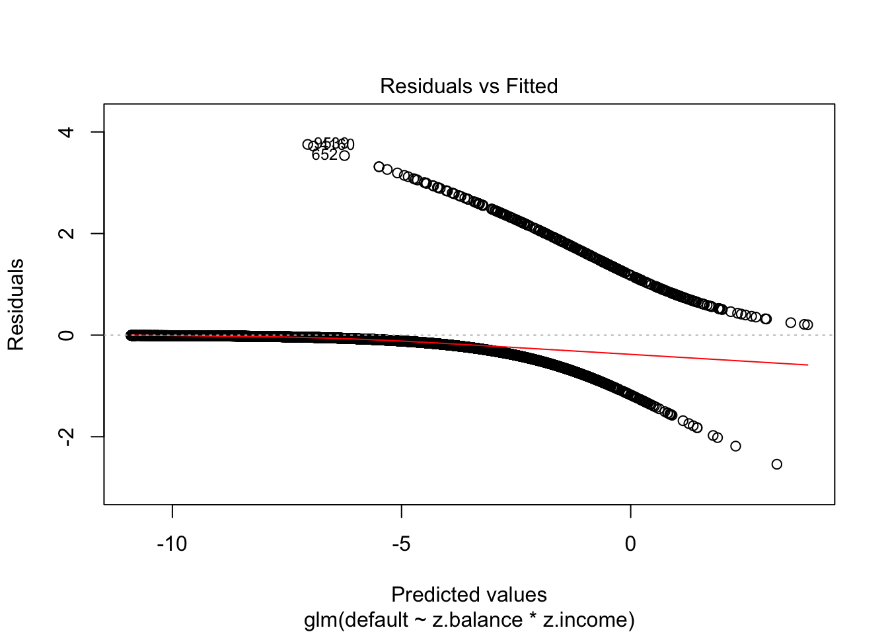{fig-align="center"}

## Binned residuals

::::: columns
::: {.column width="50%"}
-   Binned residuals

    -   Calculate raw residuals
    -   Order observations (probabilities of DV or predictor variable)
        -   Create g bins of approximate equal size $\sqrt(n)$
    -   Calculate average residuals
    -   Plot average residuals vs. average predicted probability (or predictor value)

-   **Grey bands** represent ±2 SE — ideally \~95% of points fall within
:::

::: {.column width="50%"}
```{r}
#performance::binned_residuals()
binnedplot(fitted(fit4), residuals(fit4, type="response"))
```
:::
:::::

## Binned residuals

-   Look for patterns

    -   Nonlinear trend may be indication that squared term or log transformation is required

-   If bins have average residuals with large magnitude

    -   Look at averages of other predictors across bins

    -   Interaction may be required

-   Rule of thumb: If \>5% of bins fall outside the bands, model may need improvement

## Visualizing

::: panel-tabset
## ggplot

```{r}
#| echo: false
#| fig-align: "center"
#| fig-height: 4
#| fig-width: 8

nd <- risk2009 %>% 
  distinct(female, sex) %>% 
  expand(nesting(female, sex),
         bmipct = 1:100)

predict(
  fit4,
  newdata = nd,
  se.fit = TRUE
) %>% 
  data.frame() %>% 
  # define the 95% CIs
  mutate(lwr = fit - 1.96 * se.fit,
         upr = fit + 1.96 * se.fit) %>% 
  # drop unneeded columns
  select(fit, lwr, upr) %>% 
  # transform to the probability metric
  mutate_all(.funs = plogis) %>% 
  # add in the predictor values
  bind_cols(nd) %>% 
  
  ggplot(aes(x = bmipct, y = fit, ymin = lwr, ymax = upr,
             group = sex, color = sex, fill = sex)) +
  geom_ribbon(alpha = 1/2, size = 0) +
  geom_line() +
  scale_fill_manual(NULL, values = c("red", "blue")) +
  scale_color_manual(NULL, values = c("red", "blue")) +
  scale_y_continuous("probability of trying to lose weight",
                     limits = 0:1, expand = c(0, 0)) +
  xlab("BMI percentile (by sex)")

```

## ggeffects

```{r}
#| fig-align: "center"
#| fig-height: 4
#| fig-width: 8
#| 
# library(ggeffects)
# ggemmeans(fit4, terms=c("bmipct", "female")) %>%
#   plot(ci = TRUE, add.data = TRUE, jitter=.05)

```
:::

# Assumptions

## Logistic regression assumptions

-   Outcome is dichotomous

-   Observations are independent

-   Linearity (in the log odds)

-   ~~No normality assumptions~~

-   ~~Homogeneity of variance~~

    -   Variance varies with $p$

## Logistic regression assumptions

-   Can plot with `easystats` :)

::: callout-note
Should check binned residuals of the predictor variables as well
:::

```{r}
#| fig-align: "center"
#| 
check_model(fit4, check=c("binned_residuals", "outliers", "vif"))
```

## Table

```{r}
#| echo: true
# Compare multiple models side by side
modelsummary(
  list("Intercept Only" = fit1,
       "Sex" = fit2, 
       "BMI" = fit3, 
       "Sex + BMI" = fit4, 
       "Interaction" = fit5),
  exponentiate = TRUE,
  stars = TRUE
)
```

## Reporting

::: callout-tip
We fitted a logistic model with a logit link (estimated using ML) with sex and bmipct predicting desire to lose weight (formula: lose.wt.01 \~ 1 + female+ bmipct). The model's explanatory power is substantial (Tjur's $R^2$ =0.30). The probability of females wanting to lose weight was 33% higher, *b= 1.86, 95% CI \[1.37, 2.38\], p \< .001; OR = 2.98, 95% CI \[3.93, 10.9\]*. An increase in BMI was associated with an increased probability of wanting to lose weight, b = 0.05, 95% CI \[0.04, 0.06\], p \< .001, OR = 1.05, 95% CI \[1.04, 1.06\]. Looking at the average marginal effect, 1 unit increases in BMI was associated with a 80% increase in desire to lose weight.
:::

## Reporting Checklist

-   Report the link function and estimation method (e.g., logit link, ML estimation)
-   Report log-odds coefficients **and** odds ratios with 95% CIs
-   Report a measure of model fit (McFadden $R^2$, Tjur $R^2$, etc.)
-   Consider reporting marginal effects for practical significance
-   Include sample size, number of events, and events-per-variable ratio
-   Mention any convergence issues or model diagnostics

## Common Mistakes {.smaller}

-   Interpreting log-odds coefficients as if they were probabilities

-   Forgetting that effects are **non-linear** on the probability scale

    -   A 1-unit change in X does not have a constant effect on P(Y=1)

-   Using $R^2$ from linear regression — use pseudo $R^2$ measures instead

-   Not checking for multicollinearity (VIF still applies!)

## 
::::::::::::::::::::
