## Overview

By the end of this lecture, you should be able to:

- Classify missing data mechanisms (MCAR, MAR, NMAR)
- Diagnose missingness in your own datasets
- Apply appropriate methods depending on the mechanism
- Report your missing data strategy clearly

## Today

::::: columns
::: {.column width="50%"}
-   MCAR, MAR, NMAR

-   Screening data for missingness

-   Diagnosing missing data mechanisms in R

-   Missing data methods in R

    -   Listwise deletion
    -   Casewise deletion
    -   Nonconditional and conditional imputation
    -   Multiple imputation
    -   Maximum likelihood

-   Reporting
:::

::: {.column width="50%"}
{fig-align="center" width="296"}
:::
:::::

## Discuss

Have you ever had to deal with missing data in your studies or in your dataset?

-   What caused it?

-   How did you deal with it?


## Packages

```{r, eval = F}
install.packages("mice")
```

```{r, warning = F, message = F}
library(tidyverse)
library(easystats)
library(knitr)
library(broom)
library(ggmice)
library(mice)
library(naniar)
library(finalfit)
```

-   QMD available in: <https://github.com/suyoghc/PSY504_Spring_2026/tree/main/posts>


# Missing Data Mechanisms {.center}

## Rubin's Framework

::::: columns
::: {.column width="50%"}
Rubin proposed we can divide any data set $Y$ into two components:

-   $Y_\text{obs}$ the observed values
-   $Y_\text{mis}$ the missing values

$$Y = Y_\text{obs} + Y_\text{mis}$$
:::

::: {.column width="50%"}
{fig-align="center"}

Every analysis implicitly assumes something about $Y_\text{mis}$. This decomposition forces that assumption into the open.
:::
:::::


## Missing data mechanisms

-   Mechanisms describe how missingness relates to the data

-   ***Mechanisms function as statistical assumptions***

-   This framework is the theoretical backbone for accounting for missing data


## Dog & Homework example (3 mechanisms)

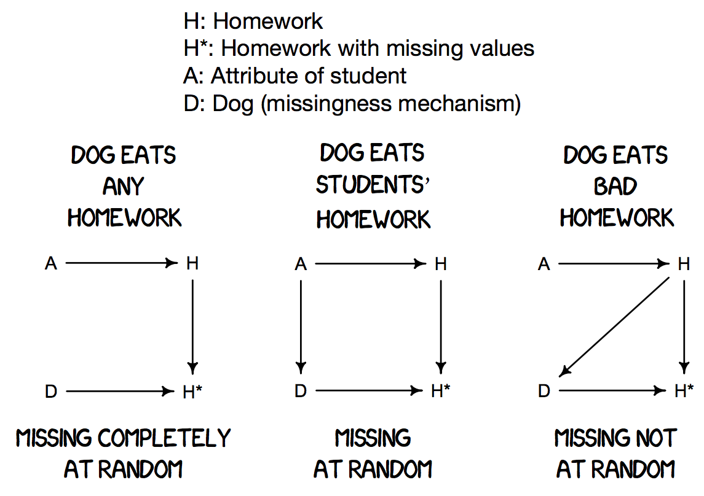{fig-align="center"}

The critical question: **what determines whether data goes missing?**


## Missing completely at random (MCAR)

::::: columns
::: {.column width="50%"}
- **Dog eats homework randomly**

- No relationship between missingness and any values

- Loss of precision, but usually no bias

- Complete-case analysis (**= listwise deletion**) is valid
:::

::: {.column width="50%"}
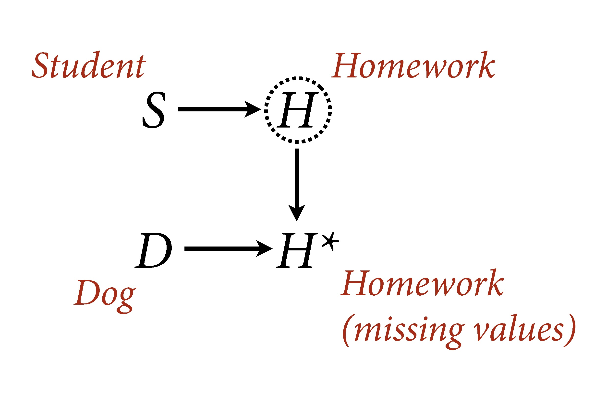{fig-align="center"}

The cause may be known (e.g., coffee spilled on questionnaires) -- what matters is that the cause is unrelated to any variable in the data.
:::
:::::


## MCAR visualized

::::: columns
::: {.column width="50%"}
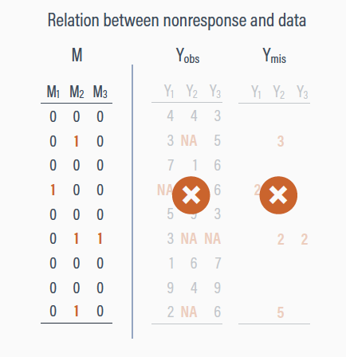{fig-align="center"}
:::

::: {.column width="50%"}
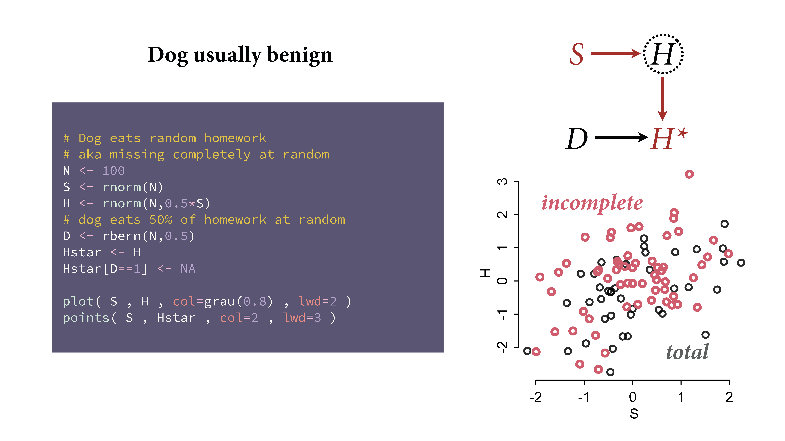{fig-align="center"}
:::
:::::


##
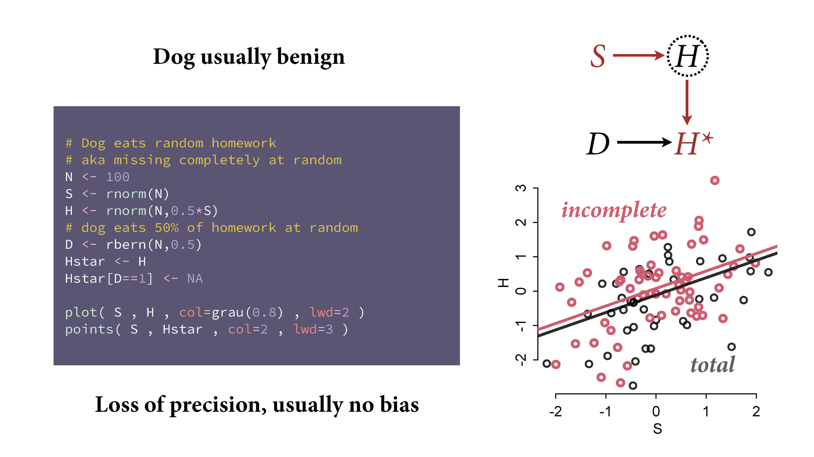{fig-align="center"}


## Conditionally missing at random (CMAR)

::::: columns
::: {.column width="50%"}
- Missingness depends on observed data

- **Dog eats conditional on cause of homework**

- Valid inference if we condition correctly

- **The name "Missing at Random" is misleading**: missingness is not random unconditionally, only **after** conditioning on observed variables
:::

::: {.column width="50%"}
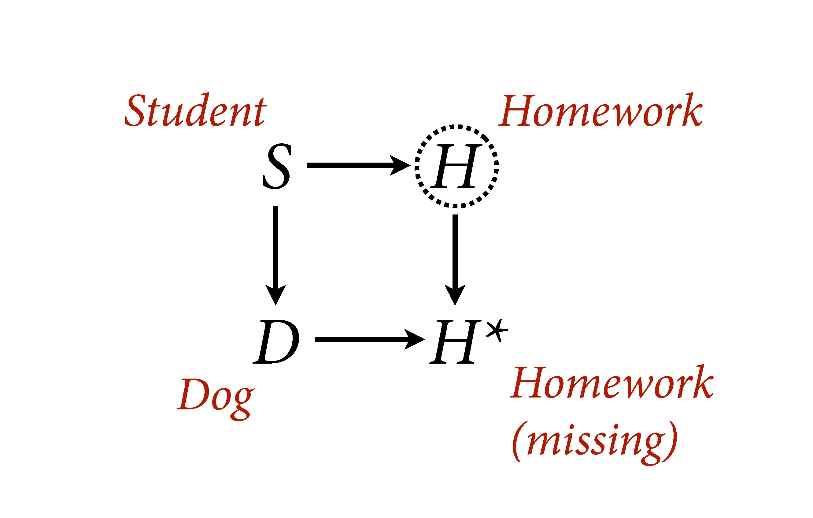{fig-align="center"}
:::
:::::


## CMAR: Simulation evidence

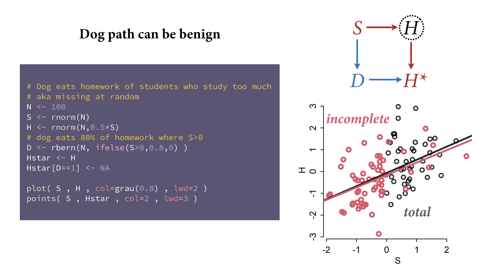{fig-align="center"}


##
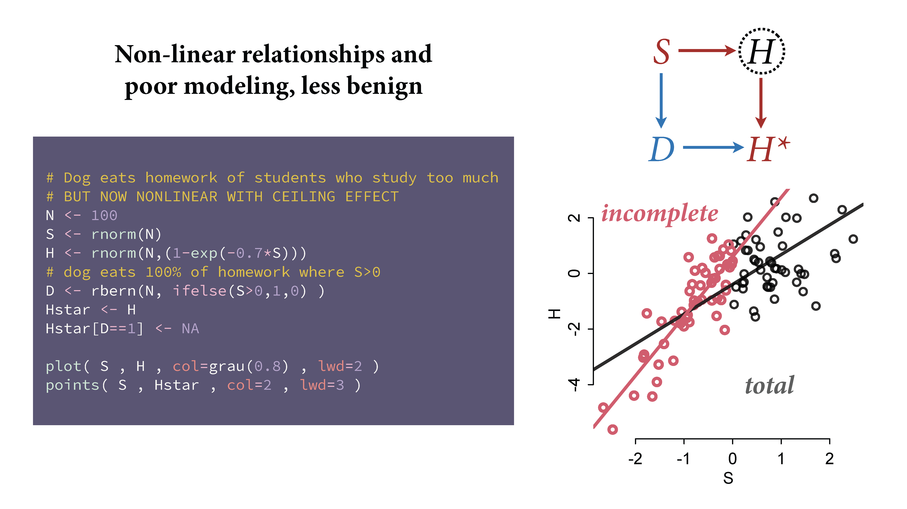{fig-align="center"}


## CMAR visualized

::::: columns
::: {.column width="50%"}
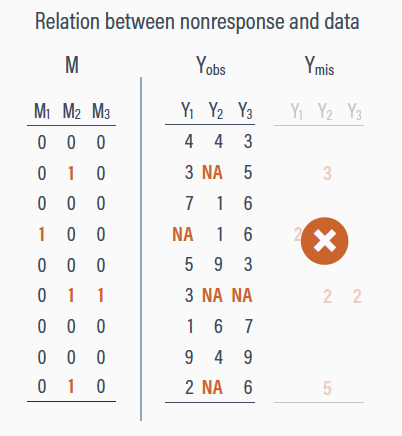{fig-align="center"}
:::

::: {.column width="50%"}
- Sometimes the missingness-predictor relationship is nonlinear

- Poor modeling of MAR can still lead to bias

- MI and ML handle this because they model the joint distribution
:::
:::::


## Not missing at random (NMAR)

::::: columns
::: {.column width="50%"}
- Missingness depends on the missing values *themselves*

- **Dog eats conditional on homework itself**

- Produces bias in standard analyses

- The missingness pattern is **informative**: who is missing tells you something about the values that are missing
:::

::: {.column width="50%"}
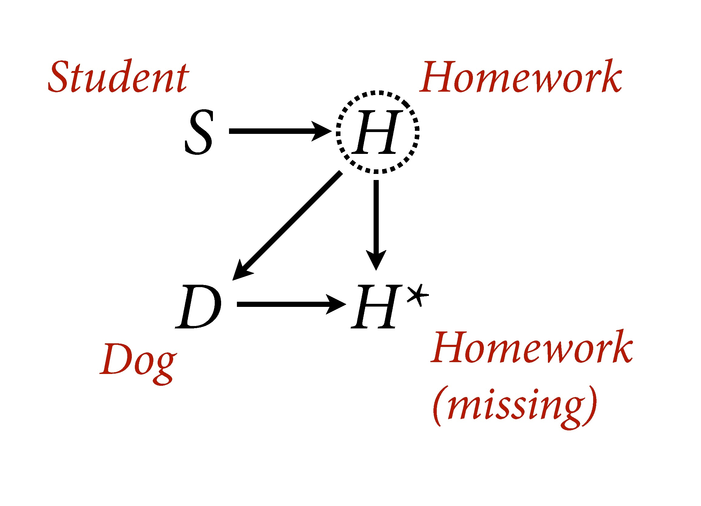{fig-align="center"}
:::
:::::


## NMAR visualized

::::: columns
::: {.column width="50%"}
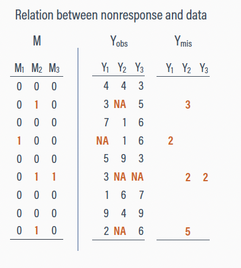{fig-align="center"}
:::

::: {.column width="50%"}
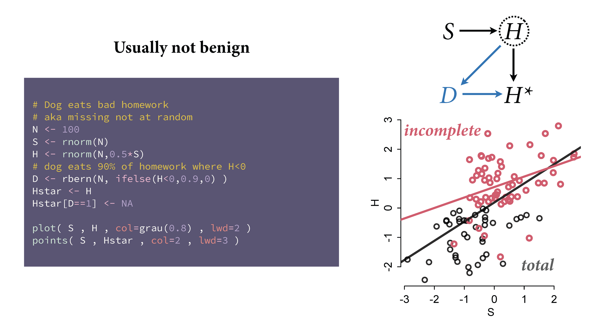{fig-align="center"}
:::
:::::


# Workflow for Missing Data {.center}

## Three steps

1. **Identify** missing data (and how much)

2. **Diagnose** the mechanism (MCAR? MAR? NMAR?)

3. **Account for** missingness:

    - Deletion (not recommended)
    - Imputation
    - Maximum likelihood
    - Bayesian methods (model observed + missing jointly)

# Data {.center}

## Chronic pain example

-   Enders (2023): *N* = 275, psychological correlates of chronic pain

    -   Depression (`depress`) and perceived control (`control`)

-   Perceived control is complete; depression scores are missing

    ::: callout-note
    Dataset manipulated so missingness is related to control (low control = missing depression). MAR by construction.
    :::

## Loading the data

::::: columns
::: {.column width="50%"}
```{r}
dat <- read.table("https://raw.githubusercontent.com/jgeller112/PSY504-Advanced-Stats-S24/main/slides/03-Missing_Data/APA%20Missing%20Data%20Training/Analysis%20Examples/pain.dat", na.strings = "999")

names(dat) <- c("id", "txgrp", "male", "age", "edugroup", "workhrs", "exercise", "paingrps",
                "pain", "anxiety", "stress", "control", "depress", "interfere", "disability",
                paste0("dep", seq(1:7)), paste0("int", seq(1:6)), paste0("dis", seq(1:6)))

dat <- dat  %>%
  select("id", "age", "control",  "depress", "stress") %>%
  mutate(depress=ifelse(depress==999, NA, depress)) %>%
    mutate(r_mar_low = ifelse(control < 15.51, 1, 0)) %>%
  mutate(depress = ifelse(r_mar_low == 1, NA, depress)) %>%
  select(-r_mar_low)
```
:::

::: {.column width="50%"}
```{r}
#| echo: false
dat %>%
  head(10) %>%
  kable()
```
:::
:::::


## EDA

-   What variables have missing data? How much?

```{r}
#| fig-align: "center"
library(naniar)
vis_miss(dat)
```


## EDA: Summary statistics

```{r}
library(skimr)
skimr::skim(dat) %>%
  kable()
```


## Missing patterns

::::: columns
::: {.column width="50%"}
-   Pattern matrix: structure of observed and missing values

```{r}
dat %>%
  plot_pattern()
```
:::

::: {.column width="50%"}
```{r}
#| echo: false
#| fig-align: "center"
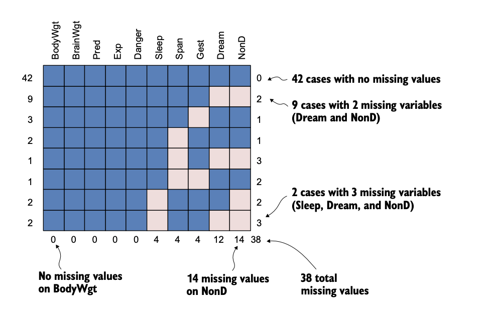
```
:::
:::::


## Types of missing patterns

::::: columns
::: {.column width="50%"}
-   **Univariate**: one variable with missing data

-   **Monotone**: if variable *j* is missing, all subsequent are too

    -   Common in longitudinal dropout

-   **Non-monotone**: scattered, no systematic ordering
:::

::: {.column width="50%"}
```{r}
#| fig-align: "center"
#| echo: false
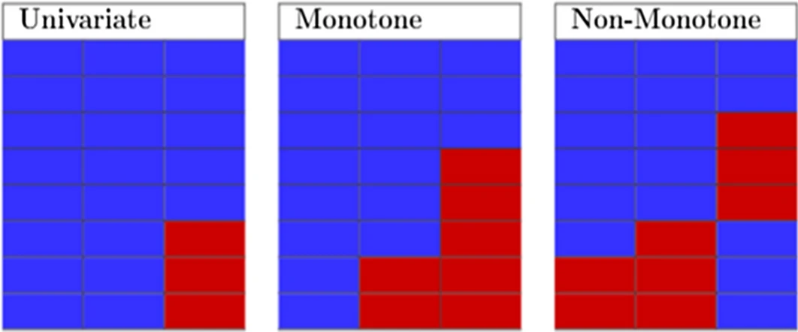
```
:::
:::::

## Is it MCAR or MAR?

{fig-align="center"}


## Little's MCAR test

-   Little's test: $\chi^2$ statistic

    -   Significant = not MCAR
    -   Not significant = consistent with MCAR

```{r}
library(naniar)
mcar_test(dat) %>% kable()
```

-   Not used much anymore!


## Visual diagnostics

```{r, echo=TRUE, fig.align='center', out.width="100%"}
library(finalfit)

explanatory = c("control", "age")
dependent = "depress"

misspairs <- dat %>%
  missing_pairs(explanatory, dependent)
```

```{r, echo=FALSE, fig.align='center', out.width="100%"}
misspairs
```


## Dummy variable approach

-   Create binary indicator: 1 = missing, 0 = observed
-   If related to other variables, evidence for MAR

```{r}
pain_r <- dat %>%
  mutate(depress_1 = ifelse(is.na(depress), 1, 0))
pain_r %>% head() %>% kable()
```

## Testing

```{r}
model <- lm(control~depress_1, data=pain_r)

tidy(model) %>%
  kable()
```

-   Missing on depression is related to control!


# Methods for MCAR {.center}

## Listwise deletion

::::: columns
::: {.column width="50%"}
```{r}
dat %>%
  head(10) %>%
  kable()
```
:::

::: {.column width="50%"}
```{r}
dat  %>%
  drop_na() %>%
  head(10) %>%
  kable()
```
:::
:::::


## Listwise deletion: pros and cons

-   Pros: unbiased if MCAR

-   Cons: can lose substantial data; biased if not MCAR

## Casewise (pairwise) deletion

-   Delete only observations where the missing data is relevant to *that specific comparison*

-   Pros: preserves more data; unbiased under MCAR

-   Cons: each statistic uses a different subset; can produce non-positive-definite covariance matrices


# Methods for MAR {.center}

## Unconditional (mean) imputation -- Bad

-   Replace missing values with the mean of observed values

::::: columns
::: {.column width="50%"}
```{r}
d <- c(5, 8, 3, NA, NA)

d_mean <- mean(d, na.rm = TRUE)
d_mean_imp <- ifelse(is.na(d), d_mean, d)

d_mean_imp
```
:::

::: {.column width="50%"}
```{r}
sd(d, na.rm=TRUE) # sd of original
sd(d_mean_imp) # sd after mean imputation
```
:::
:::::


## Conditional imputation (regression)

::::: columns
::: {.column width="50%"}
-   Use observed variables to predict missing values

```{r}
#| eval: false
lm(depress~control)

imp.regress <- mice(dat, method="norm.predict", m=1, maxit=1)
```

-   Missing scores receive predicted values
:::

::: {.column width="50%"}
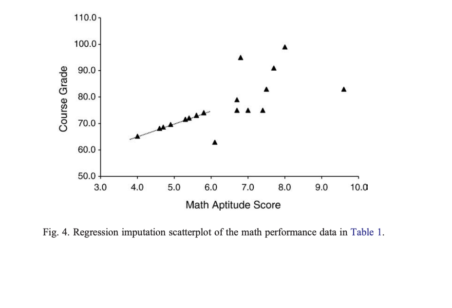{fig-align="center"}
:::
:::::


## Stochastic Regression

- Adds a random residual to predicted values

- More realistic standard errors

```{r}
#| eval: false
mice(data, m=1, method="norm.nob")
```

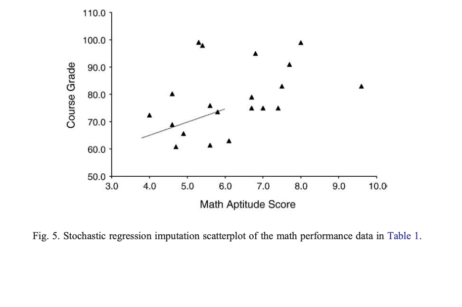{fig-align="center"}


# Multiple Imputation {.center}

## The idea

-   Use multiple plausible values instead of one "best guess"

-   Creates *m* completed datasets, each with different imputed values

-   Captures uncertainty about what the missing values might have been

## Step 1: Impute

Create *m* imputed datasets with `mice()`

{fig-align="center"}


## Step 2: Analyze

Fit your model to each dataset with `with()`

{fig-align="center"}

## Step 3: Pool

Combine results with `pool()` using Rubin's rules

{fig-align="center"}


## Multiple Imputation summary

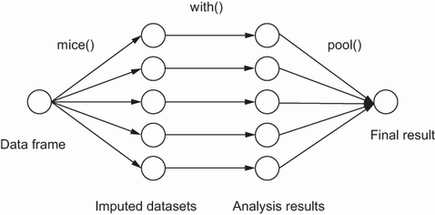{fig-align="center" width="666"}

## Connection to the Bootstrap

-   Both generate multiple datasets, analyze each separately, pool results

-   Bootstrap: "what if we'd drawn a different sample?"

-   MI: "what if the missing values had been different?"


## 1. Impute with `mice`

```{r}
m = 5
imp <- mice(dat, m = m, seed = 24415, method="pmm", print = FALSE)
```

```{r}
str(imp, max.level = 1)
```


## 1. Impute with `mice` (cont.)

```{r}
str(imp$imp, max.level = 1)

head(imp$imp$depress)
```


## PMM

::::: columns
::: {.column width="50%"}
-   Predictive mean matching

    -   Fit regression on observed data
    -   Predict mean for the missing case
    -   Find "donor" cases with closest predicted means
    -   Use a donor's actual observed value
:::

::: {.column width="50%"}
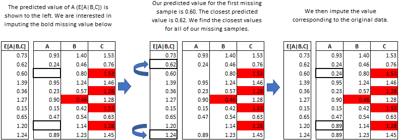{width="435" height="319"}
:::
:::::


## 2. Model with `mice`

```{r}
fit <- with(data = imp, expr = lm(depress ~ control))

summary(fit) %>%
  kable()
```


## 3. `mice` Pool Results

```{r}
result <- pool(fit)

model_parameters(result) %>%
  kable()
```


## 3. `mice` Pool Results (cont.)

-   `emmeans` does not work with `mice` objects

-   Use `marginaleffects` instead

```{r}
library(marginaleffects)

mfx_mice <- avg_slopes(fit)

mfx_mice %>% kable()
```

## Plot Imputations

-   Make sure imputed values look similar to real data

```{r, fig.align='center', out.width="60%"}
ggmice(imp, ggplot2::aes(x = .imp, y = depress)) +
  ggplot2::geom_jitter() +
    labs(x = "Imputation number")
```


# Maximum Likelihood (ML) {.center}

## ML

-   Finds most probable parameter estimates given the observed data

-   Each observation contributes whatever data it has

-   No imputation performed


## How ML uses partial data

No values are filled in. The correlation structure implies what missing values probably look like, without writing a number into any empty cell.

{fig-align="center" width="538"}


## Chronic pain illustration

-   Low perceived control = more likely to have missing depression (MAR)

-   True means are both 20

{fig-align="center" width="598"}

## Deleting incomplete information

::::: columns
::: {.column width="50%"}
-   Deletion gives a non-representative sample

-   Control mean too high (23.1), depression mean too low (17.2)
:::

::: {.column width="50%"}
{fig-align="center" width="607"}
:::
:::::


## Partial data

-   Partial data records primarily have low perceived control scores

{fig-align="center" width="605"}


## Adjusting perceived control

-   Low control scores increase variability, pull the mean downward

{fig-align="center"}

## How ML infers missing values

-   Multivariate normality + negative correlation: low control implies high depression

{fig-align="center"}


## Adjusting Depression Distribution

-   Depression mean and variance increase to accommodate the implied high scores

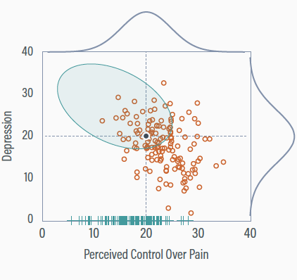{fig-align="center" width="559"}


## ML: Cons

-   Limited to normal data; mixed metric options are less common

-   Biased with interactions and non-linear terms

-   MLM software often discards observations with missing predictors


## A note on hierarchical models

-   HLMs handle unbalanced designs gracefully (ragged longitudinal data)

-   Often confused with handling missing data, but HLMs still assume MAR

-   If dropout depends on the outcome (NMAR), HLMs are biased too

## Distinguish between NMAR and MAR

-   It's genuinely difficult

    -   Not many good techniques

-   Strategies to convert NMAR to MAR:

    -   Track down the missing data
    -   Find auxiliary variables
    -   Collect more data explaining missingness


## Distinguish between NMAR and MAR

{fig-align="center"}

## Bayesian Methods

::::: columns
::: {.column width="50%"}
**Without Missing Data**

- y_i ~ Normal(α + βx_i, σ²)
- α ~ Normal(0, 10)
- β ~ Normal(0, 1)
- σ ~ HalfCauchy(0, 5)
:::

::: {.column width="50%"}
**With Missing Data**

- y_i ~ Normal(α + βx_i, σ²)
- x_i ~ Normal(μx, τ²) for missing x_i
- α ~ Normal(0, 10)
- β ~ Normal(0, 1)
- σ ~ HalfCauchy(0, 5)
- μx ~ Normal(0, 10)
- τ ~ HalfCauchy(0, 5)
:::
:::::


## Reporting Missing Data

-   Template from [Stef van Buuren](https://stefvanbuuren.name/fimd/sec-reporting.html)

::: callout-tip
The *percentage of missing values* across the nine variables varied between *0 and 34%*. In total *1601 out of 3801 records (42%)* were incomplete. Many girls had no score because the nurse felt that the measurement was "unnecessary," or because the girl did not give permission. Older girls had many more missing data. We used *multiple imputation* to create and analyze *40 multiply imputed datasets*. Methodologists currently regard multiple imputation as a state-of-the-art technique because it improves accuracy and statistical power relative to other missing data techniques. *Incomplete variables were imputed under fully conditional specification, using the default settings of the mice 3.0 package (Van Buuren and Groothuis-Oudshoorn 2011)*. The parameters of substantive interest were estimated in each imputed dataset separately, and combined using Rubin's rules. For comparison, *we also performed the analysis on the subset of complete cases.*
:::

## What to report

-   *Amount of missing data* (overall and per variable)
-   *Reasons for missingness*
-   *Consequences* (assumed mechanism and why)
-   *Method* (MI, ML, Bayesian, etc.)
-   *Imputation model* (variables, method)
-   *Pooling* (Rubin's rules, etc.)
-   *Software* (package versions)
-   *Complete-case analysis* (sensitivity check)

## Is it MCAR, MAR, NMAR?

> The post-experiment manipulation-check questionnaires for five participants were accidentally thrown away.

. . .

-   **MCAR** -- accidental, unrelated to any variable

## Is it MCAR, MAR, NMAR?

> In a 2-day memory experiment, people who know they would do poorly on the memory test are discouraged and don't want to return for the second session

. . .

-   **NMAR** -- missingness depends on the unobserved memory scores

## Is it MCAR, MAR, NMAR?

> A health psychologist is surveying high school students on marijuana use. Students who scored highly on anxiety left these questions blank.

. . .

-   **MAR** -- missingness depends on anxiety, an observed variable

## Wrap up

-   When you have missing data, think about **why** they are missing

-   Missing data handled improperly can bias your estimates

-   MI and ML are good ways to handle missing data!

    -   Bayesian methods are good too :)

    -   Inverse probability weighting seem to work well [@gomila2022]

-   Always report your missing data strategy transparently
