## Overview

::::: columns
::: {.column width="50%"}
-   The nuts and bolts of multilevel models

    -   Why do we need multilevel models? what are they? and why are they awesome?
    -   Important terminology
    -   How we specify MLMs (in code and mathematically)
:::

::: {.column width="50%"}
-   How to do it

    -   Organizing data for MLM analysis
    -   Estimation
    -   Fit and interpret multilevel models
    -   Effect size
    -   Power
    -   Visualizing data
    -   Reporting
:::
:::::

## Packages

-   Packages you will need

```{r}
library(tidyverse)
library(easystats)
library(here)
library(knitr)
library(broom)
library(broom.mixed)
library(lme4)
```

-   Follow along by downloading .qmd file here: <https://github.com/suyoghc/PSY-504_Spring-2025/blob/main/Multilevel%20Modeling/MLM.qmd>

## Why multilevel modeling?

-   Let's look at the relationship between SES and math achievement

```{r}

data <- read.csv("https://raw.githubusercontent.com/suyoghc/PSY-504_Spring-2025/refs/heads/main/Multilevel%20Modeling/data/heck2011.csv")


```

::::: columns
::: {.column width="50%"}
```{r}
#| echo: false
#| fig-align: center
#| 

data_sub <- data %>% 
      filter(schcode <= 10)

data_sub %>% 
      ggplot(mapping = aes(x = ses, y = math)) +
      geom_point2(size=3) +
      geom_smooth(method = "lm", se = FALSE, fullrange = TRUE) + 
      labs(y="Math Score", x="SES") + 
  theme_lucid(base_size=21)

```
:::

::: {.column width="50%"}
```{r}
#| echo: true
#| fig-align: center
#| 
lm(math~ses, data=data) %>%
tidy() %>%
  kable()
```
:::
:::::

## Why multilevel modeling?

-   However, if we introduce grouping we tell a slightly different story

```{r}
#| echo: false
#| fig-align: center

data_sub %>% 
  ggplot(mapping = aes(x = ses, y = math, colour = factor(schcode))) +
  geom_point2(size=3) +
  geom_smooth(mapping = aes(group = schcode), method = "lm", se = FALSE, fullrange = TRUE) +
  labs(colour = "schcode") + 
  labs(y="Math Score", x="SES") + 
  ggeasy::easy_add_legend_title("School") + 
    theme_lucid(base_size=21)
```

## Why multilevel modeling?

::::: columns
::: {.column width="50%"}
-   Simpson's paradox

    {fig-align="center"}
:::

::: {.column width="50%"}
-   **A phenomenon in which a trend appears in several groups of data but disappears or reverses when the groups are combined**

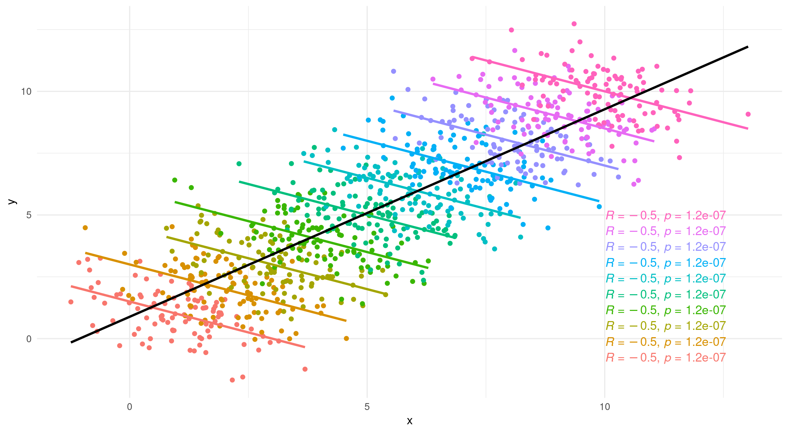{fig-align="center"}
:::
:::::

## Why multilevel modeling?

-   The word we live in is highly interdependent!

    -   Biological, psychological, social processes occur at multiple levels

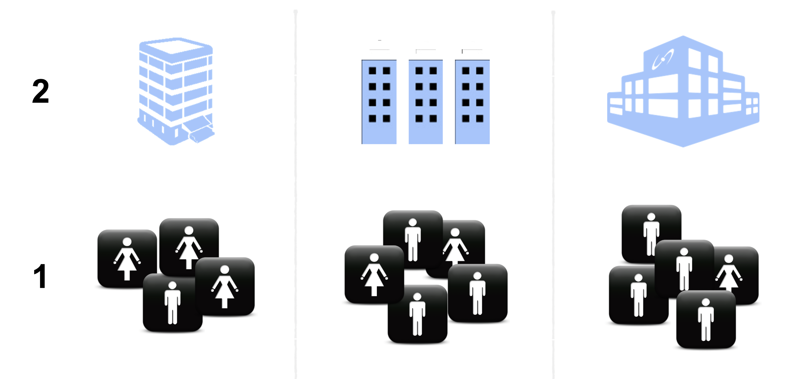{fig-align="center"}

## Why multilevel modeling?

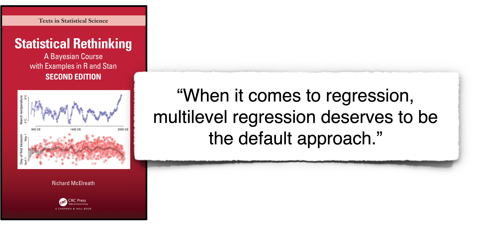{fig-align="center"}

## What is multilevel modeling?

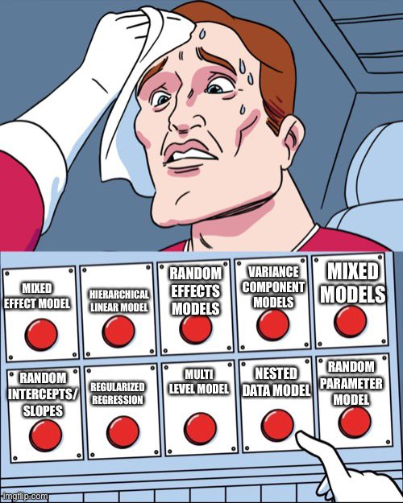{fig-align="center"}

. . .

-   An elaboration on regression

    -   just extra errors!

## What is multilevel modeling?

-   Technique that allows us deal with non-independence between data points (i.e., clustered/nested data)

    -   Nested data violate key assumptions of OLS
        -   ~~independent observations~~
        -   ~~independent errors~~
            -   Biased estimates and/or underestimated SEs, inflating Type 1 error
    -   Correct inferences!

-   Explicit partitioning of the variance

    -   Within (intra-group differences)

    -   Between (inter-group differences)

## What is a "hierarchy?"

> *Clustering = Nesting = Grouping = Hierarchies*

::::: columns
::: {.column width="50%"}
-   Key idea: More than one dimension sampling simultaneously

    -   "Nested" designs

    -   Repeated-measures and longitudinal designs

    -   Any complex mixed design
:::

::: {.column width="50%"}
{fig-align="center"}

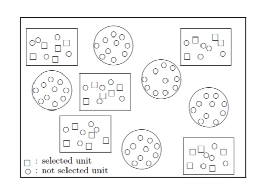{fig-align="center"}
:::
:::::

## Nested designs

```{r, echo=FALSE, fig.align='center', out.width="70%"}

```

## Two-level Hierarchy

-   Nested designs

```{r, echo=FALSE, fig.align='center', out.width="100%"}
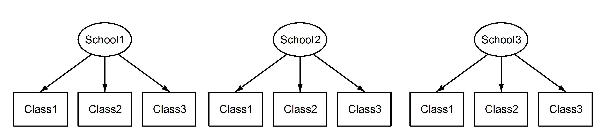
```

-   For now we will focus on data with two levels:

    -   Level one: most basic level of observation
    -   Level two: groups formed from aggregated level-one observation

## Three-level Hierarchy

```{r, echo=FALSE, fig.align='center', out.width="100%"}
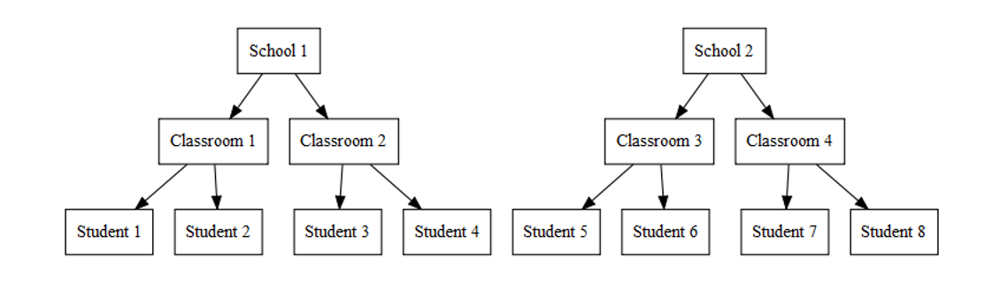
```

## Crossed vs. nested designs

-   Crossed designs (sometimes called cross-classified)

    -   When lower units do not belong to only one higher level unit

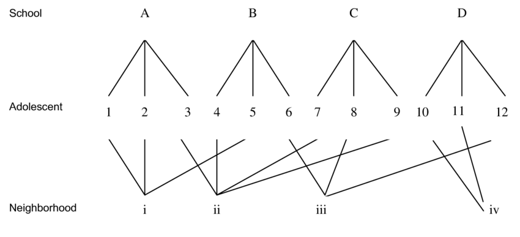{fig-align="center"}

## Repeated designs

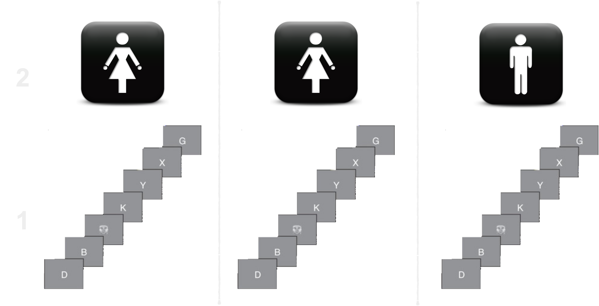{fig-align="center"}

## Repeated designs

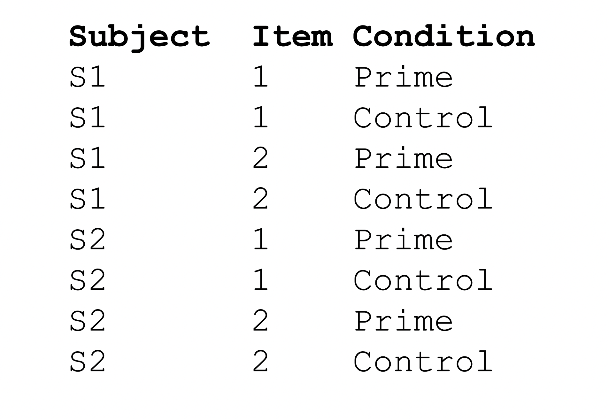{fig-align="center"}

## Repeated designs

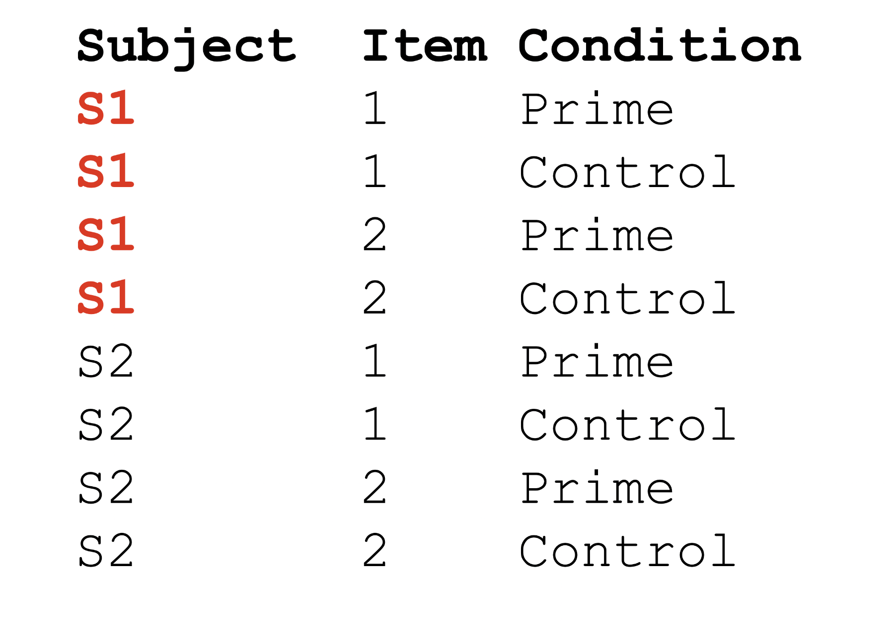{fig-align="center"}

## Repeated designs

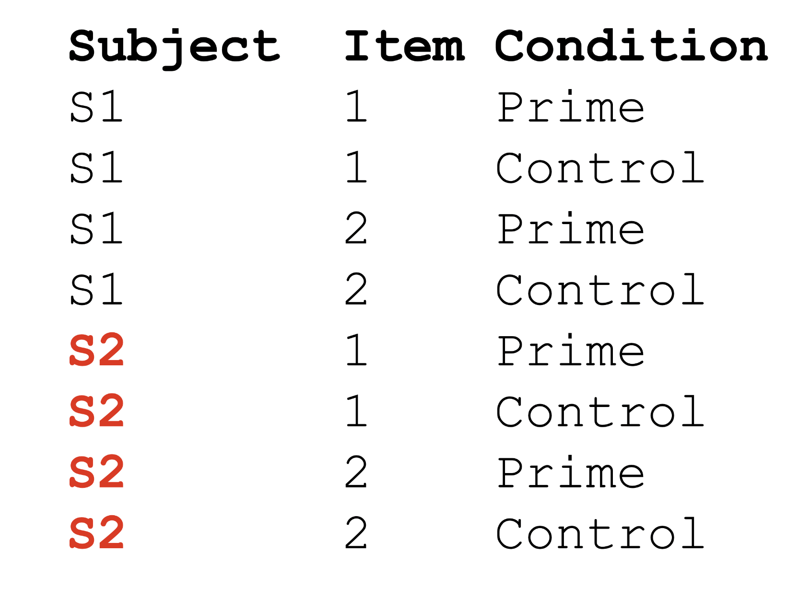{fig-align="center"}

## Repeated designs

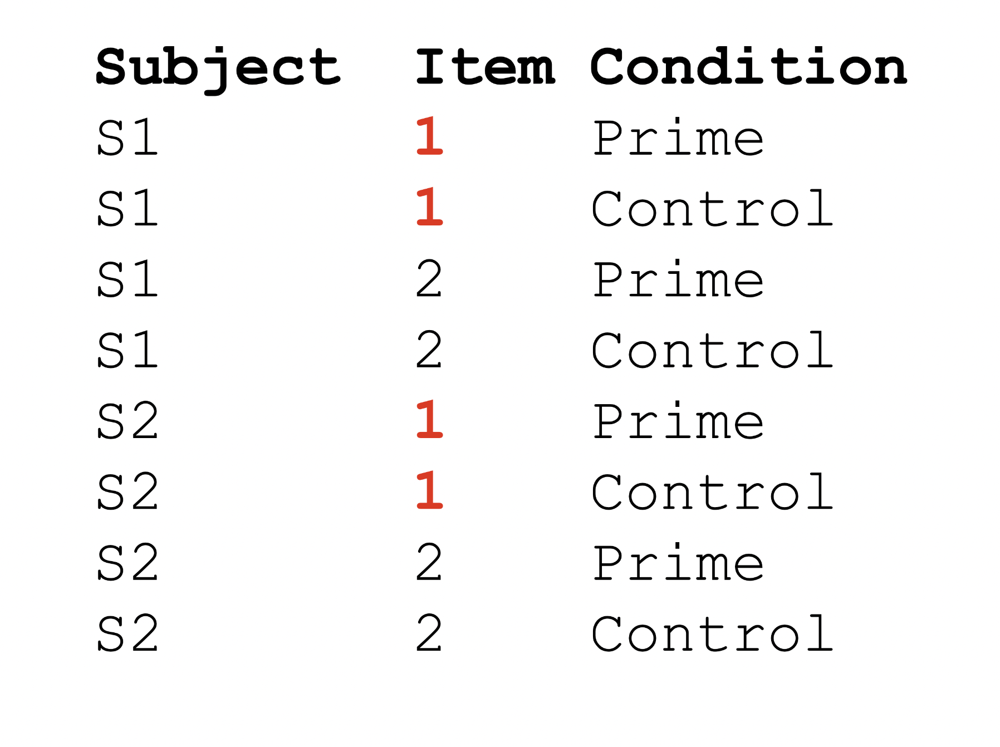{fig-align="center"}

## Repeated designs

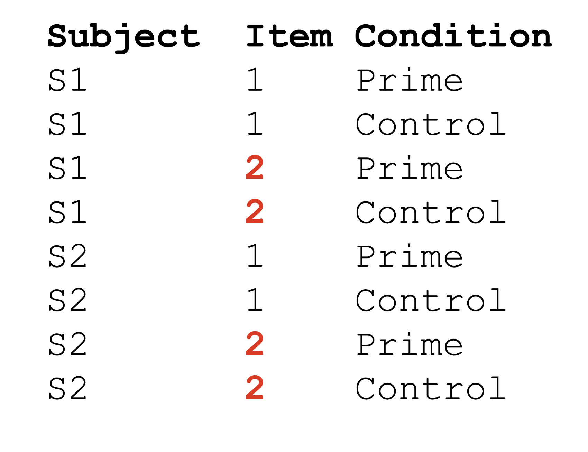{fig-align="center"}

## Longitudinal designs

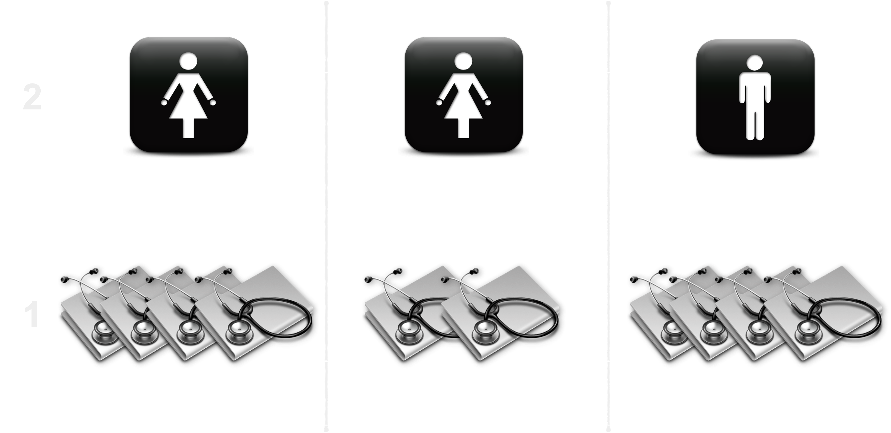{fig-align="center"}

## Test your knowledge

> Radon is a carcinogen -- a naturally occurring radioactive gas whose decay products are also radioactive -- known to cause lung cancer in high concentrations. The EPA sampled more than 80,000 homes across the U.S. Each house came from a randomly selected county and measurements were made on each level of each home. Uranium measurements at the county level were included to improve the radon estimates.

1.  What is the most basic level of observation (Level One)?
2.  What are the group units (Level Two, Level Three, etc...)?

# Simulation: OLS vs. MLM

## OLS vs. MLM

-   We *claimed* that ignoring clusters biases estimates and inflates Type 1 error

-   Let's test this claim with simulated data where we *know* the ground truth, then see which model gets it right

. . .

-   The setup:
    1.  Simulate clustered data where the **true effect of X is zero**
    2.  Fit OLS (ignoring clusters) and MLM (accounting for clusters)
    3.  If OLS finds a "significant" effect, we've caught a Type I error red-handed

## The data generating process

-   30 groups (classrooms, therapists, schools...), 10 observations each
-   Groups differ in their baseline (random intercepts, SD = 3)
-   True slope of `x` is **exactly 0** — there is no effect to find
-   We wrote the equation, so we *know* the truth — can our models recover it?

```{r}
#| echo: false
set.seed(39)
n_groups <- 30; n_per <- 10
group_effects <- rnorm(n_groups, sd = 3)

sim <- tibble(
  group = rep(1:n_groups, each = n_per),
  x = rnorm(n_groups * n_per),
  y = 5 + 0 * x +
      group_effects[group] +
      rnorm(n_groups * n_per)
)
```

```{webr-r}
set.seed(39)                                    # reproducibility
n_groups <- 30; n_per <- 10                     # 30 groups, 10 obs each
group_effects <- rnorm(n_groups, sd = 3)        # random intercepts per group

sim <- tibble(
  group = rep(1:n_groups, each = n_per),        # group labels
  x = rnorm(n_groups * n_per),                  # predictor (continuous)
  y = 5 + 0 * x +                              # true slope is ZERO
      group_effects[group] +                    # between-group variance
      rnorm(n_groups * n_per)                   # within-group variance
)
```

## What does the data look like?

```{r}
#| echo: false
#| fig-align: "center"
#| fig-width: 12
#| fig-height: 7

sim %>%
  ggplot(aes(x = x, y = y, color = factor(group))) +
  geom_point2(size = 2.5, alpha = 0.6) +
  geom_smooth(method = "lm", se = FALSE, color = "black", linewidth = 1.2) +
  labs(y = "Y", x = "X (true effect = 0)",
       title = "OLS sees one big cloud and fits a line through it") +
  guides(color = "none") +
  theme_lucid(base_size = 21)
```

-   Each color is a different group — notice how groups sit at different heights
-   OLS ignores the group structure. Fits a single line to all 300 points
-   The vertical spread across groups is between-group variance (OLS absorbs it into the error term)

## What happens when we account for groups?

```{r}
#| echo: false
#| fig-align: "center"
#| fig-width: 12
#| fig-height: 7

sim %>%
  ggplot(aes(x = x, y = y, color = factor(group))) +
  geom_point2(size = 2.5, alpha = 0.6) +
  geom_smooth(aes(group = group), method = "lm", se = FALSE, linewidth = 0.5, alpha = 0.5) +
  geom_smooth(method = "lm", se = FALSE, color = "black", linewidth = 1.2) +
  labs(y = "Y", x = "X (true effect = 0)",
       title = "Within each group, there is no relationship") +
  guides(color = "none") +
  theme_lucid(base_size = 21)
```

-   Within-group lines are mostly flat — exactly what we'd expect when the true slope is zero
-   The OLS line captures **between-group** intercept differences, not the effect of X you're trying to estimate
-   Within each group, the lines are mostly flat — the true slope is zero

## Each group on its own

```{r}
#| echo: false
#| fig-align: "center"
#| fig-width: 14
#| fig-height: 8

sim %>%
  ggplot(aes(x = x, y = y, color = factor(group))) +
  geom_point(size = 1.5, alpha = 0.6) +
  geom_smooth(method = "lm", se = FALSE, linewidth = 0.8) +
  facet_wrap(~group) +
  labs(y = "Y", x = "X (true effect = 0)") +
  guides(color = "none") +
  theme_lucid(base_size = 11) +
  theme(strip.text = element_text(size = 8))
```

-   Within-group lines are mostly flat — exactly what we'd expect when the true slope is zero
-   The OLS line captures **between-group** intercept differences, not the effect of X you're trying to estimate
-   Within each group, the lines are mostly flat — the true slope is zero

## OLS vs. MLM: comparing estimates

```{r}
#| echo: false
ols <- lm(y ~ x, data = sim)
mlm <- lmer(y ~ x + (1|group), data = sim)

bind_rows(
  tidy(ols) %>% filter(term == "x") %>% mutate(model = "OLS (ignores clusters)"),
  tidy(mlm) %>% filter(term == "x") %>% mutate(model = "MLM (accounts for clusters)")
) %>%
  select(model, estimate, std.error, p.value) %>%
  kable(digits = 3)
```

```{webr-r}
ols <- lm(y ~ x, data = sim)
mlm <- lmer(y ~ x + (1|group), data = sim)

bind_rows(
  tidy(ols) %>% filter(term == "x") %>% mutate(model = "OLS (ignores clusters)"),
  tidy(mlm) %>% filter(term == "x") %>% mutate(model = "MLM (accounts for clusters)")
) %>%
  select(model, estimate, std.error, p.value) %>%
  kable(digits = 3)
```

. . .

::: callout-important
-   The true effect is **zero** — but OLS finds *p* = .016!
-   If this were a real study, we'd publish a false finding
-   MLM correctly concludes no effect (*p* = .91)
-   The OLS estimate (-0.32) is far from zero because between-group variance contaminates it. MLM's estimate (-0.006) recovers the truth
:::

## What went wrong with OLS?

::: columns
::: {.column width="50%"}
-   OLS sees 300 "independent" observations

-   Between-group differences in Y get **absorbed into the residuals**

-   This contaminates the slope estimate, pulling it away from the true value

-   Biased estimate $\rightarrow$ false significance
:::

::: {.column width="50%"}
-   MLM **partitions** the variance:

    -   Between-group variance: $\sigma^2_{U_0}$
    -   Within-group variance: $\sigma^2_e$

-   The slope is estimated using only **within-group** variation

-   Unbiased estimate $\rightarrow$ correct conclusion
:::
:::

## The equations: one error vs. many

-   OLS has **one** error term — everything unexplained goes into a single pile:

$$y_i = \color{blue}{b_0 + b_1 x_i} + \color{red}{e_i}$$

-   MLM splits that pile into **separate sources** of variance:

$$y_{ij} = \color{blue}{\gamma_0 + \gamma_1 x_{ij}} + \color{red}{U_{0j}} + \color{red}{e_{ij}}$$

-   $\color{red}{U_{0j}}$ = how far group $j$'s intercept deviates from the grand mean (between-group error)
-   $\color{red}{e_{ij}}$ = how far observation $i$ deviates from its group mean (within-group error)

## Mapping the equation to our simulation code

-   Our data generating process **is** the MLM equation:

```
y = 5 + 0 * x + group_effects[group] + rnorm(...)
```

| Code                    | Equation          | What it is                |
|-------------------------|-------------------|---------------------------|
| `5`                     | $\gamma_0$        | Fixed intercept           |
| `0 * x`                | $\gamma_1 x_{ij}$ | Fixed slope (set to zero) |
| `group_effects[group]` | $U_{0j}$          | Between-group error       |
| `rnorm(...)`           | $e_{ij}$          | Within-group error        |

-   OLS lumps $U_{0j}$ and $e_{ij}$ into one $e_i$ — it can't tell them apart
-   MLM recovers both, so the slope estimate reflects only the within-group relationship

## Reading the code

-   OLS: `lm(y ~ x)` — one equation, one error term, all observations treated as independent
-   MLM: `lmer(y ~ x + (1|group))` — same fixed effect, but `(1|group)` lets each group have its own intercept
-   That one addition is what partitioned the variance, gave us an unbiased estimate, and prevented the false positive
-   We'll unpack the full `lmer` syntax later

. . .

-   Now let's see this in action with an interactive simulation

# In-Class Exercise

## Interactive Simulation App

Open the simulation app on your laptop:

[**Launch the MLM Simulation App**](https://j4ei32-suyog-chandramouli.shinyapps.io/mlm-simulation/){target="_blank"}

Use the sliders to control:

- **Between-group SD** — how strong the clustering is
- **True slope** — the real effect of X on Y
- **Number of groups** and **observations per group**
- Hit **Re-simulate** for a new random draw

## Questions

**Q1: Set between-group SD = 0, true slope = 0.** Compare OLS and MLM. What do you notice? What is the ICC?

<br>

**Q2: Keep true slope = 0, increase between-group SD to 3.** What happens to the OLS p-value? What about MLM? Look at the plots. Why does OLS find a significant effect?

<br>

**Q3: Set true slope = 0.5, between-group SD = 3.** Compare the OLS and MLM estimates. Which is closer to 0.5?

<br>

**Q4: Set true slope = 0. Slowly decrease between-group SD from 3 → 2 → 1 → 0.5 → 0.** At what ICC do OLS and MLM start agreeing?

## Q1: Baseline

**Set between-group SD = 0, true slope = 0.** Compare OLS and MLM. What do you notice? What is the ICC?

## A1: Baseline

- OLS and MLM give essentially **identical** results
- Both correctly find no significant effect
- ICC ≈ 0, no variance is between groups
- **Takeaway:** when there's no clustering, OLS is fine and MLM adds nothing

## Q2: Introduce clustering

**Keep true slope = 0, increase between-group SD to 3.** What happens to the OLS p-value? What about MLM? Look at the plots. Why does OLS find a significant effect?

## A2: Introduce clustering

- OLS often finds p < .05, a **false positive** (the true effect is zero!)
- MLM correctly finds no significant effect
- The plots show groups sitting at different heights, which OLS cannot distinguish from a real effect
- Within each group, the lines are flat, there's no real relationship
- ICC jumps to ~0.90, most variance is between groups

## Q3: A real effect

**Set true slope = 0.5, between-group SD = 3.** Compare the OLS and MLM estimates. Which is closer to 0.5?

## A3: A real effect

- MLM consistently estimates close to **0.5** (the true value)
- OLS is more variable, often overshooting or undershooting
- Between-group variance contaminates the OLS estimate even when there IS a real effect
- MLM isolates the within-group relationship, which is where the true effect lives

## Q4: The threshold

**Set true slope = 0. Slowly decrease between-group SD from 3 → 2 → 1 → 0.5 → 0.** Watch the ICC and model table. At what point do OLS and MLM start agreeing?

## A4: The threshold

- Around **ICC ≈ 0.20 or below** (between-group SD around 0.5–1), OLS and MLM converge
- When clustering is weak, OLS is approximately fine
- When clustering is strong, you **need** MLM
- The ICC is your diagnostic: it tells you how much the grouping structure matters

# Multilevel models are awesome!

## Why MLM is Awesome

-   Classic analysis:

    -   Aggregate to level of the group (e.g., with means)

-   Drawback of classic analysis:

    -   Loss of resolution!
    -   Loss of power!

-   MLM Approach:

    -   Deaggregation (keep all the data)

## Why MLM is Awesome

-   Classic Analysis:

    -   Repeated-measures ANOVA

-   Drawback of this approach:

    -   Missing data

        -   Must exclude entire people OR, you can interpolate missing data

-   MLM Approach:

    -   Can analyze all the observations you have!

## Why MLM is Awesome

-   Classic Analysis:

    -   Repeated-measures ANOVA

-   Drawback of ANOVA:

    -   Only use categorical predictors

-   MLM Approach:

    -   Can use any combo of categorical and continuous predictors!

## Why MLM is Awesome

::::: columns
::: {.column width="50%"}
-   ***Interdependence***
    -   You can model the relationships between cases (regression for repeated observations)
-   ***Missing data***
    -   Uses ML for missing data
-   ***Power***
    -   Deaggregated data
-   ***Take into account within and between variance***
-   ***Flexibility***
:::

::: {.column width="50%"}
{fig-align="center"}
:::
:::::

## Multilevel models

-   When to use them:

    -   Nested designs

    -   Repeated measures

    -   Longitudinal data

    -   Complex designs

-   Why use them:

    -   Captures variance occurring between groups and within groups

-   What they are:

    -   Linear model with extra residuals

## Why not use MLM?

-   Dont really care about variance (it is just a nuisance variable)

    -   Use GEEs (generalized estimating equations)
    -   Clustered standard errors

-   Data is not actually interdependent

    -   Test with ICC

-   Small number of groups/clusters

-   You only have a between-subjects design

# Important Terminology

## Jumping right in

-   Words you hear constantly in MLM Land:

    -   *Fixed effects*
    -   *Random effects*
    -   *Random factors*
    -   *Random intercepts*
    -   *Random slopes*

-   What do they all mean?

## Fixed and random effects

-   Two sides to any model

    $$
    y_i = \color{blue}{b_{0_{\text{(intercept)}}} + b_{1_{\text{(slope)}}} x_i} + e_{i_{\text{(error)}}}
    $$

    -   Model for the means (fixed part):

        -   **Fixed effect (constant effect)**:

            -   Population-level (i.e., average) effects that should persist across clusters/experiments

::: callout-note
-   What you are used to caring about for testing hypotheses

<!-- -->

-   Our predictor variables (can be continuous or categorical)
:::

## Fixed and random effects

-   Model for the variance (random part):

$$
y_i = {b_{0_{\text{(intercept)}}} + b_{1_{\text{(slope)}}} x_i} + \color{red}{e_{i_{\text{(error)}}}}
$$

-   Uncorrelated with fixed part

-   Variation around the expected values

-   Normal distributed \~ $N(\mu,\sigma)$

. . .

-   In MLM multiple "piles of variance" or residual terms

## Random factors and random effects

-   Random factors:

    -   Represent higher level grouping variables

        -   A random sample of an infinite number of possible levels

<!-- -->

-   ::: callout-note
    Can only be categorical!
    :::

## Random factors vs random effects

-   The random factor is your clustering variable:

    -   Participants 🧑‍🤝‍🧑

    -   Schools 🏫

    -   Words

    -   Pictures 🖼️

## Random factors vs random effects

-   Random effects:

    -   How random factors are allowed to vary

        -   Random intercept (most common) : $U_{0j}$

            -   Each level-2 cluster has its own average level-1 outcome

        -   Random slope: $U_{1j}$

            -   Each level-2 cluster has its own coef for the effect of a predictor on the outcome

                -   **You have a choice about whether or not to allow your Level 1 intercept and slopes to have variability**

## Is it a random or fixed factor?

-   Should my variable be fixed or random?

    -   If it is continuous, has few levels (\<5), or is an experimental manipulation

        -   Fixed

-   Want to estimate variance at each level of factor?

    -   Fixed

-   Want a general estimate of variance of factor?

    -   Random

## What is random and what is fixed?

-   **Scenario**: Investigating how student performance is influenced by teaching methods and individual student characteristics across different schools.

    -   **Data Collected**: student socio-economic status (SES), teaching method used (e.g., traditional, modern), and school ID

        -   What is fixed?

        -   What is random?

# Specifiying MLMs

## Single-level (fixed) regression

-   Blue = fixed

-   Red = random

    $$y_i = \color{blue}{b_{0_{\text{(intercept)}}} + b_{1_{\text{(slope)}}} x_i} + \color{red}{ e_{i_{\text{(error)}}}}$$

$$
e_{i_{\text{(error)}}} = y_i - \hat{y}_i
$$

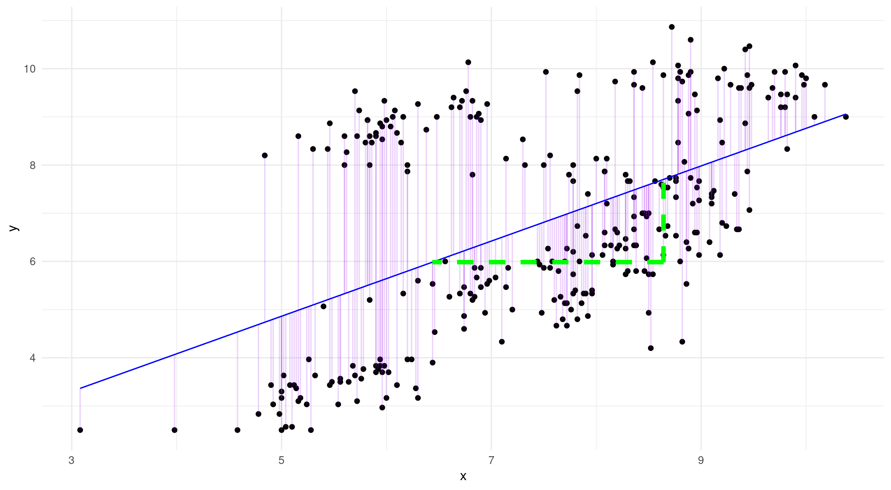{fig-align="center"}

## Random intercept

-   Varying starting point per higher level/group variable

$$
y_{ij} = (\color{blue}{b_{0j_{\text{(intercept)}}}} + \color{red}{U_{0j_{\text{(random intercept)}}}}) + \color{blue}{b_{1_{\text{(slope)}}} x_{ij}} + \color{red}{e_{ij_{\text{(error)}}}}
$$

$$
U_{0j} = b_{0j} - b_0
$$

-   Between-group variation

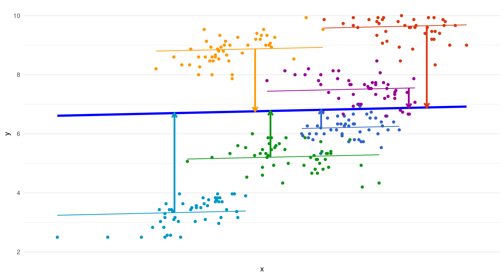{fig-align="center"}

i = individual observation j = group

## Random intercepts

$$
y_{ij} = ({b_{0j_{\text{(intercept)}}} + U_{0j_{\text{(random intercept)}}}}) + b_{1_{\text{(slope)}}} x_{ij} + \color{red}{ e_{ij_{\text{(error)}}}}
$$

Within-group variation

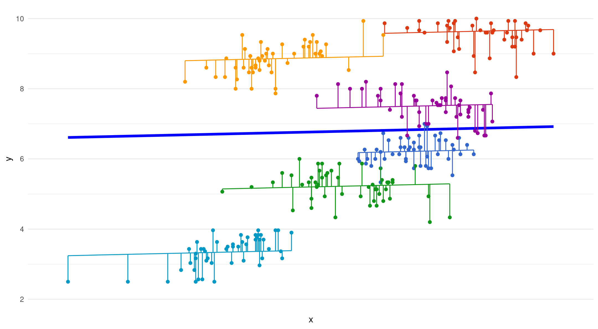{fig-align="center" width="491"}

## Random intercepts - fixed slope

-   Varying starting point (intercept), same slope for each group

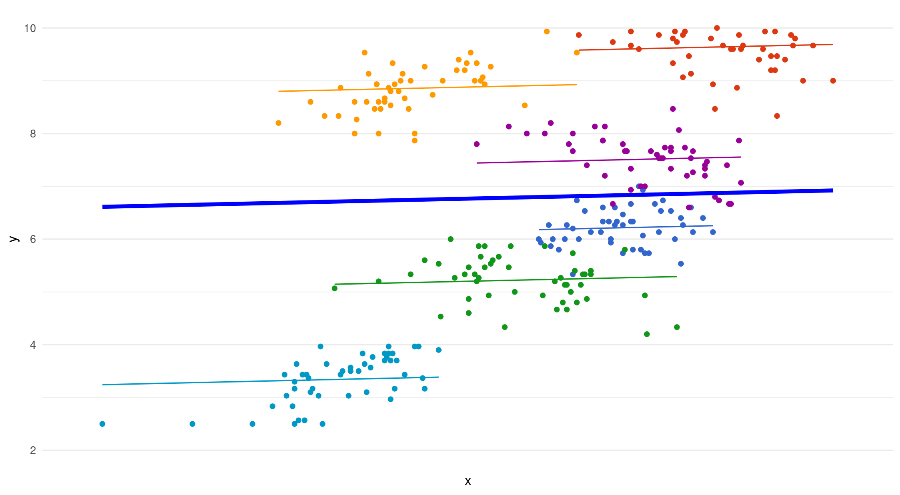{fig-align="center"}

## Random Intercepts - Random slopes

-   Varying starting point (intercept), varying slope for each group

$$
y_{ij} = (\color{blue}{b_{0j_{\text{(intercept)}}}} + \color{red}{U_{0j_{\text{(random intercept)}}}}) + (\color{blue}{b_{1_{\text{(slope)}}} x_{ij}} + \color{red}{U_{1j_{\text{(random slope)}}}}) +  \color{red}{e_{ij_{\text{(error)}}}}
$$

::: callout-important
-   ***Only put a random slope if it changes within cluster/group***
:::

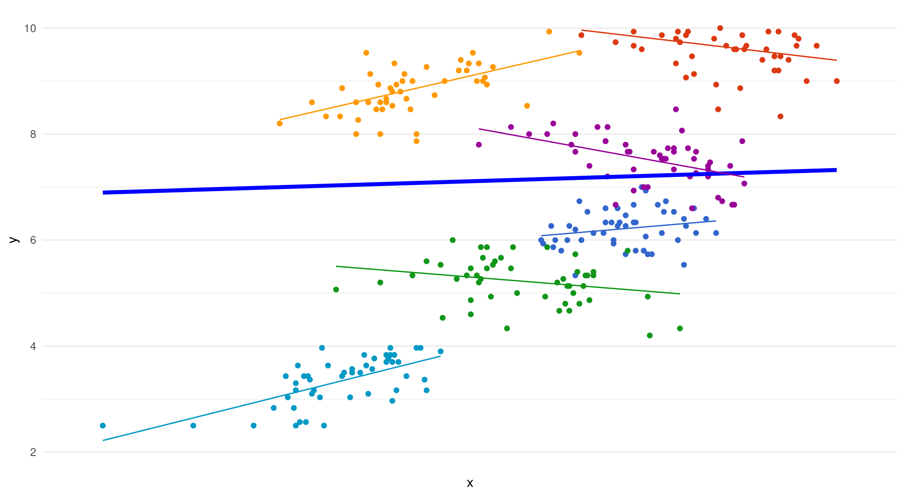{fig-align="center"}

## Random slopes

-   The dotted lines are fixed slopes. The arrows show the added error term for each random slope

$$
U_{1j} = b_{1j} - b_1
$$

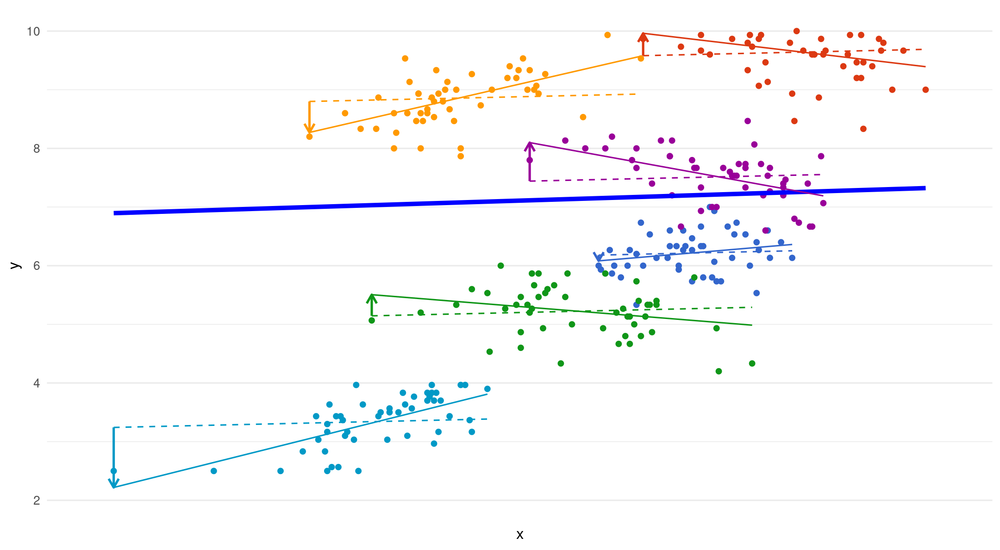{fig-align="center"}

## MLM Equations

+-----------+-----------------------------------------------------------------------------+
| **Level** | **Equation**                                                                |
+===========+=============================================================================+
| Level 1   | $y_{ij} = b_{0j} + b_{1j}X_{ij} + e_{ij}$                                   |
+-----------+-----------------------------------------------------------------------------+
| Level 2   | $b_{0j}=γ00+U_{0j}$                                                         |
|           |                                                                             |
|           | $b_{1j} = \gamma{10} + U_{1j}$                                              |
+-----------+-----------------------------------------------------------------------------+
| Combined  | $y_{ij} = \gamma_{0} + \gamma_{1}X_{ij} + e_{ij} + U_{b0j} + U_{b1j}X_{ij}$ |
+-----------+-----------------------------------------------------------------------------+

-   You will see both equations used in the literature

## All together

::::: columns
::: {.column width="50%"}
{fig-align="center"}
:::

::: {.column width="50%"}
-   Fit models using `lmer` in `lme4` package

```{r}
#| eval: false
#| 
lm(math~ses, data=data) # lm

lmer(math~ses + (1|schcode), data=data) # random intercept fixed slope

lmer(math~ses + (0+ ses |schcode), data=data) # random slope fixed intercept

lmer(math~ses + (1+ses|schcode), data=data) # random intercept + random slope
```
:::
:::::

## Syntax cheat sheet

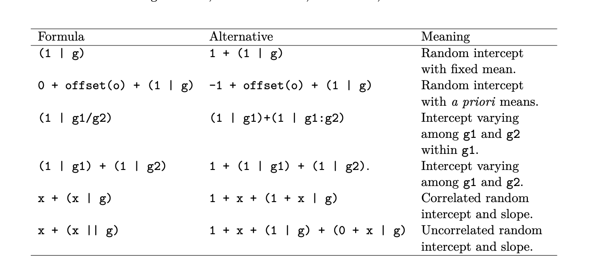{fig-align="center"}

## How do your groups differ?

-   Different averages

    -   **Random intercept**

        -   Each group gets its own intercept

-   Different relationships between x and y

    -   **Random Slope**

        -   Each group gets its own slope

## Implications

-   Multiple sources of variance?

    -   Just add more residuals!

-   Each source of variance gets its own residual term

    -   Residuals capture variance

    -   Residuals are added rendering them conditionally independent

        -   Otherwise, MLM is the same as GLM

## How are MLMs similar to LM?

-   The fixed effects (usually) hold your hypothesis tests

    -   Fixed effects output: Looks like GLM output

-   Can (essentially) be interpreted like GLM output

-   For most people, this is all that matters

## How are LM and MLM different?

-   MLM has random effects output

    -   Variance explained by the random effect

    -   This may be interesting, in and of itself

-   Fixed effects of random terms are the average estimates across groups

##

<iframe src="https://psych.princeton.edu/news-events/2026/russell-poldrack-albert-ray-lang-professor-psychology-stanford-university" width="100%" height="600" style="border:none;"></iframe>
