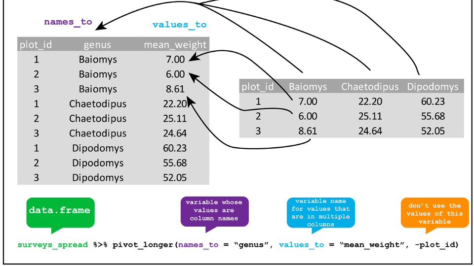
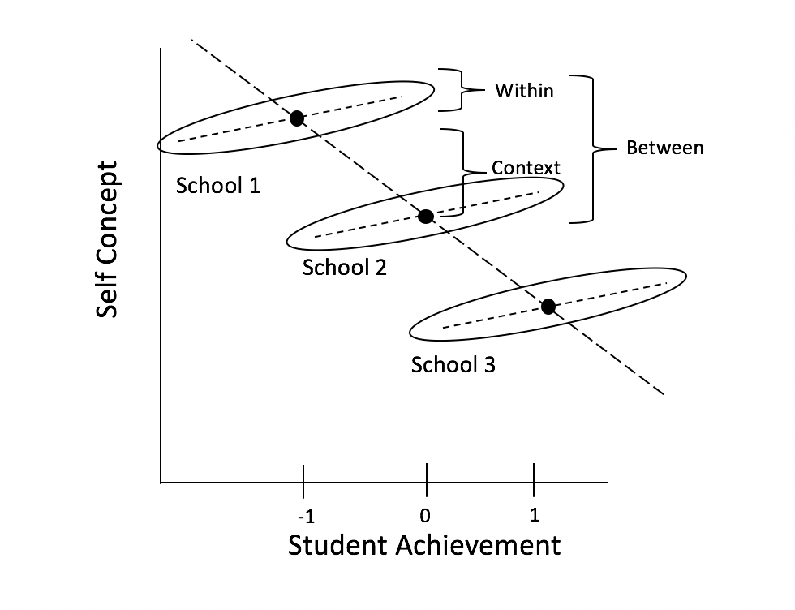
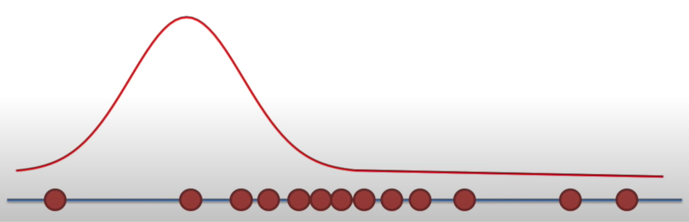
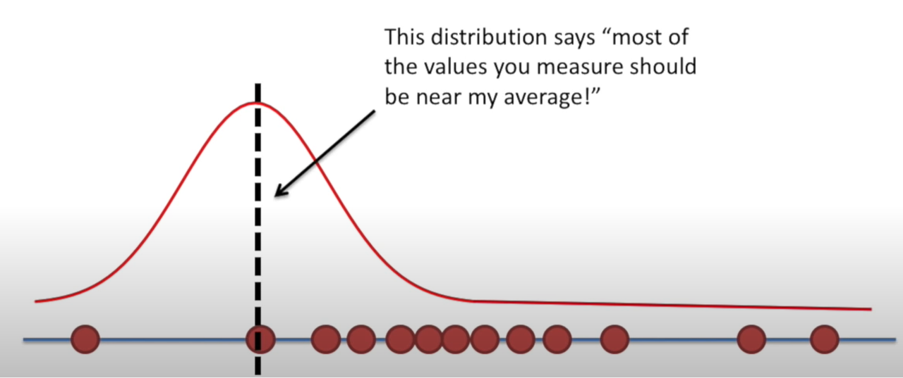
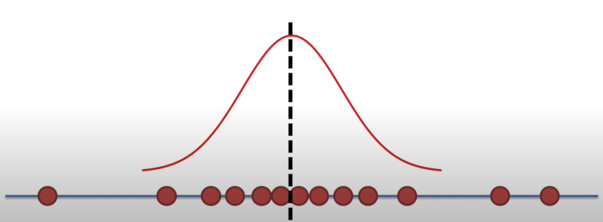
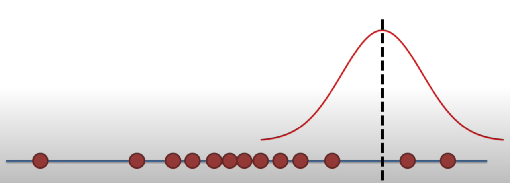
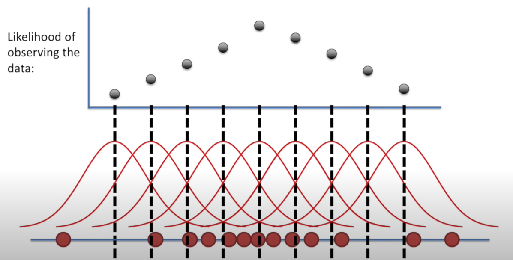

## Multilevel models

-   When to use them:

    -   Nested designs

    -   Repeated measures

    -   Longitudinal data

    -   Complex designs

-   Why use them:

    -   Captures variance occurring between groups and within groups

-   What they are:

    -   Linear model with extra residuals

## Today

-   Everything you need to know to run and report a MLM

    -   ICC and the null model
    -   Organizing data and centering
    -   Estimation
    -   Model building and crossed random effects
    -   Fit and interpret multilevel models
    -   Visualization and partial pooling
    -   Effect size
    -   Reporting
    -   Power and sample size
    -   Bridge to Bayesian

## Packages

```{r}
library(tidyverse) # data wrangling
library(knitr) # nice tables
library(lme4) # fit mixed models
library(lmerTest) # mixed models
library(broom.mixed) # tidy output of mixed models
library(afex) # fit mixed models for lrt test
library(emmeans) # marginal means
library(ggeffects) # marginal means
library(ggrain) # rain plots
library(easystats) # nice ecosystem of packages

options(scipen=999) # get rid of sci notation

```

-   Find the .qmd document here to follow along: <https://github.com/suyoghc/PSY504-Spring-2026/blob/main/posts/Multilevel%20Models/mlm_part2_students.qmd>

## Today's data

-   What did you say?

    -   Ps (*N* = 31) listened to *both* clear (NS) and 6 channel vocoded speech (V6)
        -   (<https://www.mrc-cbu.cam.ac.uk/personal/matt.davis/vocode/a1_6.wav>)
            -   Fixed factor: ?
            -   Random factor: ?
            -   What would change if we replicated this study?
            -   What would stay the same?

## Today's data

```{r}
eye  <- read_csv("data/vocoded_pupil.csv") # data for class

```

```{r}
#| echo: false
#| fig-align: "center"
#| 

eye %>% group_by(subject, vocoded) %>% summarise(mean_pupil=mean(mean_pupil)) %>% 
  ggplot(., aes(vocoded, mean_pupil, fill = vocoded)) +
  geom_rain(alpha = .5, id.long.var = "subject") +
  scale_fill_manual(values=c("dodgerblue", "darkorange")) +
  guides(fill = 'none', color = 'none') + 
  labs(y="Mean Pupil Size") + 
    theme_lucid(base_size=18)

```

## Data organization

-   Data Structure

    -   MLM analysis (in R) requires data in long format

{fig-align="center"}

## Data organization

-   Level 1: trial

-   Level 2: subject

```{r}
#| echo: false
head(eye) %>%
  select(-...1) %>%
  kable()
```

# The Null Model & ICC

## Null model (unconditional means)

Remember the ICC from the simulation app? Here's how to compute it from real data.

-   ICC is a standardized way of expressing how much variance is due to clustering/group
    -   Ranges from 0-1
-   Can also be interpreted as correlation among observations within cluster/group!
-   If ICC is sufficiently low (i.e., $\rho$ \< .1), then you don't have to use MLM! *BUT YOU PROBABLY SHOULD*

## Null model (unconditional means)

-   What does this formula say?

```{r}
library(lme4) # pop linear modeling package

null_model <- lmer(mean_pupil ~ (1|subject), data = eye, REML=TRUE)

summary(null_model)

```

## Calculating ICC

-   Run baseline (null) model

-   Get intercept variance and residual variance

$$\mathrm{ICC}=\frac{\text { between-group variability }}{\text { between-group variability+within-group variability}}$$

$$
ICC=\frac{\operatorname{Var}\left(u_{0 j}\right)}{\operatorname{Var}\left(u_{0 j}\right)+\operatorname{Var}\left(e_{i j}\right)}=\frac{\tau_{00}}{\tau_{00}+\sigma^{2}}
$$

```{r}
# easystats
#adjusted icc just random effects
#unadjusted fixed effects taken into account
performance::icc(null_model)

```

## Quick reminder

-   Fixed effects = model for the **means**

    -   "What is the average effect of vocoding on pupil size?"
    -   Centering changes what this coefficient estimates

-   Random effects = model for the **variance**

    -   "How much do subjects differ in their baseline? In their response?"
    -   Centering doesn't affect this

## Centering

::: columns
::: {.column width="50%"}
-   In a single-level regression, centering ensures that the zero value for each predictor is meaningful before running the model

-   In MLM, if you have specific questions about within, between, and contextual effects, you need to center!

-   But which mean?
:::

::: {.column width="50%"}


{fig-align="center"}
:::
:::

## Group- vs. Grand-Mean Centering

-   Grand-mean centering: $x_{ij} - x$

    -   Variable represents each observation's deviation from everyone's norm, regardless of group

-   Group-mean centering: $x_{ij} - x_j$

    -   Variable represents each observation's deviation from their group's norm (removes group effect)

## Group- vs. Grand-Mean Centering

::: columns
::: {.column width="50%"}
-   Level 1 predictors

    -   Grand-mean centering

        -   **Include means of level 2**
            -   Allows us to directly test within-group effect
            -   Coefficient associated with the Level 2 group mean represents **contextual effect**
:::

::: {.column width="50%"}
-   Group-mean centering

    -   Level 1 coefficient will always be with within-group effect, regardless of whether the group means are included at Level 2 or not
    -   If level 2 means included, coefficient represents the between-groups effect
:::
:::

::: callout-note
Can apply to categorical predictors as well (see Yaremych, Preacher, & Hedeker, 2023)
:::

## Centering in R

```{r, eval=FALSE}

# how to group mean center 
d <- d %>% 
  # Grand mean centering (CMC)
  mutate(iv.gmc = iv-mean(iv)) %>%
  # group  mean centering (more generally, centering within cluster)
  group_by(id) %>% 
  mutate(iv.cm = mean(iv),
         iv.cwc = iv-iv.cm)

library(datawizard) #easystats 

#data wizard way
x <- demean(x, select=c("x"), group="ID") #gets within-group and included cluster means

```

# Model Estimation

## Why not OLS?

{fig-align="center"}

-   Remember: ignoring group structure can reverse your conclusions
-   OLS has no way to account for groups — one error term for everything
-   MLE with random effects is the fix

## Maximum Likelihood

-   In MLM we try to maximize the likelihood of the data — no OLS!

-   We'll revisit likelihood in depth when we cover Bayesian inference — it's half of Bayes' theorem

## Likelihood

-   You've seen this in logistic regression and the Bayesian lecture: "Given our data, which parameter values are most plausible?"

-   MLM uses the same principle — but now searching over fixed effects AND variance components

Interactive: <https://rpsychologist.com/likelihood/>

## Log-Likelihood and Deviance

-   You know log-likelihood from logistic regression:

    -   Sum of log(scores) across observations — higher = better fit

-   **New: Deviance** = $-2 \times \log L$

    -   Converts log-likelihood into a scale where we can compare models
    -   Difference in deviance between two models $\approx \chi^2$ — gives us a p-value
    -   Known as the **likelihood ratio test (LRT)**

## Comparing nested models

-   Suppose there are two models:

    -   Reduced model includes predictors $x_1, \ldots, x_q$
    -   Full model includes predictors $x_1, \ldots, x_q, x_{q+1}, \ldots, x_p$

-   We want to test the hypotheses:

    -   $H_0$: smaller model is better

    -   $H_1$: Larger model is better

-   To do so, we will use the drop-in-deviance test (also known as the nested likelihood ratio test)

## Drop-In-Deviance Test

-   Hypotheses:

    -   $H_0$: smaller model is better

    -   $H_1$: Larger model is better

-   Test Statistic: $$G = (-2 \log L_{reduced}) - (-2 \log L_{full})$$

-   P-value: $P(\chi^2 > G)$:

    -   Calculated using a $\chi^2$ distribution
    -   df = $df_1$ - $df_2$

## Testing deviance

-   We can use the `anova` function to conduct this test

    -   Add test = "Chisq" to conduct the drop-in-deviance test

-   I like `test_likelihoodratio` from `easystats`

```{r, eval=FALSE}
anova(model1, model2, test="chisq")

# test using easystats function

test_likelihoodratio(model1, model2)

```

## Model fitting: ML or REML?

-   Two flavors of maximum likelihood

    -   Maximum Likelihood (ML or FIML)

        -   Jointly estimate the fixed effects and variance components using all the sample data

        -   Can be used to draw conclusions about fixed and random effects

        -   Issue:

            -   Results are biased because fixed effects are estimated without error

## Model fitting: ML or REML

-   Restricted Maximum Likelihood (REML)

    -   Estimates the variance components using the sample residuals not the sample data

    -   It is conditional on the fixed effects, so it accounts for uncertainty in fixed effects estimates

        -   This results in unbiased estimates of variance components
        -   Associated with error/penalty

## Model fitting: ML or REML?

-   Research has not determined one method absolutely superior to the other

-   **REML** (`REML = TRUE`; default in `lmer`) is preferable when:

    -   The number of parameters is large

    -   Primary objective is to obtain relaible estimates of the variance parameters

    -   For REML, likelihood ratio tests can only be used to draw conclusions about variance components

-   **ML** (`REML = FALSE`) <u>must</u> be used if you want to compare nested fixed effects models using a likelihood ratio test (e.g., a drop-in-deviance test)

## ML or REML?

-   What would we use if we wanted to compare the below models?

```{r eval=FALSE}

x= lmer(DV ~ IV1 + IV2 + (1|ID))

y= lmer(DV ~ IV1*IV2 + (1|ID))

```

## ML or REML?

-   What would we use if we wanted to compare the below models?

```{r eval=FALSE}

x = lmer(DV ~ IV1 + IV2 + (1+IV2|ID))

y = lmer(DV ~ IV1+ IV2 + (1|ID))

```

# Fitting and Interpreting Models

## Modeling approach

-   Forward/backward approach

```{webr-r}

```

-   `Keep it maximal`[^1]

    -   Whatever can vary, should vary

        -   **Decreases Type 1 error**

[^1]: Barr, D. J., Levy, R., Scheepers, C., & Tily, H. J. (2013). Random effects structure for confirmatory hypothesis testing: Keep it maximal. Journal of memory and language, 68(3), 10.1016/j.jml.2012.11.001. <https://doi.org/10.1016/j.jml.2012.11.001>

## The other side of the debate

-   Matuschek et al. (2017)[^2]: Maximal models can **substantially reduce power**

    -   In simulations, parsimonious models (retaining only variance components supported by data) achieved better power with acceptable Type I error

-   Field (Ch 19) advocates a **bottom-up** approach: start simple, add complexity

-   Both approaches are defensible — the key is being principled and transparent

[^2]: Matuschek, H., Kliegl, R., Vasishth, S., Baayen, H., & Bates, D. (2017). Balancing Type I error and power in linear mixed models. Journal of Memory and Language, 94, 305–315.

## Practical guidance

-   **"Keep it maximal"** = safest default for Type I error control

-   If convergence fails: principled simplification is good practice, not a failure

-   Singmann & Kellen (2019): Start maximal. If it doesn't converge, reduce transparently. Report what you did and why.

-   The key: **report your decisions** (which terms removed, why, in what order)

## Modeling approach: convergence

-   Full (maximal) model

    -   Only when there is convergence issues should you remove terms
        -   if non-convergence (pay attention to warning messages in summary output!):
            -   Try different optimizer (`afex::all_fit()`)
                -   Sort out random effects
                    -   Remove correlations between slopes and intercepts
                    -   Random slopes
                    -   Random Intercepts
                -   Sort out fixed effects (e.g., interaction)
                -   Once you arrive at the final model present it using REML estimation

## Modeling approach

-   If your model is singular (check output!!!!)

    -   Variance might be close to 0
    -   Perfect correlations (1 or -1)

-   Drop the parameter!

## Modeling approach

```{r}
data <- read.csv("data/heck2011.csv")

summary(lmer(math~ses + (1+ses|schcode), data=data))

```

. . .

```{r}
#| eval: false
#| 
lmer(math~ses + (1+ses||schcode), data=data) # removes correlation() with double pipes. Does not work with categorical variables
```

# Crossed Random Effects

## Crossed random effects

-   In Part 1 we saw **crossed designs** — here's how to fit them

-   Nested: $y_{ij} = \beta_0 + \beta_1 x_{ij} + U_{0j} + e_{ij}$

-   Crossed: $y_{ijk} = \beta_0 + \beta_1 x_{ijk} + U_{0j} + W_{0k} + e_{ijk}$

```{r}
#| eval: false
lmer(y ~ condition + (1|subject) + (1|item), data = d)
```

-   Just one extra random intercept term — $W_{0k}$ for items alongside $U_{0j}$ for subjects
-   $U_{0j}$ and $W_{0k}$ are assumed **independent** (any subject × item interaction → residual)
-   Replaces the old "F1 and F2" separate-analyses approach (Clark, 1973)

## When to use crossed random effects

-   Whenever you sample both **participants** AND **stimuli** (words, images, scenarios, etc.)

    -   Psycholinguistics, cognitive psych, social psych with vignettes
    -   Most experimental paradigms with stimulus sets

-   Note: crossed random effects increase model complexity

    -   Convergence issues are more likely here
    -   This is often where the maximal-vs-parsimonious debate becomes practical

## Maximal model: Fixed effect random intercepts (subject) and slopes (vocoded) model

```{r}

max_model <- lmer(mean_pupil ~vocoded +(1+vocoded|subject), data = eye)

summary(max_model)
```

## Fixed effects

-   Interpretation same as lm

```{r}
#grab the fixed effects
summary(max_model)
```

## Degrees of freedom and p-values

-   Degrees of freedom (denominator) and *p*-values can be assessed with several methods:

    -   ***Satterthwaite*** (default when install `lmerTest` and then run `lmer`)

    -   Asymptotic (Inf) (**default** behavior lme4)

    -   Kenward-Roger — **recommended for small samples** (more conservative; Singmann & Kellen, 2019)

## Random effects/variance components

-   Tells us how much variability there is around the fixed intercept/slope

    -   How much does the average pupil size change between participants

```{r}

summary(max_model)

```

## Random effects/variance components

-   Correlation between random intercepts and slopes

    -   Negative correlation

        -   Higher intercept (for normal speech) less of effect (lower slope)

```{r}
#| echo: false
#| fig-align: "center"
#| fig-width: 12
#| fig-height: 8
#| 
re = ranef(max_model)$subject # get random effects 

cor_test(re,  "vocodedV6", "(Intercept)")
```

## Visualize Random Effects

```{r}
#| fig-align: center
#| 
# use easystats to grab group variance
random <- estimate_grouplevel(max_model)

plot(random) + theme_lucid()
```

## What are you actually seeing?

-   These aren't raw subject means — they've been **pulled toward the grand mean**

-   Subjects with more extreme values → pulled more

-   Subjects with fewer observations → pulled more

-   This is called **shrinkage** or **partial pooling**

-   McElreath (2020): Models without this suffer "statistical amnesia" — they can't learn that what happened in one group is informative about other groups

## Why does this happen?

-   The assumption $U_{0j} \sim N(0, \sigma_{U_0})$ says: "subject effects are drawn from a common distribution"

-   This **IS** the mechanism — it regularizes extreme estimates toward the population mean

    -   More data for a subject → estimate stays closer to raw mean
    -   Less data → estimate pulled more toward grand mean

-   We'll see this much more clearly in the Bayesian framework — where it becomes a visible **prior**

## Model comparisons

-   Can compare models using `anova` function or `test_likelihoodratio` from `easystats`

    -   *Will be refit using ML if interested in fixed effects*

```{r}
# you try
```

# AIC/BIC

-   LRT requires nested models

## AIC

-   AIC:

$$
D + 2p
$$

-   where d = deviance and p = \# of parameters in model

-   Can compare AICs[^3]:

    $$
     \Delta_i = AIC_{i} - AIC_{min}
    $$

-   Less than 2: More parsimonious model is preferred

-   Between 4 and 7: some evidence for lower AIC model

-   Greater than 10,: strong evidence for lower AIC

[^3]: BURNHAM, ANDERSON, & HUYVAERT (2011)

## BIC

-   BIC:

$$
D + ln(n)*p
$$

-   where d = deviance, p = \# of parameters in model, n = sample size

-   Change in BIC:

    -   $\Delta{BIC}$ \<= 2 (No difference)

    -   $\Delta{BIC}$ \> 3 (evidence for smaller BIC model)

## AIC/BIC

```{r}

performance::model_performance(max_model) %>% # easystats
  kable()

```

## Hypothesis testing

-   Multiple options

    1.  t/F tests with approximate degrees of freedom (Kenward-Rogers or Satterwaithe)
    2.  Parametric bootstrap
    3.  **Likelihood ratio test (LRT)**

    -   Can be interpreted as main effects and interactions
    -   Use `afex` package to do that

## Hypothesis testing - `afex`

```{r}
library(afex) # load afex in 

m <- mixed(mean_pupil ~ 1 + vocoded +  (1+vocoded|subject), data =eye, method = "LRT") # fit lmer using afex

nice(m) %>%
  kable()
```

## Using `emmeans`

-   Get means and contrasts

```{r}

library(emmeans) # get marginal means 

emmeans(max_model, specs = "vocoded") %>% 
  kable() # grabs means/SEs for each level of vocode 

pairs(emmeans(max_model, specs = "vocoded")) %>%
  confint() %>%
  kable()
# use this to get pariwise compairsons between levels of factors
```

# Assumptions

## Check assumptions

::: columns
::: {.column width="50%"}
-   Linearity

-   Normality

    -   Level 1 residuals are normally distributed around zero

    -   Level 2 residuals are multivariate-normal with a mean of zero

-   Homoskedacticity

    -   Level 1/Level 2 predictors and residuals are homoskedastic
:::

::: {.column width="50%"}
-   Collinearity

-   Outliers
:::
:::

## Assumptions

```{r}
#| fig-align: "center"
#| 
library(easystats) # performance package

check_model(max_model)
```

## Visualization

```{r}
#| echo: false

pupil_data_mean <- eye %>%
  group_by(subject, vocoded) %>%
  summarise(mean_pup=mean(mean_pupil, na.rm=TRUE)) %>% 
  ungroup()

mod_plot <- max_model %>%
  estimate_means("vocoded") %>%
  as.data.frame()

pupil_plot_lmer <- ggplot(pupil_data_mean, aes(x = vocoded, y = mean_pup)) +     
  geom_violinhalf(aes(fill = vocoded), color = "white") +
  geom_jitter2(width = 0.05, alpha = 0.5, size=5) +  # Add pointrange and line from means
  geom_line(aes(y=mean_pup, group=subject))+
  geom_line(data = mod_plot, aes(y = Mean, group = 1), size = 3, color="purple") +
  geom_pointrange(
    data = mod_plot,
    aes(y = Mean, ymin = CI_low, ymax = CI_high),
    size = 2,
    color = "purple"
  ) + 
  # Improve colors
  scale_fill_material() +
  theme_modern() + 
  ggtitle("Pupil Effect", subtitle = "White dots represent model mean and error bars represent 95% CIs. Black dots are group level means for each person")

pupil_plot_lmer

```

## `ggeffects`

```{r}
#| fig-align: "center"

ggemmeans(max_model, terms=c("vocoded")) %>% plot()
```

## Effect size

-   Report pseudo-$R^2$ for marginal (fixed) and conditional model (full model) (Nakagawa et al. 2017)

$$
R^2_{LMM(c)} = \frac{\sigma_f^2\text{fixed} + \sigma_a^2\text{random}}{\sigma_f^2\text{fixed} + \sigma_a^2\text{random} + \sigma_e^2\text{residual}}
$$

$$
R^2_{\text{LMM}(m)} = \frac{\sigma_f^2\text{fixed}}{\sigma_f^2\text{fixed} + \sigma_a^2\text{random} + \sigma_e^2\text{residual}}
$$

-   Report semi-partial $R^2$ for each predictor variable
    -   $R^2_\beta$
        -   `partR2` package in R does this for you

## Effect size

```{r}

#get r2 for model with performance from easystats

performance::r2(max_model) 


```

```{r}
#| eval: false
#| 

# get semi-part
library(partR2)
# does not work with random slopes for some reason :/
R2_3 <- partR2(max_model,data=eye, 
  partvars = c("vocoded"),
  R2_type = "marginal", nboot = 10, CI = 0.95
)
```

## Effect size

-   Cohen's $d$ for treatment effects/categorical predictions[^4]

[^4]: Brysbaert, M., & Debeer, D. (2023, September 12). How to run linear mixed effects analysis for pairwise comparisons? A tutorial and a proposal for the calculation of standardized effect sizes. <https://doi.org/10.31234/osf.io/esnku>

$$
d = \frac{\text{Effect}}{\sqrt{\sigma^2_\text{Intercept} + \sigma^2_\text{slope} + \sigma^2_\text{residual}}}
$$

```{r}

emmeans(max_model,~ vocoded) %>% 
 eff_size(.,sigma=.04, edf=30) # need to calcuate sigma and add dfs

```

# Reporting Results

## Describing a MLM analysis - Structure

-   What was the nested data structure (e.g., how many levels; what were the units at each level?)

    • How many units were in each level, on average?

    • What was the range of the number of lower-level units in each group/cluster?

## Describing a MLM analysis - Model

::: columns
::: {.column width="50%"}
-   What equation can best represent your model?

-   What estimation method was used (e.g., ML, REML)?

-   If there were convergence issues, how was this addressed?

-   What software (and version) was used (when using R, what packages as well)?
:::

::: {.column width="50%"}
-   If degrees of freedom were used, what kind?

-   What type of models were estimated (i.e., unconditional, random intercept, random slope, max)?

-   What variables were centered and what kind of centering was used?

-   What model assumptions were checked and what were the results?
:::
:::

## Describing a MLM analysis - Results

::: columns
::: {.column width="50%"}
-   What was the ICC of the outcome variable?

-   Are fixed effects and variance components reported?

-   What inferential statistics were used (e.g., t-statistics, LRTs)?

-   How precise were the results (report the standard errors and/or confidence intervals)?
:::

::: {.column width="50%"}
-   Were model comparisons performed (e.g., AIC, BIC, if using an LRT,report the χ2, degrees of freedom, and p value)?

-   Were effect sizes reported for overall model and individual predictors (e.g., Cohen’s d, $R^2$ )?
:::
:::

## Write-up

```{r}
#| eval: false
report::report(max_model) # easystats report function
```

`r report(max_model)`

## Table

```{r}
modelsummary::modelsummary(list("max model" = max_model), output="html") # modelsummary package
```

## Power

-   Simulation-based power analyses

    -   Simulate new data

        -   `faux` (<https://scienceverse.github.io/faux/articles/sim_mixed.html>)

    -   Use pilot data (what I would do)

        -   `mixedpower` (<https://link.springer.com/article/10.3758/s13428-021-01546-0>)
        -   `simr` (<https://besjournals.onlinelibrary.wiley.com/doi/full/10.1111/2041-210X.12504>)

## The number one power insight

-   Number of **Level 2 units** (clusters/groups) matters MORE than observations per cluster

-   "500 observations in 8 schools" → poor power for school-level effects

-   "200 observations across 40 schools" → much better

-   Rule of thumb: aim for **20-30+ Level 2 units** minimum (Kreft, 1996)

-   Adding more observations within clusters has **diminishing returns** for between-cluster power

## Planning your study

-   Increase the **number of groups/clusters FIRST**, then observations per group

-   Use simulation tools (`faux`, `simr`) to verify power for YOUR specific design

-   Power depends on: number of clusters, cluster size, ICC, effect size, random effects structure

# Wrapping Up

## What we've built

-   The frequentist MLM toolkit: **specify → fit → interpret → test → report**

-   You can handle: nested data, repeated measures, unbalanced designs, crossed random effects

-   Tools: `lme4` + `lmerTest` + `afex` + `emmeans` + `easystats`

## Limitations we encountered

-   **Convergence issues** — some models just won't fit (especially with complex random effects)

-   **Boundary problems** — variance estimates stuck at zero (singular fits)

-   **The p-value debates** — Satterthwaite vs KR vs LRT, and none are exact

-   **Point estimates only** — no full distribution of uncertainty for parameters

-   Can't easily make probability statements: *"There is a 95% probability that..."*

## Coming up: Bayesian regression

-   The models and formula syntax carry over — the inference framework changes

-   `brm(y ~ x + (1|group))` instead of `lmer(y ~ x + (1|group))`

-   Some of these limitations become much easier — or disappear entirely

-   And the partial pooling / shrinkage we saw today? It becomes beautifully visible.

# Appendix {visibility="uncounted"}

## Likelihood visualizations

```{r, echo=FALSE, fig.align='center', out.width="100%"}

```

## Likelihood visualizations

```{r, echo=FALSE, fig.align='center', out.width="100%"}

```

## Likelihood visualizations

```{r, echo=FALSE, fig.align='center', out.width="100%"}

```

## Likelihood visualizations

```{r, echo=FALSE, fig.align='center', out.width="100%"}

```

## Likelihood visualizations

```{r, echo=FALSE, fig.align='center', out.width="100%"}

```

## $\chi^2$ distribution

```{r, echo=F, fig.height = 6, fig.align='center'}
x <- seq(from = 0, to = 10, length = 100)
y_1 <- dchisq(x, 1)
y_2 <- dchisq(x, 2)
y_3 <- dchisq(x, 3)
y_4 <- dchisq(x, 5)
plot(x, y_1, col = 1, type = "l", ylab = "", lwd = 3, ylim = c(0, 0.5),
     main = "Chi-square Distribution")
lines(x, y_2, col = 2, lwd = 3)
lines(x, y_3, col = 3, lwd = 3)
lines(x, y_4, col = 4, lwd = 3)
legend("topright",
       c("df = 1", "df = 2 ", "df = 3", "df = 5"),
       col = c(1, 2, 3, 4), lty = 1)
```
