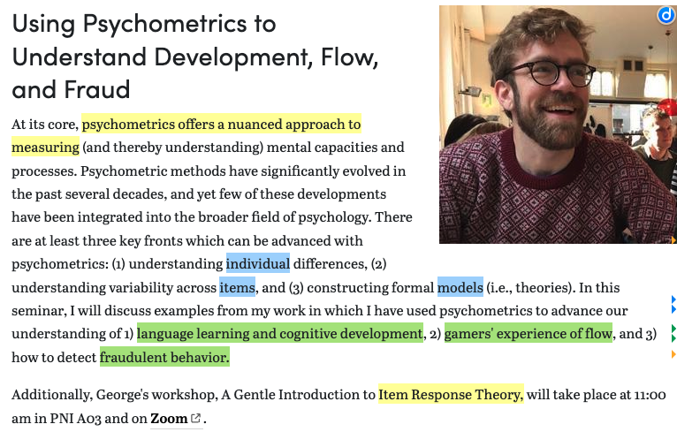

## Packages

```{r}
library(tidyverse)
library(easystats)
library(marginaleffects)
library(effects)
library(ordinal)
library(nnet)
library(ggeffects)
library(emmeans)
library(car)
library(knitr)
library(patchwork)
library(MASS)
library(broom)
library(modelsummary)

options(scipen = 999)
```

-   Access the .qmd document here: <https://github.com/suyoghc/PSY504_Spring_2026/tree/main/posts>

::: notes
-   **New package today — nnet.**

<!-- -->

-   **It contains the main function that we will be using to build multinomial regression models! It ships with base R. Just load it.**

<!-- -->

-   **Nnet stands for neural nets!**

<!-- -->

-   **There is a connection between the 2: A single-layer neural net with softmax output is just multinomial logistic regression wearing a different hat!**
:::

## Today

::::: columns
::: {.column width="50%"}
-   From ordinal to multinomial

-   A motivating simulation: Career roulette

    -   Why ordinal regression breaks
    -   Category-specific slopes
    -   The softmax / baseline-category idea
:::

::: {.column width="50%"}
-   Application: NHANES health ratings

    -   Model fitting with `nnet::multinom()`
    -   Parameter interpretation
    -   Model comparisons
    -   Visualizing predicted probabilities
    -   Reporting
:::
:::::

::: notes
-   **starting off similar to logistic regression, and ordinal regression,**

-   **with a simple example to build intuition about what's going on under the hood with multinomial regression.**

-   **Logistic: Binary outcomes (biased coin).**

-   **Ordinal: Loaded dice.**

-   **The career roulette simulation is our loaded dice equivalent.**

-   **Second half is the NHANES application.**
:::

## Last week: Ordinal regression

-   Ordered outcomes: Low \< Medium \< High

-   We modeled **cumulative probabilities** $P(Y \leq k)$ using the logit link

::: notes
-   **Two weeks ago — binary logistic. Yes/no, pass/fail.**

-   **Last time we extended that to ordered categories. The key move was cumulative probabilities — P of Y less than or equal to k.**
:::

. . .

$$\text{logit}\big(P(Y \leq k)\big) = \alpha_k - \beta X$$

::: notes
*Quick recap. Two weeks ago — binary logistic. Yes/no, pass/fail. Last time we extended that to ordered categories. The key move was cumulative probabilities — P of Y less than or equal to k.*

**Alpha-k are thresholds, beta is the slope.**
:::

. . .

-   We assumed one shared slope (β) — the proportional odds assumption.\
    (to keep things simple)

::: notes
*Quick recap. Two weeks ago — binary logistic. Yes/no, pass/fail. Last time we extended that to ordered categories. The key move was cumulative probabilities — P of Y less than or equal to k.*

*Here's the equation. Same one from last time. Alpha-k are thresholds, beta is the slope.*

**constraint — proportional odds.\
\
One shared slope across all cumulative splits. K minus 1 thresholds but only one beta. That's what made it parsimonious.**
:::

. . .

::: callout-note
Today: What happens when your outcome categories have **no natural ordering**?
:::

::: notes
**Now we relax that entirely. What if the categories don't have an order at all?**
:::

## Ordinal response variables (recap)

-   Last time we saw outcomes with a clear ranking

    -   Graduate school likelihood: unlikely \< somewhat likely \< very likely
    -   Loaded dice: Low \< Medium \< High
    -   Health status: poor \< fair \< good \< excellent

::: notes
-   **These are all from last lecture and the lab. Grad school likelihood — our real data application. Loaded dice — our simulation. Health status — your chapter reading. In every case, there's a clear ordering. "Unlikely" is less than "somewhat likely" is less than "very likely."**
:::

. . .

-   Cumulative splits made sense because the categories *stack*

::: notes
*These are all from last lecture and the lab. Grad school likelihood — our real data application. Loaded dice — our simulation. Health status — your chapter reading. In every case, there's a clear ordering. "Unlikely" is less than "somewhat likely" is less than "very likely."*

**Cumulative splits respect that stacking — P of Y less than or equal to k. But what happens when you can't stack?**
:::

## But not everything is ordered

::::: columns
::: {.column width="50%"}
**Ordered** (ordinal regression)

-   Pain severity: mild \< moderate \< severe
-   Agreement: disagree \< neutral \< agree
-   Grades: C \< B \< A
:::

::: {.column width="50%"}
**Unordered** (??? regression)

-   Political party: Democrat, Republican, Independent
-   Study strategy: space, light cram, heavy cram
-   Therapy type: CBT, DBT, psychodynamic
:::
:::::

::: notes
-   **There's a direction, a ladder.**

-   **These are just... different.**
:::

. . .

::: callout-warning
## The problem

Can you say Democrat \< Republican \< Independent? Is CBT \< DBT \< psychodynamic?

There's no meaningful way to rank these. Cumulative splits don't make sense.
:::

::: notes
-   **Can you say Democrat is less than Republican? Is CBT less than psychodynamic?**

<!-- -->

-   **If there's no ranking, you can't do cumulative splits.**

```         
-   **P of Y less than or equal to Republican doesn't mean anything.**
```
:::

## Liu Ch 7 reading

Liu uses **health status** (poor, fair, good, excellent) as the outcome.

::: notes
**Liu uses health status — poor, fair, good, excellent — as the outcome in a multinomial model.**
:::

. . .

Isn't that ordinal?!

::: notes
*So here's a fun tension from your reading. Liu uses health status — poor, fair, good, excellent — as the outcome in a multinomial model.*

**But wait. We literally just spent an entire lecture modeling that kind of variable with ordinal regression. So why is Liu using multinomial?**
:::

. . .

Liu explicitly acknowledges this:

> *"Although the multinomial logistic regression model is normally used to estimate nominal response variables, it is an alternative to estimate ordinal response variables when the proportional odds assumption is violated."*

::: notes
**Multinomial is an alternative when proportional odds doesn't hold.**
:::

. . .

::: callout-note
Two reasons to use multinomial regression:

1.  The outcome is **genuinely unordered** (party affiliation, therapy choice)
2.  The outcome is ordinal but **proportional odds fails** (fallback option)

Today we focus on reason 1 — the outcome truly has no order.
:::

::: notes
**But I want to be clear. That's reason two — the fallback. The stronger reason is reason one: the outcome is genuinely unordered. That's where multinomial isn't just a fallback — it's the correct choice. That's our focus today.**

Remember: if proportional odds fails for only some predictors, **partial proportional odds** is the first thing to try. Multinomial is the nuclear option — it drops **all** ordering information.
:::

<!-- . . . -->

<!-- ::: callout-warning -->

<!-- ## Before you reach for multinomial... -->

<!-- Remember: if proportional odds fails for only some predictors, **partial proportional odds** is the first thing to try. Multinomial is the nuclear option — it drops **all** ordering information. -->

<!-- ::: -->

## What goes wrong if we force an order? {.smaller}

Imagine 3 career paths — **academia**, **industry**, **government**, and 1 predictor, years of work experience.

::: notes
**Let's make this concrete. Three career paths — academia, industry, government. One predictor — years of work experience.**
:::

. . .

-   Experience pushes people *toward* industry and *away from* academia, but has little effect on government

-   There's no natural ordering: academia is not "less than" government

::: notes
*Let's make this concrete. Three career paths — academia, industry, government. One predictor — years of work experience.*

**Here's the truth we'll bake into the simulation: experience pushes people toward industry and away from academia. Government stays roughly flat. And there's no natural ordering — academia isn't "less than" government.**
:::

. . .

**If we force an ordering** (academia = 1, government = 2, industry = 3) and fit an ordinal model:

::: notes
*Let's make this concrete. Three career paths — academia, industry, government. One predictor — years of work experience.*

*Here's the truth we'll bake into the simulation: experience pushes people toward industry and away from academia. Government stays roughly flat. And there's no natural ordering — academia isn't "less than" government.*

**But what if we forced one anyway? Code academia as 1, government as 2, industry as 3. Run an ordinal model.**
:::

. . .

-   The model assumes one shared slope — but the true effect is **different for each category**
-   Proportional odds is violated by design
-   The single slope averages over contradictory effects

::: notes
**The ordinal model estimates one shared slope. But the true effect is contradictory — experience increases industry odds and decreases academia odds. One slope averages them into mush. Proportional odds is violated by design.**
:::

. . .

::: callout-important
## The key difference

Ordinal regression: **K − 1 thresholds, 1 slope** per predictor (shared across splits)

Multinomial regression: **K − 1 intercepts, K − 1 slopes** per predictor (each category gets its own)
:::

::: notes
*Let's make this concrete. Three career paths — academia, industry, government. One predictor — years of work experience.*

*Here's the truth we'll bake into the simulation: experience pushes people toward industry and away from academia. Government stays roughly flat. And there's no natural ordering — academia isn't "less than" government.*

*But what if we forced one anyway? Code academia as 1, government as 2, industry as 3. Run an ordinal model.*

*The ordinal model estimates one shared slope. But the true effect is contradictory — experience increases industry odds and decreases academia odds. One slope averages them into mush. Proportional odds is violated by design.*

**And that's the key difference. Ordinal: K minus 1 thresholds, one slope. Multinomial: K minus 1 intercepts, K minus 1 slopes. Each category gets its own. That extra flexibility is exactly what you need when effects go in different directions.**
:::

## The connection across models {.smaller}

$$\begin{array}{lll}
\textbf{Logistic} & \text{2 categories} & \text{1 intercept, 1 slope} \\[6pt]
\textbf{Ordinal} & \text{K ordered categories} & \text{K−1 thresholds, } \mathbf{1} \text{ slope (shared)} \\[6pt]
\textbf{Multinomial} & \text{K unordered categories} & \text{K−1 intercepts, } \mathbf{K−1} \text{ slopes (category-specific)}
\end{array}$$

::: notes
**Here's the whole arc in one slide. Logistic — two categories, one intercept, one slope. That was week one. Ordinal — K ordered categories, K minus 1 thresholds, but still just one slope. That's the proportional odds constraint. And now multinomial — K unordered categories, K minus 1 intercepts, K minus 1 slopes.**
:::

. . .

::::: columns
::: {.column width="50%"}
**Ordinal** (last time)

$$\begin{aligned}
L_1 &= \alpha_1 - \beta x \\
L_2 &= \alpha_2 - \beta x \\
L_{K-1} &= \alpha_{K-1} - \beta x
\end{aligned}$$

Same $\beta$ everywhere — proportional odds
:::

::: {.column width="50%"}
**Multinomial** (today)

$$\begin{aligned}
L_1 &= \alpha_1 + \beta_1 x \\
L_2 &= \alpha_2 + \beta_2 x \\
L_{K-1} &= \alpha_{K-1} + \beta_{K-1} x
\end{aligned}$$

Each category gets its **own** $\beta_j$
:::
:::::

::: notes
*Here's the whole arc in one slide. Logistic — two categories, one intercept, one slope. That was week one. Ordinal — K ordered categories, K minus 1 thresholds, but still just one slope. That's the proportional odds constraint. And now multinomial — K unordered categories, K minus 1 intercepts, K minus 1 slopes.*

**Look at the equations side by side. On the left, ordinal — same beta everywhere. On the right, multinomial — beta-1, beta-2, beta-K-minus-1. Every category gets its own relationship with the predictor. That's the one structural change. Everything else — the logit link, maximum likelihood, the log-odds interpretation — stays the same. We're just relaxing the shared-slope constraint.**
:::

## Multinomial logistic regression {.smaller}

-   Choose a **baseline category** (reference). All comparisons are relative to it.

::: notes
**Here's the formal setup. Pick one category as the baseline — the reference. Every other category gets compared to it.**
:::

. . .

-   If the outcome has $K$ categories and the baseline is category $K$, we model $K - 1$ log-odds:

$$\log\bigg(\frac{P(Y = j)}{P(Y = K)}\bigg) = \beta_{0j} + \beta_{1j} x_1 + \cdots + \beta_{pj} x_p$$

for $j = 1, 2, \ldots, K-1$

::: notes
*Here's the formal setup. Pick one category as the baseline — the reference. Every other category gets compared to it.*

**If you have K categories, you write K minus 1 log-odds equations. Each one looks like a logistic regression. But notice the subscript j on every beta — each equation has its own coefficients.**

**category-specific log-odds relative to a baseline**
:::

. . .

-   Each equation is its own logistic regression — but they're estimated **simultaneously**

-   The chapter calls these `log(mu[,2]/mu[,1])`, `log(mu[,3]/mu[,1])`, etc.

::: notes
*Here's the formal setup. Pick one category as the baseline — the reference. Every other category gets compared to it.*

*If you have K categories, you write K minus 1 log-odds equations. Each one looks like a logistic regression. But notice the subscript j on every beta — each equation has its own coefficients.*

**They're estimated simultaneously, not independently. The model sees all the data at once. The chapter notation — log of mu 2 over mu 1, log of mu 3 over mu 1 — that's exactly this. Mu 1 is the baseline.**
:::

. . .

::: callout-tip
## Interpretation

$\beta_{1j}$: when $x_1$ increases by one unit, the log-odds of being in category $j$ **vs. the baseline** change by $\beta_{1j}$

$\exp(\beta_{1j})$: the **odds ratio** — the multiplicative change in odds of category $j$ vs. baseline
:::

::: notes
*Here's the formal setup. Pick one category as the baseline — the reference. Every other category gets compared to it.*

*If you have K categories, you write K minus 1 log-odds equations. Each one looks like a logistic regression. But notice the subscript j on every beta — each equation has its own coefficients.*

*They're estimated simultaneously, not independently. The model sees all the data at once. The chapter notation — log of mu 2 over mu 1, log of mu 3 over mu 1 — that's exactly this. Mu 1 is the baseline.*

**Interpretation. Beta-1-j is the change in log-odds of category j versus baseline when x goes up by one. Exponentiate and you get the odds ratio. Same as logistic regression, just specific to one comparison.**
:::

## Multinomial distribution

-   Extension of Bernoulli and binomial distributions

-   When you have more than two outcomes and fixed number of trials

$$P(X_1 = x_1, X_2 = x_2, \ldots, X_k = x_k) = \frac{n!}{x_1! x_2! \cdots x_k!} p_1^{x_1} p_2^{x_2} \cdots p_k^{x_k}$$

-   $X$ = \# of times events occur
-   $p$ = probability of occurrence
-   $n$ = \# of trials

$$\text{Mean of } X_i = E[X_i] = n \cdot p_i$$$$\text{Variance of } X_i = \text{Var}(X_i) = n \cdot p_i \cdot (1 - p_i)$$

## Multinomial Logistic Regression

-   In ordinal regression:

$$\begin{array}{rcl} L_1 &=& \alpha_1-\beta_1x_1-\cdots-\beta_p X_p\\ L_2 &=& \alpha_2-\beta_1x_1-\cdots-\beta_p X_p & \\ L_{J-1} &=& \alpha_{J-1}-\beta_1x_1-\cdots-\beta_p X_p \end{array}$$

-   In the multinomial logistic model:

$$\begin{array}{rcl} L_1 &=& \alpha_1+\beta_1x_1+\cdots+\beta_p X_p\\ L_2 &=& \alpha_2+\beta_2x_1+\cdots+\beta_p X_p & \\ L_{J-1} &=& \alpha_{J-1}+\beta_jx_1+\cdots+\beta_p X_p \end{array}$$

## Multinomial logistic regression

-   Choose a baseline category. Let's choose $y=0$. Then,

$$P(y_i = 0|x_i) = P_{i0}$$ and $$P(y_i = 1|x_i) = P_{i1}$$

$$\log\bigg(\frac{p_{i1}}{p_{i0}}\bigg) = \beta_{0k} + \beta_{1k} x_i$$

-   Slope: $\beta_1$: when x increases by one unit, the odds of Y = 1 vs. baseline is expected to multiply by a factor or $exp(\beta)$

-   Intercept: $\beta_0$: when x = 0 the odds of Y = 1 is expected to be $exp(\beta)$

## Think of it as simultaneous binary regressions

```{r}
#| echo: false
#| fig-width: 10
#| fig-height: 3.5

library(ggplot2)
library(patchwork)

# Create illustrative data
set.seed(504)
n <- 200
x <- runif(n, 0, 10)

# Three binary comparisons vs baseline
p1 <- tibble(x = x, 
             p = plogis(-1 + 0.3 * x)) %>%
  ggplot(aes(x, p)) +
  geom_line(color = "#d63031", linewidth = 1.5) +
  labs(title = "Category 2 vs. 1", 
       y = "P(Y=2) / P(Y=1)", x = "Predictor") +
  ylim(0, 1) +
  theme_minimal(base_size = 14)

p2 <- tibble(x = x, 
             p = plogis(-2 + 0.5 * x)) %>%
  ggplot(aes(x, p)) +
  geom_line(color = "#0984e3", linewidth = 1.5) +
  labs(title = "Category 3 vs. 1", 
       y = "P(Y=3) / P(Y=1)", x = "Predictor") +
  ylim(0, 1) +
  theme_minimal(base_size = 14)

p3 <- tibble(x = x, 
             p = plogis(0.5 - 0.1 * x)) %>%
  ggplot(aes(x, p)) +
  geom_line(color = "#00b894", linewidth = 1.5) +
  labs(title = "Category 4 vs. 1", 
       y = "P(Y=4) / P(Y=1)", x = "Predictor") +
  ylim(0, 1) +
  theme_minimal(base_size = 14)

p1 + p2 + p3
```

::: notes
**Three panels, three comparisons — all versus baseline category 1. Look at the slopes. Red — category 2 vs. 1, positive slope, predictor pushes odds up. Blue — category 3 vs. 1, even steeper. Green — category 4 vs. 1, slightly negative. Predictor pushes you away from this one.**
:::

. . .

Each comparison has its **own intercept and slope**. The predictor can push *toward* one category and *away from* another — something ordinal regression cannot do.

::: notes
*Three panels, three comparisons — all versus baseline category 1. Look at the slopes. Red — category 2 vs. 1, positive slope, predictor pushes odds up. Blue — category 3 vs. 1, even steeper. Green — category 4 vs. 1, slightly negative. Predictor pushes you away from this one.*

**This is what ordinal regression cannot do. One slope can't go up for some categories and down for others. Here, each comparison is free to go its own direction. That's the whole point of multinomial.**
:::

# Under the Hood: Career Roulette

## The career roulette {.center}

Easier to understand multinomial regression if we **simulate it from scratch** and watch each step.

::: notes
**That's the conceptual setup. You know why multinomial exists — unordered categories need category-specific slopes. You know the equation — K minus 1 log-odds comparisons to a baseline.**
:::

. . .

Just like our loaded dice helped us understand ordinal regression.

::: notes
*That's the conceptual setup. You know why multinomial exists — unordered categories need category-specific slopes. You know the equation — K minus 1 log-odds comparisons to a baseline.*

**Now let's build it from scratch. Same philosophy as the loaded dice — set true parameters, generate data, see if the model recovers what we planted. Except instead of dice landing on Low, Medium, High — we have people choosing careers.**
:::

```{=html}
<!-- 
============================================================
  END OF PHASE 1 — PHASE 2 (simulation) begins here
============================================================
-->
```

```{=html}
<!-- 
============================================================
  PHASE 2: Career Roulette Simulation
  Picks up after the "Career roulette" transition slide
  from Phase 1 (line 512 of phase1_multinomial_slides.qmd)
============================================================
-->
```

## The DGP: Career paths {.smaller}

300 people choosing among **3 careers** based on years of work experience.

```{r}
#| echo: true

set.seed(504)

n <- 300
experience <- runif(n, 0, 20)

# ── TRUE PARAMETERS (log-odds vs. Government baseline) ──
b0_acad <- 1.0;  b1_acad <- -0.15   # academia: popular early, fades
b0_ind  <- -0.5; b1_ind  <-  0.20   # industry: unpopular early, rises

# Linear predictors (Government is reference. Fixed at 0)
score_govt <- rep(0, n)
score_acad <- b0_acad + b1_acad * experience
score_ind  <- b0_ind  + b1_ind  * experience
```

::: notes
**Here's our data generating process.**

-   SELECT

    -   **Three hundred people, each with some years of work experience drawn uniformly from 0 to 20.**

-   **They choose one of three careers — academia, industry, or government.**

    -   **The key: government is our reference category, so its score is fixed at zero.**

        -   **Academia and industry each get their own intercept and their own slope.**
:::

. . .

::: callout-note
## The truth we're planting

-   **Academia vs. Government**: intercept = 1.0, slope = **−0.15** (experience pulls *away*)
    -   The **intercept** says: *at 0 years of experience, how attractive is this category relative to Government?*
        -   The **slope** says: *as experience increases, does this category become more or less attractive relative to Government?*
-   **Industry vs. Government**: intercept = −0.5, slope = **+0.20** (experience pushes *toward*)
-   **Government**: baseline (score = 0 by definition)
:::

::: notes
**Look at the slopes —**

-   **they go in opposite directions.**

    -   **More experience pushes you away from academia and toward industry.**

    -   We are literally setting different slopes and generating data

        -   **That's why ordinal regression can't work here.**

        -   **One slope can't be both negative and positive.**
:::

## Softmax in action {.smaller}

How do linear predictors become probabilities? Take one person with **experience = 5 years**:

::: notes
**Before we generate the full dataset, let's see what actually happens here?**

“here is the formula for softmax

“here is how the model becomes a stochastic data-generating process”

-   We've done something like thist wice already

    -   in logistic regression, we took a (1) log-odds score into a probability. plogis

        -   That was softmax with two categories.

        -   you applied plogis to each threshold to get cumulative probabilities, then subtracted to get category probabilities.

    -   **Now we have three categories** competing for probability

        -   so the denominator gets bigger.

        -   It's the same idea, now with more players.**\
            **

<!-- -->

-   **1) How does the model turn linear predictors into probabilities?**

    -   **Let's pick one person with five years of experience and trace every step.**
:::

. . .

**Step 1**: Compute scores

$$\text{score}_{\text{acad}} = 1.0 + (-0.15)(5) = 0.25 \qquad \text{score}_{\text{ind}} = -0.5 + (0.20)(5) = 0.50 \qquad \text{score}_{\text{govt}} = 0$$

::: notes
-   **Step one**

    -   **plug experience into the linear predictors.**

        -   **Academia gets 0.25, industry gets 0.50, government is zero by definition.**

        -   [**These are log-odds-scale scores**]{.underline}**.**

            -   **Not probabilities yet.**

-   <div>

    > “These scores are the category-specific log-odds relative to Government; softmax turns them into probabilities.”

    </div>
:::

. . .

**Step 2**: Exponentiate → **Step 3**: Normalize (divide by sum)

$$p_k = \frac{\exp(\text{score}_k)}{\sum_j \exp(\text{score}_j)} \quad \Rightarrow \quad p_{\text{acad}} = \frac{e^{0.25}}{e^{0.25} + e^{0.50} + e^{0}} = \frac{1.28}{3.93} = 0.33$$

$$p_{\text{ind}} = \frac{1.65}{3.93} = 0.42 \qquad p_{\text{govt}} = \frac{1.00}{3.93} = 0.25$$

::: notes
*How does the model turn linear predictors into probabilities? Let's pick one person with five years of experience and trace every step.*

*Step one — plug experience into the linear predictors.*

**Step two — exponentiate each score.**

**Step three — divide by the sum.**

-   **That's softmax.**

    -   **For this person, industry has a 42 percent chance, academia 33, government 25. The highest score wins the most probability, but nobody gets zero — everyone has some chance.**
:::

. . .

**Step 4**: Sample one career with those probabilities → this person happens to choose **Industry**

::: notes
*How does the model turn linear predictors into probabilities? Let's pick one person with five years of experience and trace every step.*

*Step one — plug experience into the linear predictors.*

-   *Academia gets 0.25, industry gets 0.50, government is zero by definition. These are log-odds-scale scores. Not probabilities yet.*

*Step two — exponentiate each score. That's softmax.*

-   *For this person, industry has a 42 percent chance, academia 33, government 25. The highest score wins the most probability, but nobody gets zero — everyone has some chance.*

**Step four**

-   **we sample one career from those probabilities.**

    -   **This person lands on industry. Now repeat 300 times, and you have a dataset.**
:::

## Generating the data {.smaller}

```{r}
#| echo: true

# Softmax → probabilities
denom  <- exp(score_govt) + exp(score_acad) + exp(score_ind)
p_govt <- exp(score_govt) / denom
p_acad <- exp(score_acad) / denom
p_ind  <- exp(score_ind)  / denom

# Sample one career per person
career <- sapply(1:n, function(i) {
  sample(c("Academia", "Industry", "Government"),
         size = 1,
         prob = c(p_acad[i], p_ind[i], p_govt[i]))
})

sim_data <- tibble(
  experience = experience,
  career     = factor(career, levels = c("Government", "Academia", "Industry"))
)

sim_data %>% count(career)
```

::: notes
**Here's the code doing exactly what we just traced out**

-   **softmax probabilities for all 300 people,**

    -   **then one random career draw each.**

        -   **Notice we set Government as the first factor level**

        ```         
        -   **— that makes it the baseline when we fit the model later.**
        ```
:::

## **The underlying data-generating process** {.smaller}

```{r}
#| echo: false
#| fig-width: 12
#| fig-height: 5

# Left panel: bar chart at low/med/high experience
sim_binned <- sim_data %>%
  mutate(exp_bin = cut(experience, 
                       breaks = c(0, 7, 14, 20),
                       labels = c("Low (0-7)", "Mid (7–14)", "High (14–20)"),
                       include.lowest = TRUE))

p_bars <- sim_binned %>%
  count(exp_bin, career) %>%
  group_by(exp_bin) %>%
  mutate(prop = n / sum(n)) %>%
  ggplot(aes(x = exp_bin, y = prop, fill = career)) +
  geom_col(position = "dodge", width = 0.7) +
  scale_fill_manual(values = c("Government" = "#636e72", 
                                "Academia"   = "#d63031", 
                                "Industry"   = "#0984e3")) +
  labs(x = "Experience", y = "Proportion", 
       title = "Observed proportions",
       fill = "Career") +
  theme_minimal(base_size = 14) +
  theme(legend.position = "bottom")

# Right panel: true probability curves
exp_grid <- tibble(experience = seq(0, 20, 0.1)) %>%
  mutate(
    s_acad = b0_acad + b1_acad * experience,
    s_ind  = b0_ind  + b1_ind  * experience,
    s_govt = 0,
    denom  = exp(s_acad) + exp(s_ind) + exp(s_govt),
    Academia   = exp(s_acad) / denom,
    Industry   = exp(s_ind)  / denom,
    Government = exp(s_govt) / denom
  ) %>%
  pivot_longer(cols = c(Academia, Industry, Government),
               names_to = "career", values_to = "prob")

p_curves <- ggplot(exp_grid, aes(x = experience, y = prob, color = career)) +
  geom_line(linewidth = 1.5) +
  scale_color_manual(values = c("Government" = "#636e72", 
                                 "Academia"   = "#d63031", 
                                 "Industry"   = "#0984e3")) +
  labs(x = "Experience (years)", y = "Probability",
       title = "True generating probabilities",
       color = "Career") +
  ylim(0, 0.7) +
  theme_minimal(base_size = 14) +
  theme(legend.position = "bottom")

p_bars + p_curves
```

::: notes
**Two panels.**

-   **Left — the observed data,**

    -   **binned into low, medium, and high experience.**

-   **Watch the pattern:**

    -   **academia dominates at low experience,**

        -   **industry rises, government stays middling.**

-   **Right — the true probability curves we baked in.**

    -   **The data on the left is a noisy snapshot of the smooth curves on the right.**

**Even though we are dealing with a linear model in the linear predictor scale.** Because in multinomial regression, what is linear are the **category-specific log-odds relative to the reference category**.
:::

. . .

The careers **trade places** as experience increases. No single gradient can capture this.

::: notes
**This is the key visual.**

-   **The careers trade places. At zero experience, academia leads. By twenty years, industry dominates. Government stays roughly flat. There is no single direction here — no gradient from less to more. That's why this is genuinely unordered.**
:::

## Exploring the simulated data {.smaller}

```{r}
#| echo: true

# Proportions at each experience bin
sim_binned %>%
  count(exp_bin, career) %>%
  group_by(exp_bin) %>%
  mutate(
    prop = n / sum(n),
    log_odds_vs_govt = round(log(prop / prop[career == "Government"]), 3)
  ) %>%
  kable(digits = 3)
```

::: notes
**We computed the proportion choosing each career at low, medium, and high experience.**

-   **Then we take the log of each proportion [divided by the government proportion]{.underline}.**

    -   **That gives us [log-odds versus baseline at each experience level.]{.underline}**
:::

. . .

::: callout-note
## What do you notice?

The **log-odds of academia vs. government** decrease as experience goes up. The **log-odds of industry vs. government** increase. Each career has its own trend — and the trends go in opposite directions.
:::

::: notes
*Let's explore the data before modeling it. We compute the proportion choosing each career at low, medium, and high experience. Then we take the log of each proportion divided by the government proportion. That gives us log-odds versus baseline at each experience level.*

**Look at the pattern. Academia's log-odds drop as experience goes up. Industry's log-odds rise. Two separate trends, opposite directions. This is exactly what the model needs to capture — and exactly what a single shared slope cannot.**
:::

## What if we force an order? {.smaller}

Code the careers as **1 = Academia, 2 = Government, 3 = Industry** and fit an ordinal model.

```{r}
#| echo: true

sim_data_ord <- sim_data %>%
  mutate(career_ord = ordered(career, 
                              levels = c("Academia", "Government", "Industry")))

wrong_model <- clm(career_ord ~ experience, data = sim_data_ord)

tidy(wrong_model) %>% kable(digits = 3)
```

::: notes
**Now let's do what you should never do — force an order. We code academia as 1, government as 2, industry as 3 and fit a cumulative logit model. The ordinal model estimates one shared slope for experience. Let's see what it gives us.**
:::

. . .

```{r}
#| echo: true

# Check proportional odds
library(sure)
set.seed(504)
nominal_test(wrong_model)
```

::: notes
*Now let's do what you should never do — force an order. We code academia as 1, government as 2, industry as 3 and fit a cumulative logit model. The ordinal model estimates one shared slope for experience. Let's see what it gives us.*

-   **And the nominal test rejects proportional odds. The assumption fails because the true effects go in opposite directions.**

-   **The shared slope is trying to average a negative effect and a positive effect into one number.**
:::

## Three things went wrong {.smaller}

::: callout-warning
## Why the ordinal model fails here

1.  **No natural gradient exists** — academia, government, and industry don't fall on a continuum. Any ordering we impose is arbitrary.

2.  **One slope can't be both positive and negative** — experience pushes *toward* industry and *away from* academia. A shared slope averages contradictory effects into mush.

3.  **Proportional odds is violated by construction** — the model assumes the same effect across cumulative splits, but the true category-specific effects differ in sign.
:::

::: notes
**Three things went wrong, and they're all related. First — there's no real ordering. We picked academia less-than government less-than industry, but that's arbitrary. Second — the one-slope constraint is fatal. Experience is positive for industry and negative for academia. Average those and you get near zero — the model misses both effects. Third — proportional odds is violated because the true effects genuinely differ across categories. This isn't a borderline assumption violation. It's fundamental.**
:::

. . .

We need a model that gives **each category its own slope**.

::: notes
**So we need a model with separate slopes — one for each comparison. That's exactly what multinomial gives us.**
:::

## Multinomial model recovers the truth {.smaller}

```{r}
#| echo: true

library(nnet)
right_model <- multinom(career ~ experience, data = sim_data, trace = FALSE)

tidy(right_model, conf.int = TRUE) %>%
  kable(digits = 3)
```

::: notes
**Now we fit the right model. multinom from the nnet package. Government is our reference level. The model estimates two intercepts and two slopes — one for academia versus government, one for industry versus government.**
:::

. . .

```{r}
#| echo: false

# True vs. estimated comparison
tidy(right_model) %>%
  mutate(
    comparison = paste(y.level, "vs. Govt"),
    true_value = c(b0_acad, b1_acad, b0_ind, b1_ind)
  ) %>%
  dplyr::select(comparison, term, true_value, estimate) %>%
  kable(digits = 3, col.names = c("Comparison", "Term", "True", "Estimated"))
```

::: notes
*Now we fit the right model. multinom from the nnet package. Government is our reference level. The model estimates two intercepts and two slopes — one for academia versus government, one for industry versus government.*

**And here's the payoff — true values next to estimated values. The model recovers what we planted. The academia slope is negative, the industry slope is positive, and the magnitudes are close to the truth. The whole point of the simulation: fit the right model, get the right answer.**
:::

## Changing the baseline {.smaller}

What happens if we switch the reference from Government to Academia?

```{r}
#| echo: true

sim_data_reref <- sim_data %>%
  mutate(career = relevel(career, ref = "Academia"))

reref_model <- multinom(career ~ experience, data = sim_data_reref, trace = FALSE)

tidy(reref_model) %>% kable(digits = 3)
```

::: notes
**Common source of confusion — what happens when you change the baseline? Let's switch from government to academia as the reference and refit. - The coefficients change. - Signs flip, magnitudes shift. - But watch what happens to the predictions.**
:::

. . .

```{r}
#| echo: true

# Predicted probabilities are identical
bind_rows(
  predict(right_model, newdata = tibble(experience = 10), type = "probs") %>% 
    as_tibble() %>% mutate(baseline = "Government"),
  predict(reref_model, newdata = tibble(experience = 10), type = "probs") %>% 
    as_tibble() %>% mutate(baseline = "Academia")
) %>% kable(digits = 3)
```

::: notes
*Common source of confusion — what happens when you change the baseline? Let's switch from government to academia as the reference and refit. The coefficients change. Signs flip, magnitudes shift. But watch what happens to the predictions.*

**Identical predicted probabilities. The model is the same — you're just reading a different column of the same table. Changing the baseline changes how you describe the model, not what the model says. Like converting temperatures from Fahrenheit to Celsius — different numbers, same weather.**
:::

## Visualizing the recovery {.smaller}

```{r}
#| echo: true
#| fig-width: 10
#| fig-height: 5

# True curves (from DGP) + fitted curves (from model)
fitted_grid <- tibble(experience = seq(0, 20, 0.1))
fitted_probs <- predict(right_model, newdata = fitted_grid, type = "probs") %>%
  as_tibble() %>%
  bind_cols(fitted_grid) %>%
  pivot_longer(cols = c(Government, Academia, Industry),
               names_to = "career", values_to = "fitted")

true_grid <- exp_grid %>% rename(true_prob = prob)

combined <- fitted_probs %>%
  left_join(true_grid, by = c("experience", "career"))

ggplot(combined, aes(x = experience)) +
  geom_line(aes(y = true_prob, color = career), 
            linetype = "dashed", linewidth = 1.2, alpha = 0.6) +
  geom_line(aes(y = fitted, color = career), linewidth = 1.2) +
  scale_color_manual(values = c("Government" = "#636e72", 
                                 "Academia"   = "#d63031", 
                                 "Industry"   = "#0984e3")) +
  labs(x = "Experience (years)", y = "Probability",
       title = "Dashed = truth we planted | Solid = what the model found",
       color = "Career") +
  theme_minimal(base_size = 14) +
  theme(legend.position = "bottom")
```

::: notes
**Dashed lines are the truth we planted. Solid lines are what the model estimated. They overlap. The model found the generating process. This is the visual proof that multinomial regression works — it recovers category-specific effects that go in different directions.**
:::

## Career roulette: Recap {.smaller}

| Step | What we did | What it demonstrates |
|:------------------|:----------------------|:-----------------------------|
| Define true parameters | Category-specific intercepts + slopes | Each career gets its own relationship with experience |
| Softmax → sample | `exp(score) / sum(exp(scores))` | How linear predictors become choice probabilities |
| Explore proportions | Log-odds vs. baseline at each experience level | Structure in the data mirrors what the model estimates |
| Fit ordinal model (wrong) | `clm()` gives one shared slope | Proportional odds fails when effects differ by category |
| Fit multinomial model | `multinom()` recovers the truth | Category-specific slopes capture contradictory effects |
| Change baseline | `relevel()` + refit | Coefficients change, predictions don't |

::: notes
**Here's the full arc. We set the truth, generated data, explored it, fit the wrong model, watched it fail, fit the right model, and recovered what we planted. Same philosophy as the loaded dice — except now each category has its own slope instead of sharing one.**
:::

. . .

::: callout-note
Now let's apply this to real data — where we don't know the truth.
:::

::: notes
*Here's the full arc. We set the truth, generated data, explored it, fit the wrong model, watched it fail, fit the right model, and recovered what we planted. Same philosophy as the loaded dice — except now each category has its own slope instead of sharing one.*

**The chapter jumps straight to real data. We just did the step Liu skips — checking that the model works on data where we know the answer. Now let's see what happens when we don't know the answer.**
:::

```{=html}
<!-- 
============================================================
  END OF PHASE 2 — PHASE 3 (applied section) begins here
============================================================
-->
```

## Tomorrow - Stats Seminar



::: notes
Psychometrics: designing and evaluating tests that measure psychological traits or abilities. Item Response Theory: models how a person’s latent trait affects their responses to individual test items.
:::
