## Packages

```{r}
#| echo: false
#| 
library(pacman)
p_load("tidyverse", "easystats", "broom", "supernova", "ungeviz", "gt", "afex", "emmeans", "knitr", "kableExtra", "papaja")

if (!require("pacman")) install.packages("pacman")
pacman::p_load(tidyverse, easystats, performance, ICSOutlier, see)
```

```{r}
library(grateful)
pkgs <- cite_packages(output = "table", out.dir = ".")
pkgs
```

::: notes
-   these are the packages we're using today

-   There's this package named `grateful` which lets you list all the
    packages that you've used in your code!

-   Good for reproducibility. But it also allows you to cite them / just
    add them to your references.

-   You can even take it one further and get all the dependencies if you
    wish.
:::

## Today

::: nonincremental
-   Introduction to multiple regression

    -   Motivation
    -   Interpretation of coefs

-   Assumptions of multiple regression

-   Effect size and power

-   Plotting

-   Write-up
:::

::: notes
-   Roadmap. Motivation. See MR in action.

-   Q: I said that MR is an extension of LR, which allows us to consider
    more than 1 vars. But have you already considered more than 1
    variable before? A: YES! with ANOVA. But why is that different?
    Hybrid is also called ancova

-   We'll build on simple regression — add more predictors

-   Then tackle the messiness: assumptions, outliers, multicollinearity

-   End with how to report results properly
:::

## Previously.. Simpson's paradox

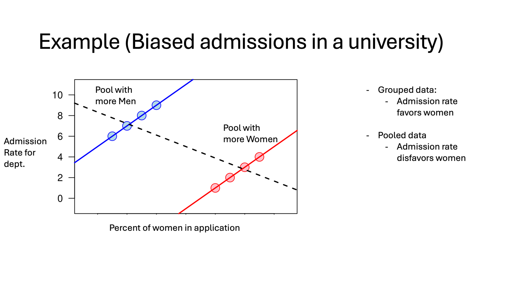

::: notes
-   In the context that looking at the data and thinking carefully about
    it matters

-   Y: admission rates for department

-   X: percent of women who applied.

-   Department and levels... also interaction effects (more messy and
    realistic, but not as much a paradox)
:::

## Simpson's paradox

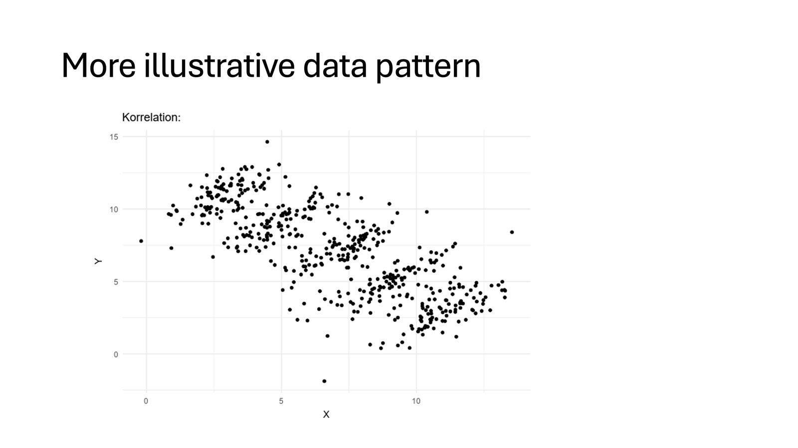

## Simpson's paradox

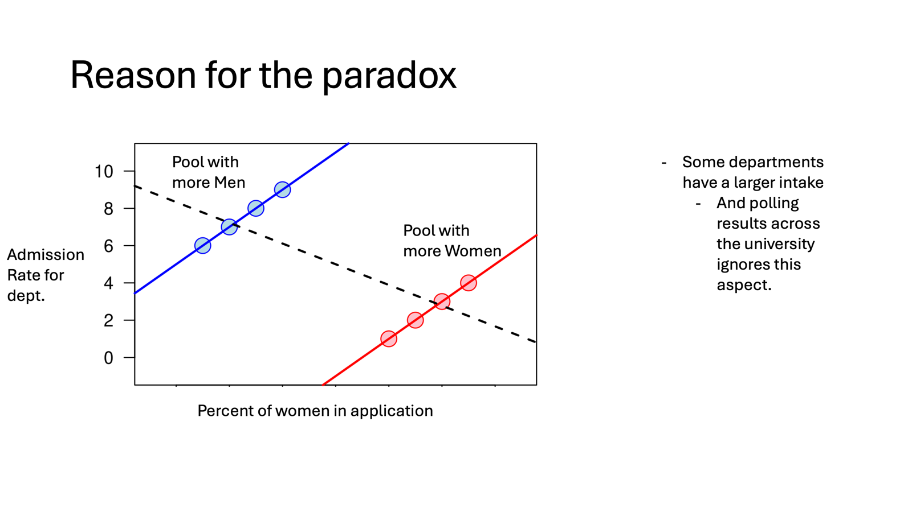

::: notes
-   Q: How do we solve for this?

-   A: first, by even considering that the department matters: by adding
    it to your model

-   A2: Mixed effects models are even more helpful. It prevents a single
    small, outlier department from skewing your entire conclusion. Let's
    you do more such as account for different levels in it, etc.
:::

## Correlation & Confounds

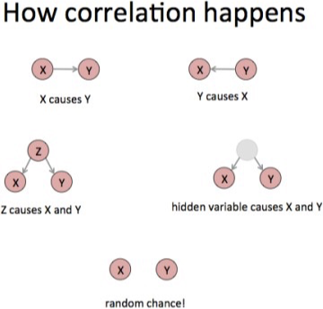

## Simple Linear Model

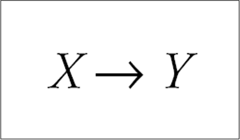{fig-align="center"}

::: notes
-   SLR: One predictor, one outcome

-   X predicts Y — that's our foundation

-   Single arrow, single relationship
:::

## Multiple predictors in linear regression

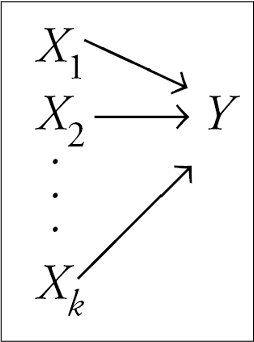{fig-align="center"}

::: notes
-   Now we add more Xs

-   Multiple arrows pointing to Y

-   Same logic, just more of it
:::

## Multiple regression

$$\begin{align}
\hat{Y} &= b_0 + \beta_1 X
\end{align}$$

$$\large \hat{Y} = b_0 + b_1X_1 + b_2X_2 + \dots+b_kX_k$$

-   Simple as adding predictors to our linear equation

::: notes
-   Simple regression on top, multiple regression below

-   We just keep adding terms

-   Q: what do you anctipate to change in the outputs?

-- A: Each X gets its own slope
:::

## Multiple regression equation

::: incremental
$$\large \hat{Y} = b_0 + b_1X_1 + b_2X_2 + \dots+b_kX_k$$

-   $\hat{Y}$ = predicted value on the outcome variable Y
-   $b_0$ = predicted value on Y when all Xs = 0
-   $X_k$ = predictor variables
-   $b_k$ = unstandardized regression coefficients
-   $k$ = the number of predictor variables
:::

::: notes
-   Let's break this apart

-   Y-hat is our prediction

-   b₀ is the intercept — Y *when all predictors are zero* (just like
    SLR)

-   Each b is a slope, each X is a predictor

-   k is how many predictors we have
:::

## Straight Line to Hyperplane

::::: columns
::: {.column .incremental width="50%"}
-   More than two predictors (plane)

    -   Multi-dimensional space

-   Regression coefficients are "partial" regression coefficients

    -   Slope for variable X1 ($b_1$) predicts the change in Y per unit
        X1 holding X2 constant

    -   Slope for variable X2 ($b_2$) predicts the change in Y per unit
        X2 holding X1 constant
:::

::: {.column width="50%"}
<br>

<br>

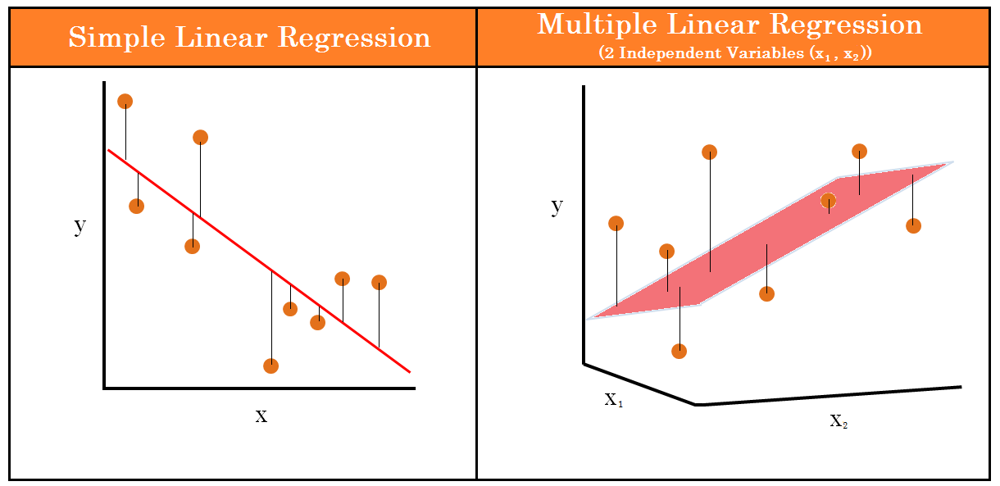{fig-align="center" width="722"}
:::
:::::

::: notes
-   With one predictor we had a line that was fit to the data

-   With Two predictors we are fitting a plane

-   More than two: terminology is a hyperplane (hard to visualize)

-   Key insight: each coefficient is now "partial" -- It tells you the
    effect of X₁ *after controlling for* X₂ -- what does that mean? It
    means, you stay at a fixed point in X1, then X2 has a slope -- 2
    different slopes =\> 2 coefficients
:::

## Multiple Regression: Example

$$
\begin{align*}
\operatorname{CESD\_total} &= b_o + b_{1}(\operatorname{PIL\_total}) \\
&+ b_{2}(\operatorname{AUDIT\_TOTAL\_NEW}) \\
&+ b_{3}(\operatorname{DAST\_TOTAL\_NEW}) \\
&+ e
\end{align*}
$$

```{r}
#| code-overflow: wrap
master <- read.csv("https://raw.githubusercontent.com/jgeller112/psy503-psych_stats/master/static/slides/10-linear_modeling/data/regress.csv")

head(master)

```

-   Mental Health and Drug Use:

    -   CESD = depression measure
    -   PIL total = measure of meaning in life
    -   AUDIT total = measure of alcohol use
    -   DAST total = measure of drug usage

::: notes
-   Here is some real data from a mental health study

-   Outcome we're predicting : depression (CESD) from three things

-   Meaning in life, alcohol use, drug use

-   What predicts depression when we account for everything
    simultaneously?
:::

## Multiple Regression: Example

-   *Validated Measures*
    -   *CESD : Center for Epidemiological Studies Depression Scale*
    -   *PIL : Purpose in Life Test*
    -   *AUDIT : Alcohol Use Disorders Identification Test*
    -   *DAST : Drug Abuse Screening Test*

::: notes
-   Here is some real data from a mental health study

-   Outcome we're predicting : depression (CESD) from three predictors

-   That is.... Meaning in life, alcohol use, drug use

-   What predicts depression when we account for everything
    simultaneously?
:::

## Scatterplot

```{r}
#| fig-align: center
# Change the point sizes manually

anim.1<- ggplot(master, aes(x=PIL_total, y=CESD_total))+
   geom_point() + 
  theme_minimal(base_size=20)

anim.1

```

::: notes
-   As usual, we start by visualizing data

-   Here is a scatterplot: Meaning in life vs. depression

-   Clear negative relationship

-   And it makes sense (Purpose in life/meaning increases -\> less
    depression)
:::

## Scatterplot

```{r}
#| fig-align: center
# Change the point sizes manually

anim.1<- ggplot(master, aes(x=AUDIT_TOTAL_NEW, y=CESD_total))+
   geom_point() + 
  theme_minimal(base_size=20)

anim.1
```

::: notes
-   Next: Alcohol use vs. depression

-   Relationship less clear

-   Some positive trend maybe — noisier
:::

## Scatterplot

```{r}
#| fig-align: center
# Change the point sizes manually
anim.1<- ggplot(master, aes(x=DAST_TOTAL_NEW, y=CESD_total))+
   geom_point() + 
  theme_minimal(base_size=20)

anim.1
```

::: notes
-   Finally: Drug use vs. depression

-   Also messy

-   Most people cluster at zero... At 0 where most points are drug use
    isn't helpful for capturing

-   Hard to see pattern
:::

## Individual Predictors

::: incremental
-   We test the individual predictors with a t-test:

    -   $t = \frac{b}{SE}$

    -   Therefore, the model for each individual predictor is our
        coefficient b

    -   Single sample t-test to determine if the b value is different
        from zero
:::

::: notes
-   How do we test if each predictor matters?

-   Same t-test logic

-   Take the coefficient, divide by its standard error

-   (Many of these tests are SNR / proportion of variance explained)

-   Is b different from zero? That's our question for each predictor
:::

## Fitting the model

```{r}
model_fit <- lm(CESD_total ~ PIL_total + AUDIT_TOTAL_NEW + DAST_TOTAL_NEW,
             data = master) 

summary(model_fit)


```

```{r}
#| echo: false
#| 
model_fit %>%
  tidy(conf.int=TRUE) %>%
  knitr::kable() %>%
    kable_styling(font_size = 24) %>%
 row_spec(1, color = "white",
              background = "red")

```

> $b_0$: The value of Y when all the Xs=0

::: notes
-   Here's the R code — simple formula

-   outcome \~ predictor1 + predictor2 + predictor3

-   You plug all the coefficients in, you get the model with which you
    can make predictions!

-   The intercept (b₀ = 55.16): predicted depression when someone has
    zero meaning, zero alcohol use, zero drug use INTERCEPT: Not very
    interpretable in practice but mathematically necessary

-   

    ```         
    For every 1-unit increase in meaning in life, depression scores are predicted to decrease by 0.38 units, (assuming alcohol and drug use remain the same.)
    ```

-   can think of t-statistics as SNR: meaning, ...

-   ignore t-value of intercept

-   acohold and depression not so much

-   Residuals: distribution (min, max).. median is helpful... not a huge
    shift

-   SE of the estimates... guess of how much the estimate my change as
    you look at different samples

-   DAST..... high of drug abuse
:::

## Fitting the model

```{r}
#| echo: false
#| 
model_fit %>%
  tidy(conf.int=TRUE) %>%
  knitr::kable() %>%
    kable_styling(font_size = 24) %>%
 row_spec(2, color = "white",
              background = "red")


```

> $b_1$: If Alch and drug use are held constant, for every 1 unit
> increase in X (meaning) leads to a -0.38 decrease in depression
> scores.

::: notes
-   The meaning coefficient: -0.38
-   Negative — more meaning, less depression
-   "Holding alcohol and drug use constant" — that's the partial
    regression magic
-   Each unit increase in meaning drops depression by 0.38 points
:::

## Fitting the model

```{r}
#| echo: false
#| 
model_fit %>%
  tidy(conf.int=TRUE) %>%
  knitr::kable() %>%
    kable_styling(font_size = 24) %>%
 row_spec(3, color = "white",
              background = "red")


```

> $b_2$: Holding meaning and drug use constant, for every unit increase
> in alch use there is a -0.09 decrease in depression scores.

::: notes
-   Alcohol coefficient: -0.09
-   Tiny and not significant (p = .33)
-   After accounting for meaning and drugs, alcohol doesn't add much
-   Surprising? Maybe meaning captures the variance
:::

## Fitting the model

```{r}
#| echo: false


model_fit %>%
  tidy(conf.int=TRUE) %>%
  knitr::kable() %>%
    kable_styling(font_size = 24) %>%
 row_spec(4, color = "white",
              background = "red")


```

> $b_3$: Holding meaning and alch usage constant, for every unit
> increase in drug usage there is a 1.03 increase in depression.

::: notes
-   Drug use coefficient: 1.03
-   Positive — more drug use, more depression
-   Significant at p = .01
-   Each unit increase in drug use adds about 1 point to depression
:::

## More predictors =\> more problems

-   Assumptions

    -   Linearity

    -   Independence

    -   Normality of residuals

    -   Equal error ("homoskedasticity")

::: incremental
-   Issues:

    -   Missingness

    -   Factors are correlated with one another (multicollinearity)

    -   Unusual values/outliers
:::

::: notes
-   More predictors = more things can go wrong

-   Standard assumptions still apply: linearity, independence,
    normality, homoskedasticity

-   New issues: missing data, multicollinearity, outliers

-   Let's tackle each
:::

## Problems

-   Missingness
    -   list-wise deletion (removes entire row where missingness occurs)

```{r}
nomiss <- master %>%
  drop_na() # drop missing data

#base r
nomiss <- master %>%
  na.omit() 

nrow(master)
nrow(nomiss)

```

::: notes
-   Missing data? R uses listwise deletion by default

-   One missing value in a row? Whole row gone

-   We went from 267 to 266 — not bad here

-   Can be catastrophic with more missingness

-   Later in the semester, we'll look at other solutions
:::

## Problems

::: incremental
-   Multicolinearity

    -   You want X and Y to be correlated

    -   You do not want the Xs to be highly correlated

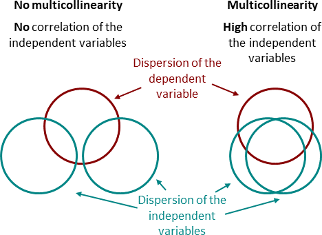{fig-align="center"}
:::

::: notes
-   We *want* X and Y correlated

-   We *don't* want the Xs correlated with each other

-   Figure: We want as much of the red circle to be calculated!

-   Next: we also want blues to be seperated! If predictors overlap too
    much, we can't untangle their unique effects!! which variable to
    give credit to! It's also redundancy.
:::

## Multicolinearity

::: incremental
-   Problems

    -   Extreme cases (complete collinearity) = Nonidentifiable model

    -   "Unstable" regression coefficients ("bouncing betas")

        -   Imprecise estimation

    -   Large standard errors

        -   Increased Type II errors
            -   Not detecting a difference when there is one
:::

::: notes
-   Extreme case: predictors perfectly correlated — model can't be
    estimated at all
-   Less extreme: "bouncing betas" — coefficients become unstable
-   Standard errors inflate
-   You miss real effects (Type II errors)
:::

## Multicolinearity

-   Tolerance

    -   Measures influence of one predictor on another
    -   If predictors are highly correlated, tolerance gets smaller

$$Tolerance=1- R^2_j$$

> where $R^2_j$ is the proportion of variation in X that is explained by
> the linear combination of the other predictors in the model

::: notes
-   Tolerance: how much variance in X₁ is NOT explained by other Xs

-   Formula: 1 - R²

-   Lower tolerance = more problematic

-   The predictor is redundant with others

-   "How much unique information do I have about X1?"
:::

## Multicolinearity

-   VIF (variance inflation factor)

    -   How much does our estimates (SEs) change due to the correlation

$$VIF=\frac{1}{1- R^2_j}$$

-   Rule of thumb:

    -   VIF \> 10 indicates issues

::: notes
-   VIF is the inverse of tolerance

-   "How much damage is being done?"

-   How much are standard errors inflated due to collinearity?

-   Rule of thumb: VIF \> 10 is trouble, some say \> 5
:::

## Multicolinearity

-   Check multicolinearity in your data

```{r}
#| fig-align: center
#| 
#easystats performance package
#plot(check_collinearity(model_fit))
```

::: notes
-   Easy to check with `check_collinearity()`
-   Our predictors look fine — low VIF values
-   No multicollinearity concerns here
:::

## Multicolinearity

::: incremental
-   Strategies

    -   Anticipate collinearity issues at the design stage

    -   Depends: Drop variable if there's no theoretical pay-off anyway

    -   Depends: Fit separate models and compare fit

    -   Depends: Increase sample size

    -   Depends: Orthogonalize predictors experimentally

    -   Depends: Use alternative approaches, such as ridge regression or
        LASSO

    -   Do not do anything about it (if prediction is your goal)
:::

::: notes
-   What if you have multicollinearity?

-   Options depend on your goal

-   Drop redundant predictors, combine them into composites

-   Use regularization (ridge, LASSO)

-   Increase sample size

-   Or — if predicting is all you care about — ignore it

-   Predictions stay fine; it's the individual coefficients that suffer
:::

## Identifying unusual cases

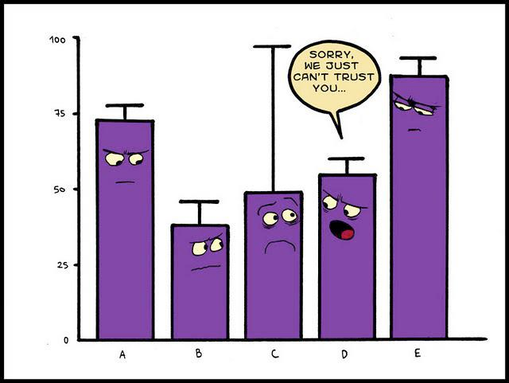{fig-align="center"}

::: notes
-   Outliers matter more in regression

-   One weird point can drag the whole line

-   We need systematic ways to find them
:::

## Influential points

-   An observation or case is influential if removing it substantially
    changes the coefficients of the regression model

> Influence = Leverage x Distance (outliers)

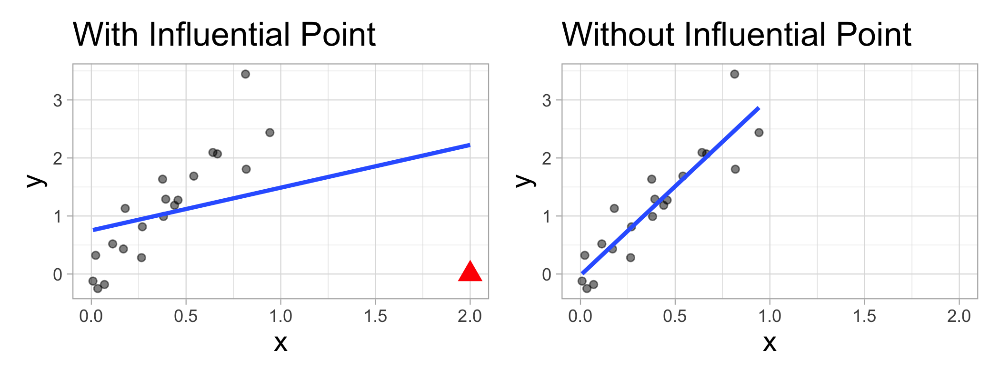{fig-align="center"}

::: notes
-   Key formula: Influence = Leverage × Distance
-   Leverage: how extreme is the X value?
-   Distance: how far is Y from the prediction?
-   Both matter — high leverage + large residual = influential point
:::

## Influential points

::: incremental
-   Influential points have a large impact on the coefficients and
    standard errors used for inference

    -   Can be on x or y variables

-   These points can sometimes be identified in a scatterplot if there
    is only one predictor variable

    -   This is often not the case when there are multiple predictors

-   We will use measures to quantify an individual observation's
    influence on the regression model

    -   **Leverage**, **Standardized residuals** , and **Cook's
        distance**
:::

::: notes
-   These points mess with your coefficients and standard errors
-   With one predictor, you might spot them in a scatterplot
-   Multiple predictors? Need diagnostic measures
-   Three key measures: leverage, standardized residuals, Cook's
    distance
:::

## Leverage

-   Deals with Xs

> Measure of geometric distance of the observation's predictor point
> ($X_{i1}$, $X_{i2}$) from center point of the predictor space

$$
h_i = \dfrac{1}{n} + \dfrac{\left(x_i -\overline{x}\right)^2}{\sum_{j=1}^{n}{\left(x_j -\overline{x}\right)^2}} \qquad \text{and}\qquad \overline{h} = \dfrac{k}{n}  \qquad \text{and}\qquad \dfrac{1}{n} \leq h_i \leq 1.0
$$

::: callout-note
In multiple regression $h_i$ measures distance from the centroid (point
of means) of Xs
:::

::: notes
-   Leverage (h): how unusual is this observation's X values?

-   Far from the center of predictor space = high leverage

-   Points on the edge of the X distribution have more "pull" on the
    regression line
:::

## Leverage

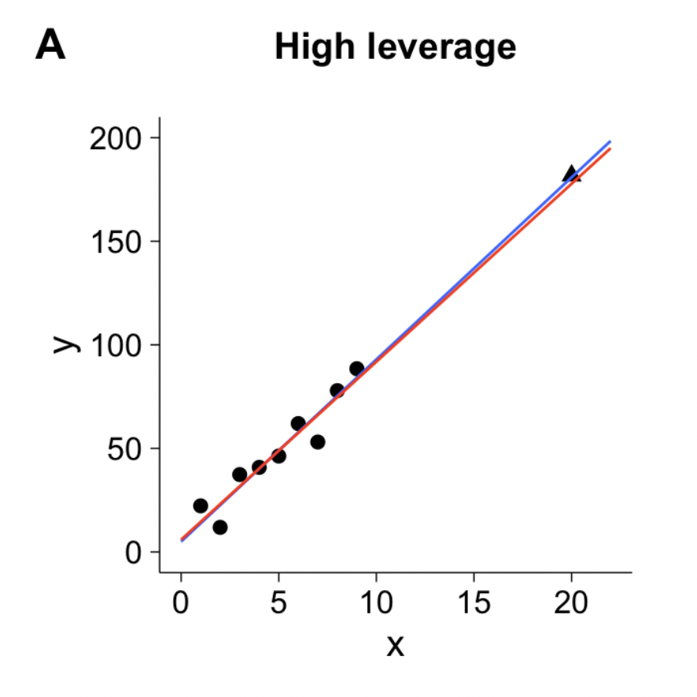{fig-align="center"}

::: notes
-   Visual representation

-   Points far from the center have high leverage

-   They have more influence on where the line goes

-   Not necessarily bad — but watch them
:::

## Leverage

-   We say a point is high leverage if:

$$
h_i > \frac{2K+2}{N}
$$

-   K is the number of predictors

-   N is the sample size

```{r}
#| code-line-numbers: "5"
#| 
k <- 3 ##number of IVs/predictors
# label 1 if out 0 if not
model_out<- model_fit  %>%
  augment() %>%
  mutate(lev_out = ifelse(.hat>(2*+2)/nrow(.),1, 0))

model_out

```

::: notes
-   Threshold formula: h \> (2k+2)/n

-   k predictors, n observations

-   The `.hat` column from `augment()` gives you leverage values

-   Compare to the threshold, flag the high ones

-   for each data point
:::

## Standardized Residuals

-   Distance
    -   how far away y point is from line

$$
std.res_i = \frac{y_i - \hat{y}_i}{\hat{\sigma}_\epsilon\sqrt{1-h_i}}
$$

> Where $\hat{\sigma}_\epsilon$ is regression standard error

-   Use cut-off \> 3

::: notes
-   Now the Y side
-   How far is each point from the line?
-   Standardized residuals account for leverage too
-   Rule: \|standardized residual\| \> 3 is suspicious
:::

## Standardized Residuals

```{r}
#| code-line-numbers: "5"
# label 1 if out 0 if not
model_out<- model_fit  %>%
  augment() %>%
  mutate(lev_out = ifelse(.hat>(2*k+2)/nrow(.),1, 0), 
         std_out=ifelse(abs(.std.resid) > 3, 1, 0))

```

```{r}
#| fig-align: center
#| 
library(olsrr)

ols_plot_resid_stand(model_fit)

```

::: notes
-   Visual inspection
-   Most residuals cluster near zero
-   Outliers stick out
-   The `olsrr` package makes nice plots
:::

## Leverage and Distance

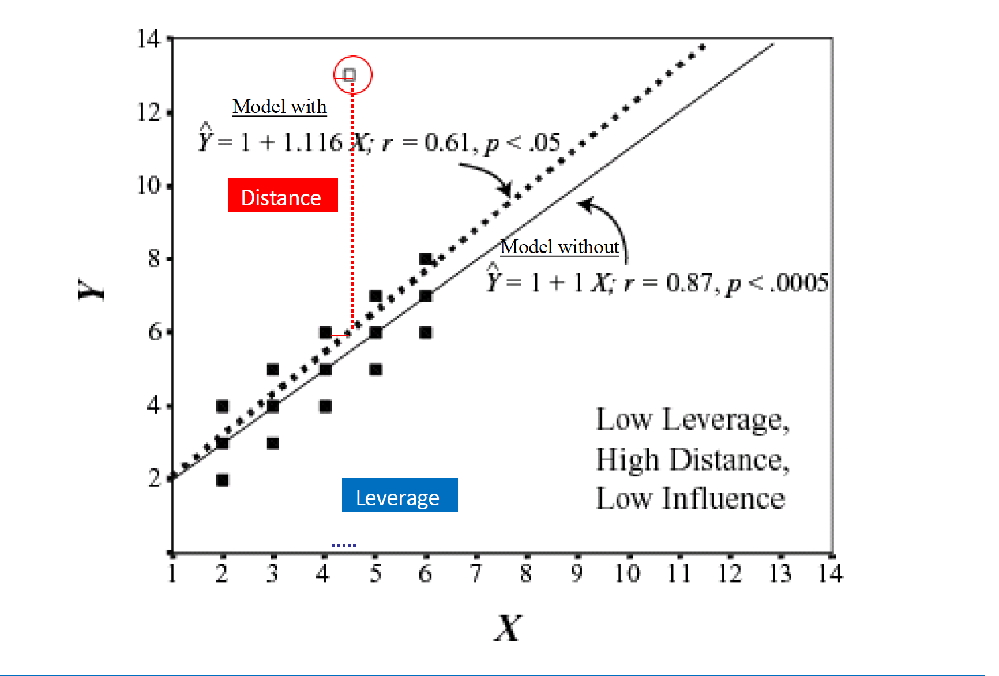{fig-align="center"}

::: notes
-   Four quadrants to think about
-   Low leverage + small residual: typical points (good)
-   This is what we want most of our data to look like
:::

## Leverage and distance

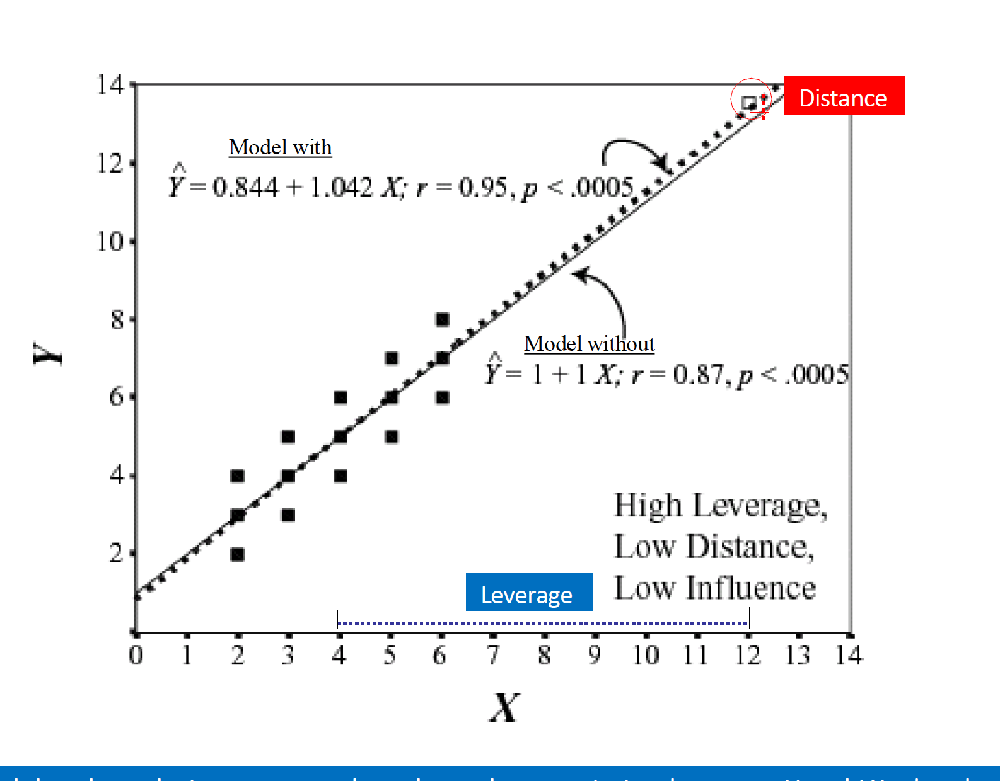{fig-align="center"}

::: notes
-   High leverage + small residual: unusual X but fits the pattern
-   Low leverage + large residual: unusual Y but not very influential
-   These are less concerning
:::

## Leverage and distance

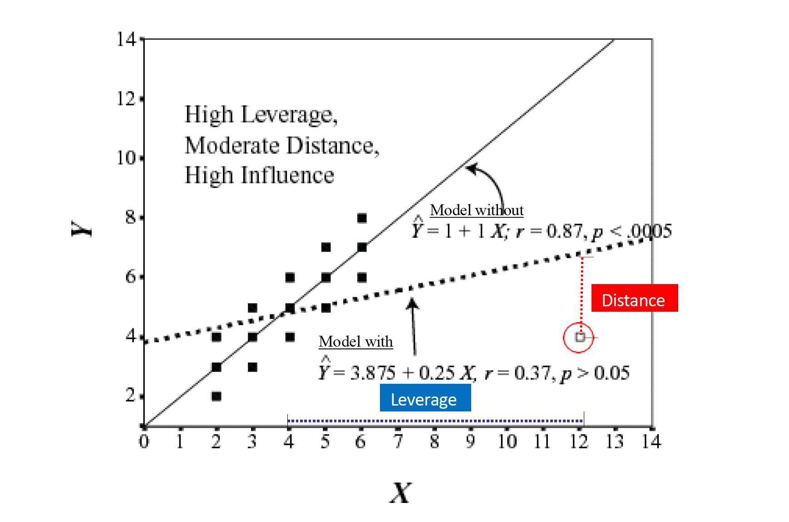{fig-align="center"}

::: notes
-   High leverage + large residual: TROUBLE
-   These are your influential points
-   They can dramatically change your regression line
:::

## Cook's distance

-   Influence **(Cook's Distance)**

    -   A measure of how much of an effect that single case has on the
        whole model

        -   How close it lies to general line (residuals)

        -   It's leverage $$
            D_i = \frac{(std.res_i)^2}{k + 1}\bigg(\frac{h_i}{1-h_i}\bigg)
            $$

        -   Threshold:

$$
\frac{4}{N-K-1}
$$

::: notes
-   Cook's D combines everything
-   How much would coefficients change if we removed this point?
-   Formula incorporates both leverage and residuals
-   Threshold: 4/(n-k-1)
:::

## Cook's distance

```{r}
#| code-line-numbers: "8"
# label 1 if out 0 if not
model_out<- model_fit  %>%
  augment() %>%
  mutate(lev_out = ifelse(.hat>(2*k+2)/nrow(.),1, 0),
         std_out=ifelse(abs(.std.resid) > 3, 1, 0), 
         cook_out = ifelse(.cooksd > (4 / (nrow(.) - 3 - 1)), 1, 0))

```

```{r}
#| fig-align: center
#| 
library(olsrr)
ols_plot_cooksd_bar(model_fit)

```

::: notes
-   Bar plot of Cook's D
-   Tall bars = influential points
-   Easy to spot
-   Red line is threshold
:::

## Combine Metrics

-   What do I do with all these numbers?

    -   Create a total score for the number of indicators a data point
        has

    -   You can decide what rule to use, but a suggestion is 2 or more
        indicators is an outliers

```{r}
#| code-line-numbers: "9"


# label 1 if out 0 if not
model_out<- model_fit  %>%
  augment() %>%
  mutate(lev_out = ifelse(.hat>(2*k+2)/nrow(.),1, 0), cook_out = ifelse(.cooksd > (4 / (nrow(.) - 3 - 1)), 1, 0), std_out=ifelse(.std.resid >= 3, 1, 0)) %>%
  rowwise() %>%
  mutate(sum_out=lev_out+cook_out+std_out) %>%
  filter(sum_out < 2)


nrow(nomiss)

nrow(model_out)

```

::: notes
-   Multiple indicators, multiple decisions
-   My suggestion: flag points that exceed 2+ thresholds
-   More robust than any single measure
-   Create a sum score, filter out the problems
:::

## `Easystats: Check_outliers`

-   Use consensus method

    -   If half of methods say point is outlier, get rid of it

```{r}

# will estimate all outliers methods
outliers_list <- check_outliers(model_fit, method = "all")

# provides a col called outliers with prob of outliers by method (50% more than half said ob was outlier)

out_data <-insight::get_data(model_fit)[outliers_list, ] # Show outliers data

# get rid of values in outliers list in the main dataset 
clean_data <- anti_join(nomiss,out_data, by=c("CESD_total", "PIL_total", "AUDIT_TOTAL_NEW", "DAST_TOTAL_NEW"))

```

::: notes
-   Even easier: `check_outliers()` with method = "all"
-   Uses multiple methods
-   Consensus approach: if half the methods flag it, remove it
-   Clean and principled
:::

## Refit model

```{r}

model_fit <- lm(CESD_total ~ PIL_total + AUDIT_TOTAL_NEW + DAST_TOTAL_NEW,
             data = clean_data) 

```

::: notes
-   After removing outliers, refit
-   Now we have clean data
-   Our inferences will be more trustworthy
:::

## Assumptions

-   Linearity

-   Independence

-   Normality of residuals

-   Equal error ("homoskedasticity")

. . .

-   **Additivity (more than one variable)**

::: notes
-   Back to basics
-   Linearity, independence, normality, homoskedasticity
-   Plus one new one for multiple regression: additivity
-   Effects of predictors shouldn't depend on each other — unless you
    model interactions
:::

## Assumptions

-   Additivity

    -   Implies that for an existing model, the effect of a predictor on
        a response variable (whether it be linear or non-linear) is not
        affected by changes in other existing predictors

        -   Add interaction if not the case

::: notes
-   Additivity means: effect of X₁ doesn't change across levels of X₂
-   If it does, you need an interaction term
-   We'll cover interactions later
:::

## Assumptions

```{r}
performance::check_model(model_fit, check=c("normality", "linearity", "homogeneity", "qq", "vif"))

```

::: notes
-   `check_model()` gives you everything
-   Visual diagnostics for all assumptions at once
-   Look for patterns in residuals
:::

## Violation Assumptions

-   Normality (more on this next week)

-   Homoskedasticity

::: notes
-   Two common violations: non-normality and heteroskedasticity
-   We'll focus on heteroskedasticity today
-   Normality next week
:::

## Heteroskedasticity

```{r}

check_heteroscedasticity(model_fit)

```

-   We can use robust SEs

-   They work by changing the covariance matrix (the diagonal is the
    variance)

    $$
    \text{Var}(\epsilon) = \sigma^2 I_n = \sigma^2
    \begin{bmatrix}
    1 & 0 & \cdots & 0 \\
    0 & 1 & \cdots & 0 \\
    \vdots & \vdots & \ddots & \vdots \\
    0 & 0 & \cdots & 1
    \end{bmatrix}
    $$

::: notes
-   `check_heteroscedasticity()` detected a problem (p = .001)
-   Variance isn't constant — our standard errors are wrong
-   Solution: robust standard errors
-   They adjust the covariance matrix
:::

## Heteroskedasticity

$$
D_{\text{HC3}} =
\begin{bmatrix}
\frac{\epsilon_1^2}{(1-h_{11})^2} & 0 & \cdots & 0 \\
0 & \frac{\epsilon_2^2}{(1-h_{22})^2} & \cdots & 0 \\
\vdots & \vdots & \ddots & \vdots \\
0 & 0 & \cdots & \frac{\epsilon_n^2}{(1-h_{nn})^2}
\end{bmatrix}
$$

```{r}

library(easystats) # model_paramters function
#fit model first then read into function
mp <- model_parameters(model_fit, vcov = "HC3")

mp

```

::: notes
-   HC3 is the gold standard for robust SEs
-   Corrects the covariance matrix
-   Same coefficients, different (usually larger) standard errors
-   More honest inference
:::

## Refit Model

-   Fit model on clean dataset with outliers removed

```{r}
#| echo: false

mp  %>%
  knitr::kable() %>%
    kable_styling(font_size = 24) %>%
 row_spec(2, color = "white",
              background = "red")

```

$b_1$:

::: notes
-   Results with robust SEs
-   Notice the standard errors changed, p-values changed too
-   Meaning: b = -0.40, still significant, still the strongest predictor
:::

## Interpretation

```{r}
#| echo: false


mp  %>%
  knitr::kable() %>%
    kable_styling(font_size = 24) %>%
 row_spec(3, color = "white",
              background = "red")


```

$b_2$:

::: notes
-   Alcohol: b = -0.10
-   Still not significant
-   Alcohol doesn't predict depression after controlling for meaning and
    drugs
:::

## Interpretation

```{r}
#| echo: false
#| 

mp  %>%
    knitr::kable() %>%
    kable_styling(font_size = 24) %>%
 row_spec(4, color = "white",
              background = "red")


```

-   $b_3$:

::: notes
-   Drugs: b = 0.89
-   Now marginal with robust SEs (p = .066)
-   The relationship is there but less certain
:::

## Predictors

```{r}
library(papaja)
apa_style <- apa_print(model_fit)

apa_style
```

-   Meaning: `r apa_style$full_result$PIL_total`
-   Alcohol: `r apa_style$full_result$AUDIT_TOTAL_NEW`
-   Drugs: `r apa_style$full_result$DAST_TOTAL_NEW`

::: notes
-   `papaja` formats everything for you
-   Copy-paste into your paper
-   No manual formatting errors
:::

## Overall Model Fit

-   Is the overall model significant?

```{r}
apa_style <- apa_print(model_fit)

```

-   `r apa_style$full_result$modelfit`

::: notes
-   The whole model: R² = .37
-   F-test significant
-   Our three predictors together explain 37% of depression variance
-   Is that good? For psychological data, that's solid
:::

## Adjusted $R^2$

$$
\large R_{A}^2 = 1 - (1 -R^2)\frac{n-1}{n-p-1}
$$

```{r}

glance(model_fit) %>%
    knitr::kable() %>%
    kable_styling(font_size = 24) %>%
 column_spec(2, color = "white",
              background = "red")

```

::: notes
-   Adjusted R² penalizes for adding predictors
-   Regular R² always increases with more variables — even useless ones
-   Adjusted R² can decrease
-   Keeps us honest
:::

## Effect size

::::: columns
::: {.column width="50%"}
-   R is the multiple correlation
-   $R^2$ is the multiple correlation squared
    -   All overlap in Y used for overall model
    -   $A+B+C/(A+B+C+D)$
:::

::: {.column width="50%"}
```{r}
#| echo: false
#| fig-align: center
#| 

knitr::include_graphics("https://brendanhcullen.github.io/psy612/lectures/images/venn/Slide3.jpeg")

```
:::
:::::

::: notes
-   Venn diagram view
-   R² is the total overlap between predictors and outcome
-   A + B + C in the diagram
-   Shared and unique variance lumped together
:::

## Effect Size

::::: columns
::: {.column width="50%"}
-   sr is the semipartial correlation
    -   It represents (when squared) the proportion of (unique) variance
        accounted for by the predictor, relative to the total variance
        of Y
        -   Increase in proportion of explained Y variance when X is
            added
            -   How much does X add over and beyond other variables
:::

::: {.column width="50%"}
```{r}
#| echo: false
#| fig-align: center

knitr::include_graphics("https://brendanhcullen.github.io/psy612/lectures/images/venn/Slide4.jpeg")

```
:::
:::::

::: notes
-   Semipartial correlation (sr): unique contribution
-   How much does this predictor add beyond the others?
-   The sliver that's only X₁, not shared with X₂
-   Squared gives you proportion of total Y variance uniquely explained
:::

------------------------------------------------------------------------

<!-- ## Effect Size -->

<!-- ::::: columns -->

<!-- ::: {.column width="50%"} -->

<!-- -   $pr$ is the partial correlation -->

<!--     -   When squared, proportion of variance not explained by other -->

<!--         predictors but just X -->

<!--         -   Removes influence of other variables -->

<!-- -   Pr \> sr -->

<!-- ::: -->

<!-- ::: {.column width="50%"} -->

<!-- ```{r} -->

<!-- #| echo: false -->

<!-- #| fig-align: center -->

<!-- #| fig-height: 2 -->

<!-- #| fig-width: 4 -->

<!-- #|  -->

<!-- knitr::include_graphics("https://brendanhcullen.github.io/psy612/lectures/images/venn/Slide5.jpeg") -->

<!-- knitr::include_graphics("https://brendanhcullen.github.io/psy612/lectures/images/venn/Slide6.jpeg") -->

<!-- ``` -->

<!-- ::: -->

<!-- ::::: -->

<!-- ::: notes -->

<!-- -   Partial correlation (pr): different denominator -->

<!-- -   Proportion of *unexplained* variance that this predictor captures -->

<!-- -   pr \> sr always -->

<!-- -   Different questions, different uses -->

<!-- ::: -->

<!-- ## When to use? -->

<!-- -   $sr^2$ -->

<!--     -   Most often used when we want to show that some variable adds -->

<!--         incremental variance in Y above and beyond another X variable -->

<!-- -   $pr^2$ -->

<!--     -   Remove influence of another variable -->

<!-- ::: notes -->

<!-- -   sr² for "incremental validity" — does this variable add anything? -->

<!-- -   pr² for "what's the relationship after removing confounds?" -->

<!-- -   Choose based on your research question -->

<!-- ::: -->

<!-- ## Partial correlations -->

<!-- ```{r} -->

<!-- cor <- cor(clean_data[2:5]) -->

<!-- #partial corr from easystats -->

<!-- correlation::cor_to_pcor(cor)^2 -->

<!-- #semipartial you need the covariance  -->

<!-- #cor_to_spcor(cor, cov = sapply(clean_data[2:5], sd)) -->

<!-- ``` -->

<!-- ::: notes -->

<!-- -   `correlation::cor_to_pcor()` gives partial correlations -->

<!-- -   Square them for pr² -->

<!-- -   For semipartial, use `r2_semipartial()` from easystats -->

<!-- ::: -->

<!-- ## Partial correlations -->

<!-- -   Can use your model to get $sr^2$ -->

<!-- ```{r} -->

<!-- #input model to semi-partial -->

<!-- r2_semipartial(model_fit) -->

<!-- ``` -->

<!-- ::: notes -->

<!-- -   sr² for meaning = .33 -->

<!-- -   That's huge — one-third of depression variance is uniquely explained -->

<!--     by meaning in life -->

<!-- -   Alcohol and drugs contribute almost nothing uniquely -->

<!-- ::: -->

<!-- ## Partial correlations -->

<!-- -   We would add these to our other reports: -->

<!--     -   Meaning: `r apa_style$full_result$PIL_total`, $pr^2 = .33$\` -->

<!--     -   Alcohol: `r apa_style$full_result$AUDIT_TOTAL_NEW`, -->

<!--         $pr^2 = .02$\` -->

<!--     -   Drugs: `r apa_style$full_result$DAST_TOTAL_NEW`, $pr^2 = .03$\` -->

<!-- ::: callout-note -->

<!-- $pr^2$: 33% of variance in Depression is explained by meaning that is -->

<!-- not explained by the other variables -->

<!-- $sr^2$: 3% of variance in depression can be uniquely explained by -->

<!-- meaning above and beyond the other vars. -->

<!-- ::: -->

<!-- ::: notes -->

<!-- -   Report both the coefficient and the effect size -->

<!-- -   b tells you the unit change -->

<!-- -   sr² tells you the importance -->

<!-- -   Both matter -->

<!-- ::: -->

<!-- ## Multiple Regression: Power -->

<!-- ```{r echo=TRUE, message=FALSE, warning=FALSE} -->

<!-- R2<-glance(model_fit) -->

<!-- R2 <- R2$adj.r.squared -->

<!-- f2 <- R2 / (1-R2) -->

<!-- WebPower::wp.regression(n=72, p1=3, p2=0, f2=f2, alpha=.05, power=NULL) -->

<!-- ``` -->

<!-- ::: notes -->

<!-- -   Power analysis for multiple regression -->

<!-- -   Convert R² to f² -->

<!-- -   Use `WebPower` package -->

<!-- -   With n = 72 and our effect size, power is nearly 1.0 -->

<!-- -   We're well-powered -->

<!-- ::: -->

# Plotting

::: notes
-   Section break
-   Let's visualize our results
:::

## Partial regression plots

-   Must partial out other factors by setting them to some value
    (usually mean)

```{r}
#| fig-align: center
#| 
library(ggeffects)
#will hold all other vars at mean level 
dat <-ggpredict(model_fit, terms=c("PIL_total")) 
#add raw data points to plot
plot(dat, show_data=TRUE) + theme_minimal(base_size=20)

```

::: notes
-   Can't just plot X vs Y anymore — other predictors confound things
-   Partial regression plots hold other variables at their means
-   Shows the unique relationship
-   `ggeffects` makes this easy
:::

## Write-up

We fitted a linear model(estimated using OLS) to predictCESD_total with
PIL_total,AUDIT_TOTAL_NEW andDAST_TOTAL_NEW (formula:CESD_total \~
PIL_total +AUDIT_TOTAL_NEW +DAST_TOTAL_NEW). The model explains a
statistically significant and substantial proportion of variance (R2
=0.36, F(3, 262) = 48.84, p \<.001, adj. R2 = 0.35).

-   Meaning: `r apa_style$full_result$PIL_total`, $pr^2 = .35$\`
-   Alcohol: `r apa_style$full_result$AUDIT_TOTAL_NEW`, $pr^2 = .02$\`
-   Drugs: `r apa_style$full_result$DAST_TOTAL_NEW`, $pr^2 = .03$\`

::: notes
-   Putting it all together
-   State the model, report R² and F-test
-   Then each predictor with b, CI, t, p, and effect size
-   This is publication-ready
:::

## Oh btw, ANCOVA vs MR

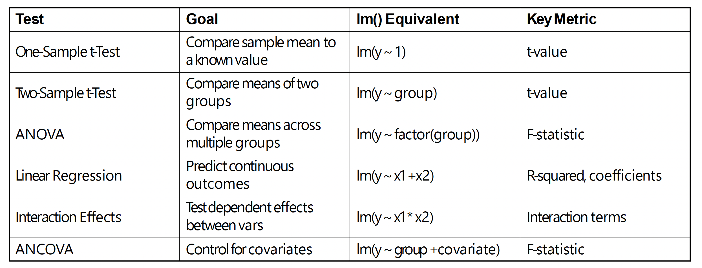

::: notes
-   I'd shown this before

-   MR and ANCOVA are the same. but the emphasis is different

-   ANCOVA: Group difference after controlling for noise (another
    predictor u actually don't care about)

-   MR: How do the predictors together explain the outcome
:::

## ANCOVA vs MR


## ANCOVA vs MR

-   Multiple Regression are the same.

-   But the emphasis is different with respect to the research question

-- ANCOVA: Group difference after controlling for noise (another
predictor u actually don't care about)

-- MR: How do the predictors together explain the outcome
