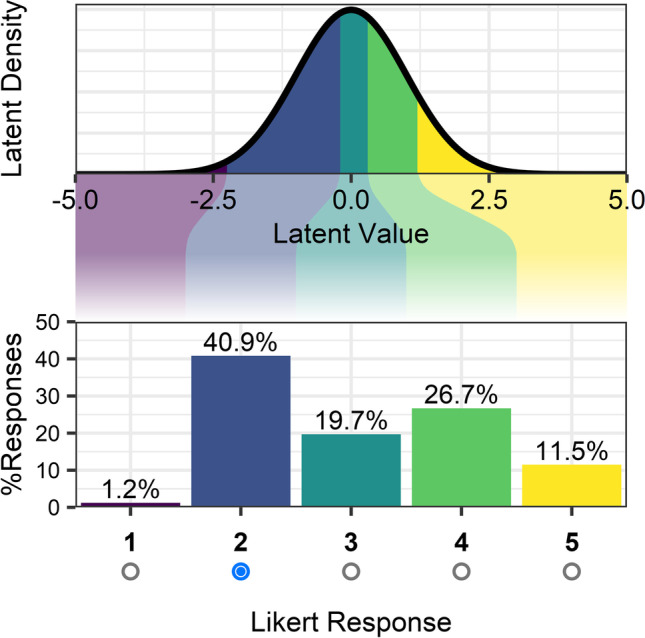
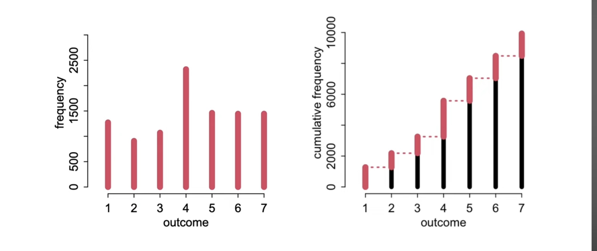
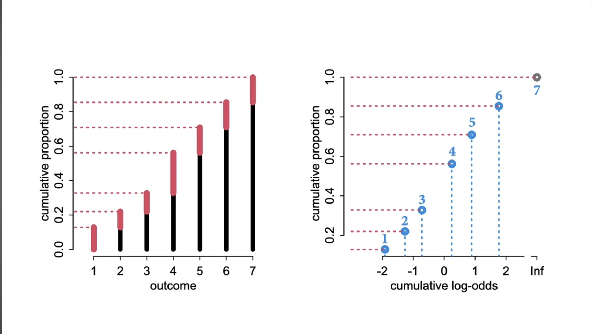
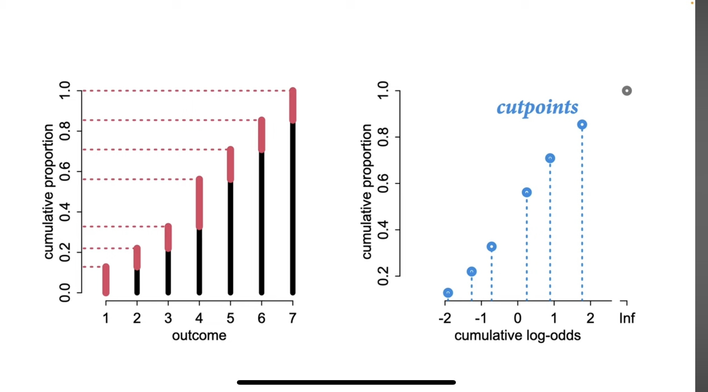
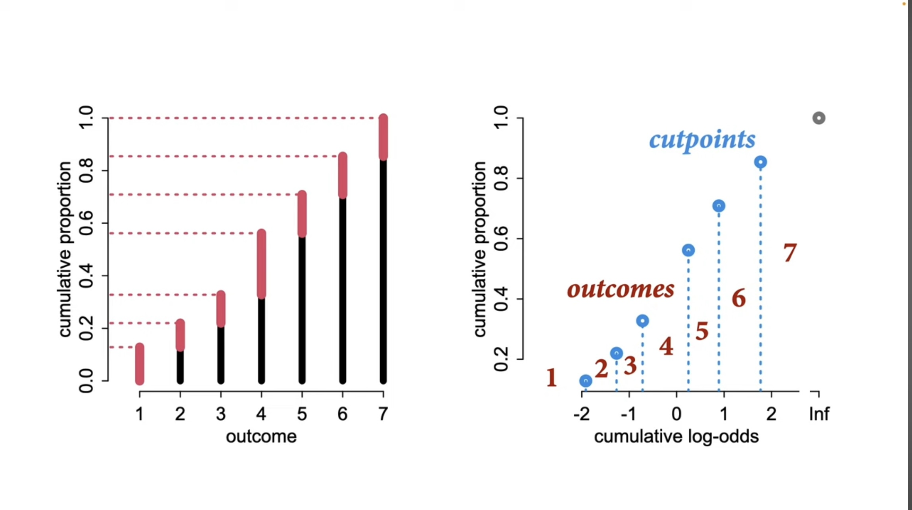
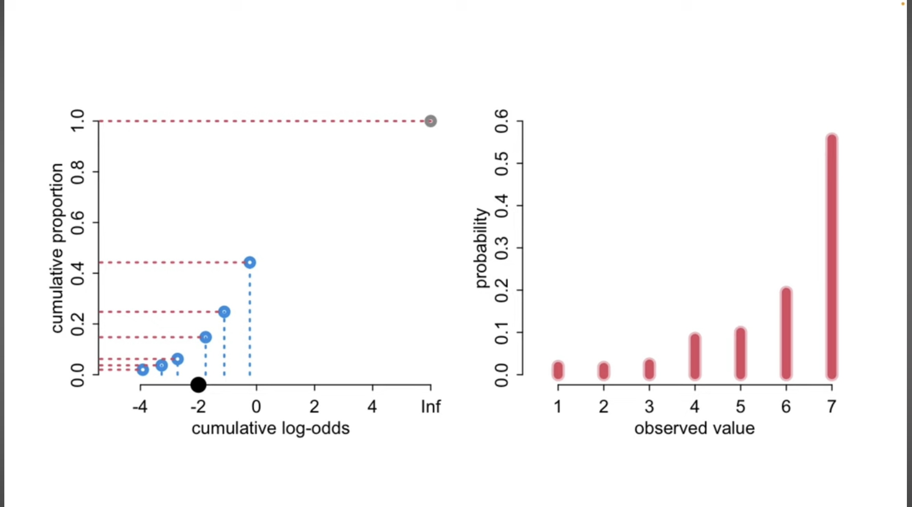
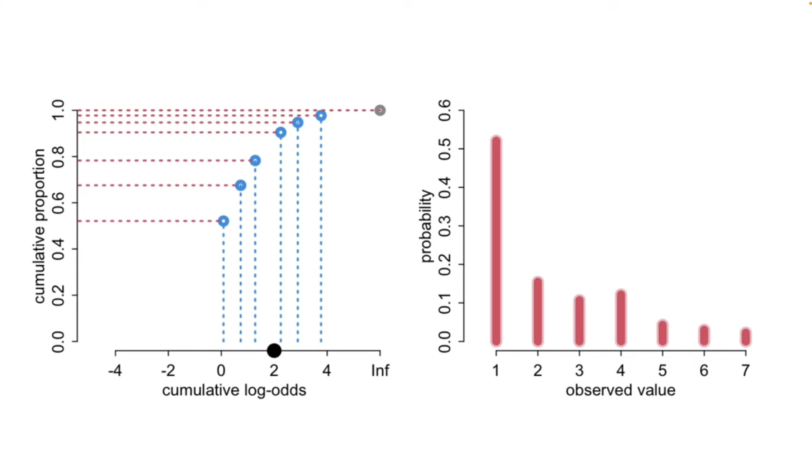
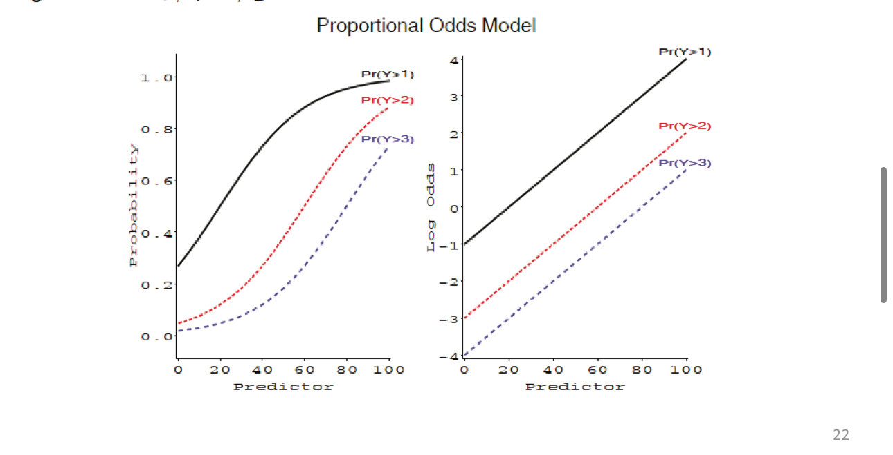

## Packages

```{r}
library(tidyverse)
library(easystats)
library(marginaleffects)
library(effects)
library(ordinal)
library(ggeffects)
library(emmeans)
library(car)
library(knitr)
library(patchwork)
library(MASS)
library(broom)
library(modelsummary)

options(scipen = 999)
```

-   Access the .qmd document here: <https://github.com/suyoghc/PSY504_Spring_2026/tree/main/posts>


## Announcements

## Today

::::: columns
::: {.column width="50%"}
-   From logistic to ordinal

-   Motivating simulation: Loaded dice

    -   Why not just use OLS?
    -   The latent variable idea
    -   Cumulative logit link
    -   Thresholds and slopes
:::

::: {.column width="50%"}
-   Application: Graduate school

    -   Model fitting
    -   Parameter interpretation
    -   Proportional odds assumption
    -   Model comparisons
    -   Visualizing
    -   Reporting
:::
:::::


## Last time: Logistic regression

-   Binary outcomes: 0 or 1

-   We modeled P(Y = 1) using the logit link

$$\text{logit}(p) = \log\frac{p}{1-p} = \beta_0 + \beta_1 X$$

-   The logit mapped probabilities $(0, 1)$ → log-odds $(-\infty, +\infty)$, allowing a linear model

. . .

::: callout-note
Today we extend this idea. What happens when your outcome has **more than two** ordered categories?
:::


## Ordinal Response Variables

-   In psychology many variables have a natural ordering

    -   Grades (e.g., A, B, C)
    -   Education level (e.g., BA, MS, PhD)
    -   Competitions (e.g., 1st, 2nd, 3rd)
    -   Economic status (e.g., wealthy, middle class, poor)

-   Most common are Likert scale ("Lick-ert") items


## This is a cat, not a dog?

```{r, echo=FALSE, fig.align='center', out.width="50%"}
knitr::include_graphics("images/Idli.JPG")
```

1.  Very likely to be a cat
2.  Somewhat likely to be a cat
3.  As likely to be cat or dog
4.  Somewhat likely to be a dog
5.  Very likely to be a dog


## Methods for analysis

-   **Metric models** (e.g., t-test, OLS)
    -   Overestimate information in data; common & "simple"
-   **Nonparametric** (e.g., signed ranks)
    -   Underestimate information; don't scale well
-   **Ordinal models** ← today
    -   Treat outcomes appropriately as ordered categories


## "What could possibly go wrong?" {.smaller}

Liddell and Kruschke (2018) surveyed 68 Psychology articles and found that **every** article used metric models on ordinal data.

. . .

Three main problems:

-   Response categories may not be (psychologically) **equidistant**

-   Responses can be **non-normally distributed**

-   Differences in **variances** of the underlying variable are treated inappropriately

. . .

::: callout-warning
Using metric models on ordinal data can lead to false alarms, failures to detect true effects, distorted effect sizes, and even inversions of effects.
:::


# Under the Hood: The Loaded Dice


## The Loaded Dice {.center}

Easier to understand ordinal regression if we **simulate it from scratch** and watch the steps unfold.

Just like our weighted coins helped us understand logistic regression.


## Simulation with a Data Generating Process {.smaller}

6 dice. 30 rolls each.

Each die has a lead weight. More lead → the die tends to produce higher scores on a continuous latent "quality" scale.

We then **bin** these latent scores into three ordered categories: **Low**, **Medium**, **High**.

```{r}
#| echo: true

set.seed(504)

# --- DATA GENERATING PROCESS ---
# Lead weight determines each die's latent mean
dice <- tibble(
  die         = 1:6,
  lead_weight = 1:6,
  latent_mean = c(-1.5, -0.5, 0, 0.5, 1.0, 2.0)
)

# TRUE thresholds (students will try to recover these)
tau1 <- -0.5   # boundary between Low and Medium
tau2 <-  1.0   # boundary between Medium and High

# Roll each die 30 times → continuous latent score → categorize
rolls <- dice %>%
  rowwise() %>%
  mutate(latent = list(rnorm(30, mean = latent_mean, sd = 1))) %>%
  unnest(latent) %>%
  ungroup() %>%
  group_by(die) %>%
  mutate(roll = row_number()) %>%
  ungroup() %>%
  mutate(
    category = case_when(
      latent <= tau1 ~ "Low",
      latent <= tau2 ~ "Medium",
      TRUE           ~ "High"
    ),
    category = ordered(category, levels = c("Low", "Medium", "High"))
  )
```


## The truth you normally never see {.smaller}

Each point is a roll. The **dashed lines** are the true thresholds. Color = the category it falls into.

```{r}
#| echo: false
#| fig-width: 11
#| fig-height: 5.5

# Consistent colors throughout all slides
color_low  <- "#d63031"
color_med  <- "#fdcb6e"
color_high <- "#00b894"

ggplot(rolls, aes(x = lead_weight, y = latent)) +
  geom_jitter(aes(color = category), width = 0.15, alpha = 0.5, size = 2) +
  geom_hline(yintercept = tau1, linetype = "dashed", linewidth = 1, color = "grey30") +
  geom_hline(yintercept = tau2, linetype = "dashed", linewidth = 1, color = "grey30") +
  annotate("text", x = 6.7, y = tau1 - 0.25, label = paste0("τ₁ = ", tau1), size = 5) +
  annotate("text", x = 6.7, y = tau2 + 0.25, label = paste0("τ₂ = ", tau2), size = 5) +
  scale_color_manual(values = c("Low" = color_low, "Medium" = color_med, "High" = color_high)) +
  labs(
    x = "Lead weight (grams)", y = "Latent score (unobserved in real life!)",
    title = "What's really happening under the hood",
    color = "Observed\ncategory"
  ) +
  theme_lucid(base_size = 16)
```

. . .

::: callout-important
In real life, you **never see this plot**. You only see the colors — the categories. The y-axis is hidden from you. Ordinal regression's job is to recover the thresholds and the effect of lead weight **using only the categories**.
:::


## What you actually observe

```{r}
#| echo: false
#| fig-width: 11
#| fig-height: 5.5

rolls %>%
  count(lead_weight, category) %>%
  group_by(lead_weight) %>%
  mutate(prop = n / sum(n)) %>%
  ggplot(aes(x = factor(lead_weight), y = prop, fill = category)) +
  geom_col(position = "stack", width = 0.7) +
  scale_fill_manual(values = c("Low" = color_low, "Medium" = color_med, "High" = color_high)) +
  labs(
    x = "Lead weight (grams)", y = "Proportion",
    title = "The data you actually observe — just category counts",
    fill = "Rating"
  ) +
  theme_lucid(base_size = 16)
```

. . .

More weight → more "High" and fewer "Low." The pattern is clear. How do we model it?


## RM: From counts to cumulative log-odds {.smaller}

Before we model anything, let's do the arithmetic ourselves. Pick the **3-gram die** (30 rolls):

```{r}
#| echo: true

die3 <- rolls %>% filter(lead_weight == 3)

# Step 1: Category counts and proportions
die3_counts <- die3 %>%
  count(category) %>%
  mutate(
    prop         = n / sum(n),
    cum_prop     = cumsum(prop),
    cum_odds     = cum_prop / (1 - cum_prop),
    log_cum_odds = log(cum_odds)
  )

kable(die3_counts, digits = 3)
```

. . .

::: callout-tip
## 🔗 Connection to the model

Those log-cumulative-odds you just computed? **They're exactly what the model's thresholds estimate** when there's no predictor. You just did ordinal regression by hand.
:::

```{webr-r}
# Try it yourself: pick a different die (change the number) and repeat
my_die <- rolls %>% filter(lead_weight == 5)

my_die %>%
  count(category) %>%
  mutate(
    prop = n / sum(n),
    cum_prop = cumsum(prop),
    cum_odds = cum_prop / (1 - cum_prop),
    log_cum_odds = log(cum_odds)
  )
```


## What if we just use OLS? {.smaller}

Code the categories as numbers (Low = 1, Medium = 2, High = 3) and fit a linear regression.

```{r}
#| echo: true
#| fig-width: 10
#| fig-height: 4.5

rolls_numeric <- rolls %>%
  mutate(y_numeric = as.numeric(category))

ols_bad <- lm(y_numeric ~ lead_weight, data = rolls_numeric)

ggplot(rolls_numeric, aes(x = lead_weight, y = y_numeric)) +
  geom_jitter(aes(color = category), width = 0.15, height = 0.1, alpha = 0.4, size = 2) +
  geom_smooth(method = "lm", se = TRUE, color = "red", linewidth = 1.2, fullrange = TRUE) +
  scale_color_manual(values = c("Low" = color_low, "Medium" = color_med, "High" = color_high),
                     guide = "none") +
  scale_x_continuous(limits = c(-1, 9)) +
  scale_y_continuous(breaks = 1:3, labels = c("Low", "Medium", "High")) +
  geom_hline(yintercept = c(0.5, 3.5), linetype = "dashed", color = "grey50") +
  annotate("text", x = 8, y = 3.4, label = "Impossible!", color = "red", size = 5) +
  annotate("text", x = -0.5, y = 0.6, label = "Impossible!", color = "red", size = 5) +
  labs(x = "Lead weight (grams)", y = "Response",
       title = "OLS on ordinal data: looks fine, isn't") +
  theme_lucid(base_size = 16)
```


## Thresholds matter — OLS can't see them {.smaller}

Same latent scores, **two different threshold placements**. OLS treats both identically.

::: panel-tabset
## Observed distributions

```{r}
#| echo: false
#| fig-width: 12
#| fig-height: 5

# Alternative thresholds: narrow Medium band
tau1_alt <- 0.0
tau2_alt <- 0.5

rolls_alt <- rolls %>%
  mutate(
    category_alt = case_when(
      latent <= tau1_alt ~ "Low",
      latent <= tau2_alt ~ "Medium",
      TRUE               ~ "High"
    ),
    category_alt = ordered(category_alt, levels = c("Low", "Medium", "High"))
  )

# Panel A: Original thresholds
p_orig <- rolls %>%
  count(lead_weight, category) %>%
  group_by(lead_weight) %>%
  mutate(prop = n / sum(n)) %>%
  ggplot(aes(x = factor(lead_weight), y = prop, fill = category)) +
  geom_col(position = "stack", width = 0.7) +
  scale_fill_manual(values = c("Low" = color_low, "Medium" = color_med, "High" = color_high)) +
  labs(x = "Lead weight", y = "Proportion",
       title = "Original: τ₁ = −0.5, τ₂ = 1.0",
       subtitle = "Wide Medium band",
       fill = "Rating") +
  theme_lucid(base_size = 14) +
  theme(legend.position = "bottom")

# Panel B: Squeezed thresholds
p_alt <- rolls_alt %>%
  count(lead_weight, category_alt) %>%
  group_by(lead_weight) %>%
  mutate(prop = n / sum(n)) %>%
  ggplot(aes(x = factor(lead_weight), y = prop, fill = category_alt)) +
  geom_col(position = "stack", width = 0.7) +
  scale_fill_manual(values = c("Low" = color_low, "Medium" = color_med, "High" = color_high)) +
  labs(x = "Lead weight", y = "Proportion",
       title = "Squeezed: τ₁ = 0.0, τ₂ = 0.5",
       subtitle = "Tiny Medium band",
       fill = "Rating") +
  theme_lucid(base_size = 14) +
  theme(legend.position = "bottom")

p_orig + p_alt
```

## OLS on both

```{r}
#| echo: false
#| fig-width: 12
#| fig-height: 5

# OLS on original
rolls_ols_orig <- rolls %>%
  mutate(y_num = as.numeric(category))

p_ols_orig <- ggplot(rolls_ols_orig, aes(x = lead_weight, y = y_num)) +
  geom_jitter(aes(color = category), width = 0.15, height = 0.1, alpha = 0.4, size = 2) +
  geom_smooth(method = "lm", se = TRUE, color = "red", linewidth = 1.2) +
  scale_color_manual(values = c("Low" = color_low, "Medium" = color_med, "High" = color_high),
                     guide = "none") +
  scale_y_continuous(breaks = 1:3, labels = c("Low", "Medium", "High")) +
  labs(x = "Lead weight", y = "Response",
       title = "OLS: Original thresholds",
       subtitle = paste0("Slope = ", round(coef(lm(y_num ~ lead_weight, data = rolls_ols_orig))[2], 3))) +
  theme_lucid(base_size = 14)

# OLS on squeezed
rolls_ols_alt <- rolls_alt %>%
  mutate(y_num = as.numeric(category_alt))

p_ols_alt <- ggplot(rolls_ols_alt, aes(x = lead_weight, y = y_num)) +
  geom_jitter(aes(color = category_alt), width = 0.15, height = 0.1, alpha = 0.4, size = 2) +
  geom_smooth(method = "lm", se = TRUE, color = "red", linewidth = 1.2) +
  scale_color_manual(values = c("Low" = color_low, "Medium" = color_med, "High" = color_high),
                     guide = "none") +
  scale_y_continuous(breaks = 1:3, labels = c("Low", "Medium", "High")) +
  labs(x = "Lead weight", y = "Response",
       title = "OLS: Squeezed thresholds",
       subtitle = paste0("Slope = ", round(coef(lm(y_num ~ lead_weight, data = rolls_ols_alt))[2], 3))) +
  theme_lucid(base_size = 14)

p_ols_orig + p_ols_alt
```

## Ordinal model recovers both

```{r}
#| echo: true

# Ordinal model on original thresholds
fit_orig <- clm(category ~ lead_weight, data = rolls, link = "logit")

# Ordinal model on squeezed thresholds
fit_alt <- clm(category_alt ~ lead_weight, data = rolls_alt, link = "logit")

bind_rows(
  tibble(thresholds = "Original (−0.5, 1.0)", term = names(coef(fit_orig)), estimate = coef(fit_orig)),
  tibble(thresholds = "Squeezed (0.0, 0.5)",  term = names(coef(fit_alt)),  estimate = coef(fit_alt))
) %>%
  kable(digits = 3)
```
:::

::: callout-important
## The point

The distributions look completely different. OLS gives nearly the same answer for both. The ordinal model **recovers the different thresholds** — it knows the measurement scales differ.
:::


## Problems with the "treat it as numeric" approach

::: callout-warning
## Three things went wrong

1.  **Assumes equal spacing** — is the jump from Low → Medium the same as Medium → High? We don't know, but OLS assumes it is.

2.  **Predicts impossible values** — the line escapes the range of the data.

3.  **Wrong distributional assumptions** — residuals are not normal, variance is not constant.
:::

. . .

We need a model that respects the **ordered** nature of the outcome without assuming it's metric.


# Cumulative Logit Model


## The key idea: Cumulative splits {.smaller}

With **binary** logistic regression, we modeled one split:

$$\text{logit}(P(Y = 1)) = \beta_0 + \beta_1 X$$

. . .

With **ordinal** regression, we model **multiple cumulative splits**:

-   Split 1: P(Low) vs. P(Medium or High)
-   Split 2: P(Low or Medium) vs. P(High)

. . .

Each split is its own logistic regression — but they all share the **same slope**.

::: callout-note
## 🔗 The connection

With 2 categories, ordinal regression **is** logistic regression. There's 1 threshold, 1 slope.

With K categories, you get **K − 1 thresholds** but still just **1 slope** per predictor. Think of it as running K − 1 logistic regressions simultaneously, forced to have the same slope.
:::


## The latent variable interpretation

::::: columns
::: {.column width="50%"}
-   There is a continuous latent variable $\tilde{Y}$ (the "true score") that gets categorized into bins by **thresholds**: $\tau_1, \tau_2, \dots, \tau_{K-1}$

-   In our dice simulation:
    -   $\tilde{Y}$ = the latent score
    -   $\tau_1 = -0.5$, $\tau_2 = 1.0$
    -   Categories = Low, Medium, High
:::

::: {.column width="50%"}
{fig-align="center"}
:::
:::::


## Ordered = Cumulative

::::: columns
::: {.column width="50%"}
-   We use the **cumulative distribution** to model ordered categories

-   Cumulative probability: $P(Y \leq k)$

    -   Preserves the natural ordering
    -   Always increasing: $P(Y \leq 1) \leq P(Y \leq 2) \leq \dots$
:::

::: {.column width="50%"}
<br>

{fig-alt="Statistical Rethinking" fig-align="center" width="1088"}
:::
:::::


## Generalized linear model {.smaller}

You saw this in the logistic regression lecture. Same skeleton — three components:

$$\begin{align*}
  Y_i & \sim \mathrm{Dist}(\mu_i, \tau) & \quad & \text{← Random component} \\
  g(\mu_i) & = \eta_i & \quad & \text{← Link function} \\
  \eta_i & = \beta_0 + \beta_1 X_{1i} + \beta_2 X_{2i} + \ldots & \quad & \text{← Linear predictor}
\end{align*}$$

. . .

Last time we filled in: **Bernoulli** distribution, **logit** link, linear predictor with one intercept and slopes.

. . .

**What changes for ordinal data?**


## Ordinal regression: Filling in the GLM {.smaller}

$$\begin{align*}
  Y_i & \sim \color{#d63031}{\mathrm{Cumulative}}(\pi_1, \ldots, \pi_K) & \quad & \color{#d63031}{\text{← Ordinal outcome (K ordered categories)}} \\[8pt]
  \color{#2d3436}{g(\mu_i)} & = \color{#0984e3}{\mathrm{logit}} & \quad & \color{#0984e3}{\text{← Same link as logistic regression}} \\[8pt]
  \eta_i & = \color{#00b894}{\alpha_k - (\beta_1 X_{1i} + \beta_2 X_{2i} + \ldots)} & \quad & \color{#00b894}{\text{← Thresholds + slopes}}
\end{align*}$$

. . .

::::: columns
::: {.column width="33%"}
[**Distribution**]{style="color: #d63031; font-size: 1.1em;"}

Models cumulative probability $P(Y \leq k)$ — preserves the ordering
:::
::: {.column width="33%"}
[**Link**]{style="color: #0984e3; font-size: 1.1em;"}

Logit — identical to logistic regression. Nothing new here.
:::
::: {.column width="33%"}
[**Linear predictor**]{style="color: #00b894; font-size: 1.1em;"}

$K-1$ thresholds $\alpha_k$ (one per split) + shared slopes $\beta$ (proportional odds)
:::
:::::


## Cumulative logit model (notation) {.smaller}

| Symbol        | Meaning                                                |
|---------------|--------------------------------------------------------|
| $P_k$         | Probability of being in category k                     |
| $C_{pk}$      | Cumulative probability of being in category k or lower |
| 1 − $C_{pk}$  | Probability of being above category k                  |

$$\textrm{Cumulative Odds} = \frac{P(Y \leq k)}{P(Y > k)} = \frac{C_{pk}}{1-C_{pk}}$$

. . .

Take the log to get the **cumulative logit**:

$$\log\left(\frac{C_{pk}}{1-C_{pk}}\right)$$

. . .

::: callout-note
## 🏷️ Jargon Alert

Cumulative logit = cumulative log-odds = the same logit link you already know, just applied to *cumulative* probabilities.
:::


## Cumulative logit model

{fig-align="center"}


## Cumulative logit model

{fig-align="center"}


## Cumulative logit model




## The model equation {.smaller}

$$\log \left(\frac{P(Y \leq k)}{P(Y > k)}\right) = \alpha_k - \beta X$$

$$\begin{array}{rcl} L_1 &=& \alpha_1 - \beta_1 x_1 - \cdots - \beta_p X_p\\ L_2 &=& \alpha_2 - \beta_1 x_1 - \cdots - \beta_p X_p \\ L_{J-1} &=& \alpha_{J-1} - \beta_1 x_1 - \cdots - \beta_p X_p \end{array}$$

-   We estimate **J − 1 equations** simultaneously

-   Each equation has a **different intercept** $\alpha_k$ (the thresholds/cut points)

-   But a **common slope** $\beta$ ← this is the proportional odds assumption

-   Intercepts are always ordered: $\alpha_1 < \alpha_2 < \dots$


## What do the pieces mean?

-   $\alpha_k$ (thresholds/intercepts/cut-offs):

    -   Log-odds of falling **at or below** category $k$ when all predictors = 0
    -   These are the ordinal equivalent of $\beta_0$ in logistic regression

-   $\beta$ (slopes):

    -   Effect of the predictor on the log-odds of being in a **higher** category
    -   Shared across all cumulative splits

-   The $-$ sign:

    -   Convention so that a **positive** $\beta$ means higher X → higher category


Thresholds are where the latent variable gets **cut** into categories.

```{r}
#| echo: false
#| fig-width: 12
#| fig-height: 5

# Panel 1: Thresholds close together
p1 <- ggplot(data.frame(x = c(-4, 4)), aes(x)) +
  stat_function(fun = dnorm, linewidth = 1.2) +
  geom_vline(xintercept = c(-0.3, 0.3), color = c(color_low, "#0984e3"),
             linetype = "dashed", linewidth = 1) +
  annotate("text", x = -2, y = 0.35, label = "Low", size = 6, color = color_low) +
  annotate("text", x = 0, y = 0.35, label = "Med", size = 6, color = color_med) +
  annotate("text", x = 2, y = 0.35, label = "High", size = 6, color = color_high) +
  labs(title = "Thresholds close together → narrow middle",
       x = "Latent variable", y = "") +
  theme_lucid(base_size = 14) +
  theme(axis.text.y = element_blank())

# Panel 2: Thresholds far apart
p2 <- ggplot(data.frame(x = c(-4, 4)), aes(x)) +
  stat_function(fun = dnorm, linewidth = 1.2) +
  geom_vline(xintercept = c(-1.5, 1.5), color = c(color_low, "#0984e3"),
             linetype = "dashed", linewidth = 1) +
  annotate("text", x = -2.7, y = 0.35, label = "Low", size = 6, color = color_low) +
  annotate("text", x = 0, y = 0.35, label = "Med", size = 6, color = color_med) +
  annotate("text", x = 2.7, y = 0.35, label = "High", size = 6, color = color_high) +
  labs(title = "Thresholds far apart → wide middle",
       x = "Latent variable", y = "") +
  theme_lucid(base_size = 14) +
  theme(axis.text.y = element_blank())

p1 + p2
```

. . .

Close thresholds → few people land in the middle category. Far-apart thresholds → the middle category captures a wide range.


## What the slope does {.smaller}

The slope $\beta$ shifts the **entire latent distribution** along the x-axis — the thresholds stay put.

```{r}
#| echo: false
#| fig-width: 12
#| fig-height: 5

# Show effect of shifting the distribution
p_shift1 <- ggplot(data.frame(x = c(-5, 5)), aes(x)) +
  stat_function(fun = dnorm, args = list(mean = -1), linewidth = 1.2, color = "#0984e3") +
  geom_vline(xintercept = c(-0.5, 1.0), linetype = "dashed", linewidth = 0.8) +
  annotate("text", x = -3, y = 0.35, label = "Low weight\n(shifted left)", 
           color = "#0984e3", size = 5) +
  labs(title = "Low lead weight → distribution shifted left → more 'Low'",
       x = "Latent variable", y = "") +
  theme_lucid(base_size = 14) +
  theme(axis.text.y = element_blank())

p_shift2 <- ggplot(data.frame(x = c(-5, 5)), aes(x)) +
  stat_function(fun = dnorm, args = list(mean = 1.5), linewidth = 1.2, color = "#6c5ce7") +
  geom_vline(xintercept = c(-0.5, 1.0), linetype = "dashed", linewidth = 0.8) +
  annotate("text", x = 3.5, y = 0.35, label = "High weight\n(shifted right)", 
           color = "#6c5ce7", size = 5) +
  labs(title = "High lead weight → distribution shifted right → more 'High'",
       x = "Latent variable", y = "") +
  theme_lucid(base_size = 14) +
  theme(axis.text.y = element_blank())

p_shift1 + p_shift2
```

. . .

A positive $\beta$ shifts the distribution **right**, increasing P(higher categories). The thresholds $\alpha_k$ don't move — they're properties of the response scale, not the predictor.


## Parametrization note {.smaller}

::::: columns
::: {.column width="50%"}
-   With **subtraction** convention ($\alpha_k - \beta X$):

    -   Positive $\beta$ → higher probability of being in **higher** categories

{fig-align="center"}
:::

::: {.column width="50%"}
-   With **addition** convention ($\alpha_k + \beta X$):

    -   Positive $\beta$ → higher probability of being in **lower** categories

{fig-align="center"}
:::
:::::

. . .

::: callout-tip
`ordinal::clm()` uses **subtraction** by default (positive = higher). `MASS::polr()` also uses subtraction. Just check the documentation for whatever package you use.
:::


## RM: The intercept-only model {.smaller}

Before adding predictors, fit a model with **no predictor at all** — just the thresholds.

```{r}
#| echo: true

# Intercept-only model: just thresholds, no slope
dice_null <- clm(category ~ 1, data = rolls, link = "logit")

broom::tidy(dice_null) %>%
  kable(digits = 3)
```

. . .

::: callout-note
## 🔗 Recognize these?

These threshold estimates are the **log-cumulative-odds pooled across all six dice** — the same quantity you just computed by hand, but now averaged over the whole dataset. When we add `lead_weight` as a predictor next, watch how the thresholds and model fit change.
:::


## Fitting our dice data {.smaller}

```{r}
#| echo: true

library(ordinal)

# Fit the ordinal model
dice_fit <- clm(category ~ lead_weight, data = rolls, link = "logit")

summary(dice_fit)
```


## Interpreting the output {.smaller}

```{r}
#| echo: false

broom::tidy(dice_fit, conf.int = TRUE) %>%
  kable(digits = 3)
```

. . .

**Two parts:**

-   **Thresholds** (intercepts for each cumulative split)

    -   `Low|Medium`: log-odds of $Y \leq$ Low when lead_weight = 0
    -   `Medium|High`: log-odds of $Y \leq$ Medium when lead_weight = 0

-   **Slope** (shared across splits)

    -   `lead_weight`: effect on log-odds of being in a higher category

. . .

::: callout-tip
## Can we recover the truth?

True thresholds: $\tau_1$ = `r tau1`, $\tau_2$ = `r tau2`. Compare to the estimated thresholds above. True slope of the latent mean was roughly 0.7 per gram. How close did we get?
:::


## From log-odds to odds ratios

```{r}
#| echo: true

# Exponentiate to get cumulative odds ratios
broom::tidy(dice_fit, exponentiate = TRUE, conf.int = TRUE) %>%
  filter(coef.type == "location") %>%
  kable(digits = 3)
```

. . .

-   Interpretation: Each additional gram of lead **multiplies** the odds of being in a higher category by the OR


## From log-odds to probabilities

```{r}
#| echo: true

# Predicted probabilities for each die
predictions(dice_fit, newdata = datagrid(lead_weight = 1:6)) %>%
  kable(digits = 3)
```


## Visualizing the dice model {.smaller}

```{r}
#| echo: true
#| fig-width: 11
#| fig-height: 5

plot_predictions(dice_fit, condition = "lead_weight", type = "prob") +
  facet_wrap(~group) +
  scale_fill_manual(values = c(color_low, color_med, color_high)) +
  labs(x = "Lead weight (grams)", y = "Predicted probability") +
  theme_lucid(base_size = 16)
```

. . .

As weight increases: P(Low) decreases, P(High) increases. The S-curves are the same shape (proportional odds!) — just shifted.


## Proportional odds assumption {.smaller}

-   The key assumption: the **slope is equal** across all cumulative splits

-   In our dice model: the effect of lead weight on the log-odds of $Y \leq$ Low vs. $Y >$ Low is the **same** as the effect on $Y \leq$ Medium vs. $Y >$ Medium

{fig-align="center"}

. . .

::: callout-note
If this assumption holds, you only need **one slope** per predictor — massive parsimony. If it doesn't hold, consider partial proportional odds or multinomial models.
:::


## FYI: Partial proportional odds model {.smaller}

-   Is it fair to say the effect of your predictor stays the same across all category transitions?

. . .

-   Examples of when this breaks down:
    -   Test prep might help more for moving from F → D than from A− → A
    -   Age might strongly affect moving from "poor" → "fair" health but less so from "good" → "excellent"
    -   Ceiling effects

. . .

-   How to know?
    -   Likelihood ratio test comparing the two types of models
    -   Big difference ⇒ the proportional assumption is probably wrong


## Dice simulation: Recap {.smaller}

| Step | What we did | What it teaches |
|------|------------|-----------------|
| Generate latent scores | `rnorm()` per die | Latent variable concept |
| Apply thresholds | `case_when()` with $\tau_1$, $\tau_2$ | How categories arise from a continuum |
| Fit OLS | `lm(y_numeric ~ lead_weight)` | Why treating ordinal as numeric fails |
| Fit ordinal model | `clm(category ~ lead_weight)` | How cumulative logit works |
| Check estimates vs. truth | Compare $\hat{\alpha}$ to $\tau$, $\hat{\beta}$ to true slope | Model recovers the generating process |

. . .

::: callout-note
Now let's apply this to real data — where we don't know the truth.
:::


# Case Study: Applying to Graduate School


## Data: Postgraduate school applications {.smaller}

-   Undergraduate students report how likely they were to apply to graduate school (`apply`): "Unlikely", "Somewhat Likely", "Very Likely"

-   Additional information: GPA (`gpa`), parent education (`pared`) (college vs. no college), type of schooling (`public`) (public vs. private)

```{r}
#| echo: false
dat <- read.csv("https://raw.githubusercontent.com/jgeller112/PSY504-Advanced-Stats-S24/main/slides/Ordinal_Regression/data/graduate_school.csv")
```

```{webr-r}
dat <- read.csv("https://raw.githubusercontent.com/jgeller112/PSY504-Advanced-Stats-S24/main/slides/Ordinal_Regression/data/graduate_school.csv")
```

```{r}
#| echo: false
dat %>% 
  count(apply) %>% 
  mutate(proportion = n / sum(n)) %>%
  kable(digits = 3)
```


## Data preparation

```{r}
#| echo: false
dat <- dat %>%
  mutate(pared = as.factor(pared), public = as.factor(public))

dat$apply <- ordered(dat$apply, levels = c("unlikely", "somewhat likely", "very likely"))
```

```{webr-r}
dat <- dat %>%
  mutate(pared = as.factor(pared), public = as.factor(public))

# make sure the outcome is ordered properly 
dat$apply <- ordered(dat$apply, levels = c("unlikely", "somewhat likely", "very likely"))

head(dat$apply)  # check to see if ordered
```

. . .

::: callout-tip
Always use `ordered()` to explicitly set the level ordering. R won't guess correctly — it defaults to alphabetical.
:::


## Exploratory data analysis

```{r}
#| echo: false
#| fig-width: 10
#| fig-height: 5
#| fig-align: center

dat %>%
  count(pared, apply) %>%
  group_by(pared) %>%
  mutate(prop = n / sum(n)) %>%
  ggplot(aes(x = pared, y = prop, fill = apply)) +
  geom_col(position = "stack", width = 0.6) +
  scale_fill_manual(values = c("unlikely" = color_low, 
                                "somewhat likely" = color_med, 
                                "very likely" = color_high)) +
  labs(x = "Parent went to college", y = "Proportion", fill = "Apply") +
  theme_lucid(base_size = 18)
```


## Model 1: Parent education only

$$\text{logit}(P(Y_i \leq j)) = \alpha_j - \beta_1 \cdot \text{pared}_i$$

-   Fit the model with `ordinal::clm` (can also use `MASS::polr`)

```{r}
#| echo: false
library(ordinal)
ols1 <- clm(apply ~ pared, data = dat, link = "logit")
```

```{webr-r}
# link = probit would also be acceptable
ols1 <- clm(apply ~ pared, data = dat, link = "logit")

summary(ols1)
```


## Interpreting output {.smaller}

```{r}
#| echo: false
broom::tidy(ols1, conf.int = TRUE) %>%
  kable(digits = 3)
```

. . .

-   **Thresholds** (2 thresholds for 3 categories)

    -   `unlikely|somewhat likely`: log-odds of being Unlikely vs. higher, when pared = 0
    -   `somewhat likely|very likely`: log-odds of being ≤ Somewhat Likely vs. Very Likely, when pared = 0

-   **Slope**

    -   `pared1`: Students with a college-educated parent have higher log-odds of being in a higher application category

```{webr-r}
# What is the intercept?
# What is the slope? How do we interpret it?

```


## Cumulative odds ratios

```{r}
#| echo: true
broom::tidy(ols1, exponentiate = TRUE, conf.int = TRUE) %>%
  filter(coef.type == "location") %>%
  kable(digits = 3)
```

-   Exponentiate the log cumulative odds to get odds ratios

-   Students with college-educated parents have roughly 3× the odds of applying to graduate school


## Probabilities

$$P(Y \leq k) = \frac{\exp(\alpha_k - \beta X)}{1 + \exp(\alpha_k - \beta X)}$$

```{webr-r}
# Try converting manually:
# What is P(unlikely) for pared = 0?
# What is P(unlikely) for pared = 1?

```


## Predicted probabilities

```{r}
#| echo: true
predictions(ols1, newdata = datagrid(pared = c("0", "1"))) %>%
  kable(digits = 3)
```


## Model 1 visualization

```{r}
#| echo: true
#| fig-align: center

plot_predictions(ols1, condition = "pared", type = "prob") +
  facet_wrap(~group) +
  labs(x = "Parent Education", y = "Predicted probability") +
  scale_y_continuous(labels = scales::percent) +
  theme_lucid(base_size = 20)
```


## Marginal effects

```{r}
#| echo: true
avg_comparisons(ols1) %>%
  kable(digits = 3)
```

. . .

::: callout-tip
Marginal effects tell you the change in **probability** for each category — much easier to interpret than odds ratios.
:::


## Testing proportional odds assumption

-   `brant` test: compares the full proportional odds model to one that relaxes the assumption

    -   You want a **non-significant** $\chi^2$ test

```{r}
#| echo: true
library(gofcat)
brant.test(ols1)
```


## If the proportional odds test is violated

Several options:

-   **Multinomial regression** — use lowest level as reference; no ordering assumed

-   **Adjacent category model** — model transitions between neighboring categories

-   **Non-proportional odds (NPO) model** — allow slopes to vary by split

```{r}
#| echo: true
#| eval: false
# In VGAM: NPO model
library(VGAM)
ols_npo <- vglm(apply ~ pared, family = cumulative(parallel = FALSE, reverse = TRUE), data = dat)
```


## Model 2: Add public school + GPA

```{r}
#| echo: false
ols2 <- clm(apply ~ pared + public + gpa, data = dat)
```

```{webr-r}
ols2 <- clm(apply ~ pared + public + gpa, data = dat)

broom::tidy(ols2, conf.int = TRUE) %>%
  filter(coef.type == "location") %>%
  kable(digits = 3)
```

. . .

```{webr-r}
# What do the coefficients mean?
# pared1: 
# public1: 
# gpa: 

```


## Test proportional odds: Model 2

```{r}
#| echo: true
brant.test(ols2)
```


## Visualization: Stacked area plots

::: panel-tabset
## Continuous (GPA)

```{r}
#| fig-align: center
library(effects)
plot(effect("gpa", ols2), style = "stacked")
```

## Categorical (Public)

```{r}
#| fig-align: center
plot(effect("public", ols2), style = "stacked")
```
:::


## RM: Seeing the full redistribution {.smaller}

A predictor doesn't push someone into a specific category — it shifts their latent score, which **redistributes probability across all categories simultaneously**.

```{r}
#| echo: true
#| fig-width: 11
#| fig-height: 5

predictions(ols2, 
            newdata = datagrid(gpa = c(2.5, 3.0, 3.5, 4.0), 
                               pared = "0", public = "0")) %>%
  mutate(gpa_label = paste0("GPA = ", gpa)) %>%
  ggplot(aes(x = group, y = estimate, fill = group)) +
  geom_col(width = 0.7) +
  geom_errorbar(aes(ymin = conf.low, ymax = conf.high), width = 0.2) +
  facet_wrap(~gpa_label, nrow = 1) +
  scale_fill_manual(values = c("unlikely" = color_low, 
                                "somewhat likely" = color_med, 
                                "very likely" = color_high),
                    guide = "none") +
  scale_y_continuous(labels = scales::percent) +
  labs(x = "Response category", y = "Predicted probability",
       title = "How probability mass redistributes as GPA increases",
       subtitle = "Non-college-educated parent, private school") +
  theme_lucid(base_size = 14) +
  theme(axis.text.x = element_text(angle = 20, hjust = 1))
```

. . .

::: callout-tip
This is what the model *predicts*, not the raw data. As GPA rises, probability drains from "unlikely" and flows into "somewhat likely" and "very likely." **All three categories change simultaneously — that's the ordinal redistribution.**
:::


## Model 3: Add interaction (pared × GPA)

```{r}
#| echo: false
ols3 <- clm(apply ~ public + pared * gpa, data = dat)
```

```{webr-r}
ols3 <- clm(apply ~ public + pared * gpa, data = dat)

broom::tidy(ols3, conf.int = TRUE) %>%
  filter(coef.type == "location") %>%
  kable(digits = 3)
```


## Model comparisons

-   Likelihood ratio test (LRT)

```{r}
#| echo: true
# Main effects model vs. interaction
ols_test <- anova(ols2, ols3)
kable(ols_test)
```


## Testing significance

```{r}
#| echo: true
# Use Type III if interactions are important
ols_test3 <- anova(ols3, type = "III")
kable(ols_test3)
```


## Model comparison table

```{r}
#| echo: true
modelsummary(
  list("Parent Ed" = ols1,
       "Main Effects" = ols2,
       "Interaction" = ols3),
  exponentiate = TRUE,
  stars = TRUE,
  title = "Ordinal Regression: Model Comparison"
)
```


## Visualization: Interaction

```{r}
#| echo: true
#| fig-align: center
plot_predictions(ols3, condition = c("gpa", "pared"), type = "prob") +
  facet_grid(~group) +
  theme_lucid(base_size = 14)
```


## Pairwise comparisons

-   Results are on the logit (latent scale) by default

```{webr-r}
emmeans(ols3, list(pairwise ~ pared, pairwise ~ public))
```


## Simple slopes

```{webr-r}
emtrends(ols3, pairwise ~ pared, var = "gpa")
```


## Latent scale

```{r}
#| fig-align: center
plot(effect("pared:gpa", ols3, latent = TRUE))
```


## Marginal effects

```{r}
#| echo: true
avg_comparisons(ols3) %>%
  kable(digits = 3)
```


## Model fit

-   Pseudo-$R^2$

```{r}
#| echo: true
r2_mcfadden(ols2)
```

. . .

-   Not "explained variance" — but a ratio indicating how much better the model fits than an intercept-only model


## Model diagnostics {.smaller}

-   No `easystats` functions for ordinal models :(

-   `sure` package: **surrogate residuals** — based on continuous residuals

    -   Check normality, linearity, homoscedasticity

```{r}
#| echo: true
#| fig-align: center
#| fig-height: 6

library(sure)

set.seed(1225)

gridExtra::grid.arrange(
  autoplot.clm(ols2, nsim = 100, what = "qq"),
  autoplot.clm(ols2, nsim = 100, what = "fitted", alpha = 0.5),
  ncol = 2
)
```

::: callout-note
For multicollinearity, check correlations between predictor variables directly.
:::


# Assumptions


## Ordinal regression assumptions

-   Outcome is **ordinal** (ordered categories)

-   Observations are **independent**

-   **Proportional odds** (parallel slopes across cumulative splits)

-   **Linearity** in the log-odds (for continuous predictors)

-   ~~No normality assumptions for residuals~~

-   ~~Homogeneity of variance~~


## Multilevel ordinal regressions

-   For repeated measures or clustered/nested designs:

```{r}
#| eval: false
# Use clmm() from the ordinal package
ols_multilevel <- ordinal::clmm(
  apply ~ pared + gpa + (1 | school_id),
  data = dat
)
```


## Sample write-up

::: callout-tip
A proportional odds model with a logit link (estimated using ML) was used to investigate factors influencing undergraduates' likelihood of applying to graduate school ("unlikely," "somewhat likely," "very likely"). The overall model fit was modest, McFadden's pseudo-$R^2$ = .03. Parent education significantly predicted application likelihood, *b* = 1.05, *z* = 3.94, *p* < .001, OR = 2.85, 95% CI [1.55, 5.28]. Students with college-educated parents had roughly 185% higher odds of applying. Whether students attended public or private school did not significantly predict application likelihood, *b* = −0.06, *z* = −0.20, *p* = .844, OR = 0.94. GPA was also a significant predictor, *b* = 0.62, *z* = 2.36, *p* = .018, OR = 1.85. Each one-point increase in GPA was associated with 85% higher odds of applying.
:::


## Reporting checklist

-   Report the model type (**proportional odds / cumulative logit**) and estimation method

-   Report **log-odds coefficients and odds ratios** with 95% CIs

-   Report thresholds (or note they are available)

-   Report a measure of model fit (**McFadden pseudo-$R^2$**)

-   **Test and report** the proportional odds assumption (Brant test or LRT)

-   Consider reporting **marginal effects** / predicted probabilities for each category

-   Include sample size and **distribution across response categories**

-   Mention diagnostics (surrogate residuals, multicollinearity)


## Common Mistakes {.smaller}

-   **Treating ordinal data as continuous** — running OLS or t-tests on Likert scales

-   Forgetting that coefficients are in **cumulative log-odds**, not probabilities

-   Confusing **thresholds with slopes** — thresholds are intercepts for each cumulative split, not effects of predictors

-   **Ignoring the proportional odds assumption**
    -   Always test it; if it fails, consider partial proportional odds or multinomial

-   Interpreting **odds ratios as probability ratios**
    -   OR = 3 means 3× the *odds*, not 3× the *probability*

-   **Not visualizing** predicted probabilities per category
    -   Log-odds and ORs are hard to interpret; always plot `plot_predictions()`

