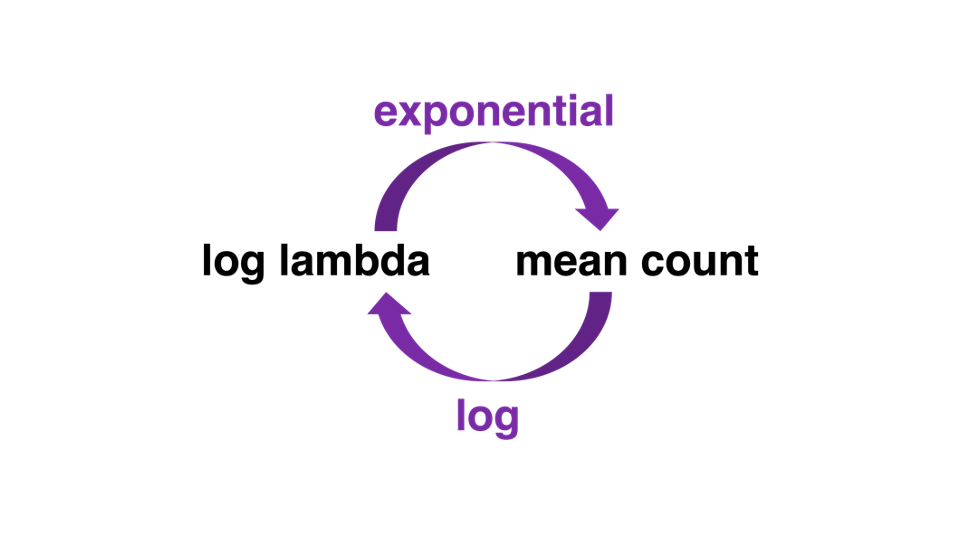

## Today

-   GLMs for count data

    -   Poisson, negative binomial (overdispersion), and zero-inflated (excess zeros) models

        -   Fitting and interpretation in R

        -   Visualization

        -   Effect sizes

        -   Reporting

    -   Running example: stuttering and fixations to faces


## Packages

```{r}
library(tidyverse) # data wrangling
library(easystats) # performance
library(kableExtra) # table formatting
library(ggeffects) # plot 
library(lme4) # glmer 
library(knitr)
library(patchwork) # combine plots
library(viridis) # colors
library(gridExtra)
library(pscl) # zip 
library(glmmTMB) # zero inflated glmer 
library(marginaleffects)
library(modelsummary)
library(broom.mixed)

options(scipen=999) # get rid of sci notation
```

-   Access the .qmd document here: <https://github.com/suyoghc/PSY504_Spring_2026/tree/main/posts>

## Count data

-   Today's lecture brought to you by the number 8

```{r, echo=F, out.width="100%", fig.align='center'}


```


------------------------------------------------------------------------

## Recall: the log link {.smaller}

In our logistic regression slides, we previewed two link functions:

::::: columns
::: {.column width="50%"}
### Logit link (done ✓)

$$\text{logit}(p) = \log\frac{p}{1-p}$$

-   Maps probability $(0, 1)$ → $(-\infty, +\infty)$
-   Used for: **Binomial / Logistic** models
:::

::: {.column width="50%"}
### Log link (today!)

$$\log(\mu) = \beta_0 + \beta_1 X$$

-   Maps positive values $(0, +\infty)$ → $(-\infty, +\infty)$
-   Used for: **Poisson / Count** models
-   Inverse is exponentiation: $\mu = e^{\beta_0 + \beta_1 X}$
:::
:::::


## Poisson distribution {data-link="Poisson distribution"}

```{r}
#| echo: false
#| fig-align: "center"

set.seed(2000)
sim1 <- rpois(100000,1)
sim2 <- rpois(100000,5)
sim3 <- rpois(100000,50)
pois_sim <- tibble (
  sim1 = sim1, 
  sim2 = sim2, 
  sim3 = sim3
)

ggplot(data = pois_sim, aes(x = sim1)) +
  geom_histogram() +
  labs(x = "", title = "lambda:1") + 
  theme_lucid(base_size=25)
```


## Poisson distribution

$$Y_i \sim Poisson(\lambda)$$

Let $Y$ be the number of events in a given unit of time or space.


$$P(Y=y) = \frac{e^{-\lambda}\lambda^y}{y!} \hspace{10mm} y=0,1,2,\ldots, \infty$$

. . .

-   $E(Y) = Var(Y) = \lambda$ (*just the mean number of events*)
-   The distribution is typically skewed right, particularly if $\lambda$ is small
-   The distribution becomes more symmetric as $\lambda$ increases
    -   If $\lambda$ is sufficiently large, it can be approximated using a normal distribution


## Poisson distribution

```{r}
#| fig-align: "center"
#| echo: false

set.seed(2000)
sim1 <- rpois(100000,1)
sim2 <- rpois(100000,5)
sim3 <- rpois(100000,50)
pois_sim <- tibble (
  sim1 = sim1, 
  sim2 = sim2, 
  sim3 = sim3
)
p1 <- ggplot(data = pois_sim, aes(x = sim1)) +
  geom_histogram() +
  labs(x = "", title = "lambda:1")
p2 <- ggplot(data = pois_sim, aes(x = sim2)) +
  geom_histogram() +
  labs(x = "", title = "lambda:5")
p3 <- ggplot(data = pois_sim, aes(x = sim3)) +
  geom_histogram() +
  labs(x = "", title = "lambda:50")
p1 + p2 + p3 
```

```{r echo = F}
sum1 <- c(mean(sim1), var(sim1))
sum2 <- c(mean(sim2), var(sim2))
sum3 <- c(mean(sim3), var(sim3))
data <- rbind(sum1,sum2,sum3)
rownames(data) <- c("lambda = 1", "lambda = 5","lambda = 50")
colnames(data) <- c("Mean", "Variance")
kable(data,format="html")
```


## Examples

The annual number of earthquakes registering at least 2.5 on the Richter Scale and having an epicenter within 40 miles of downtown Memphis follows a Poisson distribution with mean 6.5. **What is the probability there will be 3 or fewer such earthquakes next year?**

. . .

$$P(Y<=y) = \frac{e^{-6.5}6.5^0} {0!}+
\frac{e^{-6.5}6.5^1} {1!} + 
 \frac{e^{-6.5}6.5^2} {2!} + 
  \frac{e^{-6.5}6.5^3} {3!}$$
. . .
```{webr-r}
a=(exp(-6.5) * 6.5^0) / factorial(0)
b=(exp(-6.5) * 6.5^1) / factorial(1)
c=(exp(-6.5) * 6.5^2) / factorial(2)
d=(exp(-6.5) * 6.5^3) / factorial(3)

ppois(3, 6.5)
```

## Examples

-   Exact count

    -   Let's say you read, on average, 10 pages an hour. **What is the probability you will read 8 pages in an hour?**

. . .

$$P(Y=y)= \frac{e^{-10}10^8} {8!}$$

```{webr-r}
prob <- (exp(-10) * 10^8) / factorial(8)

dpois(x=8, lambda=10)

prob
```


# Under the Hood: What Happens When You Fit OLS to Counts? {.center}

## Simulation with a Data Generating Process {.smaller}


```{r}
#| echo: true

set.seed(504)

# --- DATA GENERATING FUNCTION ---
# Department size (scaled 1-8) determines the average number of attendees
departments <- tibble(
  dept        = 1:8,
  dept_size   = 1:8,
  true_lambda = c(0.5, 1, 2, 4, 6, 10, 15, 25)
)

# 30 seminars per department
seminar_data <- departments %>%
  rowwise() %>%
  mutate(attendees = list(rpois(30, true_lambda))) %>%
  unnest(attendees) %>%
  ungroup()

# Summarize
dept_summary <- seminar_data %>%
  group_by(dept, dept_size, true_lambda) %>%
  summarize(
    mean_attend = mean(attendees),
    var_attend  = var(attendees),
    .groups = "drop"
  )
```

## The raw data

```{r}
dept_summary %>% knitr::kable(digits = 2)
```


## What if we fit OLS? {.smaller}

```{r}
#| echo: true
#| fig-width: 10
#| fig-height: 4.5

ols_counts <- lm(attendees ~ dept_size, data = seminar_data)

ggplot(seminar_data, aes(x = dept_size, y = attendees)) +
  geom_jitter(width = 0.15, alpha = 0.4, size = 2, color = "#0984e3") +
  geom_smooth(method = "lm", se = TRUE, color = "red", linewidth = 1.2,
              fullrange = TRUE) +
  scale_x_continuous(limits = c(-2, 12), breaks = 1:8) +
  geom_hline(yintercept = 0, linetype = "dashed", color = "grey50") +
  annotate("text", x = -1, y = -4, label = "Negative counts!\nImpossible!", 
           color = "red", size = 5, fontface = "bold") +
  labs(x = "Department size (scaled)", y = "Number of attendees") +
  theme_lucid(base_size = 16)
```

. . .


## Two problems with OLS on counts {.smaller}

```{r}
#| echo: false
#| fig-width: 14
#| fig-height: 5

p_resid <- ggplot(data.frame(fitted = fitted(ols_counts), resid = resid(ols_counts)),
       aes(x = fitted, y = resid)) +
  geom_point(alpha = 0.4) +
  geom_hline(yintercept = 0, linetype = "dashed") +
  labs(x = "Fitted values", y = "Residuals", title = "Residuals fan out → heteroscedasticity") +
  theme_lucid(base_size = 14)

p_pred <- ggplot(seminar_data, aes(x = dept_size, y = attendees)) +
  geom_jitter(width = 0.15, alpha = 0.3, size = 1.5, color = "grey50") +
  geom_smooth(method = "lm", se = FALSE, color = "red", linewidth = 1, fullrange = TRUE) +
  geom_smooth(method = "glm", method.args = list(family = poisson), 
              se = FALSE, color = "#6c5ce7", linewidth = 1, fullrange = TRUE) +
  scale_x_continuous(limits = c(-1, 10)) +
  geom_hline(yintercept = 0, linetype = "dashed", color = "grey50") +
  labs(x = "Department size", y = "Attendees", 
       title = "Red = OLS (can go negative)  Purple = Poisson (always ≥ 0)") +
  theme_lucid(base_size = 14)

p_pred + p_resid
```

. . .

1.  **Impossible predictions** — OLS can predict negative counts
2.  **Heteroscedasticity** — variance grows with the mean (the fan shape in the residuals)


## Three different scales {.smaller}

```{r}
#| echo: false
#| fig-width: 14
#| fig-height: 5

p_count <- ggplot(dept_summary, aes(x = dept_size, y = mean_attend)) +
  geom_point(size = 3.5, color = "#0984e3") +
  geom_point(aes(y = true_lambda), shape = 1, size = 3.5, color = "grey50") +
  geom_hline(yintercept = 0, linetype = "dotted", color = "grey70") +
  labs(x = "Department size", y = "Mean attendees", title = "Count scale",
       caption = "Solid = observed. Open = true λ.") +
  theme_lucid(base_size = 14)

p_log <- ggplot(dept_summary, aes(x = dept_size, y = log(mean_attend))) +
  geom_point(size = 3.5, color = "#00b894") +
  geom_smooth(method = "lm", se = FALSE, color = "#00b894", linewidth = 1) +
  labs(x = "Department size", y = "Log(mean attendees)", title = "Log scale") +
  theme_lucid(base_size = 14)

p_var <- ggplot(dept_summary, aes(x = mean_attend, y = var_attend)) +
  geom_point(size = 3.5, color = "#e17055") +
  geom_abline(slope = 1, intercept = 0, linetype = "dashed", color = "grey50") +
  labs(x = "Mean", y = "Variance", title = "Mean vs. Variance",
       caption = "Dashed = mean equals variance line") +
  theme_lucid(base_size = 14)

p_count + p_log + p_var
```


## How does `glm()` actually fit counts? {.smaller}

. . .

1.  **Propose** a line in log-counts: $\;\log(\hat{\lambda}) = \beta_0 + \beta_1 x$

. . .

2.  **Convert** to predicted counts: $\;\hat{\lambda} = \exp(\beta_0 + \beta_1 x)$

. . .

3.  **Score** against your raw data (0, 1, 2, 3...) — "how likely is what I observed?"

. . .

4.  **Repeat** with different $\beta_0$, $\beta_1$ until the likelihood is maximized (MLE).


## Per-department predictions {.smaller}

```{r}
#| echo: true

fit_poisson <- glm(attendees ~ dept_size, data = seminar_data, family = poisson)

dept_preds <- dept_summary %>%
  mutate(
    pred_log    = predict(fit_poisson, newdata = tibble(dept_size = dept_size)),
    pred_count  = exp(pred_log)
  )

dept_preds %>%
  dplyr::select(dept_size, true_lambda, mean_attend, pred_count, pred_log) %>%
  knitr::kable(digits = 2, col.names = c("Dept size", "True λ", "Observed mean", 
                                          "Model's λ̂", "Model's log(λ̂)"))
```


## Per-department predictions {.smaller}

```{r}
#| echo: false
#| fig-width: 10
#| fig-height: 5

pred_full <- tibble(dept_size = seq(0.5, 8.5, 0.05))
pred_full$count <- predict(fit_poisson, newdata = pred_full, type = "response")

ggplot() +
  geom_line(data = pred_full, aes(x = dept_size, y = count), color = "#6c5ce7", linewidth = 1.2) +
  geom_point(data = dept_preds, aes(x = dept_size, y = pred_count), 
             size = 5, color = "#6c5ce7") +
  geom_point(data = dept_preds, aes(x = dept_size, y = true_lambda), 
             size = 5, shape = 1, color = "grey40") +
  geom_segment(data = dept_preds, 
               aes(x = dept_size, xend = dept_size, y = true_lambda, yend = pred_count),
               linetype = "dotted", color = "grey50") +
  labs(x = "Department size", y = "Expected attendees",
       caption = "Filled purple = model prediction. Open grey = true λ.") +
  theme_lucid(base_size = 16)
```


## Red (OLS) vs. purple (Poisson Regression) {.smaller}

```{r}
#| echo: false
#| fig-width: 10
#| fig-height: 5

pred_grid <- tibble(dept_size = seq(0.5, 9, 0.05))
pred_grid$poisson_count <- predict(fit_poisson, newdata = pred_grid, type = "response")
pred_grid$ols_count <- predict(ols_counts, newdata = pred_grid)

ggplot() +
  geom_jitter(data = seminar_data, aes(x = dept_size, y = attendees),
              width = 0.08, alpha = 0.2, size = 1.5, color = "grey40") +
  geom_line(data = pred_grid, aes(x = dept_size, y = ols_count), 
            color = "red", linewidth = 1.2, linetype = "dashed") +
  geom_line(data = pred_grid, aes(x = dept_size, y = poisson_count), 
            color = "#6c5ce7", linewidth = 1.2) +
  geom_hline(yintercept = 0, linetype = "dashed", color = "grey50") +
  scale_x_continuous(limits = c(0, 9.5)) +
  labs(x = "Department size", y = "Predicted attendees") +
  theme_lucid(base_size = 16)
```

. . .

| Line | Model | Equation | Bounded? |
|---|---|---|---|
| **Red dashed** | OLS | $\hat{\lambda} = b_0 + b_1 x$ | ✗ Can go negative |
| **Purple solid** | Poisson | $\hat{\lambda} = \exp(\beta_0 + \beta_1 x)$ | ✓ Always ≥ 0 |


# Poisson regression {.center}

## Preferential viewing task

-   The data: viewing behavior to emotional faces

```{r, fig.align='center', echo=FALSE}

```


## Preferential viewing task

**Response**:

-   Number of fixations to each face

-   **Predictors**:

    -   `Emotion`: Anger vs. Happy (within-subject)
    -   `Group`: Control vs. Stuttering (between subject)

## The data

```{webr-r}
hh_data <- read.csv("https://raw.githubusercontent.com/jgeller112/psy504-advanced-stats/main/slides/Poisson/data/tobii_aoi_study1.csv")
```

```{r}
#| echo: false
hh_data <- read.csv("https://raw.githubusercontent.com/jgeller112/psy504-advanced-stats/main/slides/Poisson/data/tobii_aoi_study1.csv")
```

## The data

```{r, echo=TRUE}
hh_data <- hh_data %>% dplyr::select(ID, Number_of_fixations, emotion, Group) %>%
  filter(emotion=="Anger"| emotion=="Happy")

head(hh_data) %>%
  kable()
```


## Response variable

::::: columns
::: {.column width="50%"}
```{r}
#| echo: false

ggplot(data = hh_data, aes(x = Number_of_fixations)) +
  geom_histogram() + 
  labs(title = "Total number of fixations") +
  theme_lucid(base_size = 16)
```
:::

::: {.column width="50%"}
```{r}
hh_data %>% ungroup() %>%
  summarise(mean = mean(Number_of_fixations), var = var(Number_of_fixations), ratio=mean/var) %>%
  kable(digits = 3)
```
:::
:::::


## Why the least-squares model doesn't work

The goal is to model $\lambda$, the expected number of fixations on faces, as a function of the predictors (covariates)

. . .

We might be tempted to try a linear model $$\lambda_i = \beta_0 + \beta_1x_{i1} + \beta_2x_{i2} + \dots + \beta_px_{ip}$$

. . .

This model won't work because...

-   It could produce negative values of $\lambda$ for certain values of the predictors

-   The equal variance assumption required to conduct inference for linear regression is violated


## Poisson regression model

If $Y_i \sim Poisson$ with $\lambda = \lambda_i$ for the given values $x_{i1}, \ldots, x_{ip}$, then

\
$$\log(\lambda_i) = \beta_0 + \beta_1 x_{i1} + \beta_2 x_{i2} + \dots + \beta_p x_{ip}$$
. . .

-   Each observation can have a different value of $\lambda$ based on its value of the predictors $x_1, \ldots, x_p$

-   $\lambda$ determines the mean and variance, so we don't need to estimate a separate error term


## Assumptions for Poisson regression

-   **Poisson response**: The response variable is a count per unit of time or space, described by a Poisson distribution, at each level of the predictor(s)

-   **Independence**: The observations must be independent of one another

-   **Linearity**: The log of the mean rate, $\log(\lambda)$, must be a linear function of the predictor(s)

-   **Mean = Variance**: The mean must equal the variance


# Poisson regression: Fitting and Interpretation {.smaller .center}

## Poisson regression: Fitting and Interpretation

```{webr-r}
hh_data_contrast <- hh_data %>%
  mutate(emotion=ifelse(emotion=="Anger", 0.5, -0.5), Group=ifelse(Group=="S", 0.5, -0.5))
```

```{r, echo=FALSE}
hh_data_contrast <- hh_data %>%
  mutate(emotion=ifelse(emotion=="Anger", 0.5, -0.5), Group=ifelse(Group=="S", 0.5, -0.5))
```

-   `glm`

```{r, eval=TRUE}
# regular glm 
model_glm <- glm(Number_of_fixations ~ emotion*Group, data = hh_data, family = poisson(link = "log"))
```

-   `glmer` from the package `lme4`

```{r}
#| echo: false
model1 <- glmer(Number_of_fixations ~ emotion+ Group + (1|ID), data = hh_data, family = poisson(link = "log"))
```

```{r}
# repeated measures poisson
model1_cont <- glmer(Number_of_fixations ~ emotion+ Group + (1|ID), data = hh_data_contrast, family = poisson(link = "log"))
```


## Unrolling the coefficients {.smaller}


```{r}
#| echo: true
b0 <- fixef(model1_cont)[1]
b1_emotion <- fixef(model1_cont)[2]
```

. . .

**1. Log-counts** — what the model estimates

"Angry faces have `r round(b1_emotion, 3)` fewer log-fixations than happy faces"

. . .

**2. Incidence Rate Ratio (IRR)** — exponentiate

-  how many times larger (or smaller) the expected count is in one group compared to another, or for a one-unit increase in a predictor.

```{r}
#| echo: true
exp(b1_emotion)
```

"Each unit of emotion multiplies the expected count by `r round(exp(b1_emotion), 3)`"

. . .

**3. Expected count** — what you actually care about

```{r}
#| echo: true
exp(b0)  # overall mean count
```

"The average participant made about `r round(exp(b0), 1)` fixations"

------------------------------------------------------------------------


## Poisson regression: Fitting and interpretation

-   Coefficients represent log lambda or log mean counts

```{r}
parameters::model_parameters(model1_cont, exponentiate = FALSE, effects="fixed") %>% kable(digits = 3, format = "markdown")
```

## Poisson regression: Fitting and interpretation

-   Mean counts = more interpretable

```{r, fig.align='center', echo=FALSE}

```


## Poisson regression: Fitting and interpretation

-   Incidence rate ratios (IRR)

    -   The IRR for a one-unit change in $x_i$ is exp $(\beta)$

    -   The coefficient tells you how changes in X affect the rate at which Y occurs

::: callout-note
IRR \> 1: Expected \# events increases for 1 unit increase

IRR \< 1: Expected \# events decreases for 1 unit increase

IRR = 1: No difference in expected number of events for 1 unit increase
:::


## Poisson regression: Fitting and interpretation

```{r, echo=FALSE}
model_parameters(model1_cont, exponentiate = FALSE, effects="fixed") %>%
  print_md()
```

-   exp($\alpha$) = Overall mean count

```{webr-r}

```

## Poisson regression: Fitting and interpretation

::: panel-tabset
## Log

```{r}
#| eval: false
model_parameters(model1_cont, effects="fixed")
```

```{r}
#| echo: false
model_parameters(model1_cont, effects="fixed") %>% 
 print_md() %>% kableExtra::row_spec(2, bold= T, color="red", background = "white")
```

## Exp

```{r}
#| eval: false
model_parameters(model1_cont, exponentiate = TRUE, effects="fixed")
```

```{r}
#| echo: false
model_parameters(model1_cont, exponentiate = TRUE, effects="fixed") %>% 
  print_md()  %>% kableExtra::row_spec(2, bold= T, color="red", background = "white")
```
:::

::: callout-important
-   Angry faces have .08 fewer log fixations than happy faces or
    -   exp(-.08) = `r round(exp(-.08), 3)`x that of happy faces. The expected number of fixations is 8% lower for angry faces vs. happy faces
:::

## Predicted counts with `emmeans` {.smaller}


```{r}
library(emmeans)
emm_emotion <- emmeans(model1, "emotion", type = "response")
emm_emotion
```

. . .

```{r}
# get IRR for comparison
pairs(emm_emotion, type = "response", reverse = TRUE)
```

------------------------------------------------------------------------


## Main effect: `emotion`

-   Marginal mean counts for each condition

```{r}
marginaleffects::avg_predictions(model1, variables="emotion") %>%
  kable()
```

## Marginal effects

-   Difference in counts

```{r}
marginaleffects::avg_comparisons(model1, variables = "emotion") %>%
  kable()
```

::: callout-important
Happy faces had .33 more fixations than angry faces
:::


## Poisson regression: Fitting and interpretation

::: panel-tabset
## Log

```{r}
#| eval: false
model_parameters(model1_cont, effects="fixed")
```

```{r}
#| echo: false
model_parameters(model1_cont, effects="fixed") %>% 
  print_md() %>% kableExtra::row_spec(., row=3, bold= T, color="red", background = "white")
```

## Exp

```{r}
#| eval: false
model_parameters(model1_cont,exponentiate = TRUE,  effects="fixed")
```

```{r}
#| echo: false
model_parameters(model1_cont, exponentiate = TRUE, effects="fixed") %>% 
  print_md()  %>% kableExtra::row_spec(., row=3, bold= T, color="red", background = "white")
```
:::

::: callout-important
-   Stuttering group has .09 more log fixations than Control group, or

    -   exp(0.09) = `r round(exp(.09), 3)`x that of Control group. The expected number of fixations is 9% higher for the Stuttering group
:::

## Main effect: `Group`

-   Marginal mean counts

```{r}
marginaleffects::avg_predictions(model1, variables="Group") %>% 
  kable(digits = 3, format = "markdown")
```

## Marginal Effects

-   Difference in counts

```{r}
marginaleffects::avg_comparisons(model1, variables = "Group") %>%
  kable()
```

::: callout-important
Stuttering group had .33 more fixations than Control group.

Difference: ~0.33 more fixations for stutterers
All four are saying the same thing. Stutterers fixate slightly more overall. But the p-value is not significant — so we can't conclude the groups differ on average. The group difference only shows up when you look at the interaction (specifically for angry faces).
:::

## Full model

-   LRT test for more complex models

```{r}
mod_1 <- car::Anova(model1, type="II")

mod_1 %>% kable(digits = 3, format = "markdown")
```

. . .

-   Main effect of emotion, $\chi^2$ = 7.01, p \< .001, but not Group

## Model 2: Add interaction

```{r}
#| echo: false
model2_dum <- glmer(Number_of_fixations ~ emotion*Group+ (1|ID), data = hh_data, family = poisson)
```

. . .

```{r}
model2 <- glmer(Number_of_fixations ~ emotion*Group+ (1|ID), data = hh_data_contrast, family = poisson)

model_parameters(model2, effects="fixed") %>% 
   print_md() %>% kableExtra::row_spec(., row=4, bold= T, color="red", background = "white")
```

## Add `emotion*Group` to the model?

-   ☑️ Conduct a drop-in-deviance LR test

```{r}
test_likelihoodratio(model1_cont, model2) %>% 
  kable()
```

. . .

-   ✅ Yes!


## Interaction: `Group*emotion`

-   Simple effects test done on the *response* (count)

```{r}
marginaleffects::avg_comparisons(
    model_glm,
    variables  = "Group", 
    by="emotion") %>%
  kable()
```

. . .

-   More fixations to Angry faces vs. Happy faces for the Stuttering group


# Visualization {.center}

## Visualizing poisson regression

-   Used expected/predicted values

```{r, fig.align='center', out.width="60%"}
ggemmeans(model2_dum, terms=c("emotion", "Group")) %>%
  plot(show_data=TRUE, colors = "hero", jitter=.2, dot_size=3)
```


## Model comparison table

```{r}
modelsummary(
  list("Main effects" = model1_cont,
       "Interaction" = model2),
  exponentiate = TRUE,
  stars = TRUE,
  title = "Poisson models: Fixations to emotional faces"
)
```

------------------------------------------------------------------------


## Assumptions

```{r, fig.align="center", out.width="60%"}
performance::check_model(model2, check = c("pp_check", "outliers", "vif", "overdispersion"))
```


## Overdispersion

**Overdispersion**: There is more variability in the response than what is implied by the Poisson model

```{r echo = F}
hh_data %>%
  summarise(mean = mean(Number_of_fixations), var = var(Number_of_fixations)) %>%
  kable(digits = 3)
```

```{r echo = F}
hh_data %>%
  group_by(emotion) %>%
  summarise(mean = mean(Number_of_fixations), var = var(Number_of_fixations), ratio=mean/var) %>%
  kable(digits = 3)
```

```{r, echo=F}
hh_data %>%
  group_by(Group) %>%
  summarise(mean = mean(Number_of_fixations), var = var(Number_of_fixations), ratio=mean/var) %>%
  kable(digits = 3)
```


## Testing for overdispersion

```{r}
#| message: true
performance::check_overdispersion(model2)
```

$$
\text{Pearson residual}_i = \frac{\text{observed} - \text{predicted}}{\text{std. error}} = \frac{y_i - \hat{\lambda}_i}{\sqrt{\hat{\lambda}_i}}
$$

$$
(\text{Pearson}) = \sum_{i=1}^{n}(\text{Pearson residual})_i^2
$$

$$
\text{Pearson} \sim \chi^2_{df(n-p)}
$$


## Why overdispersion matters

-   If there is overdispersion, then there is more variation in the response than what's implied by a Poisson model. This means:

❌ The standard errors of the model coefficients are artificially small

❌ The p-values are artificially small

❌ We are not fitting the correct model


## Why overdispersion matters

-   We can take overdispersion into account by:

    -   Robust standard errors

    -   **Quasi-Poisson**: quick fix — just rescales the SEs

    -   **Using a negative-binomial regression model**: proper fix — models the extra variance

------------------------------------------------------------------------

## Quick fix: Quasi-Poisson {.smaller}


```{r}
model_quasi <- glm(Number_of_fixations ~ emotion*Group, data = hh_data, 
                   family = quasipoisson(link = "log"))

model_parameters(model_quasi) %>% print_md()
```

. . .


# Negative binomial regression model {.center}

## Negative binomial regression model

$$
f(y) = \binom{y + \phi - 1}{y} \left ( \frac{\mu}{\mu + \phi} \right )^y \left ( \frac{\phi}{\mu + \phi} \right )^\phi,
$$

$$
Y_i \sim NegBinom(\mu_i, \phi)
$$

-   Basically a Poisson model, but allowing for a dispersion parameter $\phi$

$$Var(Y) = \mu + \frac{\mu^2}{\phi}$$

-   As $\phi$ -\> inf, converges to Poisson

-   Smaller $\phi$ = more overdispersion


## Running negative binomial

-   `glmer.nb` (nested/multilevel data)

```{r}
m.nb_c <- lme4::glmer.nb(Number_of_fixations ~ emotion*Group + (1|ID), data=hh_data_contrast, verbose=FALSE) 
```

```{r}
#| echo: false
model_parameters(m.nb_c, conf.int =TRUE, effects="fixed") %>%
  print_md()
```

## Running negative binomial

-   `glm.nb` from `MASS` package (non-nested/between-subjects)

```{r eval=T}
m.nb <- MASS::glm.nb(Number_of_fixations ~ emotion*Group, data=hh_data)
```


## Visualize negative binomial

-   Same as Poisson (show expected counts)

```{r, fig.align='center', out.width="60%", echo=T}
plot(ggemmeans(m.nb, terms=c("emotion", 'Group')), show_data=TRUE, jitter=.2)
```

## Model comparison: Poisson or Neg Binom?

-   Can test Poisson vs. negative binomial with LRT because they are nested

```{r}
test_likelihoodratio(model2, m.nb_c) %>%
  kable()
```

. . .

-   Seems like a Poisson model is okay here


## Decision so far {.smaller}

```{r}
#| echo: false
#| fig-align: "center"

# Simple text-based decision summary
tibble(
  Step = c("1. Fit Poisson", "2. Check overdispersion", "3. If overdispersed → Neg Binom", "4. Compare with LRT"),
  Result = c("✅ Done", "✅ No overdispersion detected", "Fitted anyway for comparison", "p = 0.94 → Poisson is fine")
) %>% kable()
```

. . .


# Zero-inflated Models {.center}

## Zero-inflation

-   Too many zeros can bias your results

    -   Overdispersion

    -   Problematic for negative binomial model as well

        -   Assumes 0s are part of the same process (but might not be)

```{r}
#| message: true
performance::check_zeroinflation(model2)
```

-   Observed \> predicted (zero inflation)


## ZI Models

-   Two parts

    -   Count model

        -   True zeros (sampling 0s)

            -   Poisson or negative binomial

    -   Zeros model

        -   Excess zeros (structural 0s)

            -   Uses a binomial logistic model

                -   0 vs. not 0


## ZI Model

-   `pscl` package `zeroinfl`

-   `glmmTMB` package for multilevel zero-inflated models

```{r}
# pscl 
zif_model <- zeroinfl(Number_of_fixations ~ emotion*Group | emotion*Group, dist=c("negbin"), link=c("log"), data=hh_data_contrast) 
```

```{r}
# glmmTMB
model_zip_glmer <- glmmTMB(Number_of_fixations ~ emotion*Group +(1|ID), 
                               data = hh_data_contrast,
                               ziformula = ~1,
                               family = nbinom2)
```


## ZI model

```{r}
model_parameters(
  model_zip_glmer) %>%
  print_md()
```


## The full decision pipeline {.smaller}

::: callout-note
**Poisson** → check overdispersion → **Negative Binomial** → check zero-inflation → **ZIP / ZINB**

At each step, test whether the more complex model is warranted. Don't jump straight to ZINB because it sounds fancier. Start simple. Complicate only when the data demand it.
:::

## Effect sizes

-   Pseudo-$R^2$

```{r}
performance::r2(model1_cont) # glmer
```

------------------------------------------------------------------------

## Effect sizes

-   Simpler models

    -   Pseudo- $R^2$ (overall model)
    -   IRR (individual effect)
    -   Cohen's *d* (categorical individual effects)
        -   [RecountD](https://stefany.shinyapps.io/RcountD/)


```{r}
#| eval: false
performance::r2_mcfadden(model_glm) # glm 
```

## Reporting a Poisson/neg binom regression

-   State your hypothesis, statistical test, its link function, and justify the use of Poisson/neg binomial

-   In text, report mean counts/marginal effects

    -   Report log $\lambda$, SE, 95 CIs, p-values, IRR, effect size

::: callout-important
```{r}
#| echo: false
report(model2)
```
:::

## Reporting Checklist

-   Report the link function and estimation method (e.g., log link, ML estimation)
-   Report log-count coefficients **and** IRRs with 95% CIs
-   Report a measure of model fit (McFadden $R^2$, etc.)
-   Consider reporting marginal effects (count differences) for practical significance
-   Report overdispersion and zero-inflation test results
-   Mention any convergence issues or model diagnostics

------------------------------------------------------------------------


